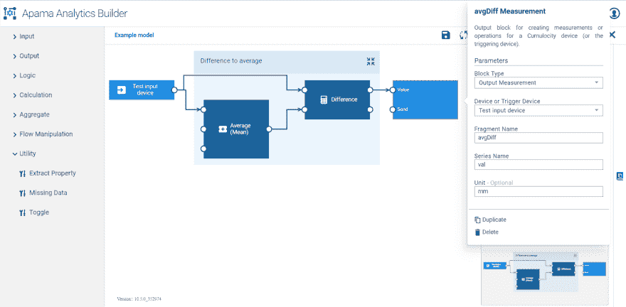
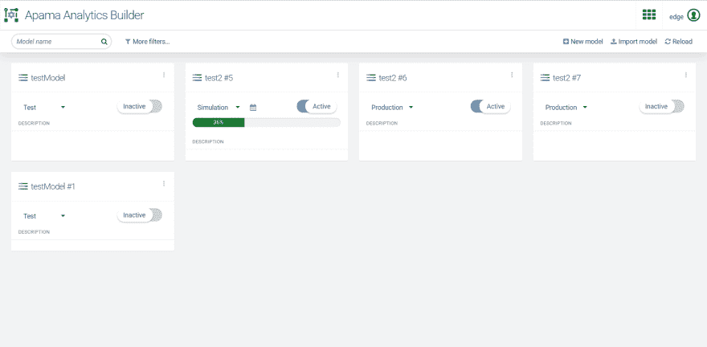

# 阿帕玛分析生成器

> 原文：<https://dev.to/techcommunity/apama-analytics-builder-5lo>

# 面向 Cumulocity 物联网的全新流分析功能

**阿帕玛分析构建器是一款全新的工具，可大幅减少设计、开发和部署物联网应用分析所需的时间。Analytics Builder 为在物联网边缘工作的工程师和其他领域专家提供了基于网络的功能，以开发基于流数据的分析应用程序，使用模拟或实时数据对其进行测试，并通过单击立即部署，以实时处理机器数据和事件。您可以开发和运行结合了来自预构建块库的分析的模型。模型可以处理测量和事件输入，计算平均值和表达式，并检测阈值突破。**

## 分析构建器概述

cumulocity IoT Edge 10.4(2019 年 4 月)现在包括阿帕玛分析构建器。Analytics Builder 是 Cumulocity IoT 中的一个 web 应用程序，允许您从预构建的块库中快速创建模型。与 Cumulocity IoT 中包含的智能规则模板相比，Analytic Builder 模型可以更加强大和可定制，并且比编写阿帕玛 EPL 代码更快、更简单。Analytics Builder 模型可以简单到“当度量超过阈值时创建一个操作”模型可以扩展到几十个模块，产生多个输出，包括可以在其他模型中检查或使用的派生测量。模型编辑器提供了一个简单的拖放界面，用于选择块、提供参数和块之间的布线连接。模型执行由阿帕玛处理，可以并行执行来自不同设备的数据。模型管理器显示所有的模型，并允许从历史数据导入、导出、启动和停止用于生产、测试或模拟的模型。

**图 1:** 显示一个简单模型的模型编辑器

图 1 显示了一个简单模型，其中从器件接收测量值，并在“平均值”模块中计算滑动窗口内测量值的平均值。“差值”模块然后获取输入值和平均值，并计算差值。然后，这将作为新的测量值“avgDiff”发出。

## 扩展解析块库

分析模块包括:

*   来自 Cumulocity 物联网测量和事件的输入
*   Cumulocity 物联网测量和操作的输出
*   逻辑块:与、或、非
*   计算:交叉计数器、增量、差值、方向检测、范围查找、舍入、阈值
*   数学表达式的灵活表达式，例如(输入 1 * 1000) +输入 2
*   值窗口上的聚合，由时间或信号定义，以定义何时重置窗口:平均值、最小值、最大值、积分、梯度、标准偏差
*   流操作:组合器、门、锁存器、时间延迟
*   实用程序:提取特性，缺失数据，切换

块库将在未来版本中扩展。

## 型号

您可以用标签来组织模型。模型管理器可以显示所有模型，或者按模式(草案、生产、测试和模拟)、设备、状态(活动/非活动)或标签过滤。模型可以生成新的测量值，该测量值既可用于 Cumulocity 物联网平台的其余部分，也可用作其他模型的输入。这使得生成派生测量成为可能，例如传感器的平均值，您可以在 Cumulocity IoT 中查看、在仪表盘中使用或用于构建更复杂的模型。

**图 2:** 模型管理器显示不同模式和状态下的模型

## 用例

使用 Analytics Builder 的两个主要原因是:

1.  **生成新的关键绩效指标(KPI)。**例如，计算设备测量流的移动平均值，然后将此 KPI 用于 Cumulocity 物联网仪表盘。
2.  **状态监控和提高对潜在问题的认识。**例如，确定何时测量缺失或超出预期范围。

## 路线图

Analytics Builder 的第一个版本适用于 Cumulocity IoT Edge。

2019 年 10 月，Software AG 计划在 Cumulocity 物联网云和内部部署 Analytics Builder。2019 年 10 月的计划还包括添加新的输出块以生成警报和块 SDK，以允许用户在阿帕玛 EPL 编写自定义块，实现他们自己的专业分析。

## 总结

Analytics Builder 使领域专家能够将逻辑块组合在一起，构建强大的模型来处理 Cumulocity IoT Edge 安装中的可用数据。在 Cumulocity 物联网环境中，模型可以在几分钟内轻松开发、编辑和测试。有关更多信息，请咨询您的 Software AG 代表。