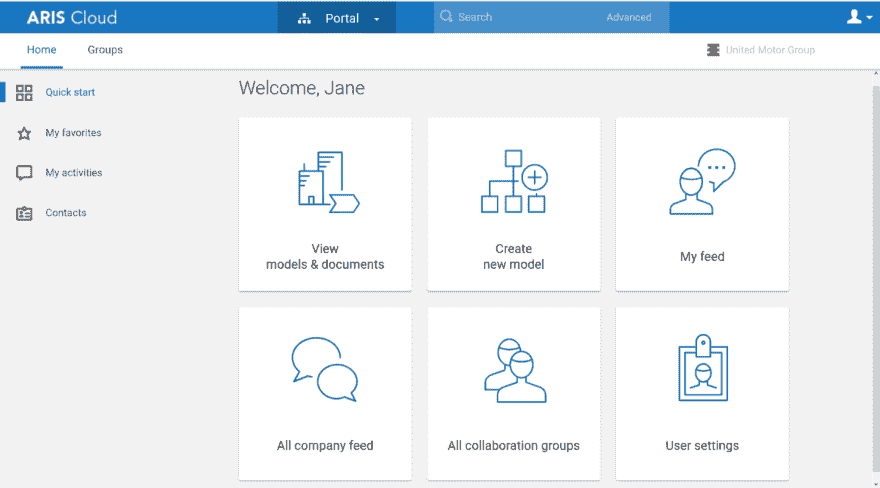

# Strive for process excellence

> 原文：[https://dev.to/techcommunity/strive-for-process-excellence-59bo](https://dev.to/techcommunity/strive-for-process-excellence-59bo)

# Think Big – Start Small and grow your business transformation projects in the cloud

Globalization and digital transformation are radically changing the way your company competes. They are also bringing many new challenges: adapting to constant change, keeping pace with market speed, fulfilling customers’ expectations, complying with changing regulations, and simply embracing quality & transparency - just to name a few.

Process excellence can help companies cope with these challenges. Many companies start business process analysis (BPA) either without tool support or by using low functionality tools. Inevitably, these companies come to realize that it’s time to deploy sophisticated BPA software and support their business initiatives by creating a process center of excellence with stakeholders of different departments.

Here are a few of the common challenges companies often face:

*   Processes are organized in functional silos without an end-to-end perspective
*   Processes are not transparent, nor are they integrated into the transformation methodology
*   Process owners and SLAs are unknown and there’s no reuse of best practices
*   Processes are not designed to provide the best customer experience, and they fail to differentiate your business from the competition

The solution to these challenges is change! Business transformation is a huge task though; you have a vision and big plans. But how do you get started? The best way is to begin with small steps, before involving more people and letting your projects grow.

*Grow your business transformation projects in the cloud*

So why spend additional effort looking for the right tool and implementation strategy? You have enough to do with the operational stuff and don’t need the extra work. You just need a simple tool that can be extended later, when you need it. Why wait for investment approval, hardware, software installation, and so on? Just open your web browser, log in and start. Sounds fantastic? This is ARIS Cloud.

ARIS Cloud is a professional BPA software that can be used immediately without any installation efforts. It is suited for small to medium-sized projects and can be expanded with additional functionalities, user numbers and operations when needed.

ARIS becomes the single source of truth for all your business assets and even the most basic edition of ARIS Cloud supports professional change projects with three key steps:

1.  **Understand** Visualize business interactions, responsibilities and dependencies in a single source of truth
2.  **Improve** Use the insights and execute what-if analyses to create value from performance improvements
3.  **Manage** Share best-practices and guidelines and let everybody contribute to improvements and drive change

## Why does SaaS offer so many benefits?

First and foremost, you can focus on your projects instead of managing IT, hardware, software, data security or availability. Also, you have much more flexibility with regards to the scalability of user numbers or sizing than with classic deployments. It’s less complex, using standard functionality, avoiding migration efforts. The cloud always provides the newest version. You can start immediately and grow your project. ARIS Cloud supports all sizes of projects. You can add more users or functionality when you need to.

The slim ARIS Cloud Advanced edition in the public cloud provides professional features for modeling, e. g. event-driven process chain (EPC) or BMPNTM, sharing and publishing, and reporting and analyzing. When advanced modeling is needed you can add ARIS Architect along with additional features for enterprise architecture and strategy.

*Portal view in ARIS Cloud Advanced*

Most companies realize that change projects don’t stop at a certain point in time - or when a certain target is reached. They see the benefits of continuous process improvements in increased performance and transfer these projects into their daily operations. They have their whole process landscape in a single source of truth and start building an [enterprise management system](https://www.softwareag.com/corporate/innovation/enterprise_management_system/default.html) that involves all employees. At this stage, they can use a process portal in their own corporate design, based on an ARIS Cloud Enterprise edition, deployed in a private cloud. The ARIS Cloud Enterprise editions support six different sizes - from S to XXXL, ranging from projects with small numbers of users to very large numbers of users and challenging performance needs.

With ARIS Cloud you can:

*   Create customer centric end-to-end processes that differentiate from the competition
*   Respond quickly to the changing market and business environment
*   Rapidly deliver new products and services
*   Ensure effective use of resources and take advantage of new technology
*   Manage risk and comply with regulation efficiently

Try ARIS Cloud at [www.ariscloud.com](http://www.ariscloud.com) and start a 30-day trial for free.

If you want more, you can also purchase your ARIS Cloud Advanced edition over the [online shop](http://www.ariscloud.com/shop_Advanced.htm).

AWS marketplace users can also find ARIS Cloud Advanced [on this platform](https://aws.amazon.com/marketplace/pp/B07PJKYS4K?qid=1561723817708&sr=0-1&ref_=srh_res_product_title). Just search for it and subscribe.

Think Big – Start Small!