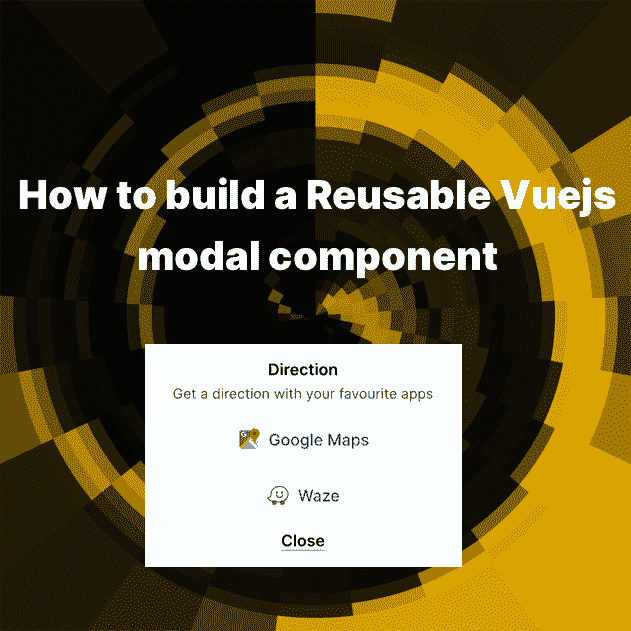

# 如何构建可重用的 Vuejs 模态组件

> 原文：<https://dev.to/jakzaizzat/how-to-build-a-reusable-vuejs-modal-component-3e9j>

[](https://res.cloudinary.com/practicaldev/image/fetch/s--5bpMhHd9--/c_limit%2Cf_auto%2Cfl_progressive%2Cq_auto%2Cw_880/https://jakzaizzat.com/wp-content/uploads/2019/07/Featured-Image.png)

模态是用户界面中必不可少的组件之一。在不移动到其他页面的情况下显示或接收来自用户的响应是很好的。我将构建一个模态组件，并在每个页面中可重用。

我们要构建的模型是一个简单的模型，里面有静态内容。

## 创建一个 VueJS 组件

在你的 Vue 应用中创建一个新文件，并将它们定义为 Vue 组件。在脚本部分设置组件名称。

模态。视图

```
 <script>
        export default {
            name: 'Modal'
        };
    </script> 
```

我将使用 TailwindCSS 来设计组件的样式。

如果你需要任何关于用 TailwindCSS 构建 UI 的教程/指南，请告诉我。

模态。视图

```
 <template>
      <div class="modal">
        <div class="container">
          <div class="modal__title">Direction</div>
          <p>Get a direction with your favourite apps</p>
          <a href="#" class="btn gmaps">
             Google Maps
          </a>
          <a href="#" class="btn waze">
             Waze
          </a>
          <button class="mt-3 border-b border-teal font-semibold">Close</button>
        </div>
      </div>
    </template>

    <script>
        export default {
            name: 'Modal'
        };
    </script>

    <style lang="css" scoped>
        .modal {
          background-color: rgba(0, 0, 0, 0.7);
      }
    </style> 
```

## 调用页面中的组件

例如，我想在我的索引页面上调用这个组件。首先，先导入 Vue 组件，设置到 components 对象中。

确保您调用了正确的路径。

*app . view*

```
 <script>
    import ModalDirection from "@/components/common/Modal";
    export default {
      components: {
        ModalDirection
      }
    };
    </script> 
```

您已成功将组件导入页面。您可以通过使用该标记来使用该组件。

```
<modal-direction></modal-direction> 
```

或者

```
<ModalDirection></ModalDirection> 
```

*app . view*

```
<template>
  <div>
    <modal-direction></modal-direction>
  </div>
</template>

<script>
import ModalDirection from "@/components/common/Modal";
export default {
  components: {
    ModalDirection
  }
};
</script> 
```

## 给模态添加一个函数

模态的特征之一是它可以是可见的或者不可见的。当其他元素触发一个函数时，它将是可见的。如何控制组件之间的功能🤔？

我们需要在 App.vue 中添加新的数据绑定，我们将其命名为 **modalOpen** ，并将其设置为 **false** 。当用户进入页面时，我们不希望模态是可见的。

*app . view*

```
 <script>
    import ModalDirection from "@/components/common/Modal";
    export default {
      components: {
        ModalDirection
      },
      data() {
        return {
          modalOpen: false
        };
      }
    };
    </script> 
```

让我们创建一个按钮来切换 **modalOpen** 的值。

*app . view*

```
<template>
  <div>
    <button class="btn" @click="openModal">Open Modal</button>
    <modal-direction></modal-direction>
  </div>
</template>

<script>
import ModalDirection from "@/components/common/Modal";
export default {
  components: {
    ModalDirection
  },
    data() {
        return {
            modalOpen: false
        }
    },
    methods: {
        openModal() {
            this.modalOpen = !this.modalOpen;
        }    
    }
};
</script> 
```

然后，将 **v-model** - modalOpen 分配给 **ModalDirection** 组件。

```
 <modal-direction v-model="modalOpen"></modal-direction> 
```

## 接收来自父组件的数据

现在，数据已经被传递到组件中。让我们编辑我们的组件，以确保它受到好评。我们将编写一个 prop 来接受来自我们刚刚编写的 *directModal - model* 的数据。

模态。视图

```
 <template>
      <div class="modal">
        <div class="container">
          <div class="modal__title">Direction</div>
          <p>Get a direction with your favourite apps</p>
          <a href="#" class="btn gmaps">
             Google Maps
          </a>
          <a href="#" class="btn waze">
             Waze
          </a>
          <button class="mt-3 border-b border-teal font-semibold">Close</button>
        </div>
      </div>
    </template>

    <script>
        export default {
            name: 'Modal',
            props: {
                value: {
                    required; true
                }
            }
        };
    </script>

    <style lang="css" scoped>
        .modal {
          background-color: rgba(0, 0, 0, 0.7);
      }
    </style> 
```

酷毙了。现在我们可以从父母那里获取数据🎉。您可以通过使用此代码从 *v-model* 中访问数据。

模板标签

```
 {{ value }} 
```

脚本标签

```
 {{ this.value }} 
```

## 控制模态可视性

如果组件从父组件接收到 *true* ，我们应该显示模态。现在，模态是完全可见的。我们应该从*值*控制模态的可见性。

幸运的是，我们有 *v-show* 来简化这一切。只需在模态标签中添加 *v-show* 标签。

模态。视图

```
 <template>
      <div class="modal" v-show="value">
        <div class="container">
          <div class="modal__title">Direction</div>
          <p>Get a direction with your favourite apps</p>
          <a href="#" class="btn gmaps">
             Google Maps
          </a>
          <a href="#" class="btn waze">
             Waze
          </a>
          <button class="mt-3 border-b border-teal font-semibold">Close</button>
        </div>
      </div>
    </template> 
```

仅当*值*设置为*真*时，模态才可见。

## 向父节点发送信号

酷，现在当我们点击按钮时模态出现了。不幸的是，还有最后一个问题。我们如何关闭模态？

现在，父节点正在从*值控制模态- v-model* 。现在，让我们将*方法*添加到按钮 close，使用*自定义事件将数据传递给父节点。*

模态。视图

```
 <template>
      <div class="modal" v-show="value">
        <div class="container">
          <div class="modal__title">Direction</div>
          <p>Get a direction with your favourite apps</p>
          <a href="#" class="btn gmaps">
             Google Maps
          </a>
          <a href="#" class="btn waze">
             Waze
          </a>
          <button @click.prevent="close"
 class="mt-3 border-b border-teal font-semibold">Close</button>
        </div>
      </div>
    </template>

    <script>
        export default {
            name: 'Modal',
            props: {
                value: {
                    required: true
                }
            }
              methods: {
                close() {
                  this.$emit("input", !this.value);
                }            
            }
        };
    </script>

    <style lang="css" scoped>
        .modal {
          background-color: rgba(0, 0, 0, 0.7);
      }
    </style> 
```

> 💡快速提示:使用。不会触发防止禁用事件的默认操作。它可以用于按钮、表单、锚链接等等。

因为，我们通过组件中的 *v-model* 传递数据，默认情况下，该事件将作为事件的*输入*被调用。

[图片:149 f520 d-B9CC-46c 7-8ab 7-507 f1 c 172 b 76-7088-0000631 BC 02 b 8581/modal . gif]

恭喜🎉

现在，这种模式正在发挥作用。您可以使用组件来打开和关闭它。最好的部分是可重复使用的。您可以在不同的页面中使用它，而无需再次编写代码。

## 源代码

模态。视图

```
 <template>
      <div class="modal" v-show="value">
        <div class="container">
          <div class="modal__title">Direction</div>
          <p>Get a direction with your favourite apps</p>
          <a href="#" class="btn gmaps">
             Google Maps
          </a>
          <a href="#" class="btn waze">
             Waze
          </a>
          <button @click.prevent="close"
 class="mt-3 border-b border-teal font-semibold">Close</button>
        </div>
      </div>
    </template>

    <script>
        export default {
            name: 'Modal',
            props: {
                value: {
                    required: true
                }
            }
              methods: {
                close() {
                  this.$emit("input", !this.value);
                }            
            }
        };
    </script>

    <style lang="css" scoped>
        .modal {
          background-color: rgba(0, 0, 0, 0.7);
      }
    </style> 
```

*app . view*

```
<template>
  <div>
    <button class="btn" @click="openModal">Open Modal</button>
    <modal-direction></modal-direction>
  </div>
</template>

<script>
import ModalDirection from "@/components/common/Modal";
export default {
  components: {
    ModalDirection
  },
    data() {
        return {
            modalOpen: false
        }
    },
    methods: {
        openModal() {
            this.modalOpen = !this.modalOpen;
        }    
    }
};
</script> 
```

最初发表于[https://jakzaizzat.com](https://jakzaizzat.com/how-to-build-a-reusable-vuejs-modal-component/)