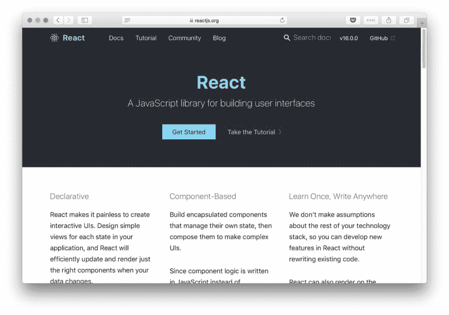
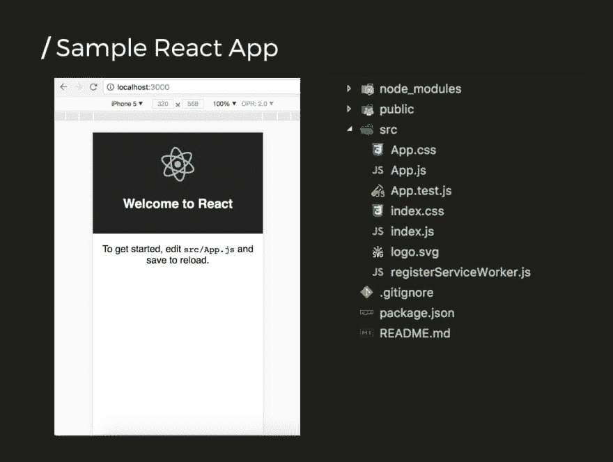
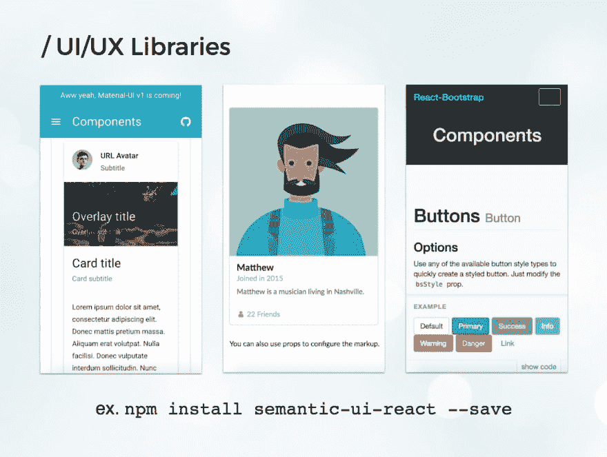
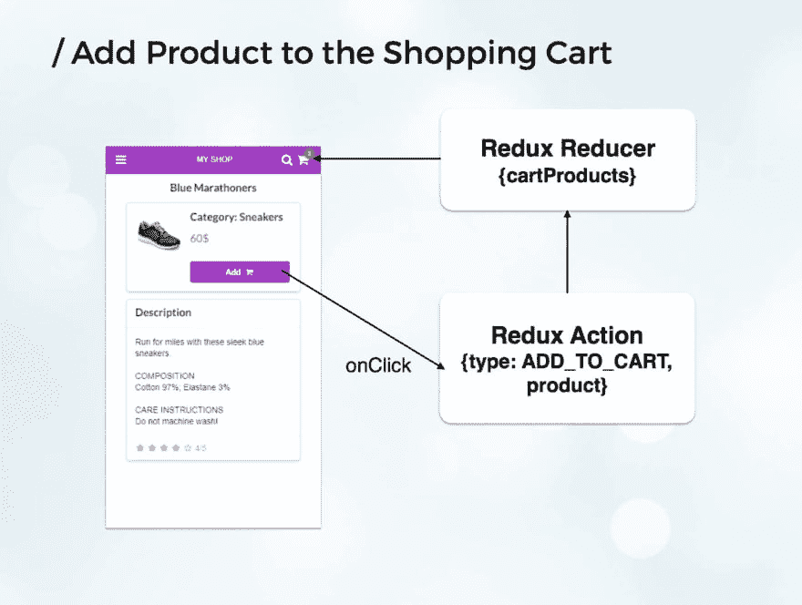

# 想建立基于 WordPress 和 WooCommerce 的渐进式网络应用吗？下面是方法(带有代码示例)

> 原文：<https://dev.to/codeinwp/want-to-build-progressive-web-apps-based-on-wordpress-and-woocommerce-here-s-how-w-code-examples-20f7>

下面的文章解决了一个非常有趣的话题，并为我们的网站和/或应用程序提供了一个新的分支，让我们可以沿着这条移动优先的道路前进。

我们称之为“响应式网页设计”的东西已经存在了一段时间，在游戏的这个阶段，大多数开发者/网站/网络工具已经完全整合了它的原理。但这是“手机友好”的终结吗？或者这只是开始。

嗯，谷歌认为是后者。接下来是渐进式网络应用程序！

### **了解渐进式网络应用**

渐进式网络应用(PWA)是结合了最好的网络和最好的应用的体验。通过诸如[推送通知](https://themeisle.com/blog/wordpress-push-notifications/)、离线工作、平滑动画和过渡、在主屏幕上加载等功能，原生应用商店应用在过去变得非常受欢迎。

移动网络应用程序是在浏览器中运行的 JavaScript 应用程序，并试图将一些本地应用程序功能带到网络上，但不能提供推送通知等功能。随着新的 Web APIs 在移动领域的引入，渐进式 Web 应用程序正在缩小这一差距，在移动 Web 上提供完整的类似应用程序的体验。

谷歌将他们描述为:

**可靠**–即时加载
**快速**–快速响应用户交互
**参与**–表现得像一个原生应用

为了达到所有这些目标，渐进式 Web 应用程序必须具备以下功能:

*   脱机工作或在恶劣的网络条件下工作
*   Web 应用程序安装横幅或添加到主屏幕
*   使用网络推送通知。随着 Web Push API 的引入，我们现在可以向用户发送推送通知，即使在浏览器关闭的情况下也是如此。
*   实施 HTTPS
*   使用一个应用程序外壳(或应用程序外壳)架构，它可以立即加载到用户的屏幕上，类似于本地应用程序。

本质上，PWA 是用 JavaScript 编写的单页应用程序。离线模式、添加到主屏幕和网络推送通知都是使用服务人员实现的。

### **渐进式网络应用 vs .响应式网页设计**

渐进式网络应用程序不应该与响应式网站设计相混淆。渐进式网络应用程序具有响应能力，因为它们可以适应不同的屏幕尺寸，但它们独特的价值主张是使它们像应用程序一样的功能。

在过去几年中，RWD 一直是移动网络解决方案的首选解决方案，但去年的一份 Forrester 报告指出，RWD 已经达到饱和——87%的数字体验制造商接受它——并且客户期望更喜欢类似应用程序的网络体验的转变正在我们眼前发生。

### **PWAs 是吸引移动网络用户的解决方案吗？**

构建一个高质量的渐进式网络应用程序有着不可思议的好处，可以轻松取悦用户，增加参与度和转化率。有几个公司的例子，特别是来自电子商务行业的公司，已经成功地使用渐进式网络应用程序来提高他们的指标，其中很多都列在谷歌的开发者网站上。

例如，Alibaba.com 建立了一个 PWA，带来了快速、有效和可靠的移动网络体验。新策略[使浏览器间的总转化率增加了 76%](https://developers.google.com/web/showcase/2016/alibaba),从添加到主屏幕的互动率提高了四倍。

在另一个用例中，OLX 希望通过添加到主屏幕和推送通知来重新吸引移动网络用户。他们将参与度提高了 250 %( T1 ),并改善了其他指标:页面变得可交互的时间减少了 23%,跳出率相应下降了 80%。货币化也有所改善，点击率(CTR)上升 146%。

### **我们如何知道一个移动 web app 是进步的？**

首先，进步是一个分数，而不是是或否，有一个叫做 [Lighthouse](https://chrome.google.com/webstore/detail/lighthouse/blipmdconlkpinefehnmjammfjpmpbjk?hl=en) 的 Chrome 插件，你可以用它来衡量这个分数。这个插件真的很容易使用，并生成一个具有所有 PWA 功能的报告，基本上它让我们知道我们需要改变什么来使一个 web 应用程序变得完全进步。对于我们的 WooCommerce PWA 的 alpha 版本，我们设法在 Lighthouse 上打了 91 分。

[](https://res.cloudinary.com/practicaldev/image/fetch/s--F7fKQNwH--/c_limit%2Cf_auto%2Cfl_progressive%2Cq_auto%2Cw_880/https://iotvnaw69daj.i.optimole.com/w:325/h:175/q:auto/https://mk0codeinwp10tp0961a.kinstacdn.com/wp-content/uploads/2017/11/Lighthouse.jpg)

### **怎样才能建立 PWA？**

谷歌的 PWA 标准没有列出任何创建渐进式网络应用的特定技术或框架。只要遵循清单，它可以是任何东西。**很多 pwa 都是用** [Angular JS](https://angularjs.org/) **或者** [React](https://reactjs.org/) 构建的，这些都是目前最流行的 JavaScript 框架。

AngularJS 和 React 各有优势:

棱角分明的/离子型的组合如今相当流行。Ionic 是一个很棒的框架，最初是为移动应用程序构建的，但现在已经扩展到了渐进式 Web 应用程序，甚至桌面应用程序。
反应真是直观易懂。它受益于一个很棒的样板文件 create-react-app，默认情况下它带有 PWA 支持。

[](https://res.cloudinary.com/practicaldev/image/fetch/s--ZNQ8c0i1--/c_limit%2Cf_auto%2Cfl_progressive%2Cq_auto%2Cw_880/https://www.codeinwp.com/wp-content/uploads/2017/11/react.jpg)

除了这两个，VueJS 也越来越受欢迎。

接下来，我们将看到一些来自一个电子商务应用程序的代码样本，这个应用程序是在 WordPress 和 WooCommerce [REST API](https://developer.wordpress.org/rest-api/) 之上用 React 构建的。

### **了解 WooCommerce REST API**

当构建电子商务应用程序时，我们首先需要的是一个 API，我们可以从中检索数据。幸运的是，[在核心](https://www.codeinwp.com/blog/october-2015-wordpress-news/)中包含 REST API 为使用 WordPress 作为后端打开了大门。此外，对于电子商务应用，我们可以使用来自[流行的 WooCommerce 插件](https://themeisle.com/blog/how-to-set-up-woocommerce/)的 REST API。

WooCommerce 还有一个 NPM 包( [WooCommerce API](https://www.npmjs.com/package/woocommerce-api) )用于进行 API 调用，但不幸的是，这个包需要消费者密钥和消费者秘密来验证请求。如果我们在前端应用程序中使用消费者秘密，我们会有一个安全问题。

此外，当从 WooCommerce 管理部分创建键时，不可能在路由级别指定权限，例如允许对产品的查看访问和对订单的写访问。

因此，我们必须在 WordPress 插件中创建一个代理，允许访问一组受限的 API 端点。作为基础，我们使用了 WooCommerce REST API PHP 包装器，如下例所示:

```
<?php
use Automattic\WooCommerce\Client;
class Custom_Endpoints_Woocommerce_API
{
    protected function get_client() {
        return new Client(
            get_site_url(),
            'woocommerce_consumer_key',
            'woocommerce_consumer_secret',
            [
                'wp_api' => true,
                'version' => 'wc/v1',
            ]
        );
    }
    public function register_woocommerce_routes() {
        register_rest_route( 'customroutes', '/products', array(
            'methods' => 'GET',
            'callback' => array( $this, 'view_products' )
        ));
    }
    public function view_products( WP_REST_Request $request ) {
        $woocommerce = $this->get_client();
        return $woocommerce->get( 'products/categories' );
    }
} 
```

我们首先使用消费者密钥和秘密初始化 WooCommerce 客户端。第二种和第三种方法是创建一个名为 products 的自定义路由，并从 WooCommerce API 将该路由映射到 products/categories 端点。

这样，我们可以允许访问阅读类别和产品，但只允许对订单进行创建操作。

### **用四个简单的步骤创建新的 React 应用**

一旦我们建立了 API，我们就可以开始开发 React 应用程序了。在全球范围内安装好 [NodeJS](https://nodejs.org/en/) 和 [NPM](https://www.npmjs.com/) 之后，你可以使用 create-react-app 包快速生成一个 React JS app，默认支持 PWA。

1.  全局安装**节点和 NPM**

2.  安装**创建-反应-应用**样板文件
    npm 安装创建-反应-应用-g

3.  生成**新的 React 应用**
    创建-react-app 我的-app

4.  **启动应用程序**
    cd my-app & npm 启动

下面是由 create-react-app 生成的应用程序的屏幕截图，它拥有我们需要的一切，因此我们可以开始编码，包括实时重新加载:

[](https://res.cloudinary.com/practicaldev/image/fetch/s--4jZBoKw3--/c_limit%2Cf_auto%2Cfl_progressive%2Cq_auto%2Cw_880/https://www.codeinwp.com/wp-content/uploads/2017/11/sample-react-app.jpg)

启动新的应用程序时，需要记住几件事:

**1)整理应用文件**

关于如何最好地构建应用程序，有几个很好的教程。我更喜欢按功能分类的文件夹，因为它允许更好的可伸缩性。你可以在这里找到一个很好的解释。

**2)棉绒和编码标准**

如果你不习惯，编码标准可能会很烦人，但是**不要跳过这一步**。它们有助于清理未使用的依赖项，并确保数据在组件级别得到正确验证。此外，如果你安装一个更漂亮的编辑器插件，自动格式化你的代码，使用编码标准就变得轻而易举了。至于标准本身，我更喜欢 Airbnb 创造的流行的[。](http://airbnb.io/javascript/)

**3)小部件**

保持组件文件小使得它们更容易测试和管理。您可以开始在单个组件中编写代码，一旦它变得更大，就将其分成更小的组件。对于 UI/UX 组件，有几个兼容 React 的库，比如[素材 UI](https://v0.material-ui.com/#/) 、[语义 UI](https://semantic-ui.com/) 甚至 [Bootstrap](https://getbootstrap.com/) ，这里仅举几个例子。

这些库包含一组现成的组件，比如网格、菜单、卡片、按钮等等。下面是一个用基本语义 UI 元素构建的电子商务应用程序界面的示例:

您可以看到类别列表、产品列表和侧边菜单。让我们深入代码——您将看到使用 React 创建这样一个示例是多么容易。

[](https://res.cloudinary.com/practicaldev/image/fetch/s--hmhYrxsN--/c_limit%2Cf_auto%2Cfl_progressive%2Cq_auto%2Cw_880/https://www.codeinwp.com/wp-content/uploads/2017/11/example-e-commerce-app.jpg)

### **潜入反应堆**

下面是一个 React 组件，它从 API 中读取一组产品类别。组件的状态用一个空的类别列表初始化。在 render 之前由 React 自动调用的 componentWillMount 方法中，我们请求获取类别，并在收到响应后将它们添加到状态:

```
import React, { Component } from "react";
import config from "./config";
import CategoriesList from "./CategoriesList";

class Categories extends Component {
  constructor(props) {
    super(props);

    this.state = {
      categories: []
    };
  }

  componentWillMount() {
    fetch(config.API_CATEGORIES_URL)
      .then(response => response.json())
      .then(json => this.setState({ categories: json }))
      .catch(() => {
        console.log("An error occured");
      });
  }

  render() {
    return <CategoriesList categories={this.state.categories} />;
  }
}

export default Categories; 
```

正如您所看到的，当收到类别时，我们不需要调用 render 方法，React 会为我们处理并重新呈现组件。render 方法只是返回另一个名为 *CategoriesList* 的定制组件，它接收类别数据，看起来像这样:

```
import React from "react";
import CategoryCard from "./CategoryCard";

const CategoriesList = props => (
  <div>
    {props.categories.map(element => (
      <CategoryCard
        key={element.id}
        categId={element.id}
        src={element.image.src}
        name={element.name}
      />
    ))}
  </div>
);

export default CategoriesList; 
```

上面的组件遍历作为道具接收的类别列表，并调用另一个名为 *CategoryCard* 的定制组件来呈现单个 category 元素。

所有这些组件都通过在它们之间传递道具来进行通信。主 Categories 组件调用 API 并将类别列表传递给 CategoriesList，后者又将类别的详细信息传递给类别卡。

### **使用 Redux 管理全局应用状态**

上述方法的问题在于，有时我们需要在顶层应用程序级别管理数据，例如添加到购物车中的产品列表。商品的数量显示在标题栏的购物车图标中，但在结帐页面上也显示为列表。

如果我们将所有这些数据添加到父应用程序组件中，那么在更大的应用程序上管理这些数据将变得非常困难。这就是像 [ReduxJs](https://redux.js.org/) 这样的库的用武之地。只是澄清一下，Redux 可以与任何 JavaScript 框架结合使用，它并不特定于 React。

还有，使用 Redux 并不意味着我们不能在组件级别使用状态或道具。Redux 应该只用于保留在应用程序级别有意义的数据。

让我们看看如何从 API 中读取产品并在列表中呈现它们，类似于我们对类别的需求，但这次使用 Redux。首先，我们需要通过将我们的主要应用程序组件封装到一个全球商店中来与 Redux 建立联系:

```
import { createStore, combineReducers, applyMiddleware } from "redux";
import thunk from "redux-thunk";

import categories from "./views/Categories/reducer";
import products from "./views/Products/reducer";

const rootReducer = combineReducers({ categories, products });
const defaultState = {};

const store = createStore(rootReducer, defaultState, applyMiddleware(thunk));

export default store; 
```

在本例中，全球应用商店将包含一个类别列表和一个产品列表，它们使用 Redux 的 *combineReducers* 方法合并在一起。

然后，我们继续定义 Redux 操作，这是非常简单的函数，返回必须包含类型属性的对象。由于 JS 是异步的，我们需要两个动作:一个是发送请求时发出信号，另一个是收到响应时发出信号。整个应用程序将知道这些动作何时发生。

下面，我们还添加了一个名为 fetchProducts 的函数。如您所见，该功能:

*   分派请求产品操作，
*   调用 API 来检索产品，
*   当收到结果时，调度 *receiveProducts* 动作。

```
import config from "./config";

export const requestProducts = () => ({
  type: "REQUEST_PRODUCTS"
});

export const receiveProducts = products => ({
  type: "RECEIVE_PRODUCTS",
  products
});

export const fetchProducts = () => dispatch => {
  dispatch(requestProducts());

  return fetch(config.API_PRODUCTS_URL)
    .then(response => response.json())
    .then(json => dispatch(receiveProducts(json)))
    .catch(() => {
      dispatch(receiveProducts([]));
    });
}; 
```

为了修改应用程序状态，我们将添加一个所谓的 Redux“reducer”。reducer 只是一个函数，它监听特定的动作并改变全局状态的一部分，在本例中是产品列表。

这个 reducer 在接收请求产品动作时不做任何事情，它总是返回当前状态。对于 receive products 操作，reducer 返回传递给它的数据，在这种情况下，它将是一个产品列表。

```
import { combineReducers } from "redux";

const productsReducer = (state = [], action) => {
  switch (action.type) {
    case "REQUEST_PRODUCTS":
      return state;
    case "RECEIVE_PRODUCTS":
      return action.products;
    default:
      return state;
  }
};

export default productsReducer; 
```

总结一下，我们在新产品组件中使用这些动作和 reducer。

```
import React from "react";
import { connect } from "react-redux";
import { fetchProducts } from "./actions";
import ProductsList from "./ProductsList";

class Products extends React.Component {
  componentWillMount() {
    const { dispatch } = this.props;
    dispatch(fetchProducts());
  }

  render() {
    return <ProductsList />;
  }
}

export default connect(null, { fetchProducts })(Products); 
```

该组件被包装在 Redux 的 connect 方法中，并在其*组件的*方法中调度 *fetchProducts* 。此外，该组件包括一个产品列表，但是正如您所看到的，产品列表组件并不直接接收产品数据。这是因为产品列表组件直接链接到全局应用程序状态，也使用 Redux。

通过这种方式，它可以直接从 app store 访问产品数据，迭代产品列表，并使用一个 *ProductCard* 组件来呈现单个产品元素。

```
import React from "react";
import { connect } from "react-redux";
import ProductCard from "./ProductCard";

class ProductsList extends React.Component {
  render() {
    const list = this.props.products.map(element => (
      <ProductCard
        key={element.id}
        src={element.images[0].src}
        name={element.name}
        price={element.price}
      />
    ));

    return <div>{list}</div>;
  }
}

const mapStateToProps = state => ({
  products: state.products
});

export default connect(mapStateToProps)(ProductsList); 
```

到目前为止，我们已经看到了一些关于如何显示数据的例子，但是如果我们想要添加用户交互，例如将产品添加到购物车中，该怎么办呢？

在这种情况下，当用户单击“添加到购物车”按钮时，我们将调度一个修改全局应用程序状态的操作。显示购物车产品数量的标题栏将与 Redux 连接。它将计算应用程序购物车中保存的产品数量，并相应地进行自我更新。

[](https://res.cloudinary.com/practicaldev/image/fetch/s--zfLd8nXt--/c_limit%2Cf_auto%2Cfl_progressive%2Cq_auto%2Cw_880/https://www.codeinwp.com/wp-content/uploads/2017/11/add-to-cart-example.jpg)

### **用 WordPress 链接应用**

这些都是让你入门的基本例子，你可能想知道我们如何将这个应用程序与 WordPress 链接起来。

嗯，我们可以[在一个子域上托管应用](https://www.codeinwp.com/blog/managed-wordpress-hosting/)并让它连接到 API，或者我们可以将它用作 WordPress 主题——这意味着用一个 index.php 文件创建一个非常基本的主题，它将只加载一个 JavaScript / CSS 文件。create-react-app 样板文件包括创建应用程序构建的命令，因此我们可以立即获得生产文件。

```
<html manifest="" <?php language_attributes(); ?>>
<head>
    <meta charset="UTF-8" />
    <meta name="viewport" content="width=device-width, initial-scale=1.0,
     maximum-scale=1.0, minimum-scale=1.0, user-scalable=no" />
    <!-- load other meta tags here -->

    <?php echo get_bloginfo("name");?>

<link rel="stylesheet" href="<?php echo get_template_directory_uri();?>/style.css" />
<script
        src="<?php echo get_template_directory_uri();?>/js/bundle.js"
        type="text/javascript">
    </script>

    <script>
        if('serviceWorker' in navigator) {
            navigator.serviceWorker
                .register('/sw.js')
                .then(function() { console.log("Service Worker Registered"); });
        }
    </script>

</head>
<body>
    <noscript>
      You need to enable JavaScript to run this app.
    </noscript>
    <div id="root" style="height:100%"></div>  
</body>
</html> 
```

### **在哪里使用服务人员**

对于离线模式，我们可以添加一个服务人员，即使用户离线，该服务人员也会显示应用程序外壳。服务工作者只是一个在浏览器中注册自己的 JavaScript 文件。

```
<script>
if('serviceWorker' in navigator) {
  navigator.serviceWorker
           .register('/sw.js')
           .then(function() { console.log("Service Worker Registered"); });
}
</script> 
```

有几种策略可以用于离线模式，比如网络优先或缓存优先，你可以在谷歌的[离线食谱](https://developers.google.com/web/fundamentals/instant-and-offline/offline-cookbook/)中读到这些。

即使我们有网络连接，缓存应用程序的外壳也有好处，因为应用程序的加载速度会快得多。

如果您想更进一步，开始缓存来自 API 的数据，您可以使用 redux-persist 这样的 NPM 包，并修改您的应用程序以保存/检索来自浏览器本地存储的数据。

对于网络推送通知，我们推荐看一看 [One Signal free WordPress 插件](https://wordpress.org/plugins/onesignal-free-web-push-notifications/)。这个插件也适用于[响应主题](https://www.codeinwp.com/blog/best-wordpress-themes/)，所以你一定要马上去看看。

### **接下来是什么？**

你可以在这里**找到**上述 WooCommerce PWA 的[演示。](https://pwa-woo.wpmobilepack.com/#/)

我们已经在开发测试版，这只是我们路线图的一部分:

*   添加离线模式功能
*   添加推送通知
*   完成结帐过程如果你想为自己的需求做贡献或定制，你可以在 [GitHub](https://github.com/appticles/pwa-theme-woocommerce) 上找到电子商务渐进式网络应用的 alpha 版本。

[](https://res.cloudinary.com/practicaldev/image/fetch/s--WuhlYovp--/c_limit%2Cf_auto%2Cfl_progressive%2Cq_auto%2Cw_880/https://www.codeinwp.com/wp-content/uploads/2017/11/PWA-demo.jpg)

你如何看待渐进式网络应用以及它们在移动 WordPress 领域的作用？你会考虑在你的下一个项目中走这条路吗？

*文章原载于[CodeinWP.com](https://www.codeinwp.com/blog/progressive-web-apps-on-wordpress-and-woocommerce/)T3* 

```
Written by Alexandra Anghel, co-founder and CTO at Appticles.com 
```