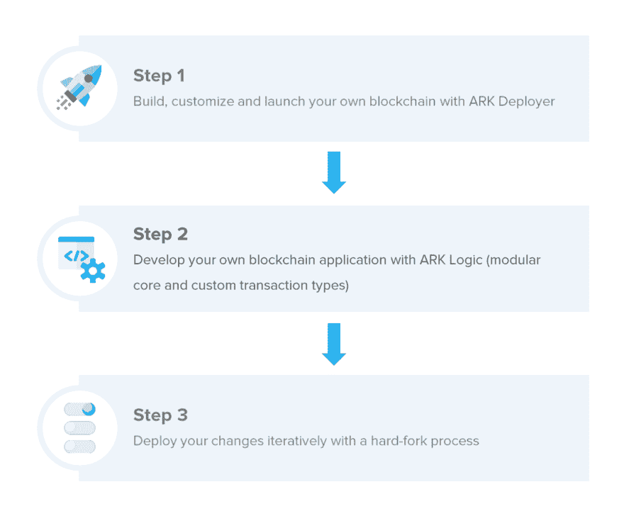
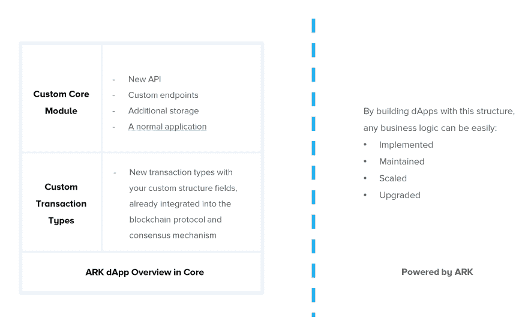
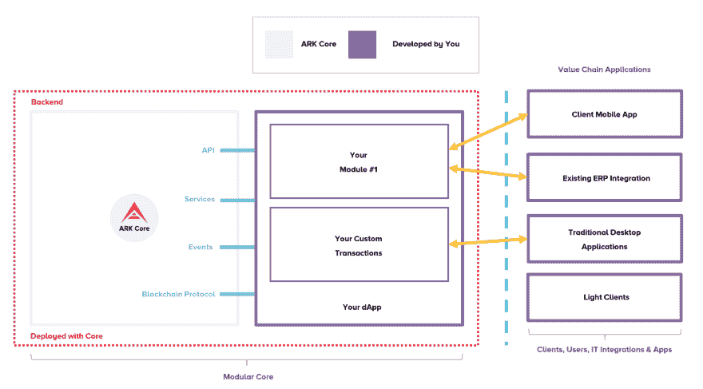

# 区块链应用开发简介-第 1/2 部分

> 原文：<https://dev.to/kristjank/an-introduction-to-blockchain-application-development-part-1-2-462a>

在这篇文章中，我们将熟悉使**区块链应用程序开发几乎像在公园散步**的架构方法。我们将为区块链应用程序提出五种简单而有效的软件开发方法。它们都有代码示例和教程支持。

这是一个介绍性的帖子，接下来是单独的教程和研讨会，我们将构建一个完整的区块链应用程序。

# 引导开发环境设置

在开始区块链应用程序开发之前，我们总是需要:

*   我们自己的连锁经营。
*   启动本地节点的知识。
*   连接到某种公共测试区块链网络，该网络由其他人运行和维护，不受我们的控制。

我们都知道，在过去，为了让一个区块链节点运行起来，必须使用 sysadmin 魔法。结果，许多开发人员被开发环境设置的复杂性或缺少加密库和实现所拒绝。幸运的是，我们的英雄——方舟部署者出现了。通过三个简单的步骤实现无缝且可轻松定制的区块链部署。

> 我们在该领域学到的一切(与组织的会议、PoC 项目实施、黑客马拉松和研讨会)与我们的专业知识相结合，引导我们开发一款产品，在几分钟内轻松简单地部署您自己的定制链。

所有基于 ARK 的**桥链都配有免费和开源的 SDK**，使您能够直接进入应用开发，将区块链协议和系统管理细节留给我们的自动化工具和超过 [12 种编程语言](https://docs.ark.io/sdk)的 SDK 实现来处理。欢迎随时加入我们在`https://ark.io/slack`的友好聊天，并在我们的`help`频道寻求帮助和指导。

[](https://res.cloudinary.com/practicaldev/image/fetch/s--slSg10Vi--/c_limit%2Cf_auto%2Cfl_progressive%2Cq_auto%2Cw_880/https://cdn.hashnode.com/res/hashnode/image/upload/v1562652496863/ZDPYJGcrh.png)

> 有了 ARK 的**模块化核心**，我们在后台运行的分布式服务器/节点就转化成了容器——你可以在其中部署你自己的基于区块链的应用程序，你不需要担心共识协议或对等网络机制——这是一个协议问题，就像 TCP/IP 一样，要复杂得多；但它在后台运行，传递安全、信任和永恒——传递区块链的承诺。

# 分布式区块链的一般应用

从我在区块链领域的旅程开始，我就一直想在这项优秀的技术上构建复杂的应用程序。ARKs 的承诺之一是提供工具和最佳实践来缩小这个差距，使区块链应用程序开发变得轻而易举。我们团队在这个目标上取得的第一个成就是 ARK Logic 与 ARK Deployer 携手合作。

> 这给了我们创建**不可知**区块链应用的能力，这些应用可以在任何基于 ARK 核心技术的区块链上运行。通过在我们的可插拔核心技术上开发应用程序，开发人员可以构建与区块链无关的应用程序，面向更大的受众，并提供跨链兼容的解决方案。

通过引入新的链间货币化服务，允许企业充分利用和研究新的加密驱动的商业模式，这引入并进一步加强了方舟生态系统的作用。我们的区块链应用程序开发方法通过将软件库的概念和区块链开发联系起来，缩小了传统开发实践之间的差距。

[](https://res.cloudinary.com/practicaldev/image/fetch/s--_DOi-mkk--/c_limit%2Cf_auto%2Cfl_progressive%2Cq_auto%2Cw_880/https://cdn.hashnode.com/res/hashnode/image/upload/v1562655104655/OWAu2mmop.png)

这就是我们如何看待分布式区块链应用程序在我们的核心技术堆栈上的开发和部署:

1.  区块链应用是分散应用的缩写形式-dapp，它已经可以作为区块链模块部署。
2.  dapp 的后端代码运行在分散的对等网络(ARK)上。相比之下，应用程序的后端代码运行在集中式服务器上。
3.  dapp 可以拥有以任何语言编写的前端代码和用户界面(就像普通的应用程序一样),可以通过简单的 API 调用或通过使用在 dApp 模块实现中作为通信通道实现的任何类型的协议来调用其后端(参见第 1 点)。
4.  dapp 也可以在分散的网络上托管其前端，在这种情况下，语言限制必须与我们的核心技术语言环境和我们作为应用程序提供商的区块链网络服务器兼容。
5.  dapp 只能实现微服务，允许模块化设计，更容易修复错误，并像普通软件应用程序一样升级。

[](https://res.cloudinary.com/practicaldev/image/fetch/s--iVjJgZIA--/c_limit%2Cf_auto%2Cfl_progressive%2Cq_auto%2Cw_880/https://cdn.hashnode.com/res/hashnode/image/upload/v1562652809298/2v8okqJW0.png)

好吧，那现在怎么办？现在我们可以像在大多数 web 应用程序中一样部署一个模块——但是“区块链/账本”在哪里，我们如何使用它？

> 别担心，我们为您提供了 ARK Logic——使您的应用程序能够在分布式网络上以模块化的方式运行。您的应用程序生命周期由我们的核心维护，并由区块链节点的整个生命周期继承。可插入的应用程序/模块的一个很大的好处是以一种非常简单和开发者友好的方式访问区块链机制。区块链互动是我们非常重视的事情，我们通过以下方法实现这一点。

# 方舟逻辑:最佳实践

在这一节中，我们将探讨五种核心方法，它们使您能够在我们的平台上无缝开发分布式区块链应用程序。作为开发人员，您将了解到:

*   如何与区块链国家互动？
*   如何与区块链数据库交互？
*   学习使用事件并对状态变化做出反应。
*   通过运行在核心节点内的可定制 HTTP 服务器添加新的 API 端点。
*   将您的区块链应用程序打包成一个模块并分发它。

## 与区块链为伍的状态

核心区块链一揽子计划是一切围绕其运转的核心实体。它提供了一个`state-machine`来控制节点的状态，并在各种状态之间切换，以便同步、回滚或从分叉中恢复。当您想了解区块链节点的当前状态时，它包含了所有重要的信息。不要相信数据库，相信它公开的内存数据，因为它是实时更新的。

```
import { app } from "@arkecosystem/core-container";

const blockchain = app.resolvePlugin("blockchain");

async function callBlockchainMethods() {
  // Check if the blockchain is fully synced
  blockchain.isSynced();

  // Get the last block we've received
  blockchain.getLastBlock();

  // Get the height of the last block we've received
  blockchain.getLastHeight();

  // Get the last block we've downloaded
  blockchain.getLastDownloadedBlock();

  // Get a list of events the blockchain emits
  blockchain.getEvents();
}

callBlockchainMethods(); 
```

<svg width="20px" height="20px" viewBox="0 0 24 24" class="highlight-action crayons-icon highlight-action--fullscreen-on"><title>Enter fullscreen mode</title></svg> <svg width="20px" height="20px" viewBox="0 0 24 24" class="highlight-action crayons-icon highlight-action--fullscreen-off"><title>Exit fullscreen mode</title></svg>

[点击此处查看完整教程](https://docs.ark.io/tutorials/core/plugins/how-to-interact-with-the-blockchain.html#getting-started)

## 与数据库交互

您可以通过使用数据库插件以非常简单有效的方式访问块和事务。

```
import { app } from "@arkecosystem/core-container";

const database = app.resolvePlugin("database");

async function callDatabaseMethods() {
  // Get a block from the database by its id
  await database.getBlock("some block id");

  // Skip the first 100 blocks, grab the next 100
  await database.getBlocks(100, 100);

  // Grab blocks at height 1, 5 and 10
  await database.getBlocksByHeight([1, 5, 10]);

  // Get all blocks that have been forged in round 10
  await database.getBlocksForRound(10);

  // Get the last block we've received
  await database.getLastBlock();

  // Get the last 10 blocks we've received
  await database.getRecentBlockIds();

  // Get a transaction from the database by its id
  await database.getTransaction("some transaction id");
}

callDatabaseMethods(); 
```

<svg width="20px" height="20px" viewBox="0 0 24 24" class="highlight-action crayons-icon highlight-action--fullscreen-on"><title>Enter fullscreen mode</title></svg> <svg width="20px" height="20px" viewBox="0 0 24 24" class="highlight-action crayons-icon highlight-action--fullscreen-off"><title>Exit fullscreen mode</title></svg>

[访问完整教程](https://docs.ark.io/tutorials/core/plugins/how-to-interact-with-the-database.html#getting-started)

## 利用事件倾听变化并做出反应

Core 提供了一个名为 core-event-emitter 的包，它公开了 Node.js EventEmitter 的一个实例。一个常见的用例是，您的模块将侦听 core 发出的事件，以便处理用于监控的数据。您的模块还可以发出其他插件可以监听的事件(或者您自己的供内部使用的事件)。

```
import { app } from "@arkecosystem/core-container";
import { EventEmitter, Logger } from "@arkecosystem/core-interfaces";

const logger = app.resolvePlugin<Logger.ILogger>("logger");
const emitter = app.resolvePlugin<EventEmitter.EventEmitter>("event-emitter");

emitter.on("forger.missing", delegate => {
  // This will be a wallet object that contains information like the address, username, public key, votes, etc.
  logger.warn(`${delegate.username} just missed a block.`);

  // Here we could for example send a slack notification that we just missed a block
}); 
```

<svg width="20px" height="20px" viewBox="0 0 24 24" class="highlight-action crayons-icon highlight-action--fullscreen-on"><title>Enter fullscreen mode</title></svg> <svg width="20px" height="20px" viewBox="0 0 24 24" class="highlight-action crayons-icon highlight-action--fullscreen-off"><title>Exit fullscreen mode</title></svg>

[访问完整教程](https://docs.ark.io/tutorials/core/plugins/how-to-interact-with-events.html#listening-for-events)

## 通过运行在核心节点内的可定制 HTTP 服务器添加新的 API 端点

插件的一个常见用例是，您从核心内部处理一些数据，并希望在外部应用程序中使用这些数据。最简单的方法是通过一个 HTTP 服务器，该服务器公开一个 API，您可以从该 API 请求数据。

```
import { createServer, mountServer } from "@arkecosystem/core-http-utils";

export async function startServer(config) {
  const server = await createServer({
    host: config.host,
    port: config.port
  });

  server.route({
    method: "GET",
    path: "/",
    handler(request, h) {
      return "Hello World";
    }
  });

  return mountServer("My HTTP Server", server);
}

startServer({ host: "localhost", port: 8000 }); 
```

<svg width="20px" height="20px" viewBox="0 0 24 24" class="highlight-action crayons-icon highlight-action--fullscreen-on"><title>Enter fullscreen mode</title></svg> <svg width="20px" height="20px" viewBox="0 0 24 24" class="highlight-action crayons-icon highlight-action--fullscreen-off"><title>Exit fullscreen mode</title></svg>

[完整教程](https://docs.ark.io/tutorials/core/plugins/how-to-create-http-servers.html#getting-started)

## 将您的区块链应用程序打包并作为一个模块分发

拼图的最后一块是把所有东西打包成一个模块，并把它分发给你的区块链网络。我们的插件是模块化设计的，这意味着上面描述的概念都已经在你自己的模块中开发出来了。拥有自己的模块，使您能够将它发布到最大的包存储库——NPM，从而使每个人都可以使用它。

模块编写起来非常简单。它们的核心是一个带有注册属性的对象，也就是一个带有签名异步函数的函数。此外，插件对象有一个必需的 pkgproperty 和几个可选属性，包括 version。

```
import { Container } from "@arkecosystem/core-interfaces";
import { LogManager } from "@arkecosystem/core-logger";
import { defaults } from "./defaults";
import { PinoLogger } from "./driver";

export const plugin: Container.PluginDescriptor = {
  pkg: require("../package.json"),
  defaults,
  alias: "logger",
  extends: "@arkecosystem/core-logger",
  async register(container: Container.IContainer, options) {
    const logManager: LogManager = container.resolvePlugin("log-manager");
    await logManager.makeDriver(new PinoLogger(options));

    return logManager.driver();
  }
}; 
```

<svg width="20px" height="20px" viewBox="0 0 24 24" class="highlight-action crayons-icon highlight-action--fullscreen-on"><title>Enter fullscreen mode</title></svg> <svg width="20px" height="20px" viewBox="0 0 24 24" class="highlight-action crayons-icon highlight-action--fullscreen-off"><title>Exit fullscreen mode</title></svg>

[访问完整教程](https://docs.ark.io/tutorials/core/plugins/how-to-write-a-core-plugin.html#basic-structure-properties-of-a-plugin)

使用上述概念将使您的区块链应用程序开发变得轻而易举，它降低了企业应用程序开发人员和加密开发人员之间的差距。我们鼓励您测试这些方法，并开始构建您的第一个区块链应用程序。

## 下一步:第 2/2 部分

第二部分将介绍如何使用我们的`Generic Transaction Interface (GTI)`开发定制事务类型。**GTI 的基本前提是提供一种简单的方法来实现并在核心中包含新的交易类型，而无需修改核心中更复杂的部分。**根据区块链的使用情况，它可以简单到包括预定义的模板，或者重用现有的类型并修改其参数以引入新的类型。开发定制事务类型使您能够添加自己的定制逻辑和数据，通过现有的共识机制对其进行验证，并将其存储在链上。

之后，您将掌握使用 ARK Logic 构建区块链应用程序所需的所有技能。在后续教程中，我们将利用这一点，从第 0 行到最后一个自述文件，一起构建一个区块链应用程序。