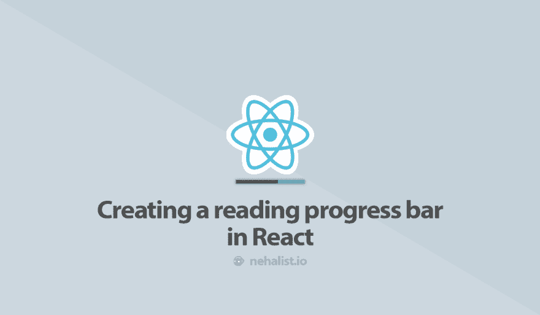

# 在 React 中创建阅读进度条

> 原文：<https://dev.to/nehalist/creating-a-reading-progress-bar-in-react-4dm3>

[](https://res.cloudinary.com/practicaldev/image/fetch/s--yS_oC72A--/c_limit%2Cf_auto%2Cfl_progressive%2Cq_auto%2Cw_880/https://ghost.nehalist.io/conteimg/2019/07/react-reading-bar-1.png)

阅读进度条，就像你可以在我的博客上的单篇文章顶部找到的那种，是一个很好的小补充，可以提供读者在当前文章上进展的详细信息。滚动条在这方面并没有真正的意义；它包括你的整个页面，这意味着你的页眉，评论，页脚等。是迹象的一部分。

创建一个阅读进度条，告诉你 React 中当前文章内容的实际进度是非常容易的——特别是使用钩子，这使得我们的组件更小。

## 阅读进度组件

我们的`ReadingProgress`组件将做以下事情:

*   使用`useState`钩子，它将负责阅读和设置我们的阅读进度
*   利用负责处理滚动事件的`useEffect`钩子，正确更新我们的滚动进度条
*   以适当的宽度返回阅读进度条

所以让我们直接进入实现:

```
const ReadingProgress = ({ target }) => {
  const [readingProgress, setReadingProgress] = useState(0);

  return <div className={`reading-progress-bar`} style={{width: `${readingProgress}%` }} />
}; 
```

这是我们组件的基础。`readingProgress`将作为进度条的宽度(百分比)。我们组件的唯一支柱是`target`，它将引用我们 post 的 DOM 容器——稍后会详细介绍。

首先让我们实现我们的监听器，它将在滚动事件上更新我们的进度条:

```
const scrollListener = () => {
    if (!target.current) {
      return;
    }

    const element = target.current;
    const totalHeight = element.clientHeight - element.offsetTop;
    const windowScrollTop = window.pageYOffset || document.documentElement.scrollTop || document.body.scrollTop || 0;

    if (windowScrollTop === 0) {
      return setReadingProgress(0);
    }

    if (windowScrollTop > totalHeight) {
      return setReadingProgress(100);
    }

    console.log(windowScrollTop);

    setReadingProgress((windowScrollTop / totalHeight) * 100);
  }; 
```

*将被放置在我们的`ReadingProgress`组件中。*

`windowScrollTop`尝试一堆不同的值，为某些浏览器(如 Safari)修复`undefined`值。

这种实现有一个问题:只有当我们滚动*超过*我们的目标时，才能达到 100%的阅读进度。这不太可能是真的(除非你读完一行后会滚动一行，这会让你觉得很奇怪)——所以我们需要稍微调整一下我们的阅读进度是如何计算的:

```
const totalHeight = element.clientHeight - element.offsetTop - window.innerHeight; 
```

这应该会产生一个更准确的结果，当条形图显示结束时。

接下来，我们将把我们的监听器放到一个`useEffect`钩子中，这使得我们的整个组件看起来像这样:

```
const ReadingProgress = ({ target }) => {
  const [readingProgress, setReadingProgress] = useState(0);
  const scrollListener = () => {
    if (!target.current) {
      return;
    }

    const element = target.current;
    const totalHeight = element.clientHeight - element.offsetTop - (window.innerHeight);
    const windowScrollTop = window.pageYOffset || document.documentElement.scrollTop || document.body.scrollTop || 0;

    if (windowScrollTop === 0) {
      return setReadingProgress(0);
    }

    if (windowScrollTop > totalHeight) {
      return setReadingProgress(100);
    }

    setReadingProgress((windowScrollTop / totalHeight) * 100);
  };

  useEffect(() => {
    window.addEventListener("scroll", scrollListener);
    return () => window.removeEventListener("scroll", scrollListener);
  });

  return <div className={`reading-progress-bar`} style={{width: `${readingProgress}%`}} />;
}; 
```

从我们的`useEffect`钩子返回的函数基本上就是组件被卸载时发生的事情(参见文档中的[清理](https://reactjs.org/docs/hooks-effect.html#effects-with-cleanup)的效果)。

最后但同样重要的是，我们需要在某个地方使用我们的组件。此时，我们需要在目标容器上创建一个引用，并简单地将它传递给我们的`ReadingProgress`组件:

```
function App() {
  const target = React.createRef();
  return (
    <>
      <ReadingProgress target={target} />
      <div className={`post`} ref={target}>post content</div>
    </>
  );
} 
```

有关`createRef`的更多信息，请参见[文档](https://reactjs.org/docs/refs-and-the-dom.html)

现在你的阅读进度条应该工作得很好了——除了你看不到它，因为它没有高度。通过添加一些 CSS:
来解决这个问题

```
.reading-progress-bar {
  position: sticky;
  height: 5px;
  top: 0;
  background-color: #ff0000;
} 
```

**搞定！**现在，你的读者不再会迷失在你的帖子的无尽长度中，并且总是知道它什么时候会结束。

要查看完整的工作示例，您可以查看以下代码笔:

[https://codepen.io/twhite96/embed/agRNYZ?height=600&default-tab=result&embed-version=2](https://codepen.io/twhite96/embed/agRNYZ?height=600&default-tab=result&embed-version=2)

## 第三方套餐

有一些第三方软件包可以处理这个问题。据我所知，它们中的大部分都已经过时和/或不再维护了——但是此时更重要的是:对于一个只有大约 30 行代码的非常简单的组件，您真的需要第三方依赖吗？嗯，老实说，我不这么认为。

## 结论

正如你所看到的，在 React 中实现一个阅读进度条非常容易。多亏了钩子，我们可以将这个组件实现为一个非常小的功能组件，几乎没有开销。

* * *

如果你喜欢这篇文章，请留下❤，在 Twitter 上关注我，订阅我的时事通讯。这篇文章最初发表在 [nehalist.io](https://nehalist.io/creating-a-reading-progress-bar-in-react/) 上。