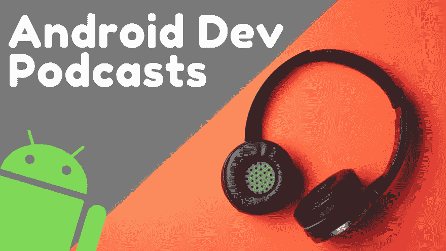
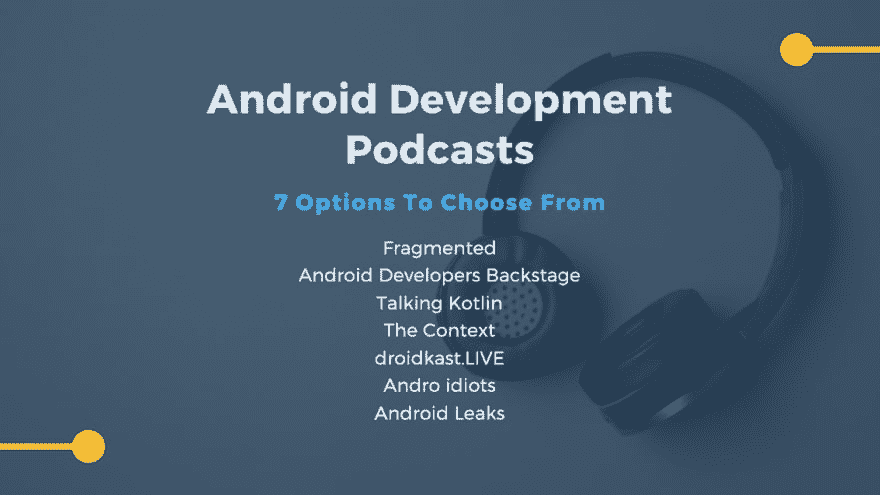

# Android Development Podcasts — 7 Options to Choose From

> 原文：[https://dev.to/goobar_dev/android-development-podcasts-7-options-to-choose-from-43k0](https://dev.to/goobar_dev/android-development-podcasts-7-options-to-choose-from-43k0)

### Android development podcasts to help you stay up to date

*Originally published at* [*https://goobar.io*](https://goobar.io/2019/07/08/android-development-podcasts-7-options-to-choose/) *on July 9, 2019.*

I’ve had a number of questions lately about which podcasts I’ve been listening to, and where to find them, so I thought I’d share a small list of relevant Android development podcasts for you to check out.

tl;dr — 7 Android Development Podcasts

*   [Fragmented](https://fragmentedpodcast.com/)
*   [Android Developers Backstage](http://androidbackstage.blogspot.com/)
*   [Talking Kotlin](http://talkingkotlin.com/)
*   [The Context](https://github.com/artem-zinnatullin/TheContext-Podcast)
*   [droidkast.LIVE](https://droidkast.live/)
*   [Andro idiots](https://soundcloud.com/andro-idiots)
*   [Android Leaks](http://androidleakspodcast.com/)

* * *

### Fragmented

[Fragmented Podcast](https://fragmentedpodcast.com/)

This has been my go-to Android development podcast for a long time. [Donn Felker](https://twitter.com/donnfelker) and [Kaushik Gopal](https://twitter.com/kaushikgopal) do a terrific job of putting out consistently great episodes on all manner of Android-related topics. They generally sit down with other Android developers to discuss tools, libraries, patterns, etc.; all relevant to the world of Android development.

### Android Developers Backstage

[Android Developers Backstage Podcast](http://androidbackstage.blogspot.com/)

This podcast comes straight out of the Googlers’ mouths as it’s hosted by [Chet Haase](https://twitter.com/chethaase) and [Tor Norbye](https://twitter.com/tornorbye) from the Android teams at Google.

I enjoy this podcast because it generally offers deep dives into Android topics usually including guests that actually work on the tools/libraries. Because of this, I think it offers a level of insight that’s difficult to replicate elsewhere.

### Talking Kotlin

[Talking Kotlin Podcast](http://talkingkotlin.com/)

Talking Kotlin with [Hadi Hariri](https://twitter.com/hhariri) is a wonderful resource if you’re wanting to learn more about Kotlin specifically. It covers everything from the world of Kotlin include Kotlin on Android, Kotlin Multiplatform, KotlinConf, etc.

### The Context

[The Context Podcast](https://github.com/artem-zinnatullin/TheContext-Podcast)

The Context is another community-driven Android development podcast hosted by the trio of [Artem Zinnatullin](https://twitter.com/artem_zin), [Hannes Dorfmann](https://twitter.com/sockeqwe), and [Artur Dryomov](https://twitter.com/arturdryomov).

This is another great option if you are wanting to hear what other developers are working on and thinking about in the world of Android.

* * *

### Bonus Android Development Podcasts

I also want to include a few other podcasts that might be worth checking out.

[Android Leaks Podcast](http://androidleakspodcast.com/) — a French Android development podcast that I recently came across. I don’t speak French, so I don’t really know a whole lot about it but it’s out there.

[Andro idiots Podcast](https://soundcloud.com/andro-idiots) — This is a new one which someone pointed out to me recently. It’s pretty new, but has a nice backlog of episodes going and covers a variety of Android topics.

[droidkast.LIVE](https://droidkast.live/) — [Antonio Levia](https://twitter.com/lime_cl) has a small backlog of episodes consisting of interviews with other Android developers which culminate in a smaller learning presentation at the end.

* * *

### Where to Listen?

For those using Android devices, I highly recommend Pocket Casts as a podcast app. I’ve been using it for years to listen to Android development podcasts (really all of my podcasts) and have been extremely happy with it.

As an alternative, I’ve used Google Play Music for podcasts in the past which does a pretty good job as well.

I haven’t been overly impressed so far with the Google Podcasts app, but it’s out there as well and might be getting more attention from Google right now than Google Play Music’s podcast support.

[https://www.youtube.com/embed/9pO5W2-86ds](https://www.youtube.com/embed/9pO5W2-86ds)

### Other Useful Resources

I love to meet/talk/discuss and help where I can. If you want to chat or ask a question you can follow me on [Twitter,](http://twitter.com/n8ebel) [YouTube](https://www.youtube.com/channel/UCVysWoMPvvHQMEJvRkslbAQ), [Instagram](https://www.instagram.com/n8ebel/) and [Facebook](https://www.facebook.com/goobar.io/).

[**Check Out My YouTube Channel**](https://www.youtube.com/c/goobario)