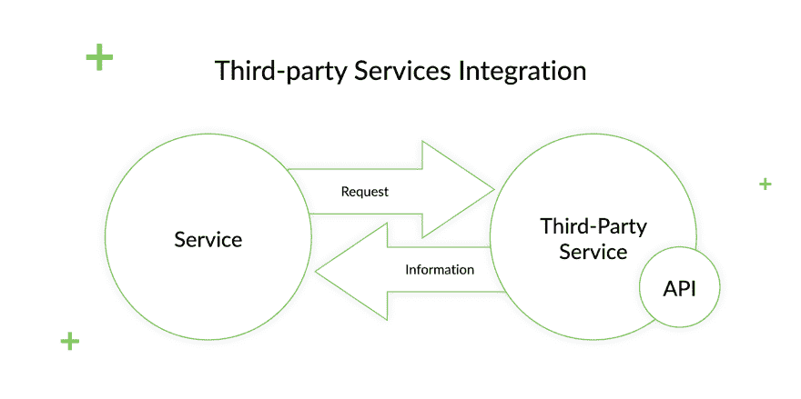
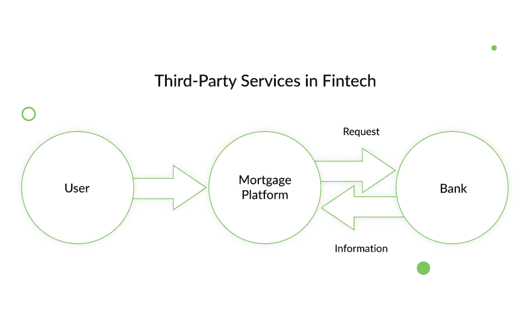
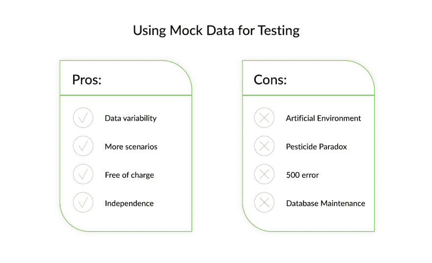
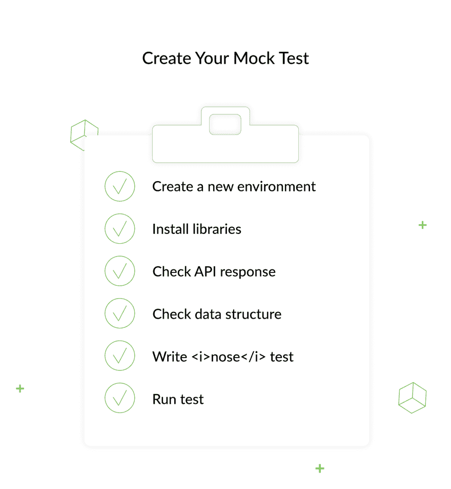

# 关于如何使用模拟数据测试第三方集成的教程

> 原文：<https://dev.to/django_stars/testing-third-party-integration-using-mock-data-nil>

我们早已习惯了日常使用的应用程序和平台中的第三方服务，我们甚至没有注意到它们。通过 API，第三方服务可以与任何其他服务集成，以添加更大的功能集——如使用脸书登录烹饪网站，或获取银行信息以获得在线抵押贷款。这些真的可以用于从娱乐到金融科技的所有领域。顺便说一下，考虑到我们在金融领域做了多少工作，金融科技是我们首先想谈论的。这些年来，我们收集了一两条有用的信息。

正如我们所说的，第三方服务保证了扩展的功能和完美的运行，而不会使主产品负担过重和过于复杂。可以肯定地说，这些都是配套服务。他们帮助主要服务检查用户提供的数据及其可靠性。在金融科技领域，可以是银行或其他机构携带私人或法律机构的信息、电子商务中使用的汇率数据或资金转移。

## 第三方服务:简短指南

让我们看看这些服务是如何工作的。例如，我们有一个抵押贷款平台。用户通过提供他们的个人数据注册——姓名、出生日期、收入和其他相关信息。该平台向与之集成的第三方服务发送请求，以确认收到的数据。第三方服务——在这种情况下，它可能是一家银行——拥有用户的信息，如他们的信用记录，可能是他们的犯罪记录等。，并将其提供给平台。在这里，我们看到第三方服务如何帮助平台识别冒名顶替者，或者简单地向特定用户提供更好的抵押估计。

同时，所有这些数据不一定要存储在平台上。您只存储您请求的数据。但与此同时，如果你需要的话，你有大量的数据可以进一步搜索。这就是它们被称为第三方服务的原因——它们是客户服务关系的第三方。

## 测试第三方服务集成

在我们将我们的平台连接到第三方 API 之前，我们需要看看它是否能与我们提供的任何服务兼容。我们需要确保他们相互理解，数据得到充分的表达。但是如果是第三方服务，为什么*我们*需要测试呢？

### 测试数据解释

我们真正要测试的是第三方服务的集成，或者更确切地说，是我们从中获得的数据。既然我们要把它和我们自己的产品一起使用，我们不希望它搞乱我们的业务。最重要的是，我们应该测试数据是否被正确解释，是否被充分处理。我们需要确保数据被转换为必要的格式并被正确地传递——例如，代表收入的金额是否显示在收入字段中，或者计算是否正确运行。

当涉及到金融科技产品时，这可能会变得特别棘手，因为这些服务必须处理大量数据。你不希望你的产品将某人的收入与未偿债务混为一谈。整个产品及其工作结果取决于对数据的解释。这就是第三方服务测试如此重要的原因。

### 缺乏标准测试

好了，我们已经确立了第三方服务测试的重要性。但是我们怎么做呢？这一次，银行、机构、税务局和大多数其他金融机构已经解决了这个问题。只要额外付费，他们就可以用你的服务来测试他们的服务，并向你提供测试结果。

此时，你可能会想，继续看这篇文章也没什么用了吧？毕竟，你可以直接买测试结果，然后就此打住。它便宜，而且不那么麻烦。

但问题是**第三方服务只能给你标准的检测数据。**它们显然不够多样化，无法回答所有潜在的搜索查询。可以有几十亿，但是第三方服务连几百都给不了你。

> 他们喜欢保持简单。例如，测试数据显示，如果你寻找一套价格低于 700 美元的公寓，第三方服务将会显示相应的可能性列表。但是如果你想找一些更有异国情调的东西，比如平房呢？如果价格在 600 美元到 2000 美元之间呢？第三方服务不会在结果中包含这样的变量。我们得到的是均价的标准住宿类型，仅此而已。它们不可配置。我们不能以任何方式操纵它们。而这显然不足以测试一款产品。

### 将测试掌握在自己手中的陷阱

在这一点上，很明显我们必须使用我们自己的资源来测试服务。花钱购买第三方服务提供的测试数据是没有用的。我们自己创建测试更容易，所以我们可以添加任何我们想要的数据，并以适合我们的方式操纵它。通过这种方式，我们可以涵盖各种查询，如价格范围、物业类型、平均市场租金或汇率等。

要测试您的产品与第三方服务的集成程度，您可以输入不同的数据，并查看第三方服务是否提供了正确的响应(或者您的产品是否正确地解释了服务的响应)。然而，这并没有解决每个查询都很昂贵的问题。事实是，**使用第三方数据是相当昂贵的**，因为发送给他们的每个请求都要花费一定的钱。你只能想象你要发送多少询问来测试你可能从服务中得到的所有可能的答案！

如你所见，测试可能是产品中最昂贵的部分。那么，你如何以一种允许你操作输入数据的方式来测试你的产品，而不用支付世界上所有的钱呢？

## 测试问题的解决方案

不要担心！确实有一种方法可以得到你需要的测试数据，而不是你从第三方服务中得到的平均结果。尝试模拟服务——模仿第三方服务。所以，它基本上看起来像只鸭子，叫起来像只鸭子，但不是真正的鸭子。[汇合](https://docs.atlassian.com/atlassian-confluence/REST/6.6.0/)我们早已习惯了日常使用的应用程序和平台中的第三方服务，我们甚至没有注意到它们。通过 API，第三方服务可以与任何其他服务集成，以添加更大的功能集——如使用脸书登录烹饪网站，或获取银行信息以获得在线抵押贷款。这些真的可以用于从娱乐到金融科技的所有领域。顺便说一下，考虑到我们在金融领域做了多少工作，金融科技是我们首先想谈论的。这些年来，我们收集了一两条有用的信息。

正如我们所说的，第三方服务保证了扩展的功能和完美的运行，而不会使主产品负担过重和过于复杂。可以肯定地说，这些都是配套服务。他们帮助主要服务检查用户提供的数据及其可靠性。在金融科技领域，可以是银行或其他机构携带私人或法律机构的信息、电子商务中使用的汇率数据或资金转移。

## 第三方服务:简短指南

让我们看看这些服务是如何工作的。例如，我们有一个抵押贷款平台。用户通过提供他们的个人数据注册——姓名、出生日期、收入和其他相关信息。该平台向与之集成的第三方服务发送请求，以确认收到的数据。第三方服务——在这种情况下，它可能是一家银行——拥有用户的信息，如他们的信用记录，可能是他们的犯罪记录等。，并将其提供给平台。在这里，我们看到第三方服务如何帮助平台识别冒名顶替者，或者简单地向特定用户提供更好的抵押估计。

同时，所有这些数据不一定要存储在平台上。您只存储您请求的数据。但与此同时，如果你需要的话，你有大量的数据可以进一步搜索。这就是它们被称为第三方服务的原因——它们是客户服务关系的第三方。

## 测试第三方服务集成

在我们将我们的平台连接到第三方 API 之前，我们需要看看它是否能与我们提供的任何服务兼容。我们需要确保他们相互理解，数据得到充分的表达。但是如果是第三方服务，为什么*我们*需要测试呢？

### 测试数据解释

我们真正要测试的是第三方服务的集成，或者更确切地说，是我们从中获得的数据。既然我们要把它和我们自己的产品一起使用，我们不希望它搞乱我们的业务。最重要的是，我们应该测试数据是否被正确解释，是否被充分处理。我们需要确保数据被转换为必要的格式并被正确地传递——例如，代表收入的金额是否显示在收入字段中，或者计算是否正确运行。

当涉及到金融科技产品时，这可能会变得特别棘手，因为这些服务必须处理大量数据。你不希望你的产品把某人的收入和未偿债务混为一谈。整个产品及其工作结果取决于对数据的解释。这就是第三方服务测试如此重要的原因。

### 缺乏标准测试

好了，我们已经确立了第三方服务测试的重要性。但是我们怎么做呢？这一次，银行、机构、税务局和大多数其他金融机构已经解决了这个问题。只要额外付费，他们就可以用你的服务来测试他们的服务，并向你提供测试结果。

此时，你可能会想，继续看这篇文章也没什么用了吧？毕竟，你可以直接买测试结果，然后就此打住。它便宜，而且不那么麻烦。

但问题是**第三方服务只能给你标准的检测数据。**它们显然不够多样化，无法回答所有潜在的搜索查询。可以有几十亿，但是第三方服务连几百都给不了你。

> 他们喜欢保持简单。例如，测试数据显示，如果你寻找一套价格低于 700 美元的公寓，第三方服务将会显示相应的可能性列表。但是如果你想找一些更有异国情调的东西，比如平房呢？如果价格在 600 美元到 2000 美元之间呢？第三方服务不会在结果中包含这样的变量。我们得到的是均价的标准住宿类型，仅此而已。它们不可配置。我们不能以任何方式操纵它们。而这显然不足以测试一款产品。

### 将测试掌握在自己手中的陷阱

在这一点上，很明显我们必须使用我们自己的资源来测试服务。花钱购买第三方服务提供的测试数据是没有用的。我们自己创建测试更容易，所以我们可以添加任何我们想要的数据，并以适合我们的方式操纵它。通过这种方式，我们可以涵盖各种查询，如价格范围、物业类型、平均市场租金或汇率等。

要测试您的产品与第三方服务的集成程度，您可以输入不同的数据，并查看第三方服务是否提供了正确的响应(或者您的产品是否正确地解释了服务的响应)。然而，这并没有解决每个查询都很昂贵的问题。事实是，**使用第三方数据是相当昂贵的**，因为发送给他们的每个请求都要花费一定的钱。你只能想象你要发送多少询问来测试你可能从服务中得到的所有可能的答案！

如你所见，测试可能是产品中最昂贵的部分。那么，你如何以一种允许你操作输入数据的方式来测试你的产品，而不用支付世界上所有的钱呢？

## 测试问题的解决方案

不要担心！确实有一种方法可以得到你需要的测试数据，而不是你从第三方服务中得到的平均结果。尝试模拟服务——模仿第三方服务。所以，它基本上看起来像只鸭子，叫起来像只鸭子，但不是真正的鸭子。例如，[[https://docs.atlassian.com/atlassian-confluence/REST/6.6.0/](https://docs.atlassian.com/atlassian-confluence/REST/6.6.0/)]有一个存储“假”数据的 API。我们使用我们自己的后端开发人员为我们编写的模拟服务，手动输入我们的数据。您从模拟中获得的数据保存在一个 *json* 文件中。例如，屏幕 1 显示关于某个用户的数据，而屏幕 2 显示关于建筑物的潜在数据，就像上面的例子一样。

使用模拟数据测试集成的方法有利也有弊。

### 优点:

*   数据可变性，与标准测试数据相反。
*   独立于第三方——你不能在银行营业时间之外测试与银行相关的服务。
*   更多可能的测试场景。
*   减少开发人员对测试人员的依赖

### 缺点:

*   人工环境——很难预测现实生活中可能出现的所有情况；遗漏某些东西的可能性更高。
*   杀虫剂悖论——通过一次又一次地使用相同的测试和相同的数据，开发人员将无法恢复 bug，并且每次都使用新数据太麻烦了。
*   500 错误——当输入不在模拟服务中的数据时，开发人员会得到错误，因为手动创建所有可能的答案相当困难。
*   数据库维护——随着数据库的增长，维护您自己的数据库变得越来越困难。

## 自己制作

要创建您自己的模拟测试，请创建一个新的开发环境。然后，安装库。一个*模拟*库——它会用模拟对象替换你系统的一部分。 *nose* 库将使测试变得更加容易。*请求*库将大大简化 HTTP 调用。

在开始测试之前，一定要知道假 API 会带来什么。首先也是最重要的，当你发送请求时，你正在使用的 API 应该正确地响应。另外，检查响应中的数据结构。您的下一个假设是，您将知道预期的数据是什么样的。此时，您会看到 API 端点运行良好。

可以写一个 *nose* 测试来确认服务器的未来寿命，看看服务器是否返回 OK 响应。现在，运行测试，看看它是如何工作的。

## 测试提示

如你所见，有一条走出死胡同的路既高效又划算。你不必勉强接受没有太大帮助的廉价标准测试，也不必在每次测试查询都使用第三方数据的昂贵测试上浪费金钱。一旦你进行了几次测试并掌握了它的运行情况。然而，当您使用模拟数据测试第三方服务时，我们仍然有一些建议您应该考虑。

*   为这些数据使用一个单独的服务器，这样您就只能访问您的模拟数据，而不会与真实数据混淆。使用单独的服务器运行测试也将保护您的用户数据免受任何可能的损坏或安全漏洞。
*   设置服务时，请确保它总是响应通常与其一起工作的服务器。例如，同步它们的部署。如果您对模拟服务器 dev.mock 进行了更改，第三方服务器 dev 应该会获得相同的更新。否则，就不可能测试数据传输和解释的方式。
*   考虑语言、浏览器和环境等变量。要做到这一点，了解你的用户。像他们一样思考。他们用什么小工具，说什么语言，用什么钱支付？遗漏哪怕一个微小的细节都可能使你的测试结果无法使用。

难怪他们说，“如果你想把事情做好，就自己去做。”当然，第三方服务可以让你的生活和你的平台的工作变得更容易，但前提是*你*作为产品所有者正确使用它们。在测试第三方集成时也是如此。这一步没有别的办法，所以找到最有效的方法来做这件事是至关重要的。在某些情况下，甚至从服务本身购买测试结果就足够了。但是通过自己做测试，你可以对你得到的结果充满信心。使用模拟数据使您能够获得最真实的测试结果，因为与来自服务的标准测试数据相比，它给了您更多的自由和更多的变量。不管怎样，你都有几个选择。所以明智的选择吧！

这篇关于使用模拟数据测试第三方集成的文章是由 Serhii Bolilyi - QA 工程师撰写的。最初发布在 Django Stars 博客上。