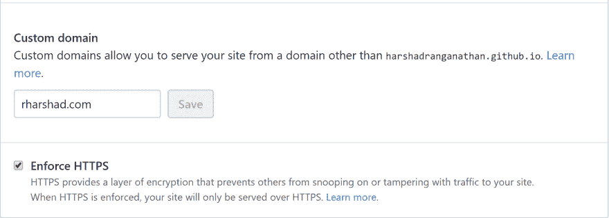
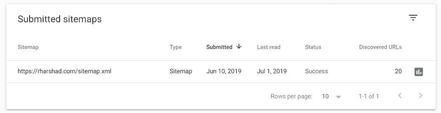
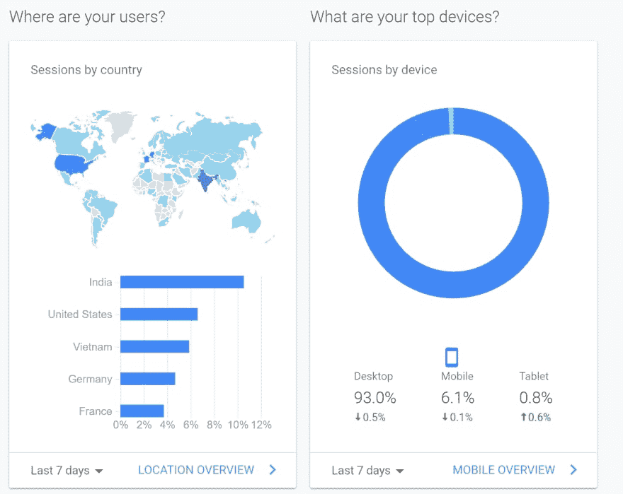
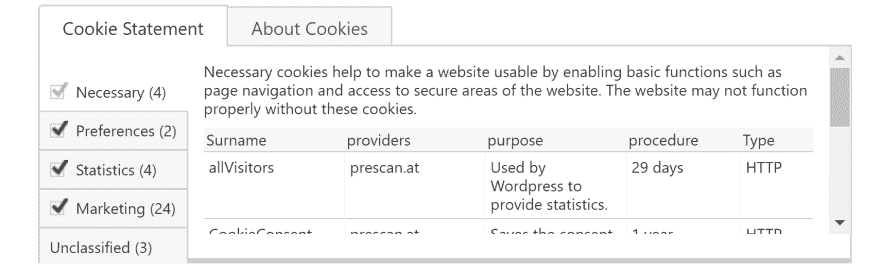

# 网站要做的事情

> 原文：<https://dev.to/harshadranganathan/website-things-to-do-2ad2>

## 安全

通过在网站上启用 HTTPS 来确保网站安全。

HTTPS 有助于防止入侵者篡改网站和用户浏览器之间的通信。入侵者包括故意恶意的攻击者，以及合法但侵入性的公司，如将广告注入页面的 ISP 或酒店。

入侵者利用你的网站和用户之间的每一个未受保护的资源。图像、cookies、脚本、HTML …它们都是可利用的。入侵可能发生在网络中的任何一点，包括用户的机器、Wi-Fi 热点或受损的 ISP 等等。

### Github 页

如果您的网站在 Github 上，您可以在资源库的设置部分启用 HTTPS。

[](https://rharshad.com/assets/img/2019/07/github-pages-https.png)

### 让我们加密

[让我们加密](https://letsencrypt.org/)是一个免费的、自动化的、开放的认证机构，你可以利用它来为你的网站启用 SSL。

您可以利用 Certbot 客户端在不停机的情况下自动进行证书颁发和安装。

## 现场审核

衡量你的网站在性能、可访问性、最佳实践和 SEO 方面的表现是很重要的。

[https://web.dev/measure](https://web.dev/measure)-分析你的网站并提供有用的指导

[https://developers.google.com/web/tools/lighthouse/](https://developers.google.com/web/tools/lighthouse/)-对性能、可访问性、渐进式网络应用等进行审计

[https://developers.google.com/speed/pagespeed/insights/](https://developers.google.com/speed/pagespeed/insights/)-分析网页的内容，然后提出建议使网页运行得更快

以上都是谷歌提供的工具，使用灯塔项目的数据。

## 可发现的

### 谷歌搜索控制台

[搜索控制台](https://search.google.com/search-console/about)提供工具和报告，帮助您测量网站的搜索流量和性能，解决问题，并使您的网站在谷歌搜索结果中大放异彩。

您可以将您的 [sitemap.xml](https://en.wikipedia.org/wiki/Sitemaps) 提交给 google，这样它就可以被抓取和索引。

[](https://rharshad.com/assets/img/2019/07/google-search-console-sitemaps.png)

## 分析学

### 谷歌分析

[谷歌分析](https://analytics.google.com/analytics/web/)是谷歌提供的一项网络分析服务，用于跟踪和报告网站流量。

在控制台中，您需要创建新的分析帐户和应用程序，并选择自定义视图。

一旦你设置好了，你就可以跟踪你的观众和实时浏览。您还可以为您的网站设置包括/排除过滤器。

[](https://rharshad.com/assets/img/2019/07/google-analytics-console.png)

要为您的网站启用分析，请使用您的 google analytics 属性 ID 将以下脚本添加到您的网页中。

```
<script async src="https://www.googletagmanager.com/gtag/js?id=GA_MEASUREMENT_ID"></script> <script>
  window.dataLayer = window.dataLayer || [];
  function gtag(){dataLayer.push(arguments);}
  gtag('js', new Date());
  gtag('config', 'GA_MEASUREMENT_ID');
</script> 
```

## 货币化

### Google AdSense 广告

Google AdSense 是由 Google 运行的一个程序，通过该程序，Google 内容网站网络中的网站发布者提供针对网站内容和受众的文本、图像、视频或交互式媒体广告。

你需要提交你的网站与谷歌审查。激活您的帐户需要几天到几周的时间。

一旦您的帐户被激活，您可以选择启用自动广告或创建自定义广告单元。

我建议创建一个定制的广告单元，这样你就可以把你的广告放在合适的地方，而不影响用户体验。

汽车广告发布: [Adsense 汽车广告在手机上显示，但不在桌面上显示](https://support.google.com/adsense/thread/3490813?hl=en)

还要确保在根域级别将 ads.txt 文件添加到您的站点。

## GDP

《一般数据保护条例》( GDPR)和《电子隐私指令》( ePR)会影响网站所有者如何使用 cookies 和在线跟踪来自欧盟的访问者。

GDPR 最具体的要求之一是定义什么构成了正确的 cookie 同意，这意味着同意必须是:

***知情:个人资料为什么、如何、在哪里使用？对于用户来说，它必须是明确的，同意什么，并且必须能够选择加入和选择退出各种类型的 cookies。*T3】**

***给予肯定的、积极的行动，不能被误解。*T3】**

***给出初始处理前的个人数据。*T3】**

***可支取。用户必须很容易改变他或她的想法并撤回同意。*T3】**

有几个网站为网站提供 GDPR 合规同意功能。

[](https://rharshad.com/assets/img/2019/07/cookie-consent-banner.png)

## 打开图形标签

[Open graph](http://ogp.me/) meta 标签允许你控制当一个页面被分享到脸书和 Twitter 上时，显示什么内容。

```
<meta property="og:title" content="The Rock" />
<meta property="og:type" content="video.movie" />
<meta property="og:url" content="http://www.imdb.com/title/tt0117500/" />
<meta property="og:image" content="http://ia.media-imdb.cimg/rock.jpg" /> 
```

## 代理过滤器

许多公司使用代理过滤器来限制对网站的访问。检查你的网站是否被正确分类以避免被屏蔽。

[https://sitereview.bluecoat.com/#/](https://sitereview.bluecoat.com/#/)