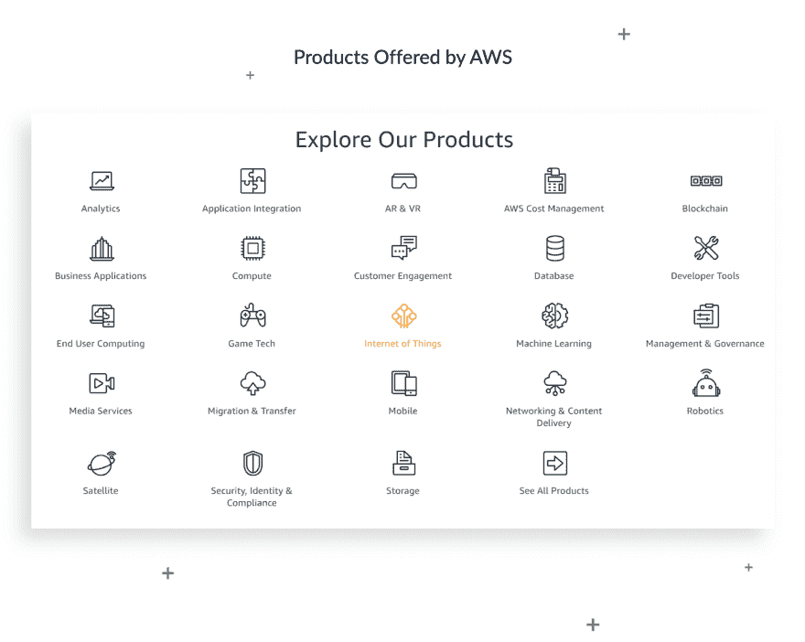
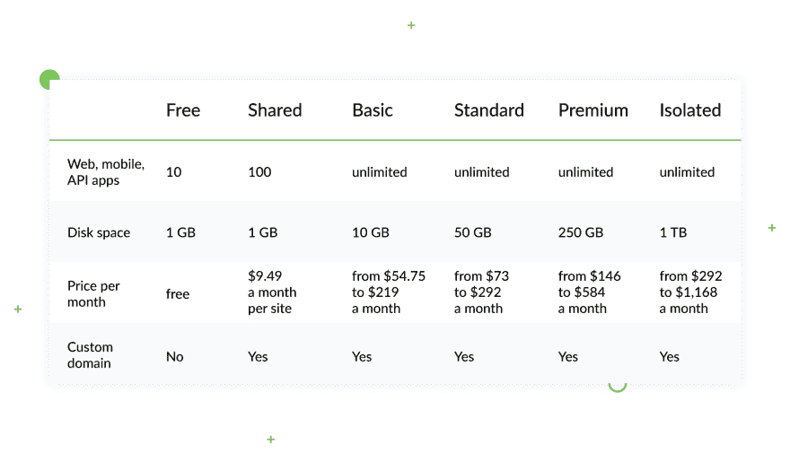
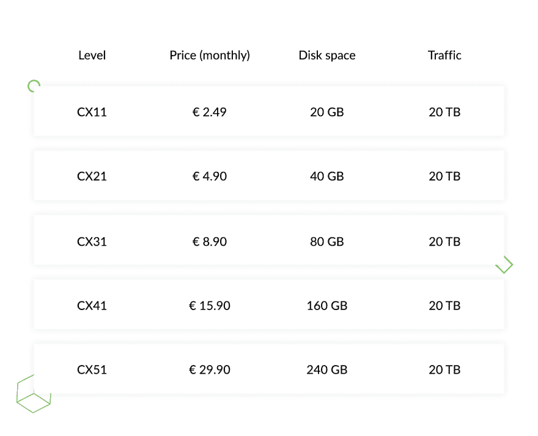
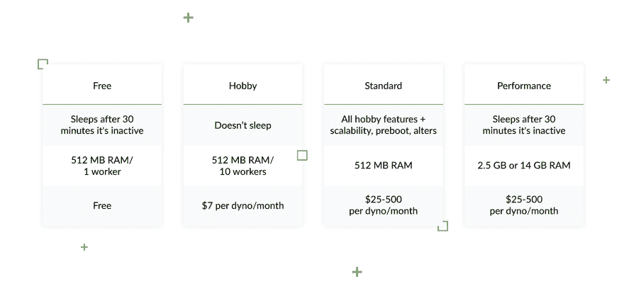

# Tips on How to Choose Django Compatible Hosting Services

> 原文：[https://dev.to/django_stars/top-6-django-compatible-hosting-services-3fgj](https://dev.to/django_stars/top-6-django-compatible-hosting-services-3fgj)

Finding the best Django hosting to suit all of your requirements might be quite a big deal, but it's definitely worth the effort. Moreover, it's also worth trying different options and seeing what will be the best fit for you. Some engineers prefer using paid and highly functional servers, while others find more benefits in (relatively) free services, and both options have their own benefits. We have chosen the top 6 small, mid, and large-scale Django hosting services with various functions that certainly deserve consideration.

## Large-scale Django web hosting companies

### [Amazon Web Services](https://aws.amazon.com/)(AWS)

AWS is one of the most elaborate Django hostings. What really stands AWS out from the others is its flexibility and functionality. It's possible to configure the application for practically any needs using its highly adjustable construction kit and apply the server for any project and for any purpose. It’s also a great choice for those who run lots of lengthy projects.

With AWS you will cover such aspects as data storage, content delivery, database management, networking, load balancing, and auto-scaling. This list will be insufficient if analytics, mobile development, testing, developer and management tools with security services are also omitted.

Even though this Django hosting is predominantly aimed at processing Amazon clients (as far as they have the corresponding infrastructure to run it), there are no direct restrictions for other users. The bottom line is that this is the most suitable tool for web professionals and those companies who may require truly wide functionality. Also, as Amazon spans around 60 entities untied by the Global infrastructure, **it works particularly well for big enterprises with offices in different countries.**

**Among the many users at mid-to-small scale, AWS can also boast Atlassian, Expedia, Vodafone, Siemens, Philips, and has many more up its sleeve.**

### Pros:

*   AWS is secure and compliant, as long as all the data meets rigid security standards and PII.
*   Contains a number of useful tools like analytics and mobile services.
*   Gives additional flexibility by providing a VPC (Virtual Private Cloud).
*   Its customer support is fast and helpful.
*   Using AWS, it's easy to run and scale your application (of course, if it’s inherently scalable).
*   Possesses data centers around the world.

### Cons:

*   Technical support is paid.
*   The abundance of options may confuse and even discourage an inexperienced user.
*   You pay for using resources, so it's hard to predict how much you will be charged at end of the day.

#### Plans & pricing

The AWS pricing is not an easy thing.

Their official website offers a free trial with special offers for beginners. This may be an alluring proposal to have a go, but pay attention that once you exceed the chosen tier they are going to charge you according to official pay-as-you-go rates.

There is also an option to go for non-expiring free tier AWS solutions. These, however, have perks when you begin gathering momentum due to limited storage volumes.

To know the exact (or, more likely, the approximate) amount you are about to pay after the end of the trial period, you should use [the calculator](https://calculator.s3.amazonaws.com/index.html)placed on the [Pricing](https://aws.amazon.com/pricing/?nc2=h_ql_pr) page of their website.

Even though AWS might seem way too tangled at first glance, it is still worth thorough consideration for those who are willing and aiming to make progress in this industry. To make things easier, you may take a look at [Terraform](https://www.terraform.io/docs/providers/aws/index.html) (a tool for implementation culture infrastructure as code.) Also, using [guides](https://www.terraform.io/guides/index.html) might be a starting point for AWS’s deeper understanding.

### [Azure](https://azure.microsoft.com/en-us/) (Microsoft)

Azure by Microsoft is a cloud-based platform with the main functions being a content delivery network, media services, web apps, API apps, and so on. As a whole, this service might resemble DigitalOcean in Amazon’s interpretation. It also embodies all the necessary toolkit to help host your Django website. **This is crucial for busy websites, especially those that receive billions of monthly requests.**
The list of Azure’s case studies contains such companies as HP, Asos, Adobe, IHG, and Airbus, among others.

### Pros:

*   Multi-factor authentication and other security layers.
*   1-year free access to Virtual Machines with a $200 30-day credit.
*   Has AI-powered processes at your disposal.
*   It is fully scalable.
*   Azure is hosted globally with over 40 data centers.
*   Spending some time with its nuances, one can easily use and deploy apps.

### Cons:

*   Is effective only if you are into managing data.
*   An absence of recovery mode, which may be solved only through setup new server settings, pulling up your stuck project data.
*   Makes you work solely with one vendor.
*   Might be difficult to understand for a new user.
*   With pretty much the same set of features, it might cost more than other Django hostings.

#### Plans & pricing

While Microsoft Azure ensures it's five times less expensive than AWS hosting services, it definitely concedes to Amazon Services in terms of complexity, the absence of certain features and even price. This, however, does not hinder big enterprises running their businesses if they find it cost-effective enough. **Instead, you may find it beneficial especially if you use other Microsoft products.**

### [Google Cloud Platform](https://cloud.google.com/)

The service is, obviously, run by Google and is an elaborate product with a lot of tools, starting from services to compute, store, run big data analytics, machine learning, and much more. They are specifically focused on meeting the needs of large enterprises akin to **Spotify, Lush, Johnson-Johnson, Coca-Cola, Sony music, Wix,** etc. An alternative function cloud storage for people and companies that need to keep their documents securely in place off-site.

### Pros:

*   It’s extremely good at analytics and data storage.
*   Works well with other Google products.
*   Offers $300 free credit to spend over 12 months.

### Cons:

*   With around $150 monthly support fee it's a bit hefty.
*   Getting data from Google Cloud Storage will cost you $0.12 per GB.
*   Has a complex pricing scheme which makes it difficult to predict expenses.
*   Is a bit behind AWS with its features and productivity.

Using other Google services, looking for generous offers to host a Django app, and being fine with paying for costly yet terrific google support assistance are the main reasons why you should give it a shot.

#### Plans & pricing

The pricing is comparatively low with $0,020 per GB monthly for the Regional class and $0,007 per GB monthly once you go for the Coldline class.

## Mid and small-scale Django hosting services

Let’s get right to it: even if free Django hosting services did exist, you would rarely opt for them since the number of features, their quality, and lack of support would hardly amaze or fit you. However, some Django hosting providers ensure free trial periods, which are equally advantageous for clients and hosts.

### [Hetzner](https://www.hetzner.com/)

Hetzner is a Germany-based organization with data centers in Germany and Finland. When visiting their website, the first thing to strike one's eye is its old web design, but this does not prevent the company from offering a wide range of services, such as SSL certificates, dedicated servers, vServers, unlimited bandwidth, storage box, domain registration, and others. Overall, **Hetzner is a wise solution for those who understand the ropes of hosts’ specs and thus know what exactly they want to get from them.**

**Hetzner is widely used by Leoni, Autodoc, Showmax, Bitdefender, Outdooractive, etc.**

### Pros:

*   It probably has the most affordable fees for both small and large-scale projects.
*   Partnership with Dell and Intel means high quality of software.
*   Is relatively scalable.
*   Gives free domain and SSL.
*   Support is free and available 24/7.
*   Has a ready-made image which is easy to configure.

### Cons:

*   Trying to reach support by phone outside of Germany may be costly.
*   No reimbursement in case of server failure
*   Does not offer a traditional uptime guarantee.
*   Provides an awkward web interface and a very limited control panel.
*   They do not possess any data centers in the USA.
*   Technical documentation is available only in the German language.

#### Plans & pricing

One of the most attractive parts of Hetzner’s is its affordability. It might turn to be truly cheap to go with Django hosting. It allows the use of web hosting with Python starting from the level 9 (cx41), though. Here is the list of approximate fees as follows:

### [DigitalOcean](https://www.digitalocean.com/)

DigitalOcean is no less than a decent competitor to Google Cloud Platform, Amazon Web Service and Azure. This cloud service platform is a reasonably good hosting provider in terms of simplicity, fast load times (with SSD storage and its 8 datacenters) and security. It also provides an intuitive interface and straightforward setup. Primarily, it's equally good for newbies and experienced businesses **with basic needs.**

**Lytham Labs, QuoDeck, Fanout, Accern, TaskRabbit, and numerous other organizations have been happily using DigitalOcean services for years.**

### Pros:

*   Has a quite simple, user-friendly setup.
*   Possesses 9 data centers in the USA, UK, Singapore, the Netherlands.
*   No hidden charges for extra services you might not know about.
*   Outstanding support around the clock.
*   Boasts an affordable pricing policy.
*   One can get a 60-day trial of free cloud-based hosting.

### Cons:

*   Overall, and covering multiple aspects, DigitalOcean doesn’t have obvious shortcomings. It’s both good in terms of pricing and coverage.

#### Plans & pricing

Starting from $5 for monthly subscription up to $960 depending on its configurations.

To sum it up, it's probably the best solution for Linux developers according to price and effectiveness, regardless of the fact that it doesn’t offer any analytics, configuration management, or hosted databases.

### [Heroku](https://devcenter.heroku.com/)

Here you won’t find a lot of frills and fancies, but Heroku still possesses PaaS architecture, Python, Ruby, Java and PHP support, plus add-ons and databases. It features app metrics, code and data rollback, real-time insights, GitHub Integration, and more. What stands Heroku out from the others is that it provides an easy way to setup and configure elements, which raises engagement and productivity. **Best for small and medium-sized companies.**

### Pros:

*   It is super easy to upload, update, and deploy a project quickly.
*   Possesses data centers in the USA and Europe.
*   Provides very good support services.
*   Heroku’s infrastructure is managed within Amazon’s secure data centers.
*   Is a polyglot among hosting services so you can pick the language you need.
*   Easy to get to the bottom of its essentials.

### Cons:

*   Will cost you more than other VPS if you grow bigger.
*   Compatibility with app servers is far from being perfect.
*   As long as Heroku provides its own infrastructure solutions, it might be challenging to switch to another server.

#### Plans & pricing

All the paid plans follow the pay-as-you-go model.

By and large, Heroku is extremely good to help you kickstart from the beginning but might impede at more advanced levels. It’s probably the best choice if you are aiming at simply launching a product.

## Wrap it Up

It is a big deal to pick the perfect hosting service for yourself. Through trials and errors, you can, however, come to terms with the most suitable kind for your specific needs.

So, if you are yet to find your own best hosting for Django, let’s take a look at the essentials of a robust host:

*   scalability that allows for customization;
*   solid technical support you can reach no matter what;
*   secure site certification to ensure reliability;
*   free domains at your disposal;
*   money back guarantee for higher reliability;
*   multiple servers in different countries.

These features are not all completely standard, yet they might give you hint if this or that host is worth trying. Overall, we recommend you to take a closer look at these Django compatible providers and pick those that most suit your business size, aim, background, and personal preferences.

In taking stock of these Python & Django compatible web hosting services, it is vital to emphasize that they tap potential at different levels. While you can go with Heroku and DigitalOcean in the middle or even entry-level, Hetzner might need you to be savvier. The same goes for AWS, Azure, and Google Cloud Services: with a wide range of features and hefty fees, these are better for bigger companies with advanced needs.

This article about [Django Compatible Hosting Services](https://djangostars.com/blog/top-django-compatible-hosting-services/) is written by Denis Podlesniy - Backend Engineer. Originally posted on Django Stars blog.