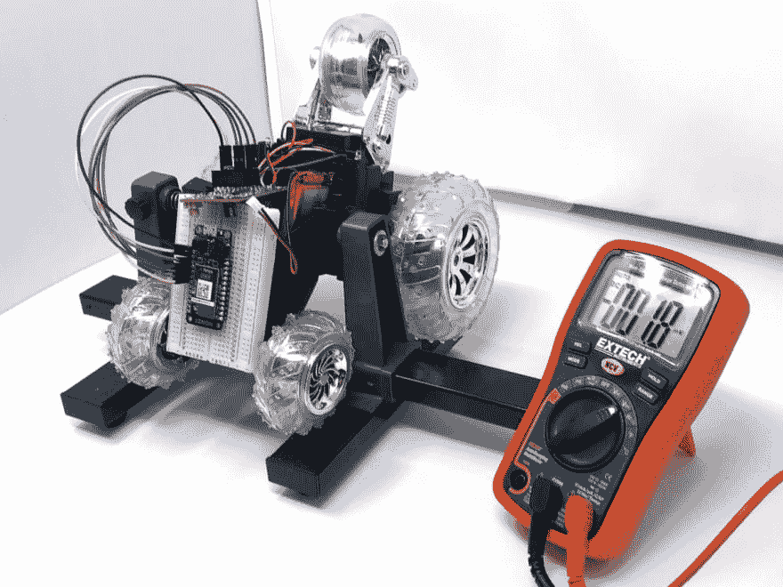
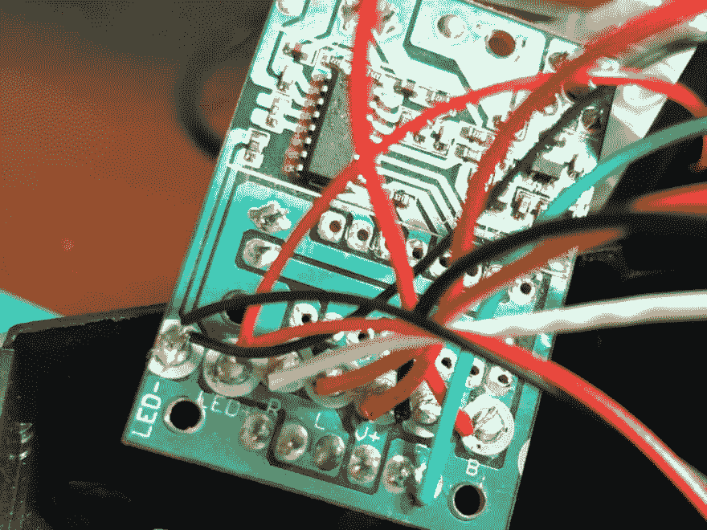
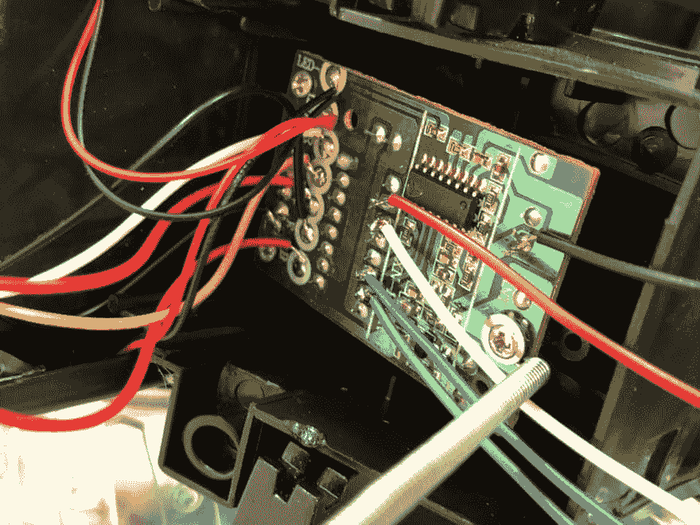
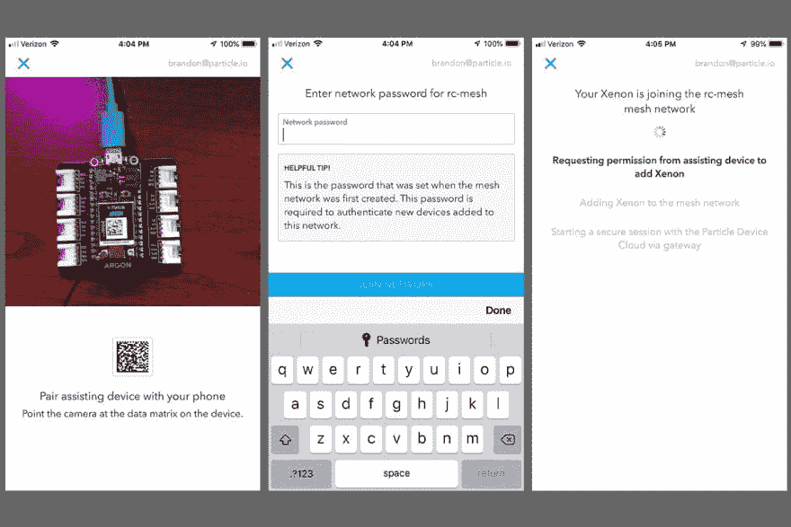
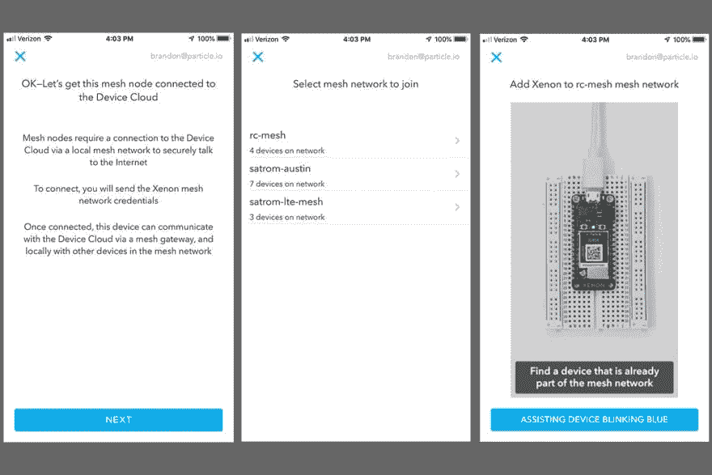
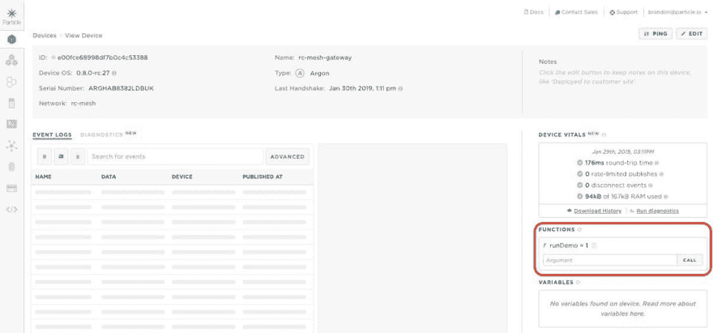
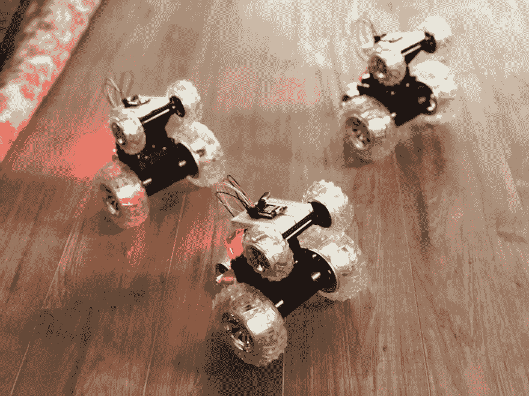
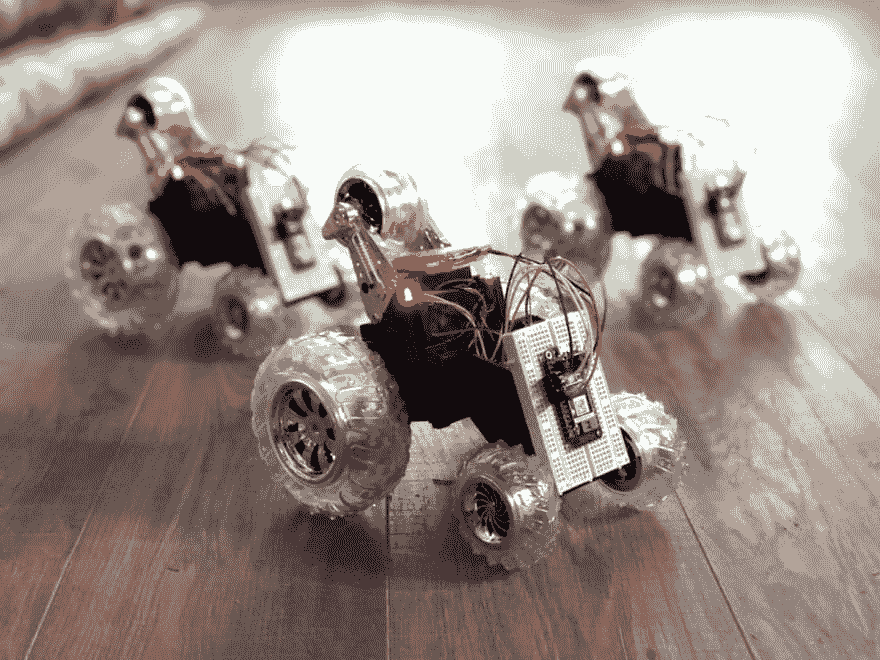

# 通过建造这一群粒子驱动的机器人来了解网状网络

> 原文：<https://dev.to/particle/learn-about-mesh-networking-by-building-this-swarm-of-particle-powered-robots-4c2j>

破解玩具是电子探索的一种有趣形式。这是一个很好的方式来学习现实世界的产品是如何设计和制造的，并且不用担心昂贵的电子产品在追求知识的过程中变得毫无用处。廉价的消费电子产品是学习、探索、甚至构建新的创新解决方案的绝佳平台。

遥控(RC)车辆是制造商的常见目标，名为“雷霆不倒翁”的汽车为 RC 汽车黑客提供了一个廉价、可访问的平台。Tumbler 以前被黑客攻击过很多次，但我不认为它曾被用于网状网络。也就是说，直到现在。使用几个你可以在网上或 CVS 等商店找到的转盘，以及一些 Particle 的新的网状硬件，我创建了一个 swarmbot 转盘网络，它们在我的每一个命令下以同步的方式移动！

**注:**本帖原载于*品牌:杂志第 68 卷*及网上[此处](https://makezine.com/projects/diy-swarmbots/)。经作者允许，此处转载。|

## 所需材料

对于这个项目，您需要以下物品:

*   (2-3)“雷霆不倒翁”遥控汽车，可在许多连锁药店或网上买到——在美国，沃尔格林和 T2【CVS】都有这种汽车。注意这个产品有多个版本，但是我将介绍如何处理这些微妙的变化。
*   (1) [粒子氩](https://store.particle.io/products/argon-kit)
*   (3) [粒子异种](https://store.particle.io/products/xenon-kit)
*   (3)试验板—包含在氩气和氙气套件中
*   各种跳线连接每个氙到钢筋混凝土汽车的印刷电路板
*   用于检查 IC 引脚功能的万用表(因为引脚可能会因不同的廉价遥控汽车而异)
*   烙铁和焊料

## 网状网络是如何工作的？

大多数联网解决方案倾向于依赖 Wi-Fi 或蜂窝网络进行连接。这通常意味着每个连接的设备都保持与互联网的直接连接。虽然这对于连接到云进行数据存储或处理很有用，但一些连接的解决方案需要能够在本地网络上使用其他设备运行，而不管是否存在到互联网的连接。

网状网络解决方案通过允许开发者创建连接设备的本地网络来实现这些场景。网络的主体由感知或驱动的端点和中继器组成，中继器通过在设备之间传递消息来帮助增加网格的大小和可靠性。此外，少量设备(通常只有一台)充当网关，以保持与互联网的连接。重要的是，当与网络的连接消失时，这些设备的本地网络仍然可以相互通信。氩、硼和氙都是第三代粒子设备，提供内置的网状网络功能。

对于这个构建，我使用网格创建了一个 RC 汽车网络，每辆车都由粒子氙控制。所有的氙遥控汽车是端点，并连接到一个网状网络与一个单一的粒子氩作为网关。一旦网络建立起来，我就可以使用本地网络消息向网络上的节点发送低延迟命令，并让我的遥控汽车跳舞。

然而，首先，我需要黑掉现成的滚筒来给它们提供粒子动力！

## 窃听雷霆不倒翁

这个过程的第一步是改装遥控汽车，添加氙气。无论你使用的是什么品牌或风格的遥控汽车，目标都是撬开汽车，露出里面的 PCB，确定设备如何向电机发送命令以转动车轮，并将氙气灯的引脚连接到汽车上相应的电机驱动器引脚。因为这些车不贵，你应该会发现一些变化，甚至在那些盒子上有“雷霆不倒翁”名字的车中。

关于 Tumbler hacking 的文章可以在网上找到，可以追溯到 9 年前。在电子世界里，这是一生的时间，所以在遵循以下说明的同时，一定要测试和验证你自己汽车的功能。

我建议拿起你最喜欢的万用表，一边用遥控器控制车轮旋转，一边测量 RC 汽车 PCB 上各种引脚之间的电压。确保把你的车停在车轮可以自由转动的地方，这样它就不会在测试时离开你。

<figure>[](https://res.cloudinary.com/practicaldev/image/fetch/s--i_Z_K0Ls--/c_limit%2Cf_auto%2Cfl_progressive%2Cq_auto%2Cw_880/https://blog.particle.io/wp-content/uploads/2019/07/tumbler-with-mm.jpg) 

<figcaption>用我信赖的万用表遥控不倒翁。由于这些汽车价格低廉，万用表就可以方便地对 IC 引脚进行逆向工程。</figcaption>

</figure>

拆下固定制栓外壳的两个螺丝。一旦这些都出来了，你可以解除外壳，露出不倒翁印刷电路板。在内部，你会看到 8-10 根电线从汽车连接到 PCB，还有一些通孔和表面贴装元件。

<figure>[](https://res.cloudinary.com/practicaldev/image/fetch/s--I1696ocP--/c_limit%2Cf_auto%2Cfl_progressive%2Cq_auto%2Cw_880/https://blog.particle.io/wp-content/uploads/2019/07/Hbridge-hacking.jpg) 

<figcaption>不倒翁使用了一种经典的电机控制器，称为 H 桥驱动器。通过用我的万用表测试衬垫，我能够逆向工程出是什么组合驱动汽车前进和后退，以及左右转向。请注意，一些 Tumblers 使用不同的引脚排列比我的，所以你会想有一个米附近测试你的车。</figcaption>

</figure>

## 了解各种板载 IC

顶部的小型表贴元件是遥控器接收器芯片 RX-2B。它的一对，TX-2B 收发器芯片位于这些汽车附带的遥控器中。这些 IC 通常用于 RC 车辆，我能够在线找到它们的数据手册，以确定哪些引脚映射到遥控器的向前、向后、向左和向右命令。我还使用数据手册建立了一个已知的接地引脚，需要它来确定哪些引脚为汽车电机供电，并且可以由氙气控制。

这一点最终变得至关重要，因为这些电路板上的主 IC(安装在汽车 PCB 底部的通孔)是我找不到数据手册的，尽管我花了很多时间寻找。虽然我仍然不能 100%确定这款芯片的所有功能，但它的主要功能是作为 H 桥电机控制器。向 IC 上的某个引脚发送脉冲信号会导致一个脉冲输出到其中一个电机控制引脚，从而使车轮向前或向后旋转。

<figure>[](https://res.cloudinary.com/practicaldev/image/fetch/s--atNMGv1t--/c_limit%2Cf_auto%2Cfl_progressive%2Cq_auto%2Cw_880/https://blog.particle.io/wp-content/uploads/2019/07/Hbridge-hacking-2.jpg) 

<figcaption>将电机控制器插回不倒翁底盘。</figcaption>

</figure>

通过逆向工程，我能够发现在这个未知的 IC 上有四个我关心的引脚:一个向前旋转左轮，一个向后旋转；一个向前旋转右轮，一个向后旋转右轮。我将一根导线焊接到这些引脚的顶部，另一根焊接到接地引脚。尽管氙气和汽车是分开供电的，但它们需要共享一个地面信号，以便根据需要工作。

## 设置网状网络

<figure>[](https://res.cloudinary.com/practicaldev/image/fetch/s--bhYxJyyT--/c_limit%2Cf_auto%2Cfl_progressive%2Cq_auto%2Cw_880/https://blog.particle.io/wp-content/uploads/2019/07/Fig-E-2.jpg) 

<figcaption>使用粒子移动应用程序建立粒子网状网络是一个快速的过程。</figcaption>

</figure>

因为这个项目需要一个网状网络，你需要为每辆 RC 汽车设置一个网关(粒子氩或硼)和一个基于氙的节点。如果你想通过无线方式对每台 Xenon 进行编程，而不必将每台 Xenon 连接到电脑上，你需要提前设置好网络。你可以从 Particle mobile 应用程序中完成这项工作，或者按照这里的说明[进行操作](http://Particle.io/start)。

<figure>[](https://res.cloudinary.com/practicaldev/image/fetch/s--5YBlP4lb--/c_limit%2Cf_auto%2Cfl_progressive%2Cq_auto%2Cw_880/https://blog.particle.io/wp-content/uploads/2019/07/Fig-E-1.jpg) 

<figcaption>此图显示了设置新的粒子网格设备时您将经历的移动流。</figcaption>

</figure>

## 编程制栓

一旦你有了第一个氙气灯并准备好了，下一步就是编写固件来控制每辆车的动作。因为我们的目标是创建一个小型的蜂群机器人网，所以我们要创建一个简单的序列来向前、向后、向左和向右移动汽车。该序列的代码可在下面找到:

```
// Wheel pin mappings
int leftReverse = A0;
int leftForward = A1;
int rightForward = A2;
int rightReverse = A3;

// Speed and delay variables
int speed = 85;
int turnSpeed = 255;
int forwardDelay = 1000;
int backDelay = 1000;
int turnDelay = 2000;

void setup()
{
  // Set motor pins to outputs
  pinMode(leftReverse, OUTPUT);
  pinMode(leftForward, OUTPUT);
  pinMode(rightForward, OUTPUT);
  pinMode(rightReverse, OUTPUT);

  // Make sure each motor is off
  digitalWrite(leftReverse, LOW);
  digitalWrite(leftForward, LOW);
  digitalWrite(rightForward, LOW);
  digitalWrite(rightReverse, LOW);
}

void runDemo(const char *event, const char *data)
{
  allOff();

  goForward(speed);
  delay(forwardDelay);

  goBack(speed);
  delay(backDelay);

  // Max spin to raise up on the back tires
  turnLeft(turnSpeed);
  delay(turnDelay);

  allOff();
}

void allOff()
{
  analogWrite(leftReverse, 0);
  analogWrite(leftForward, 0);
  analogWrite(rightForward, 0);
  analogWrite(rightReverse, 0);

  delay(50);
}

void goForward(int speed)
{
  allOff();

  analogWrite(rightForward, speed);
  analogWrite(leftForward, speed);
}

void goBack(int speed)
{
  allOff();

  analogWrite(rightReverse, speed);
  analogWrite(leftReverse, speed);
}

void turnLeft(int speed)
{
  allOff();

  analogWrite(rightForward, speed);
}

void turnRight(int speed)
{
  allOff();

  analogWrite(leftForward, speed);
}

void loop()
{
  // Nothing needed here. 
} 
```

你可能已经注意到这个演示的核心是`analogWrite`命令，通过发送一个电压到一个相应的管脚来使每个轮子向前或向后转动。通过测试，我确定我正在使用的汽车是 PWM-able，这意味着我可以将车轮引脚设置为低于数字高(氙的情况下为 3.3 伏)，并使车轮以较低的速度转动。请注意，我为向右转或向左转与向前和向后传递了不同的值。PWM 为这些廉价汽车提供了非常复杂的模式和速度。

演示代码完成后，RC cars 需要的最后一部分是订阅一个本地网络消息，该消息将`runDemo`函数指定为处理程序。使用`Mesh.publish`和`Mesh.subscribe` API，Particle 支持网络上节点之间的本地网状网络消息传递。`Mesh.publish`向网络上的所有节点发送广播消息(带有名称和有效载荷)。另一方面，`Mesh.subscribe`监听消息(通过名称)并指定一个处理程序来处理和响应这些传入的消息。

我们的 Xenons 将使用`Mesh.subscribe`监听网络消息，然后触发演示序列。

```
// Add to setup functionMesh.subscribe("run-demo", runDemo); 
```

将完成的代码闪到每辆遥控汽车 Xenon 上，你就为最后一块做好了准备:为网关编程以协调汽车群的运动。

## 编程 mesh 网关

网格网关没有运行在每个 Xenon 上的代码复杂，但是对于我们的演示来说仍然需要两个部分:

1.  一个`Mesh.publish`调用来触发遥控汽车演示序列
2.  一种告诉控制器向网状网络发送消息的方式。

我们可以跳过第二步，只在网关联机时或定期延迟时触发消息，但这有什么意思呢？相反，我们可以使用另一个 Particle API Particle.function，允许我们从手机上触发汽车。

```
void setup() {
  Particle.function("runDemo", runDemo);
}

int runDemo (String command)
{
  Mesh.publish("run-demo", NULL);

  return 1;
}

void loop() {
  // Nothing needed here
} 
```

`Particle.function`接受函数的字符串值名称(从移动或 web 应用程序或通过云调用该函数时使用)和调用时要执行的处理函数。该函数包含我们的`Mesh.publish`调用，它向网络上的所有听众(即我们的 RC 汽车)发送名为“run-demo”的广播消息。一旦你把上面的代码添加到你的网关，你就可以控制一些僵尸机器人了！

## 把所有的东西放在一起

<figure>[](https://res.cloudinary.com/practicaldev/image/fetch/s--GOpG6tsV--/c_limit%2Cf_auto%2Cfl_progressive%2Cq_auto%2Cw_880/https://blog.particle.io/wp-content/uploads/2019/07/runDemoConsole.jpg) 

<figcaption>一旦你建造了你的遥控汽车，并把它们配置在一个网状网络中，你就能从粒子控制台控制它们。</figcaption>

</figure>

可以从任何安全连接到[粒子设备云](https://www.particle.io/device-cloud)的设备调用粒子函数，这些设备可以是[粒子控制台](https://console.particle.io/devices)，命令行界面，甚至是你自己的应用程序。他们也可以从粒子移动应用程序调用，这似乎是一个合适的地方来完成这个项目。粒子移动应用程序会显示您拥有的每台粒子设备的列表。点击你的网关，然后“数据”标签菜单，你应该会看到一个“运行演示”功能。把你的异种放在有足够空间的位置，点击功能触发一些 RC 蜂拥！

上面的演示代码演示了一个简单、协调的动作序列。但是通过 PWM 和一点点的尝试和错误，你可以用网状网络的遥控汽车创造出一些很酷的同步舞蹈。

## 指挥你的虫群！

<figure>[](https://res.cloudinary.com/practicaldev/image/fetch/s--xqxhDuQ3--/c_limit%2Cf_auto%2Cfl_progressive%2Cq_auto%2Cw_880/https://blog.particle.io/wp-content/uploads/2019/07/RCdanceoff.jpg) 

<figcaption>随着项目的完成，是时候来一场钢筋混凝土不倒翁舞会了！</figcaption>

</figure>

既然你的机器人是网状的，让我们把它们变成真正的可以互相通信的群机器人。一个常见的群体场景是领导者-追随者模式。领导者决定群体的行动，并将这些直接传达给所有的追随者。一个例子是用开箱即用的遥控器控制引导者，从引导者车上读取引脚电压，并将这些作为指令发送给所有监听网格事件的追随者。

为了构建这个演示，我将我的三辆车中的一辆指定为领导者，并添加了固件来控制车队。领导者只需读取遥控器发送的模拟值，并通过一个包含车轮、方向和模拟值的`Mesh.publish`将这些值发送给网络上的听众，以应用于跟随车，而不是写入我的电机引脚。

```
int32_t lastLeftRVal = 0;
int32_t lastLeftFVal = 0;
int32_t lastRightRVal = 0;
int32_t lastRightFVal = 0;

#define MIN_PIN_VAL 150
#define DRIVE_VAL 200

void setup()
{
  pinMode(leftReverse, INPUT);
  pinMode(leftForward, INPUT);
  pinMode(rightForward, INPUT);
  pinMode(rightReverse, INPUT);
}

void loop()
{
  checkPin(leftReverse, &lastLeftRVal, "leftR");
  checkPin(leftForward, &lastLeftFVal, "leftF");
  checkPin(rightReverse, &lastRightRVal, "rightR");
  checkPin(rightForward, &lastRightFVal, "rightF");
}

void checkPin(int pin, int32_t *lastVal, const char *event)
{
  int32_t pinVal = analogRead(pin) / 16;

  if (pinVal > MIN_PIN_VAL)
    pinVal = DRIVE_VAL;
  else
    pinVal = 0;

  if (pinVal != *lastVal && pinVal == DRIVE_VAL)

    *lastVal = pinVal;

    Mesh.publish(event, String(DRIVE_VAL));
  } else if (pinVal == 0 && *lastVal != 0) {
    *lastVal = 0;

    Mesh.publish(event, String(0));

} 
```

## 为从动机器人的代码

在从动端，我添加了固件来监听每个引脚的网格事件，并使用传入的值执行`analogWrite`。在赛车上，我还移除了每块板上的天线，切断了远程接收 IC 的线路，以确保运动命令只来自领导者。

```
void setup()
{
  pinMode(leftReverse, OUTPUT);
  pinMode(leftForward, OUTPUT);
  pinMode(rightForward, OUTPUT);
  pinMode(rightReverse, OUTPUT);

  digitalWrite(leftReverse, LOW);
  digitalWrite(leftForward, LOW);
  digitalWrite(rightForward, LOW);
  digitalWrite(rightReverse, LOW);

  Mesh.subscribe("leftR", leftR);
  Mesh.subscribe("leftF", leftF);
  Mesh.subscribe("rightR", rightR);
  Mesh.subscribe("rightF", rightF);
}

void leftR(const char *event, const char *data)
{
  move(leftReverse, data);
}

void leftF(const char *event, const char *data)
{
  move(leftForward, data);
}

void rightR(const char *event, const char *data)
{
  move(rightReverse, data);
}

void rightF(const char *event, const char *data)
{
  move(rightForward, data);
}

void move(int pin, const char *speed)
{
  int32_t speedVal = atoi(speed);

  if (speedVal > 16) // Filter out noise from the leader
  {
    analogWrite(pin, speedVal);
  }
  else
  {
    analogWrite(pin, 0);
  }
}

void loop() {} 
```

以这个简单的遥控蜂群为基础，我们建立了更多的蜂群序列:

*   跟随领导者-基本的前进和后退演示，结束 spin️
*   分裂——汽车向三个不同的方向分开，然后又回到一起
*   跟随领导者并推动-领导者告诉追随者停止，前进 2 秒，转身，后退 2 秒，然后告诉追随者后退，同时继续前进
*   哨兵模式—直角转弯的方形路径
*   轨道-跟随器围绕静止的引导器运行。

您可以从 [Gihub](https://github.com/particle-iot/mesh-rc-carsgithub.com/particle-iot/mesh-rc-cars) 上的存储库中获取完整的项目源代码，包括这些更复杂的演示。我还做了一些 Twitch 流，专注于为这个项目构建演示；在我的[抽动频道](https://www.twitch.tv/brandonsatrom)上查看它们。

## 黑下来分享

<figure>[](https://res.cloudinary.com/practicaldev/image/fetch/s--nHxNAgi---/c_limit%2Cf_auto%2Cfl_progressive%2Cq_auto%2Cw_880/https://blog.particle.io/wp-content/uploads/2019/07/RChero.jpg) 

<figcaption>准备用我的新遥控不倒翁虫群机器人统治世界。</figcaption>

</figure>

我们希望看到制造商用传感器和新的行为来扩展和修改这个项目。您可以使用 PIR 或超声波传感器为 leader 添加碰撞检测，甚至可以使用遥控器记录预定义的序列，然后自动重复。如果你已经用 Particle 的新硬件构建了自己的网格风格的 swarmbot 项目，或者其他任何东西，我们很乐意听到你的意见！在 [Twitter](https://twitter.com/particle) 、 [Instagram](https://www.instagram.com/particle_iot/) 或[我们的 16 万开发者社区](https://community.particle.io/)上与我们分享。

蜂拥而上，制造者们！

帖子[通过建造这一群粒子驱动的机器人](https://blog.particle.io/2019/07/08/mesh-networking-swarm-robots/)了解网状网络最先出现在[粒子博客](https://blog.particle.io)上。