# 15 必须为开发者提供 Mac 菜单栏应用

> 原文：<https://dev.to/devtoolboxhq/15-must-have-mac-menu-bar-apps-for-developers-2e2b>

Mac 菜单栏应用程序是这些小应用程序，它们始终显示在 Mac 屏幕的右上角，从而使它们易于访问，并且不会像普通应用程序一样妨碍您。但是菜单栏只有这么大的空间，大约是屏幕空间的一半，你一次只能运行几个菜单栏应用。

因此，我们为 2019 年的开发者编制了一份清单 **15 必须拥有 Mac 菜单栏应用**，这些应用可以创造奇迹——从提高你的生产力和你的 Mac，或者为你提供快速访问信息。排名不分先后，以下是我们认为所有开发者必备的 10 大菜单栏应用。

## 1\. iStat Menus

[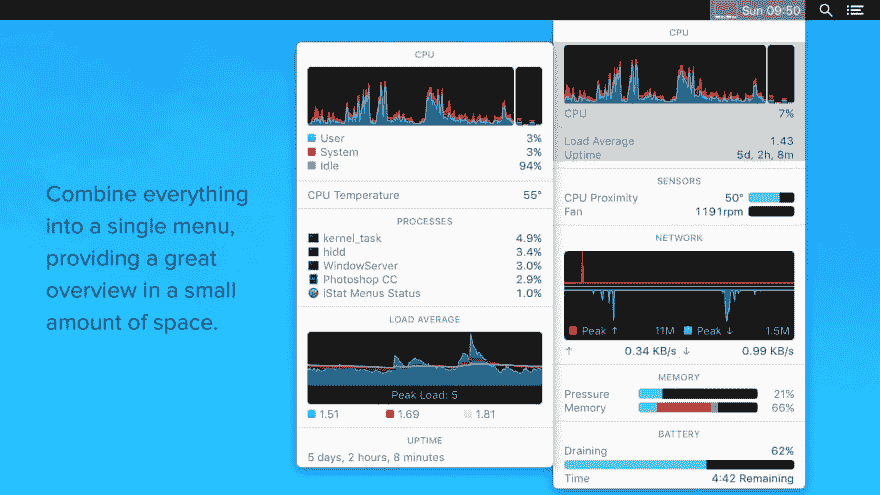](https://res.cloudinary.com/practicaldev/image/fetch/s--rs8LEM8u--/c_limit%2Cf_auto%2Cfl_progressive%2Cq_auto%2Cw_880/https://thepracticaldev.s3.amazonaws.com/i/iy5z7h2ec6o6r3sy8azu.jpg)

**[iStat Menus](https://bjango.com/mac/istatmenus/)** 是一款高级的 Mac 系统监视器菜单栏 app。它可以监控 Mac 性能的几乎每个方面，而不会占用太多菜单栏的空间，包括 CPU、GPU、内存、网络、磁盘使用、磁盘活动、温度、风扇、电池信息、日历等。

## 2。酒保

[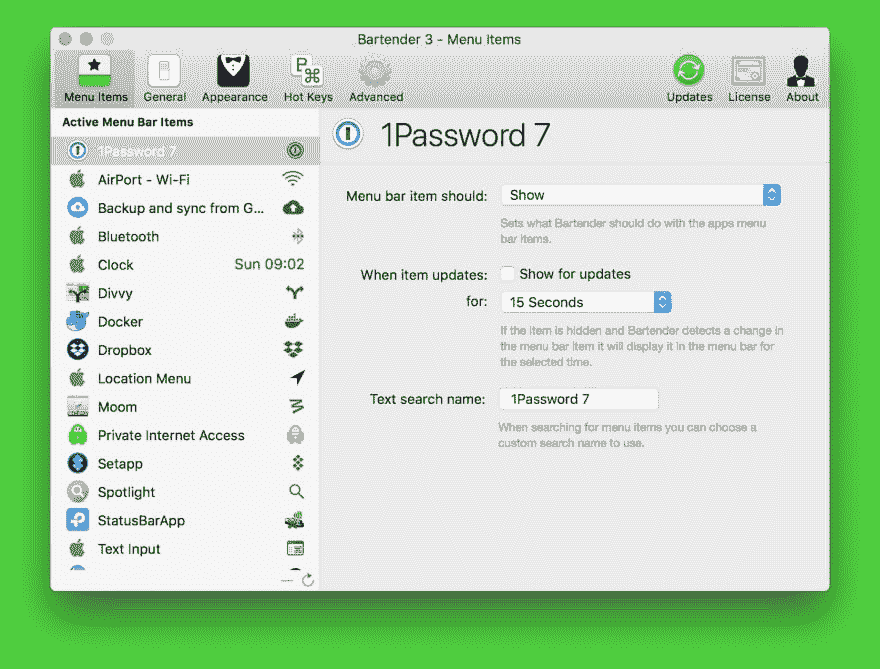](https://res.cloudinary.com/practicaldev/image/fetch/s--SQ6hsCxr--/c_limit%2Cf_auto%2Cfl_progressive%2Cq_auto%2Cw_880/https://thepracticaldev.s3.amazonaws.com/i/zw2pm7im7ljbwtrdeb6q.jpg)

**[酒保](https://www.macbartender.com/)** 是你 Mac 电脑的终极菜单栏管理应用。它可以让你组织你的菜单栏图标，通过隐藏它们，重新排列它们，显示隐藏的项目与点击或键盘快捷键，并有图标显示时，他们更新。它完美地做到了它所说的。

## 3。像素 nap

[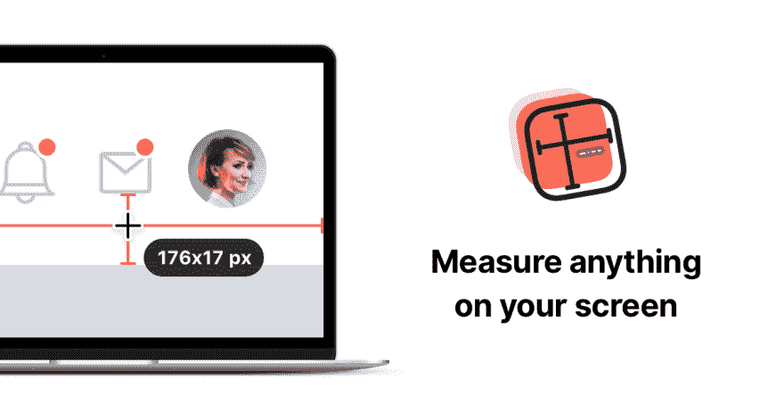](https://res.cloudinary.com/practicaldev/image/fetch/s--djHyRIw6--/c_limit%2Cf_auto%2Cfl_progressive%2Cq_auto%2Cw_880/https://thepracticaldev.s3.amazonaws.com/i/fh9i1gzsiekwuyvb4t9y.png)

**[PixelSnap](https://getpixelsnap.com/)** 是一款用于 macOS 的应用程序，只需点击并拖动光标，就可以轻松精确地测量屏幕上的任何东西。

## 4。彩色鲷鱼

[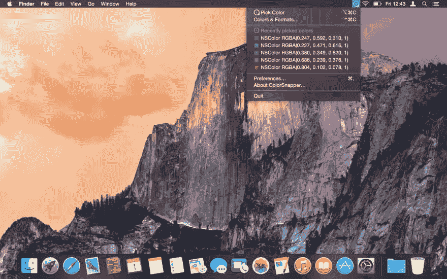](https://res.cloudinary.com/practicaldev/image/fetch/s--6cbuWH0R--/c_limit%2Cf_auto%2Cfl_progressive%2Cq_auto%2Cw_880/https://thepracticaldev.s3.amazonaws.com/i/zxjn7nb6h20emczqkk5r.jpg)

**[ColorSnapper](https://colorsnapper.com/)** 一款类固醇上的颜色选择器 app。它还允许您轻松地收集、调整、组织和导出屏幕上任何像素的颜色。

## 5。诺齐奥

[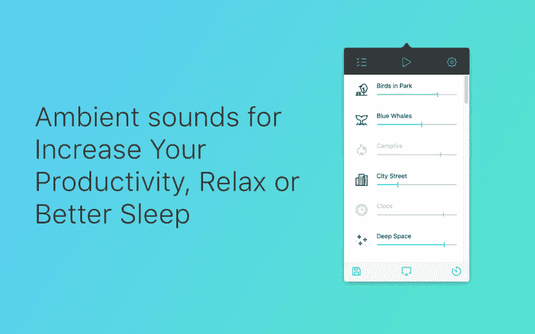](https://res.cloudinary.com/practicaldev/image/fetch/s--_G2svggp--/c_limit%2Cf_auto%2Cfl_progressive%2Cq_auto%2Cw_880/https://thepracticaldev.s3.amazonaws.com/i/p80leo6f60tt1xk7evwc.png)

**[Noizio](https://noiz.io/)** 是一款环境声音均衡器应用，可以帮助你消除外界噪音，让你专注于手头的工作，拥有环境和令人心寒的声音效果。

## 6。在那里

[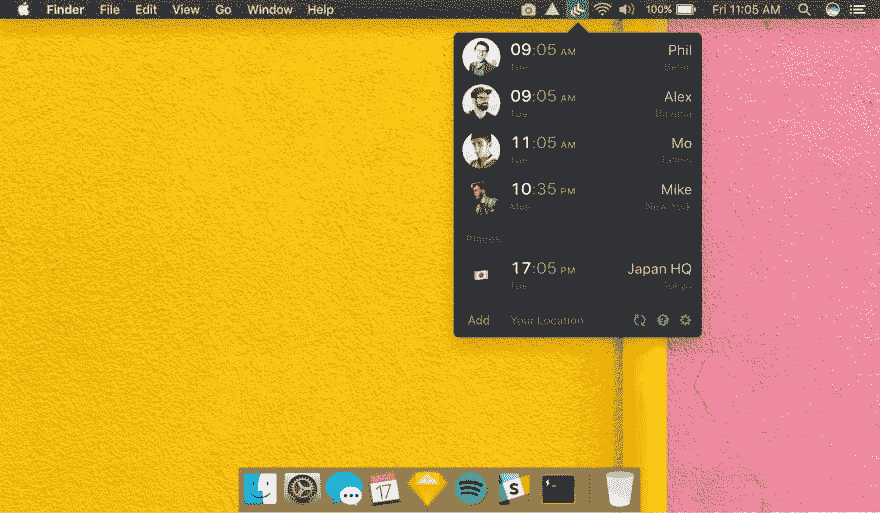](https://res.cloudinary.com/practicaldev/image/fetch/s--ioeDg0DX--/c_limit%2Cf_auto%2Cfl_progressive%2Cq_auto%2Cw_880/https://thepracticaldev.s3.amazonaws.com/i/aoat2xh00qr7lyyio85i.jpg)

**[那里](https://there.pm/)** 让你轻松与全球队友的时区同步。如果你和一个远程团队一起工作，这是必须的。

## 7。超级吧

[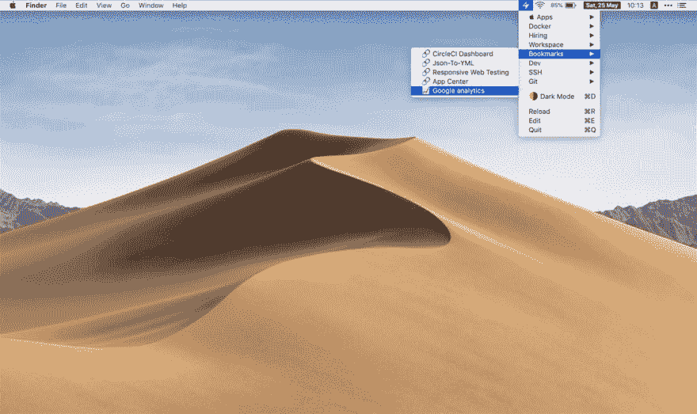](https://res.cloudinary.com/practicaldev/image/fetch/s--oqsTN8iU--/c_limit%2Cf_auto%2Cfl_progressive%2Cq_auto%2Cw_880/https://thepracticaldev.s3.amazonaws.com/i/qlmi1x3drau2kfo6800a.jpg)

**[Superbar](https://www.superbar.app/)** 是一个免费的菜单栏应用程序，它将应用程序、书签、代码片段、工作区或系统命令放在你的菜单栏上，触手可及。基本上是捷径中的捷径。

## 8。一个开关

[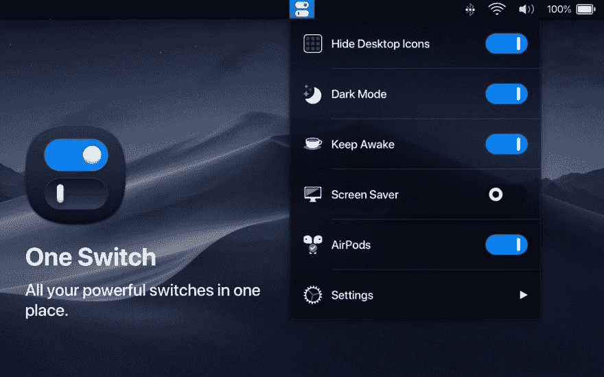](https://res.cloudinary.com/practicaldev/image/fetch/s--cCO5zTX5--/c_limit%2Cf_auto%2Cfl_progressive%2Cq_auto%2Cw_880/https://thepracticaldev.s3.amazonaws.com/i/sxf4hg4uqjql3e7wk2cl.jpg)

**[一个开关](https://fireball.studio/oneswitch/)** 是一个小菜单栏 app，把你所有强大的开关都放在一个地方。一键隐藏桌面图标，切换黑暗模式，保持你的 Mac 唤醒等等。

## 9。干净镜头

[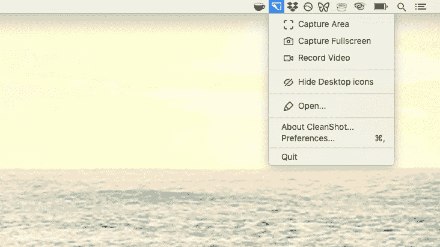](https://res.cloudinary.com/practicaldev/image/fetch/s--aSYcQv3O--/c_limit%2Cf_auto%2Cfl_progressive%2Cq_auto%2Cw_880/https://thepracticaldev.s3.amazonaws.com/i/9wmksuxt2qubyq6blrf4.png)

**[CleanShot](https://getcleanshot.com/)** 是一款小型屏幕捕捉应用，可以帮助你快速捕捉背景中没有桌面图标的 Mac 屏幕，注释或模糊特定部分，为你的截图设置自定义壁纸，等等。

## 10\. Pomo Timer

**[Pomo Timer](https://apps.apple.com/us/app/pomo-timer/id1447569061)** 是一款简单的 pomodoro timer app，有 pomodoros(番茄)！简单有效。

## 11。空投区

[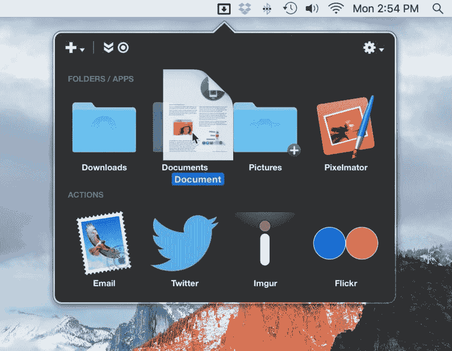](https://res.cloudinary.com/practicaldev/image/fetch/s--LZ_hvFhc--/c_limit%2Cf_auto%2Cfl_progressive%2Cq_auto%2Cw_880/https://thepracticaldev.s3.amazonaws.com/i/8ac0vk3d125vtx2rthii.jpg)

**[Dropzone](https://aptonic.com/)** 让移动和复制文件、启动应用程序、上传到许多不同的服务(如 Google Drive)等变得超级简单和快速，只需拖放即可。

## 12。工作区

[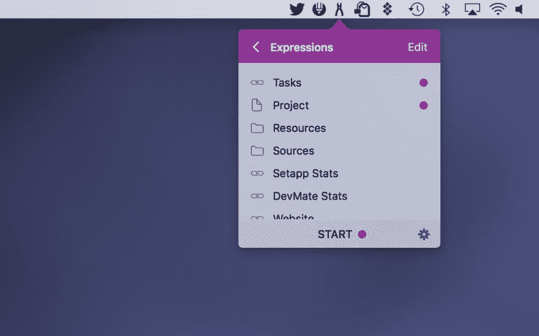](https://res.cloudinary.com/practicaldev/image/fetch/s--5LLav3XD--/c_limit%2Cf_auto%2Cfl_progressive%2Cq_auto%2Cw_880/https://thepracticaldev.s3.amazonaws.com/i/v8x0bamc8mt6jy1h1bx7.jpg)

**[Workspaces](https://www.apptorium.com/workspaces)** 是一个简单的应用程序，让你一键启动你需要的所有东西(如应用程序、文档或网站)。

## 13。CloudApp

[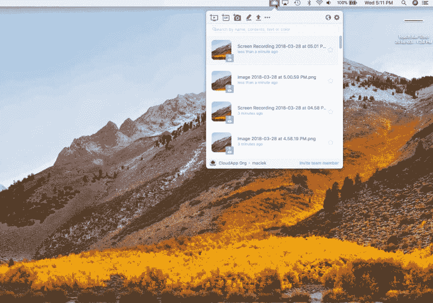](https://res.cloudinary.com/practicaldev/image/fetch/s--4RKAmSvB--/c_limit%2Cf_auto%2Cfl_progressive%2Cq_auto%2Cw_880/https://thepracticaldev.s3.amazonaws.com/i/kk9r6ikvdn3txr234phy.jpg)

**[cloud appⓐ](https://devtoolbox.co/go/cloudapp/)**使用屏幕录制、gif、高清视频和带注释的屏幕截图，轻松与同事分享和协作。它的核心是一个截屏工具，但支持社交功能。

## 14。磁铁

**[磁铁](https://apps.apple.com/app/id441258766?mt=12)** 是一个简单而强大的窗口管理工具。它通过将窗口对齐成有组织的小块来帮助整理你的屏幕。

## 15\. Runcat

[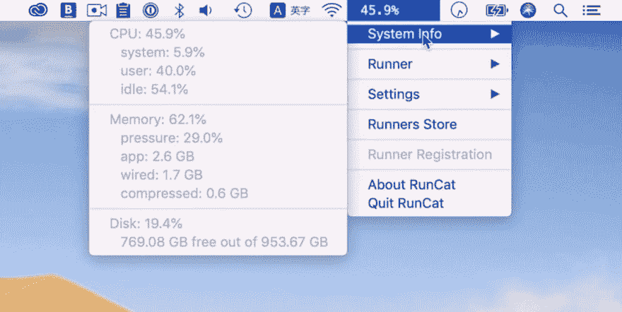](https://res.cloudinary.com/practicaldev/image/fetch/s---dr7zgBJ--/c_limit%2Cf_auto%2Cfl_progressive%2Cq_auto%2Cw_880/https://thepracticaldev.s3.amazonaws.com/i/vy0ol88imoq54vziauis.jpg)

**[Runcat](https://kyomesuke.com/runcat/index.html)** 是一款有趣的菜单栏应用，通过一帧一帧地动画一只奔跑的猫，或其他类型或“跑步者”来告诉你 Mac 的 CPU 使用情况。

## 包装完毕

你知道了，我们的 15 个列表必须在 2019 年为开发者提供 Mac 菜单栏应用。如果你有任何你认为值得添加到上面列表中的应用，请在下面的评论区告诉我们。

iStat 菜单、酒保、Noizio、One Switch、CleanShot、Dropzone 和 Workspaces 也可以在**[setappⓐ](https://devtoolbox.co/go/setapp/)**上获得，这是一种 Mac 应用程序订阅服务，在这里您可以每月只需 9.99 美元就可以获得 150 多个 Mac 应用程序的全部访问权限。

***免责声明**:标有ⓐ的链接是附属链接。我们可能会收到通过这些链接购买的佣金。*

* * *

这个帖子 [15 必须为开发者提供 Mac 菜单栏应用](https://devtoolbox.co/must-have-mac-menu-bar-apps-for-developers/)最初发布在 [DevToolbox](https://devtoolbox.co/) 上。