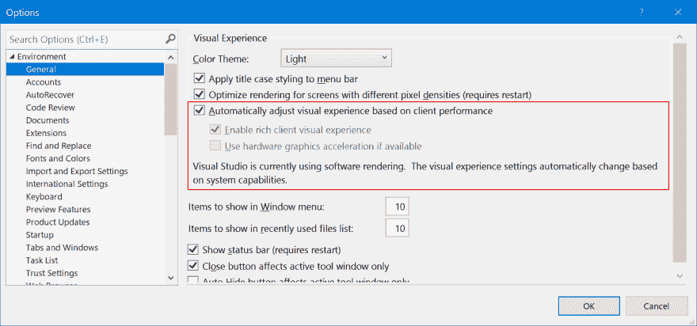
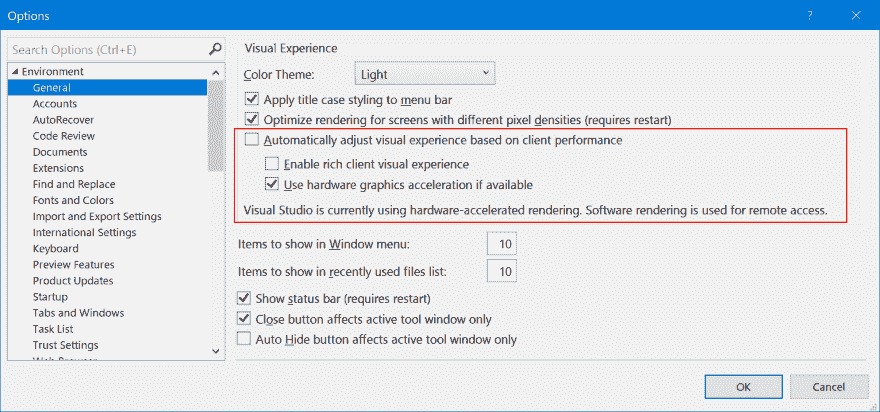

# 您的 Visual Studio 是否在 Visual Studio 中使用硬件图形加速？

> 原文：<https://dev.to/kosmosebi/is-your-visual-studio-using-hardware-graphics-acceleration-in-visual-studio-44m4>

Visual Studio 的最新版本可以支持硬件图形加速。在通常情况下，这是自动启用它在你的电脑，如果你的电脑可以支持 GPU。然而，有些情况下不会自动启用它时，已启用 Hyper-V 在您的计算机上。

图 1:自动选项已启用，但 Visual Studio 使用软件呈现。

如果您的计算机可以使用 GPU 并启用 Hyper-V，您应该选中“根据客户端性能自动调整视觉体验”，并选中“如果可用，使用硬件图形加速”。

此问题是 VSteam 中的已知问题。我期待着修复它。:)

[Visual Studio 开发人员社区](https://developercommunity.visualstudio.com/content/problem/583517/use-hardware-graphics-acceleration-if-available-op.html)