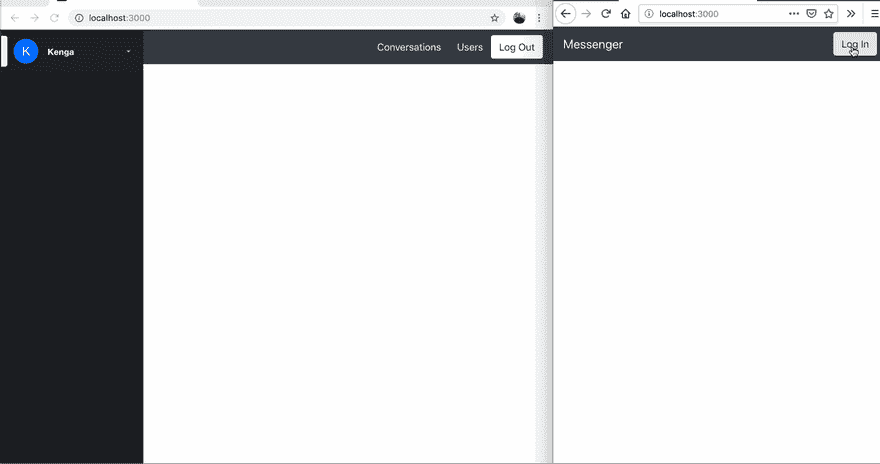
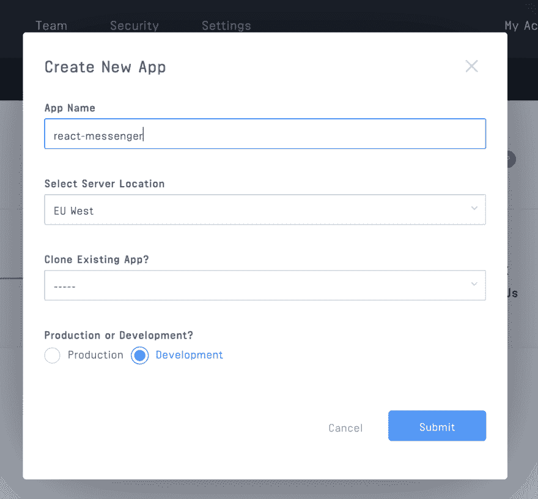

# 使用 Auth0 保护 React 聊天消息应用程序

> 原文：<https://dev.to/pmbanugo/secure-react-chat-messaging-app-with-auth0-4893>

如今，聊天信息无处不在。我们可以通过网络应用与客户支持人员交谈，让他们实时看到我们的请求*和*响应。无论身在何处，我们都可以通过 WhatsApp 和脸书等应用程序与朋友和家人互动。现在有许多即时消息应用程序，适用于许多用例，甚至有些允许你为特定的社区或团队定制(例如 Slack)，然而，你*仍然*可能会发现你需要创建你*自己的*实时消息应用程序，以便接触特定的受众并与之互动。这可能是一个面向语言学习者的社交 app，也可能是一个学校与学生和家长互动的 app。你可能想知道，”...我该怎么做？”。

有许多选项可用于构建实时应用程序，然而，在这篇文章中，我将向您展示如何使用[流聊天 API](https://getstream.io/chat/) 及其定制的 React 组件来构建 messenger 风格的应用程序。此外，我们将使用 [Auth0](https://auth0.com) 为应用程序添加身份验证。使用这些托管服务有助于我们专注于构建应用，将服务器管理和扩展的问题留给提供商。我们将在本文结束时构建的应用程序将支持:

1.  用户可以查看其聊天历史的对话列表。
2.  一个显示谁在打字的指示器。
3.  邮件传递状态。
4.  保持讨论有序的消息线索。
5.  用户的在线/离线状态。
6.  表情符号支持。
7.  文件附件和链接预览。

它的行为会是这样:

[](https://res.cloudinary.com/practicaldev/image/fetch/s--ajEoIL3---/c_limit%2Cf_auto%2Cfl_progressive%2Cq_auto%2Cw_880/https://ucarecdn.com/49d354ea-f25e-4386-ab0e-6216b7757717/)

在下一篇文章中，我们将添加打电话的功能，所以请不要离开😉。要学习本教程，您需要了解 React.js、 [Node.js](https://nodejs.org/en/download/) 和安装的 npm(NPM 随 Node.js 一起分发——这意味着当您下载 Node.js 时，您会自动在您的机器上安装 NPM)。或者，您可以在任何命令中使用 yarn。

## React 应用入门

为了节省设置和设计的时间，我们将使用 [create-react-app](https://facebook.github.io/create-react-app/) 来创建 react 项目。打开命令行应用程序，运行以下命令:

1.  `npx create-react-app react-messenger`
2.  `cd react-messenger`

这将设置 React 项目并安装必要的依赖项。我们使用了`npx`，这是一个与 npm 一起安装的工具(从 5.2 版本开始)。

## 设置 Auth0

我们将使用 Auth0 来处理用户认证和用户管理。 [Auth0](https://auth0.com/) 是一个身份验证即服务(或身份即服务)提供商，它提供一个 SDK，允许开发人员轻松添加身份验证和管理用户。其用户管理控制面板允许违规检测和多因素身份验证，以及无密码登录。

您需要在 Auth0 上创建一个应用程序，作为此 messenger 应用程序用户的容器。你需要一些 API 密匙来使用 SDK。要在 Auth0 上创建应用程序，请访问 Auth0 的[主页](https://auth0.com/)进行登录。登录后，点击右上角的大按钮**新应用**。这应该显示一个要求应用程序名称和类型的模态。将其命名为`react-messenger`，选择*单页面 Web 应用*，然后点击**创建**按钮。这将为您在 Auth0 上创建一个应用程序。

[](https://res.cloudinary.com/practicaldev/image/fetch/s--Hxfmrujt--/c_limit%2Cf_auto%2Cfl_progressive%2Cq_auto%2Cw_880/https://images.ctfassets.net/1es3ne0caaid/6bWbdlVChiCQGYkiGAcieQ/773cfaec3f0713c33b78472b4aced418/secure-chat-javascript-auth0-clients.png)

接下来，我们需要在 [Auth0](https://auth0.com/docs/api-auth/tutorials/client-credentials) 上设置一个 API。在侧边菜单中，点击**API**显示 API 仪表板。在页面的右上角，点击大的 **Create API** 按钮。这显示了一个要求名称和标识符的模态表单。输入`react-messenger-api`作为名称，输入`https://react-messenger-api`作为标识符。这将为我们创建一个 API。点击*设置*选项卡，它将显示 API 的 id、名称和标识符。稍后我们将需要这个标识符值，作为授权调用的`audience`参数。要了解关于该参数的更多信息，请查阅[文档](https://auth0.com/docs/api-auth/tutorials/client-credentials)。

## 用 Auth0 保护 React 应用

现在我们已经在 Auth0 中设置了应用程序，我们需要将它与 React 集成。我们将创建一个类来处理登录、注销，以及应用程序判断用户是否通过身份验证的方法。在`src`目录中，添加一个新文件`auth/config.js`，内容如下:

```
export default {
  clientId: "your auth0 clientId",
  domain: "yourauth0domain.auth0.com",
  redirect: "http://localhost:3000/close-popup",
  logoutUrl: "http://localhost:3000",
  audience: "https://react-messenger-api"
}; 
```

用 Auth0 应用程序仪表板中的数据替换`domain`和`clientId`的占位符。在 Auth0 应用程序的设置页面中，用`http://localhost:3000/close-popup`更新字段`Allowed Callback URLs`，用`http://localhost:3000`更新字段`Allowed Logout URLs`，以匹配`config.js`中的内容。`Allowed Callback URLs`设置是用户登录后 Auth0 Lock 小部件将重定向到的 URL。另一个设置`Allowed Logout URLs`，是用户注销后重定向到的 URL。

创建另一个文件`src/auth/service.js`，并将下面的代码添加到其中:

```
import config from "./config";
import * as Auth0 from "auth0-js";

class Auth {
  auth0 = new Auth0.WebAuth({
    domain: config.domain,
    clientID: config.clientId,
    redirectUri: config.redirect,
    audience: config.audience,
    responseType: "id_token token",
    scope: "openid profile email"
  });

  authFlag = "isLoggedIn";
  userProfileFlag = "userProfile";

  localLogin(authResult) {
    localStorage.setItem(this.authFlag, true);
    localStorage.setItem(
      this.userProfileFlag,
      JSON.stringify(authResult.idTokenPayload)
    );
    this.loginCallback(authResult.idTokenPayload);
  }

  login() {
    this.auth0.popup.authorize({}, (err, authResult) => {
      if (err) this.localLogout();
      else {
        this.localLogin(authResult);
      }
    });
  }

  isAuthenticated() {
    return localStorage.getItem(this.authFlag) === "true";
  }

  getUserProfile() {
    return JSON.parse(localStorage.getItem(this.userProfileFlag));
  }
}

const auth = new Auth();

export default auth; 
```

在上面的代码中，我们使用了 Auth0 客户端库，稍后我们将把它作为一个依赖项添加进来。我们使用 config.js 中的细节初始化它。我们有`login()`函数，当调用它时，将触发一个弹出窗口，用户可以在那里登录或注册。`localLogin()`函数将一些数据存储到 localStorage，以便我们可以在页面刷新时访问它们。稍后将在`src/App.js`中设置`loginCallback`功能，这样它就可以将认证结果用于其他一些操作。`idTokenPayload`包含电子邮件、姓名和用户 id 等信息。

我们还将在这里构建我们的注销功能。这将清除我们在前面部分中存储在 localStorage 中的所有内容，并将用户从系统中注销。将以下代码添加到我们在上一节中定义的类中:

```
 localLogout() {
    localStorage.removeItem(this.authFlag);
    localStorage.removeItem(this.userProfileFlag);
    this.logoutCallback();
  }

  logout() {
    this.localLogout();
    this.auth0.logout({
      returnTo: config.logoutUrl,
      clientID: config.clientId
    });
  } 
```

### 使用我们的认证服务

完成身份验证服务类后，我们现在将在 React 组件中使用它。我们将安装之前使用的 Auth0 依赖项，并添加 bootstrap，稍微美化一下 UI。打开您的终端并运行`npm install --save bootstrap auth0-js`来安装这些依赖项。然后，打开`src/index.js`并添加`import 'bootstrap/dist/css/bootstrap.css`以在页面上包含引导 CSS。

打开`src/App.js`并用以下代码更新它:

```
import React, { Component } from "react";
import authService from "./auth/service";
import Conversations from "./Conversations";
import Users from "./Users";

class App extends Component {
  constructor(props) {
    super(props);
    authService.loginCallback = this.loggedIn;
    authService.logoutCallback = this.loggedOut;
    const loggedIn = authService.isAuthenticated();
    this.state = { loggedIn, page: "conversations" };
  }

  loggedIn = async ({ email, nickname }) => {
    this.setState({ loggedIn: true });
  };

  loggedOut = () => {
    this.setState({ loggedIn: false });
  };

  switchPage = page => this.setState({ page });

  render() {
    return (
      <div>
        <nav className="navbar navbar-dark bg-dark">
          <a className="navbar-brand text-light">Messenger</a>
          {this.state.loggedIn ? (
            <div>
              <button
                onClick={() => this.setState({ page: "conversations" })}
                type="button"
                className="btn btn-link text-light"
              >
                Conversations
              </button>
              <button
                onClick={() => this.setState({ page: "users" })}
                type="button"
                className="btn btn-link text-light"
              >
                Users
              </button>
              <button
                onClick={() => authService.logout()}
                className="btn btn-light"
              >
                Log Out
              </button>
            </div>
          ) : (
            <button
              onClick={() => authService.login()}
              className="btn btn-light"
            >
              Log In
            </button>
          )}
        </nav>
        <div>{/* content goes here */}</div>
      </div>
    );
  }
}

export default App; 
```

该组件的作用是呈现一个带有导航标题的页面。当用户未登录时，我们显示登录按钮，单击该按钮将从 auth 服务调用`login`函数。如果他们登录了，他们会得到两个链接来切换这个应用程序的两个页面和一个注销按钮。由于这是一个小应用程序，我们将使用一个布尔变量来确定在导航标题下的主要内容区域显示什么。单击登录按钮时，会弹出一个新窗口，其中有一个页面要求用户登录或注册。当他们完成注册或登录时，它将重定向到我们在 Auth0 的仪表板中的应用程序设置页面中为`Allowed Callback URLs`设置的 URL，即`http://localhost:3000/close-popup`。目前我们没有该页面，所以我们将设置它。

在名为`close-popup/index.html`的根公共文件夹中添加一个新文件，内容如下:

```
<!DOCTYPE html>
<html lang="en">
  <head>
    <meta
      charset="utf-8"
      content="font-src: 'self' data: img-src 'self' data: default-src 'self'"
    />
    
    <script src="https://cdn.auth0.com/js/auth0/9.8.1/auth0.min.js"></script>
  </head>
  <body>
    <script type="text/javascript">
      const webAuth = new auth0.WebAuth({
        domain: "yourname.auth0.com",
        clientID: "your client id"
      });
      webAuth.popup.callback();
    </script>
  </body>
</html> 
```

您应该用您的 Auth0 应用程序凭证替换指示`domain`和`clientID`的两行。一旦页面被重定向到这里，这将关闭窗口。

## 为实时对话添加流聊天消息

到目前为止，我们已经设置了我们的应用程序，允许用户登录和注销。现在我们需要允许他们互相聊天。我们将使用 [Stream Chat 的消息传递 SDK](https://getstream.io/chat/) 来构建这一功能。使用它的美妙之处在于，它为 Chat SDK 提供了一个易于使用的 API 来构建实时消息应用程序。它的一些功能包括:

1.  聊天线程提供了一种回复特定消息的好方法。
2.  表情符号聊天反应就像你在脸书或 Slack 上一样。
3.  能够发送表情符号和文件附件。
4.  直接聊天和群聊。
5.  消息或对话的搜索功能。

另一个有趣的补充是，它提供了可以在应用程序中使用的 UI 组件，以加快开发速度。在撰写本文时，它只适用于 [React Native](https://getstream.io/chat/react-native-chat/tutorial/) 和 [React](https://getstream.io/chat/react-chat/tutorial/) 。我们将使用 React UI 组件向 React 应用程序添加消息传递功能。这是因为它提供了开箱即用的组件来查看现有对话的列表，实时发送和接收消息，聊天线程和消息反应。

要开始使用 Stream messaging SDK，您需要注册并登录到[仪表板](https://getstream.io/dashboard)。然后点击页面右上角的**创建 App** 按钮。输入应用名称`react-messenger`，选择您的首选服务器位置，以及它是生产应用还是开发中的应用。

[](https://res.cloudinary.com/practicaldev/image/fetch/s--Hq2VtlLP--/c_limit%2Cf_auto%2Cfl_progressive%2Cq_auto%2Cw_880/https://ucarecdn.com/6c5692bf-f081-4272-a4ec-f867b80aa2f5/)

创建后，您应该会看到它所在的秘密、密钥和区域。复制应用程序的密钥，因为你很快就会需要它。打开命令行并运行`npm install --save stream-chat-react`。这个包包含了我们将要使用的流聊天 React 组件，并且还安装了流聊天 SDK `stream-chat`。我们将使用`stream-chat`模块创建一个聊天客户端并连接到聊天服务器。

添加一个新文件`src/chat/service.js`并将以下内容粘贴到其中:

```
import { StreamChat } from "stream-chat";

const tokenServerUrl = "http://localhost:8080/v1/token";
const chatClient = new StreamChat("API_KEY");
const streamServerFlag = "streamServerInfo";
let isClientReady = localStorage.getItem(streamServerFlag) !== null;

export const initialiseClient = async (email, name) => {
  if (isClientReady) return chatClient;

  const response = await fetch(tokenServerUrl, {
    method: "POST",
    mode: "cors",
    headers: {
      "Content-Type": "application/json"
    },
    body: JSON.stringify({
      email,
      name
    })
  });

  const streamServerInfo = await response.json();
  localStorage.setItem(streamServerFlag, JSON.stringify(streamServerInfo));

  chatClient.setUser(
    {
      id: streamServerInfo.user.id,
      name: streamServerInfo.user.name,
      image: streamServerInfo.user.image
    },
    streamServerInfo.token
  );

  isClientReady = true;
  return { chatClient, user: { ...streamServerInfo.user } };
};

export const getClient = () => {
  const streamServerInfo = JSON.parse(localStorage.getItem(streamServerFlag));
  chatClient.setUser(
    {
      id: streamServerInfo.user.id,
      name: streamServerInfo.user.name,
      image: streamServerInfo.user.image
    },
    streamServerInfo.token
  );

  return { chatClient, user: { ...streamServerInfo.user } };
};
export const isClientInitialised = () => isClientReady;

export const resetClient = () => {
  localStorage.removeItem(streamServerFlag);
}; 
```

我们添加的代码允许我们创建一个聊天客户端，并为客户端设置用户。应用程序将通过这个聊天客户端与流聊天服务器进行交互。要初始化聊天客户端，您需要从 Stream dashboard 中复制的 API 密钥。然后我们将调用`chatClient.setUser()`来设置当前用户。`setUser()`函数有两个参数。一个对象，包含用户名和 id 以及对客户端进行身份验证所需的令牌。这些信息将来自我们稍后添加的服务器。我们用从 Auth0 获得的`name`和`email`调用服务器，它将生成并返回一个 id、名称、图像和令牌。一旦设置了用户，我们将从稍后添加的令牌服务器返回聊天客户端和用户信息。

### 添加用户列表页面

聊天服务完成后，我们将添加一个页面，列出应用程序中的用户，用户可以选择与谁聊天。

添加一个新文件`src/Users.js`，内容如下:

```
import React, { Component } from "react";

export default class Users extends Component {
  constructor(props) {
    super(props);
    this.state = { users: [] };
  }

  async componentDidMount() {
    const { users } = await this.props.chatClient.queryUsers({
      id: { $ne: this.props.user.id }
    });
    this.setState({ users });
  }

  startConversation = async (partnerId, partnerName) => {
    const userId = this.props.user.id;
    const userName = this.props.user.name;
    const filter = {
      id: { $in: [userId, partnerId] }
    };

    const channels = await this.props.chatClient.queryChannels(filter);
    if (channels.length > 0) {
      alert("chat with this user is already in your conversation list");
    } else {
      const channel = this.props.chatClient.channel("messaging", userId, {
        name: `Chat between ${partnerName} & ${userName}`,
        members: [userId, partnerId]
      });
      await channel.create();
      this.props.switchPage("conversations");
    }
  };

  render() {
    return (
      <div>
        <div class="list-group">
          {this.state.users.map(user => (
            <button
              onClick={() => this.startConversation(user.id, user.name)}
              key={user.id}
              type="button"
              class="list-group-item list-group-item-action"
            >
              {user.name}
              {": "}
              {user.online
                ? "online"
                : `Last seen ${new Date(user.last_active).toString()}`}
            </button>
          ))}
        </div>
      </div>
    );
  }
} 
```

我们已经创建了一个组件，它将从父容器中接收聊天客户端作为道具。它使用`chatClient.queryUsers({ id: { $ne: this.props.user.id } })`向流聊天服务器查询用户。`queryUsers`功能允许您搜索用户并查看他们是否在线/离线。过滤器语法使用 Mongoose 风格的查询，`queryUsers`接受三个参数。第一个参数是 filter 对象，第二个是排序，第三个包含任何附加选项。上面，我们使用了`queryUsers`来查询除当前登录用户之外的所有用户。顺便说一下，因为这个函数不在后台运行 MongoDB，所以只有它的查询语法的一个子集可用。你可以在[文档](https://getstream.io/chat/docs/#query_syntax)中了解更多信息。

当从呈现的用户列表中选择用户时，调用`startConversation`函数。它检查这两个用户之间的对话是否存在，如果不存在，它为他们创建一个对话通道。为了开始对话，我们通过调用`chatClient.channel()`创建一个通道，并向它传递通道类型和通道 id，以及一个指定通道名称及其成员的对象(如果是私有通道)，作为第三个参数。这个对象可以包含任何自定义属性，除了我们已经使用的属性，除了一个`image`字段是为流聊天保留的字段。我们使用登录用户的 id 作为频道 id，因为我们正在构建一个 messenger 风格的应用程序，所以我将频道类型(见下文)设置为`messaging`。

有 5 种内置频道类型。它们是:

1.  Livestream:如果你想建立像 Twitch 或足球公共聊天流这样的聊天，这是明智的默认设置。
2.  消息:为 Whatsapp 或 Messenger 等应用程序配置。
3.  游戏:为游戏内聊天配置。
4.  商业:构建类似于你自己版本的对讲机或漂移的好的默认设置。
5.  团队:如果你想构建你自己版本的 Slack 或者类似的东西。

虽然这些是自定义定义的频道类型，但您也可以创建自己的频道类型，并根据自己的需要进行自定义。查看[文档](https://getstream.io/chat/docs/#channel_features)了解更多相关信息。

当我们通过调用`chatClient.channel()`初始化一个通道时，它返回一个通道对象。然后，应用程序通过调用`await channel.create()`在服务器上创建频道。完成后，`switchPage("conversations")`被调用，让用户回到对话屏幕，在那里他们可以看到他们与其他用户的对话和聊天列表。

### 添加对话页面

下一步是创建对话页面。我们将制作一个新的 React 组件。我们将使用来自`stream-chat-react`库的组件。添加一个新文件`src/Conversations.js`并用以下内容更新它:

```
import React from "react";
import {
  Chat,
  Channel,
  ChannelList,
  Window,
  ChannelHeader,
  MessageList,
  MessageInput,
  Thread
} from "stream-chat-react";

import "stream-chat-react/dist/css/index.css";

const App = props => {
  const filters = { type: "messaging", members: { $in: [props.userId] } };
  return (
    <Chat client={props.chatClient} theme={"messaging dark"}>
      <ChannelList filters={filters} />
      <Channel>
        <Window>
          <ChannelHeader />
          <MessageList />
          <MessageInput />
        </Window>
        <Thread />
      </Channel>
    </Chat>
  );
};

export default App; 
```

这里我们使用了来自`stream-chat-react`库的八个组件。`<Chat />`组件创建一个容器来保存聊天客户端和主题，如果需要的话，这个容器将被传递给子组件。`<ChannelList />`组件用于呈现频道列表。`<Channel />`组件是通道的包装器组件。它有两个必备道具`channel`和`client`。当选择一个频道时，`client`道具将由`Chat`组件自动设置，而`channel`道具将由`<ChannelList />`组件自动设置。当选择一个通道时，我们希望呈现一个视图，用户可以在该视图中看到该对话/通道的消息列表，输入消息，并响应消息线程。为此，我们使用了`<ChannelHeader />`、`<MessageList />`、`<MessageInput />`和`<Thread />`组件。

使用这些组件会自动为我们提供以下功能:

1.  URL 预览(试着发送一个 Youtube 视频的链接来看看效果)
2.  视频回放
3.  文件上传和预览
4.  斜杠命令，如/giphy 和/imgur。
5.  在线状态–谁在线
6.  打字指示器
7.  消息状态指示器(发送、接收)
8.  情感符(= Smiley)
9.  线索/回复
10.  反应
11.  自动完成用户、表情和命令

准备好这些组件后，当用户登录并使用导航标题中的链接导航页面时，我们需要在 App.js 中呈现它们。打开`src/App.js`并导入聊天服务，如下所示:

```
import {
  getClient,
  initialiseClient,
  isClientInitialised,
  resetClient
} from "./chat/service"; 
```

然后将第 18 行(在构造函数中)更新为:

```
if (loggedIn && isClientInitialised()) {
  const { chatClient, user } = getClient();
  this.state = { loggedIn, page: "conversations", chatClient, user };
} else this.state = { loggedIn, page: "conversations" }; 
```

这将调用`getClient()`来使用我们已经从令牌服务器获得的信息创建一个聊天客户端。我们还将更新`loggedIn`和`loggedOut`函数，分别初始化聊天客户端和使聊天客户端失效。

```
loggedIn = async ({ email, nickname }) => {
  const { chatClient, user } = await initialiseClient(email, nickname);
  this.setState({ loggedIn: true, chatClient, user });
};

loggedOut = () => {
  resetClient();
  this.setState({ loggedIn: false });
}; 
```

我们将更新我们的`render()`函数来添加新的变量，用于确定页面显示如下:

```
const showConversations =
  this.state.loggedIn && this.state.page === "conversations";
const showUsers = this.state.loggedIn && this.state.page !== "conversations"; 
```

然后用以下内容替换注释`{\* content goes here *\}`:

```
{
  showConversations && (
    <Conversations
      chatClient={this.state.chatClient}
      userId={this.state.user.id}
    />
  );
}
{
  showUsers && (
    <Users
      chatClient={this.state.chatClient}
      user={this.state.user}
      switchPage={this.switchPage}
    />
  );
} 
```

经过所有这些修改，App.js 文件看起来应该如下所示:

```
import React, { Component } from "react";
import authService from "./auth/service";
import Conversations from "./Conversations";
import Users from "./Users";
import {
  getClient,
  initialiseClient,
  isClientInitialised,
  resetClient
} from "./chat/service";

class App extends Component {
  constructor(props) {
    super(props);
    authService.loginCallback = this.loggedIn;
    authService.logoutCallback = this.loggedOut;
    const loggedIn = authService.isAuthenticated();
    if (loggedIn && isClientInitialised()) {
      const { chatClient, user } = getClient();
      this.state = { loggedIn, page: "conversations", chatClient, user };
    } else this.state = { loggedIn, page: "conversations" };
  }

  loggedIn = async ({ email, nickname }) => {
    const { chatClient, user } = await initialiseClient(email, nickname);
    this.setState({ loggedIn: true, chatClient, user });
  };

  loggedOut = () => {
    resetClient();
    this.setState({ loggedIn: false });
  };

  switchPage = page => this.setState({ page });

  render() {
    const showConversations =
      this.state.loggedIn && this.state.page === "conversations";
    const showUsers =
      this.state.loggedIn && this.state.page !== "conversations";

    return (
      <div>
        <nav className="navbar navbar-dark bg-dark">
          <a className="navbar-brand text-light">Messenger</a>
          {this.state.loggedIn ? (
            <div>
              <button
                onClick={() => this.setState({ page: "conversations" })}
                type="button"
                className="btn btn-link text-light"
              >
                Conversations
              </button>
              <button
                onClick={() => this.setState({ page: "users" })}
                type="button"
                className="btn btn-link text-light"
              >
                Users
              </button>
              <button
                onClick={() => authService.logout()}
                className="btn btn-light"
              >
                Log Out
              </button>
            </div>
          ) : (
            <button
              onClick={() => authService.login()}
              className="btn btn-light"
            >
              Log In
            </button>
          )}
        </nav>
        <div>
          {showConversations && (
            <Conversations
              chatClient={this.state.chatClient}
              userId={this.state.user.id}
            />
          )}
          {showUsers && (
            <Users
              chatClient={this.state.chatClient}
              user={this.state.user}
              switchPage={this.switchPage}
            />
          )}
        </div>
      </div>
    );
  }
}

export default App; 
```

## 添加令牌服务器

现在我们的前端已经完成，我们接近完成！接下来，我们需要添加前面提到的令牌服务器，它需要生成一个用户令牌和其他数据，供流聊天客户端使用。我们不会从头开始构建它，而是从 GitHub 克隆一个项目来为我们做这件事。项目[资源库](https://github.com/nparsons08/stream-chat-boilerplate-api)可以在 [GitHub](https://github.com/nparsons08/stream-chat-boilerplate-api) 上找到。按照以下说明进行设置:

1.  打开您的终端并运行`git clone https://github.com/nparsons08/stream-chat-boilerplate-api.git && cd stream-chat-boilerplate-api`来克隆存储库。
2.  运行`npm install`安装 Node.js 依赖项。
3.  完成后，添加一个新文件`.env`，内容如下。

```
NODE_ENV=development
PORT=8080

STREAM_API_KEY=your_api_key
STREAM_API_SECRET=your_app_secret 
```

将`STREAM_API_KEY`和`STREAM_API_SECRET`的值替换为您在 Stream Chat 仪表盘中找到的值。然后通过运行`npm start`启动令牌服务器。这将启动令牌服务器，并在控制台中显示`Running on port 8080 in development mode. 🚀`。

## 运行和测试 App

我们运行了令牌服务器。现在我们通过运行`npm start`来运行 React 应用程序。这将打开浏览器并导航至`localhost:3000`。然后你需要登录并试用该应用程序！尝试用不同的用户从不同的浏览器运行它。使用/giphy 命令，自由共享视频。添加消息反应，并尝试我前面提到的功能！

## 这就结束了🚀

当今世界几乎所有的事情都是实时发生的。如果你关注的人在 Instagram 上开始直播视频，你会收到实时通知。你可以通过 WhatsApp 实时发送信息，并在几毫秒内获得其他人的回复。你可能需要在你的应用程序中添加实时消息，建立一个 Slack 竞争对手或其他一些允许用户实时交流的社交应用程序。

在这篇文章中，我向您展示了如何使用[流聊天 React SDK](https://www.npmjs.com/package/stream-chat-react) 和流聊天 React 组件在 React 中构建一个 messenger 风格的聊天应用程序。您已经测试了该应用程序，并且已经看到了只用几行代码就可以实现的丰富功能。我们还使用 Auth0 为应用程序增加了安全性。有了这些知识，你可以在几个小时内开始构建一个消息应用程序，并在短时间内交付你的原型。虽然我们在这篇文章中专注于文本，但在下一篇文章中，我们将为应用程序添加视频通话功能。所以，不要错过下一个！！😎

这是我们在 [GitHub](https://github.com/pmbanugo/streamchat-react-chat-messenger) 上构建的[库](https://github.com/pmbanugo/streamchat-react-chat-messenger)的链接。

想了解更多关于[https://getstream.io/chat/](Stream%20Chat)的信息，你可以在这里享受 API 之旅[。](https://getstream.io/chat/get_started/)