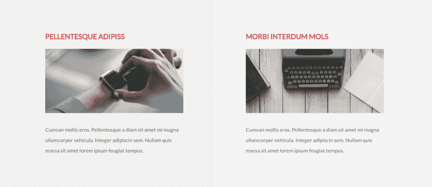
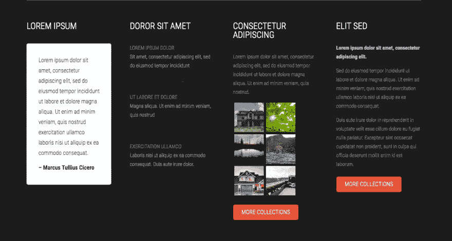

# 动画导航条，加粗推子，板条页脚|模块星期一 46

> 原文：<https://dev.to/tyrw/animated-navbar-bold-fader-slat-footer-module-monday-46-1pd0>

## 下面的一切都是开源的

它可以在任何网站、web 应用程序或其他任何地方免费使用。开发人员在 Anymod 上创建并分享了数百个这样的网站。

单击一个 mod 来查看它及其源代码。

## 动画导航条

内置过渡的简洁导航。
[查看 mod](https://anymod.com/mod/animated-menu-indicator-nkolmo)
  

## 加粗淡化章节

使用渐强和渐强的行动号召。
[查看 mod](https://anymod.com/mod/animated-fade-in-hero-unit-kdnmbr?preview=true)
  

## 图像卡片

来自 ExMachina 系列的响应图像卡。
[查看 mod](https://anymod.com/mod/image-cards-section-mlaakb)
  

## 暗板条内容

以图案化的深色背景弹出的列内容。
[查看 mod](https://anymod.com/mod/exmachina-footer-links-kdnmln?preview=true)
  

## 简单的英雄形象

一种快速添加可编辑的响应图像部分的方法。
[查看 mod](https://anymod.com/mod/exmachina-hero-llknrn?preview=true)
  

* * *

我每周一从社区[这里](https://dev.to/tyrw)贴出新的 mods 我希望你觉得它们有用！

快乐编码✌️