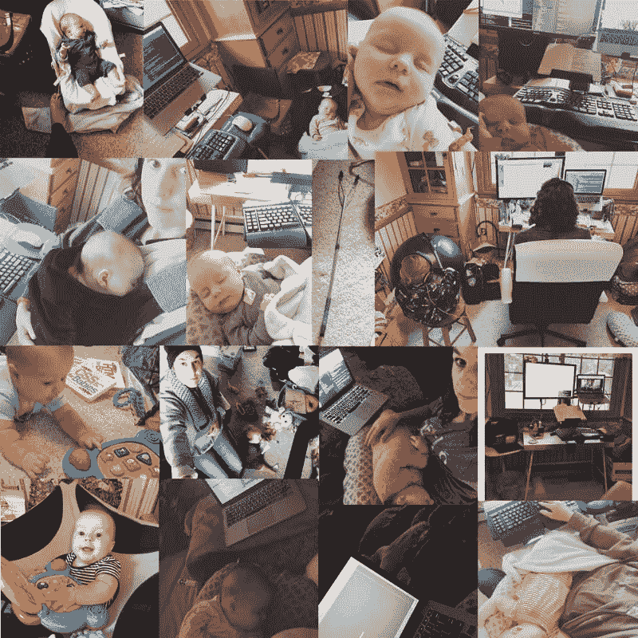

# “妈妈堆栈”以及如何兼顾孩子和网络开发

> 原文：<https://dev.to/egf/the-mom-stack-and-how-to-juggle-your-kids-and-web-development-4p15>

当我第三个孩子出生时，我在一家小公司工作，没有产假。我丈夫请了几个星期的探亲假，当探亲假结束后，他回去工作了，我决定让孩子在家呆一段时间，然后把她送到日托所和她哥哥一起。作为一名几乎完全在家工作的 Web 开发人员，如果学校或日托所不在，我偶尔会有一两个(或三个)孩子在家。此外，我丈夫每周有 3 天 2 夜在外地工作。至少可以说，这里的事情会变得有点混乱。
杂耍表演

## 堆栈

那么一个“开发者妈妈”如何管理所有的事情呢？这里有一些我放在“妈妈书库”里的工具

笔记本电脑——这个很明显。有时候你需要和生病的孩子一起在沙发上编码，或者在孩子睡觉的时候编码。

Boppy/哺乳枕——如果你正和一个小婴儿一起工作，Boppy 风格的枕头可以拯救生命。白天，如果我在办公桌前工作，宝宝就在我的腿上，宝宝在上面吃奶或打盹。晚上，当我给宝宝喂奶的时候，如果我想多花几分钟时间写代码，我可以把笔记本电脑放在我旁边的床上，把 boppy 放在我的腿上。

站立式书桌和包裹物/婴儿背带——如果你有一个宝宝，你很清楚有时候坐着是宝宝最不希望你做的事情。我有一个 [Ergotron Workfit 坐站式工作站](https://www.ergotron.com/en-us/products/stand-up-desks/desk-conversions?tid=79&vfid=2)，这样我就可以站着工作了(因为我的背部有旧伤，所以买这个很方便)。站立式办公桌结合编织包裹或任何其他类型的婴儿背带可以为你赢得一些额外的编码时间，即使你生活中的小人不允许坐着。

[分离键盘](https://www.kinesis-ergo.com/shop/freestyle2-for-mac/)——在为我的 mac 电脑寻找 ergo 键盘的一次不相关的搜索中，我遇到了 Kinesis Freestyle。它有一根较长的绳子连接两边，如果你愿意的话，你可以把婴儿/小孩放在你的腿上打字。

无线/蓝牙耳机——宝宝的爱心线。如果您需要在工作时接听 Skype 电话或听音乐，当周围有一双贪婪的小手时，无线网络是您的最佳选择。还可以让你不用绑在电脑上就能起来遛宝宝。

[弹力椅](https://www.amazon.com/Fisher-Price-BMM96-Baby-Bouncer-Luminosity/dp/B00IVNEFCM/ref=sr_1_8_s_it?s=baby-products&ie=UTF8&qid=1522207864&sr=1-8&keywords=bouncy+chair)——当你让孩子小睡一会儿时，在你的桌子旁边放一把有策略的弹力椅(或摇摆和玩耍),你可以用脚摇摆/弹跳，这会让你的手臂/膝盖有一段时间的自由。

[打包玩耍](https://www.amazon.com/Graco-Pack-Play-Playard-Aspery/dp/B00LVMSU0S/ref=sr_1_5_s_it?s=baby-products&ie=UTF8&qid=1522207973&sr=1-5&keywords=pack+and+play&dpID=51s%252BPlU8TnL&preST=_SY300_QL70_&dpSrc=srch) —如果你的小宝贝喜欢四处游荡，而你厌倦了丢下工作去追她，那么一个玩耍码/打包玩耍笔会很有用。另一个有趣的选择是飞碟/go-pod/johnny jumper。

[伸手工具](https://www.amazon.com/RMS-Rotating-Mobility-Extension-Wheelchair/dp/B00THEDL4M/ref=sr_1_2_sspa?ie=UTF8&qid=1522209514&sr=8-2-spons&keywords=grabber+reach+arm&psc=1) —说真的，你知道一旦婴儿在你腿上睡着，你就会丢掉你的无线鼠标或手机。

泵站——当你的孩子不在时，这个很有用。我在桌子旁边放了一个小桌子，用来放吸奶器，这样可以节省很多时间。更不用说当你在家工作时，你可以边工作边加油，而不是把所有东西都拖到妈妈的房间。我使用的小桌子可以兼作一个想要“帮忙”的大孩子的书桌。给他们配备一台 iPad 或一本活动手册，只要他们的注意力范围允许，他们就可以在你身边工作。

娱乐——我在桌子旁边放了一堆玩具，是给肚子时间/玩耍时间准备的:一些书，玩具笔记本电脑，一面镜子，等等。有时候，宝宝喜欢玩我放在身边的旧键盘、鼠标或电视遥控器。当你给宝宝一些他们通常不应该有的东西时，你可以挤出一些额外的独立玩耍时间，妈妈的“玩具”更有趣。

最后，我在家带了 6 个月的孩子，同时全职工作。大约 5 个月的时候，她开始变得更加灵活，对被我逗乐更感兴趣。也就是从那时起，她开始试图把我桌子上的键盘踢掉，同时照顾我或试图参与我的打字。所以她现在和她哥哥一起在日托所。但如果她偶尔在家陪我，我们还是会一起编码。