# 构建 Raspberry Pi Hadoop / Spark 集群

> 原文：<https://dev.to/awwsmm/building-a-raspberry-pi-hadoop-spark-cluster-8b2>

> *专业提示:如果你只是在寻找如何配置 Hadoop 和 Spark 在集群上运行，[从这里开始](#networking)。*

### 

1.  [动机和背景](#introduction)
    *   什么是 Apache Hadoop？
    *   地图缩小和平行化
    *   什么是阿帕奇火花？
2.  [硬件](#hardware)
    *   关于树莓派
    *   选择 Pi 模型
    *   以太网供电(PoE)和网络
    *   磁盘空间
    *   成本和总体规格
    *   安装 PoE 帽子
3.  [软件](#software)
    *   操作系统
    *   建立工作关系网
    *   保护集群
4.  [Hadoop & Spark](#hadoopspark)
    *   单节点设置
    *   集群设置
5.  [结论](#conclusion)

## 

近十年来，“大数据”一直是一个行业术语，尽管就该术语的含义以及大数据分析领域所包含的内容达成一致一直是争论的焦点。像阿帕奇软件基金会的 [Hadoop](https://hadoop.apache.org/) 和 [Spark](https://spark.apache.org/) (H & S)软件这样的大数据工具的使用受到了[的鄙视](https://www.chrisstucchio.com/blog/2013/hadoop_hatred.html)和[的赞扬](https://www.researchgate.net/publication/281403776_Big_Data_And_Hadoop_A_Review_Paper)一样。事实是，像任何其他工具一样，只有当你知道何时以及如何恰当地使用它们时，H & S 才是有用的。

许多公司使用 H &进行数据存储和分析。具有这些技能的开发人员很受欢迎，但是直到最近，如果没有大量的时间和/或金钱投入，很难获得集群计算的必要经验。像全新的 [Raspberry Pi 4](https://www.raspberrypi.org/) (起价 35 美元)这样的小型廉价单板计算机的广泛存在，几乎消除了开发自己的集群的这些障碍。

在本指南中，**我将教你如何构建一个网络化的 Raspberry Pis 集群**。我们将让它们通过网络交换机相互通信，安装 HDFS，并让 Spark 在整个集群中通过 YARN 运行分布式处理作业。本指南全面介绍了建立 H & S 集群所涉及的硬件和软件，并且可以扩展(就像 H & S 一样！)适用于任何数量或规模的机器。

### 什么是 Apache Hadoop？

Apache Hadoop 分布式文件系统(HDFS)是一个分布式(网络)文件系统，可以在现成的消费级硬件上运行。在联网的商用硬件上运行意味着 HDFS 既可扩展又经济高效。HDFS 将文件拆分成“块”(通常大小为 64MB)，并在同一机架上的不同“数据节点”、同一数据存储中心的不同机架或多个数据存储中心之间存储这些块的多个副本。

<figure>

[](https://res.cloudinary.com/practicaldev/image/fetch/s--PT_bH1AT--/c_limit%2Cf_auto%2Cfl_progressive%2Cq_auto%2Cw_880/https://thepracticaldev.s3.amazonaws.com/i/mtjl1qm6z9h4gxlmcsgq.PNG)

<figcaption>HDFS Hardware Architecture Diagram</figcaption>

</figure>

以这种方式分割和存储数据有几个优点:

1.  **容错。**每个数据块都有冗余副本，存储在多个物理位置。这意味着，如果一个磁盘出现故障(这在大量商用硬件中是意料之中的)，该节点上的所有数据块都可以从其他位置获得。HDFS 还可以制作丢失数据块的额外副本，以便始终保持所需数量的冗余数据块。

    > 在 Hadoop 的旧版本中，单个 NameNode 是整个系统的潜在漏洞。由于 NameNode 保存了有关文件系统的所有信息以及对文件系统所做的更改，因此一个失败的 NameNode 会危及整个集群。在较新的版本中，[一个集群可以有多个 NameNode](https://fr.hortonworks.com/blog/hdfs-metadata-directories-explained/)，消除了单点故障。

2.  **平行化。**分割成块的数据已经成熟，可以使用 [map-reduce](https://en.wikipedia.org/wiki/MapReduce) 分析管道进行并行处理。在 100 台功能相似的机器上处理一个分割成 100 个数据块的文件，所需时间大约是在单台机器上处理同一文件所需时间的 1/100。

3.  **数据局部性。**块的原位处理还消除了通过网络传输大型数据文件的需要。这可以大大降低网络带宽需求。原本用于从存储库中复制文件的时间和计算能力可以用来在本地处理数据:*“移动计算比移动数据便宜”*。

4.  **大型数据集。**由于 HDFS 将文件分成多个块，因此任何单个文件的大小仅受网络上可用存储总量的限制。HDFS 是基于 POSIX 的，但是[放松了一些 POSIX 要求，允许数据快速流动](https://hadoop.apache.org/docs/r1.2.1/hdfs_design.html)，还有其他好处。HDFS 可以支持数百个网络节点和数千万个文件。

HDFS 通过将 I/O(读/写)磁盘延迟分布到网络上的所有磁盘来加快数据处理速度。它不是从单个磁盘上的单个位置读取文件，而是由多台机器从多个点同时读取。这些相同的机器可以并行处理同一个文件，将处理速度提高了几个数量级。

对于 HDFS 来说，需要注意的一点是，为了促进数据一致性，写入 HDFS 的文件是不可变的。这意味着，要编辑一个文件，它必须从 HDFS 下载到本地文件系统，进行修改，然后上传回 HDFS。这个工作流与大多数用户习惯的工作流有些不同，但是对于 HDFS 提供的高吞吐量数据访问来说是必要的。HDFS 并不是要取代普通的交互式文件系统。它应该被用作您的大数据的存储库，这些数据不会定期更改，但需要快速轻松地进行处理。这是一个“写一次，读多次”的文件系统。

> 如果你有兴趣，你可以在这里阅读更多关于 HDFS 建筑的细节。

### 地图缩小和平行化

存储在 HDFS 上的数据的分布式特性使其非常适合使用 **map-reduce** 分析框架进行处理。Map-reduce(也称“MapReduce”、“Map-Reduce”等。)是一种编程技术，在这种技术中，尽可能地同时执行可并行的任务，然后是任何不可并行的“瓶颈”。Map-reduce 是一个通用的分析框架，而不是一个特定的算法。(然而，在大数据领域，它有时与 Apache 的 **Hadoop MapReduce** 同义，这将在下面详细讨论。)

<figure>

[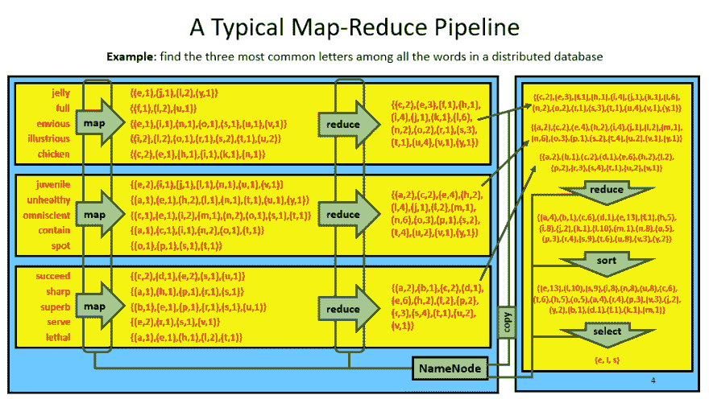](https://res.cloudinary.com/practicaldev/image/fetch/s--KoWFRIuY--/c_limit%2Cf_auto%2Cfl_progressive%2Cq_auto%2Cw_880/https://thepracticaldev.s3.amazonaws.com/i/2hzhe1o9g837vov865up.PNG)

<figcaption>An Example Map-Reduce Pipeline</figcaption>

</figure>

一些数据分析任务是*可并行化的*。例如，如果我们想在一个特定的数据库中找到所有单词中最常见的字母，我们可能首先要计算每个单词中的字母数。因为一个单词中字母的频率不影响另一个单词中字母的频率，所以这两个单词可以分开计算。如果你有 300 个长度大致相等的单词，并且有 3 台计算机来计算它们，你可以划分数据库，给每台计算机 100 个单词。这种方法大约是让一台计算机计算全部 300 个单词的速度的 3 倍。请注意，任务也可以跨 CPU 内核并行执行。

> 注意:将数据分割成块进行并行分析会产生一些开销。因此，如果这些块不能被并行处理(如果一台机器上只有一个 CPU 核心可用)，一个算法的并行版本通常会比它的非并行版本运行得更慢(T3)。

一旦上面例子中的每台机器都分析了它所有的 100 个单词，我们需要综合结果。这是一个*不可并行的*任务。一台计算机需要把所有其他机器的结果加起来，以便对结果进行分析。不可并行的任务是*瓶颈*，因为在它们完成之前甚至不能开始进一步的分析。

**常见的可并行任务包括:**

*   过滤(例如，删除无效或不完整的数据)
*   转换(例如:格式化字符串数据，将字符串解释为数字)
*   流式计算(例如:总和、平均值、标准偏差等。)
*   宁滨(例如:频率、柱状图)

**常见的不可并行任务包括:**

*   聚合(例如:将*部分*结果收集到单个*全局*结果中)
*   [文本解析](https://scicomp.stackexchange.com/a/1423)(例如:正则表达式、语法分析)
*   可视化(例如:创建汇总图)
*   数学建模(例如:线性回归、机器学习)

*排序*数据是算法的一个例子，它并不完全符合上述任何一个类别。尽管整个数据集必须被收集到一个位置来完成*全局*排序，但是对本身已经*本地*排序的小数据集进行排序比对等量的未排序数据进行排序要快得多，也容易得多。以这种方式排序数据本质上既是一个*映射*又是一个*归约*任务。

> 并行化并不适用于所有任务。一些算法是固有顺序的。[P-完成](https://en.wikipedia.org/wiki/P-complete)。其中包括 *n 体问题*、*电路值问题*、[、*牛顿法*、](https://stackoverflow.com/a/18774268/2925434)用于数值逼近多项式函数的根，以及*哈希链*，广泛应用于密码学。

### 什么是阿帕奇 Spark？

当 HDFS 在 2006 年第一次发布时，它与一个叫做——很有创意地——Hadoop MapReduce 的 map-reduce 分析框架结合在一起。HDFS 和 MapReduce 都受到了谷歌研究的启发，是谷歌的[“谷歌文件系统”](https://en.wikipedia.org/wiki/Google_File_System)和[“MapReduce”](https://en.wikipedia.org/wiki/MapReduce)的 Apache 对应产品，后者谷歌获得了专利(受到了批评)。

Hadoop MapReduce 是处理存储在 HDFS 上的数据的原始分析框架。MapReduce 执行 map-Reduce 分析管道(如上所述)，在“map”任务之前从 HDFS 读取数据，并在“reduce”任务之后将结果写回 HDFS。这种行为是为什么 Apache Spark 被广泛认为是 MapReduce 的继任者，相对于 MapReduce 提供了 10-100 倍的 T2 加速的原因之一。

> *Hadoop MapReduce 与 HDFS 协同工作，能够“以可靠、容错的方式在大型商用硬件集群(数千个节点)上并行处理大量数据(多 TB 数据集)。”* [【来源】](https://medium.com/@jayhuang75/a-simple-mapreduce-in-go-42c929b000c5)


<figure>[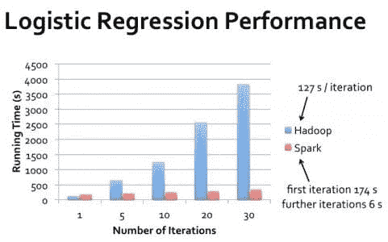

<figcaption>Hadoop vs. Spark 在逻辑回归上的表现</figcaption>](https://www.edureka.co/blog/apache-spark-vs-hadoop-mapreduce) </figure>


与 MapReduce 相比，Spark 至少提供了四个主要优势:

1.  **Spark 最大限度地减少不必要的磁盘 I/o。**Spark 对 MapReduce 进行了多项改进，尽可能减少对磁盘的读写。*当 MapReduce [将每个中间结果写入磁盘](https://www.quora.com/What-makes-Spark-faster-than-MapReduce)时，Spark 试图尽可能地将结果流水线化，仅在用户需要时或在分析流水线结束时写入磁盘。Spark 还将在内存中缓存用于多次操作的数据，因此不需要多次从磁盘中读取。由于这些原因，Spark 有时被称为“内存处理”。(尽管这是一个有点误导的术语，因为 MapReduce 和 Spark 都必须在 RAM 中处理数据。)

    > *一般来说，[读写 CPU 的缓存](https://linustechtips.com/main/topic/34636-what-is-the-bandwith-speed-of-l1l2-and-l3-cache/?do=findComment&comment=10911961)比 RAM 快一个数量级，RAM 比 SSD 快几个数量级(比传统硬盘还要[快](https://gist.github.com/jboner/2841832))。

2.  Spark 为容错处理提供了抽象。Spark 提供的主要数据结构是[弹性分布式数据集( **RDD** )](https://cs.stanford.edu/~matei/papers/2012/nsdi_spark.pdf) :

    *   **弹性** - [Spark 保留了一个*血统*](https://jaceklaskowski.gitbooks.io/mastering-apache-spark/spark-rdd-lineage.html) 给定的 RDD 是如何从任何“父”rdd 构建的。如果任何 RDD 被破坏或丢失，它可以很容易地从它的谱系图(又名。其 [*逻辑执行计划*](https://www.quora.com/What-is-an-RDD-Lineage) )。
    *   **分布式** -一个 RDD 可能物理上存在于几台机器的不同部分。Spark 干净地抽象出了存储在 HDFS 上的文件的分布式本质。读取和处理存储在单个机器上的单个文件的相同代码可以用于处理分布式文件，该文件被分成块并存储在许多不同的物理位置上。
    *   **Dataset** - [RDDs 可以存储](https://jaceklaskowski.gitbooks.io/mastering-apache-spark/spark-rdd.html)简单对象，如`String` s 和`Float` s，或者更复杂的对象，如元组、记录、自定义`Object` s 等等。这些数据集本质上是可并行的。

    > rdd 是不可变的数据集合，所以它们是**线程安全的**:它们可以被并行处理，程序员不必担心[竞争条件](https://en.wikipedia.org/wiki/Race_condition)或其他多线程陷阱。(使存储在 HDFS 上的文件不可变的逻辑是相似的。)
    > 
    > rdd 被**延迟评估**。在需要使用*-打印到终端、绘图、写入文件等之前，不会执行构建 RDD 必须追踪的计算序列。这减少了 Spark 执行的不必要的处理量。*

**   **Spark 有不同的处理模式。** Spark 使用了一个[有向无环图( **DAG** )](https://data-flair.training/blogs/dag-in-apache-spark/) 处理模型，而不是一个简单的两步 map-reduce 流水线:

    

    <figure>[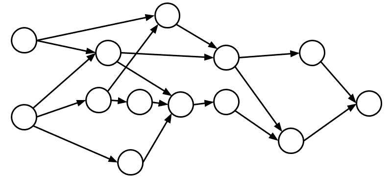

    <figcaption>
    【有向无环图(DAG)</figcaption>](https://blog.daglabs.com/an-introduction-to-the-blockdag-paradigm-50027f44facb) </figure>

    

    这意味着 Spark 对整个加工流程进行整体观察，并试图在全球范围内优化工艺。MapReduce 将(1)从磁盘读取数据，(2)执行“映射”操作，(3)执行“减少”操作，(4)将数据写入磁盘，而 Spark 对于何时完成什么更灵活。只要朝着最终结果前进，就可以并行或在不同时间对不同数据块执行*映射*和*减少*。DAG 是 MapReduce 的 map-reduce 管道的一个更通用的版本——它也可以被看作是 RDD 的理想化的*谱系图*的代码实现。

    *   [**Spark 消除了 JVM 的启动次数。**](https://medium.com/@Nim94Sha/apache-spark-ready-get-set-stream-75bbb2dae9c) 通过在启动时(相对于执行新任务时)在每个 DataNode 上启动 Java 虚拟机(JVM)，Spark 消除了加载`*.jar`和解析任何配置文件等所需的时间。MapReduce 在每次运行新任务时都会打开一个新的 JVM，所有这些启动开销都会在每个作业上产生。每次可能只需要几秒钟，但是积少成多。* 

 *此外，Spark 内置了对复杂分析的支持，如机器学习( [MLlib](https://spark.apache.org/mllib/) )和图形处理( [GraphX](https://spark.apache.org/graphx/) )，并且可以在 [Python、R、Scala、Java 和 SQL](https://en.wikipedia.org/wiki/Apache_Spark#Spark_Core)shell 中交互使用

上述特性使得 Spark 比 MapReduce 快得多，容错能力更强，功能也更丰富。Spark 拥有 MapReduce 的所有优势，基本上[只有在需要维护传统 MapReduce 代码的时候](https://stackoverflow.com/q/30299129/2925434)才应该选择后者。或者如果你不在乎处理时间。或者你不想花时间学 Spark。

还有其他分布式数据存储/分布式分析管道，但是 Apache Hadoop 和 Spark 是免费的、快速的、容错的，并且相对容易安装和理解。有了对 H&S 的基本了解，我们现在可以继续构建我们自己的 H&S 树莓集群了。

[【返回顶部】](#top)

## 

### 关于树莓派

[Raspberry Pi Foundation](https://en.wikipedia.org/wiki/Raspberry_Pi) 自 2012 年初以来一直在开发和发布单板电脑。最初的设想是[激发孩子们进入电子和编程](https://www.bbc.co.uk/blogs/thereporters/rorycellanjones/2011/05/a_15_computer_to_inspire_young.html)，就像 20 世纪 70 年代和 80 年代的 [DIY“套件”电脑](https://en.wikipedia.org/wiki/List_of_early_microcomputers)，树莓派[的受欢迎程度远远超出了基金会创始人的预期](https://www.raspberrypi.org/blog/ten-millionth-raspberry-pi-new-kit/)，售出 1250 万台成为[有史以来第三大受欢迎的个人电脑](https://www.theverge.com/circuitbreaker/2017/3/17/14962170/raspberry-pi-sales-12-5-million-five-years-beats-commodore-64)，击败了 Commodore 64，但[仍然落后于](https://www.raspberrypi.org/magpi/raspberry-pi-sales/)苹果麦金塔电脑和 Windows 个人电脑。是的，树莓 pi 已经被用于引入新一代计算，但它们也用于家庭自动化、制造业、机器人、数码相机等。


<figure>[

<figcaption>树莓派对比图(点击打开 PDF)</figcaption>](https://www.modmypi.com/download/Raspberry-Pi-Comparison_r3.pdf) </figure>


如今有许多不同的树莓 Pi 模型，它们分为四类:模型 A、模型 B、Zero 和 Compute。 **Model B** 系列是功能齐全的旗舰产品 Raspberry Pis。型号 b 都有以太网连接，这是其他 Pi 系列所没有的。每辆 B 型车的建议零售价为 35 美元。型号 b 都具有完全相同的外形:85.6 毫米 x 56.5mm 毫米 x 17.0mm 毫米，重量仅为 17 克。

> B 型 Pis 的大小相当于信用卡大小！大约和键盘键一样宽。它们的大小和重量大致相当于一副纸牌。


<figure>[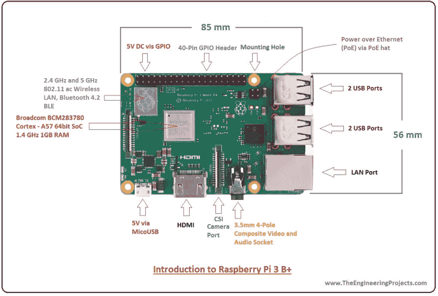

<figcaption>树莓派 3 B+示意图</figcaption>](https://www.theengineeringprojects.com/2018/07/introduction-to-raspberry-pi-3-b-plus.html) </figure>


树莓派也有不同的版本。版本 1 包括型号 B 和型号 B+，其中包括两个额外的 USB 端口，一个从 SD 到 microSD 存储的开关，以及板上 GPIO(通用输入/输出)头的变化，允许添加 **Pi HATs** (顶部连接的硬件)。HATs 连接到 GPIO 引脚，并向 Pi 添加附加功能:允许 PoE(以太网供电)、冷却风扇、LCD 屏幕等等。

版本 1 还包括一个模型 A 和 A+。A 系列的体积更小，更便宜(20-25 美元)，规格也更小(只有一个 USB 端口，没有以太网，RAM 更少)。零模型 Pis 更精简，甚至更便宜(5-10 美元)。所有这些 Pi 模型的详细信息可以在上表中看到，或者在网上的[各种](https://www.rs-online.com/designspark/rel-assets/dsauto/temp/uploaded/Raspberry_Pi_Comparison_A3_Final.png?w=815) [对比](http://socialcompare.com/fr/comparison/raspberrypi-models-comparison) [表格](https://www.mbtechworks.com/hardware/raspberry-pi-model-comparison.html)中找到。

### 选择一个 Pi 模型

我们希望将我们的 pi 联网以构建一个 Hadoop 集群，因此我们仅限于使用具有 Wi-Fi 和/或以太网硬件的型号。在目前可用的 Pi 中，这将我们限制在 Pi 3 B 型、Pi 3 B+型、Pi 3 A+型或 Pi Zero Wireless 型。所有这些 Pis 都有 WiFi 连接，但只有 B and B+型号有以太网。

> 请注意，版本 4 Pis 仅在几周前发布，但它们的销售速度与商店的库存速度一样快。如果可以的话，我推荐使用版本 4 的 pi，而不是版本 3 的。它们拥有更快的处理器，并能够添加更多内存(高达 4GB)。


<figure>[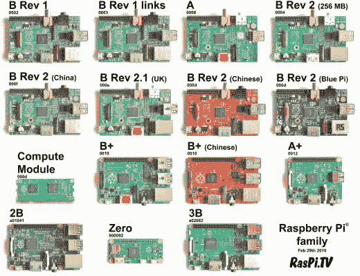

<figcaption>树莓派车型</figcaption>](https://opensource.com/life/16/10/which-raspberry-pi-should-you-choose-your-project) </figure>


如果我们使用 WiFi 将 Pis 联网，我们将需要一个无线路由器。我们还需要为每个 Pi 购买[电源](https://www.raspberrypi.org/products/type-c-power-supply/)。我要构建一个 8π的集群。八个电源会很笨重。如果我想向任何人展示我的集群，我必须随身携带所有这些设备，外加一个多插座。为了消除这种体积，我们可以通过 PoE 供电。这既考虑了网络，也考虑了每个 Pi 的电源，但是成本更高。这个选择限制了我只能选择 B 型或者 B+型。

最后，为了消除 Pis 的任何可能的网络延迟(由于所有型号 B/B+的价格相同)，我将选择 Pi 3 型号 B+，它具有最大的带宽以太网支持(~ 300 兆位/秒)。对于我的 8 Pi 集群，Pi 的总成本大约是 280 美元。

### 以太网供电和联网

Raspberry Pis 型号 B+可以通过传统的 DC 电源(微型 USB)供电。这些设备的成本大约是每个 8 美元(所以我的 8 Pi 集群总共需要 64 美元)，并且需要每个 Pi 都有自己的电源插座。你可以花大约 9 美元在网上[买到一个多插座(“电源板”)。](https://amzn.to/2Jm9PoE)

或者，Pis B+也可以通过以太网供电，这种技术被创造性地称为以太网供电或 PoE。PoE 需要支持 PoE 的网络交换机；这些通常比不支持 PoE 的更贵。非 PoE 的 8 端口网络交换机在亚马逊上只需 10 美元就能买到，千兆(1000Mbps)交换机只需 15 美元。一个所有端口都支持 PoE 的 8 端口网络交换机运行[大约 75 美元](https://amzn.to/2FRIv0N)。通过以太网联网需要 8 根短以太网电缆([大约 14 美元一个 10 包](https://amzn.to/2XnCfDF))。如果你选择非 PoE 路线，你也可以用一个好的、便宜的无线路由器(亚马逊上大约 23 美元)把你的 Pis 联网。

那么，对于使用 DC 电源的有线(以太网)集群，我们至少会看到 64 + $9 + $10 + $14 = **$97** 的网络和电源成本，或者使用 DC 电源的 WiFi 集群，我们至少会看到 64 + $9 + $23 = **$96** 的网络和电源成本。

<figure>[](https://res.cloudinary.com/practicaldev/image/fetch/s--DYV0Vsl1--/c_limit%2Cf_auto%2Cfl_progressive%2Cq_auto%2Cw_880/https://thepracticaldev.s3.amazonaws.com/i/bsdvkjhuzojxxxfkrhqi.jpg) 

<figcaption>树莓派集群使用以太网供电</figcaption>

</figure>

我正在构建的集群将用于演示，因此它需要是可移植的。八个电源加一个多插座并不理想，所以我选择了 PoE 选项。这消除了所有额外的体积，但这是有代价的。一个 PoE Pi 集群需要 8 顶 PoE 帽子(每顶大约 21 美元)，外加以太网电缆(10 根 14 美元)，外加一个支持 PoE 的 8 端口网络交换机(大约 75 美元)。这意味着一个 PoE Pi 集群将产生至少**257**美元的网络和电源成本，或者是无线集群的 2.5 倍以上。


<figure>[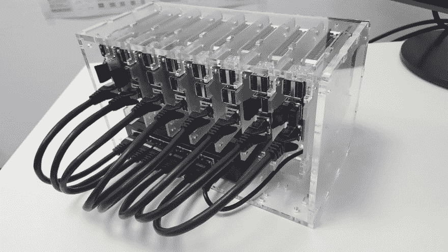

<figcaption>C4Labs Cloudlet 集群案，捧着树莓 Pi 集群</figcaption>](https://www.c4labs.com/product/8-slot-stackable-cluster-case-raspberry-pi-3b-and-other-single-board-computers-color-options/?attribute_pa_cloudlet-case-color=clear) </figure>


我还有一个小问题。我从 C4Labs 为我的 Pi 集群买了一个特殊的手提箱(55 美元)，所以我唯一可以从亚马逊英国订购的网络交换机(由于空间限制)是 T2 的 TRENDnet v 1.1r T3，价格约为 92 美元。所以我的网络和电源总成本(加上这个案例)是 **$329** 。

> 注意，以上报价均不含运费。此外，C4Labs 机箱配备了冷却风扇，这些风扇意味着从 Pis 上的 GPIO 5V 引脚获取电力。由于这些将被 PoE 帽子占据，我买了一些 USB 插孔和烙铁，这样我就可以将冷却风扇的电线焊接到 USB 插孔上。然后，风扇可以通过 USB 从 Pis 获取电能。这两次购买又增加了大约 32 美元的集群成本**。**

 **### 磁盘空间

树莓馅饼没有机载存储空间。不过，它们配有 microSD 插槽，所以 microSD 卡可以用来保存操作系统和 Pi 数据。128GB 型号的高等级微型 SD 卡价格[约为 17.50 美元](https://amzn.to/2Xrcqma)，尽管其中大多数将读取速度限制在约 80MB/s。在撰写本文时，读取速度高达 100MB/s 的最便宜的 128GB SD 卡价格[约为 21 美元](https://amzn.to/2FOFuxV)或**168 美元**用于整个集群。

### 成本和总体规格

总之，我的 8-Pi 集群的总成本大约是

*   所有八款树莓 Pis 售价 280 美元
*   274 美元用于所有的电源和网络设备
*   所有 microSD 卡 168 美元
*   一个漂亮的手提箱要 55 美元
*   USB 插口和烙铁 32 美元

...总共大约 810 美元。将所有这些东西运送到爱尔兰又要花费大约 125 美元，这使得我的集群的总成本达到大约 935 美元。注意，这还不包括键盘、鼠标、显示器或 HDMI 线的成本，所有这些都是我从其他项目借来的。

该 8 机集群的选定规格如下:

*   CPU: 8 个 1.4GHz 64 位四核 ARM Cortex-A53 处理器
*   RAM: 8 个 1GB LPDDR2 SDRAM(最大 1066 Mbps 数据速率)
*   以太网:千兆以太网(最大 300 Mbps)，PoE 支持
*   存储:8 个 128GB microSD 存储(最高 80MB/秒读取速度)
*   端口:8 个 HDMI 端口，8 个 USB 2.0 端口

对于 1000 美元以下的人来说还不错！

### 安装 PoE 帽子

在很大程度上，树莓 pi 是即插即用的。但是因为我们正在安装一顶帽子，我们必须做一点点硬件工作。树莓派网站[在这里](https://www.raspberrypi.org/products/poe-hat/)给出了如何在树莓派上安装 PoE 帽子的说明——非常简单:

1.  将 [40 针 GPIO 接头](https://www.raspberrypi.org/documentation/usage/gpio/)和附近的 [4 针 PoE 接头](https://raspberrypi.stackexchange.com/q/84752/103781)定位在树莓 Pi 的顶部，并将相应的 40 针和 4 针插槽定位在 PoE 帽子的底部，但是**还没有将任何东西放在一起**。

    [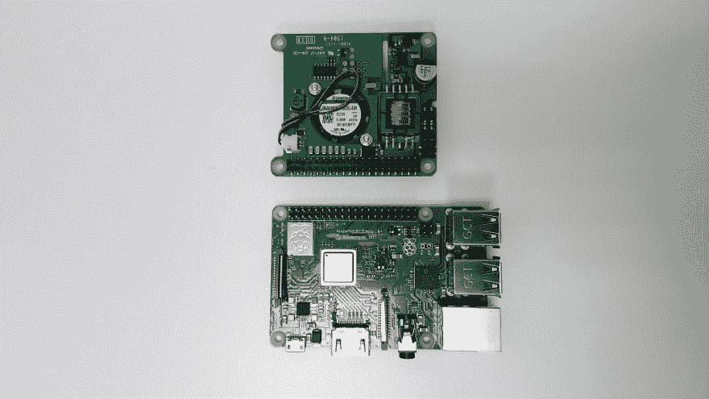](https://res.cloudinary.com/practicaldev/image/fetch/s--f8PTJQlV--/c_limit%2Cf_auto%2Cfl_progressive%2Cq_auto%2Cw_880/https://thepracticaldev.s3.amazonaws.com/i/piq1a3itlki75b817etc.jpg)

    当 PoE 帽子正面朝上翻转时，Pi 上的针脚应与帽子上的插槽对齐:

    [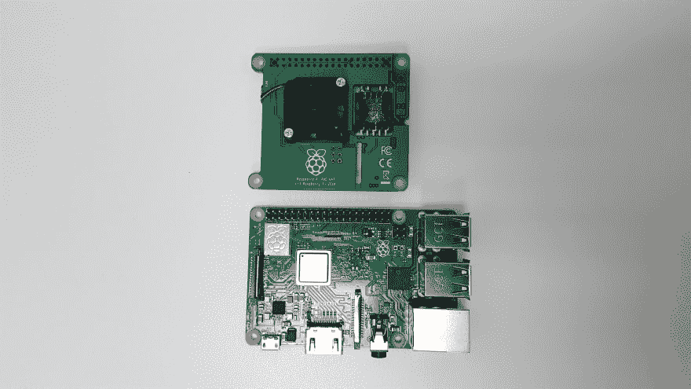](https://res.cloudinary.com/practicaldev/image/fetch/s--ZcJ0y-LT--/c_limit%2Cf_auto%2Cfl_progressive%2Cq_auto%2Cw_880/https://thepracticaldev.s3.amazonaws.com/i/xhz1huedr1vgdywa8fjk.jpg)

2.  找到 PoE 帽子附带的垫片和螺钉。应该至少有 4 个垫片和 8 个螺钉。

    [](https://res.cloudinary.com/practicaldev/image/fetch/s--QEQUf9XK--/c_limit%2Cf_auto%2Cfl_progressive%2Cq_auto%2Cw_880/https://thepracticaldev.s3.amazonaws.com/i/pepp8oeqt6d37nikc85l.jpg)

3.  从顶部将垫片拧到帽子上。

    [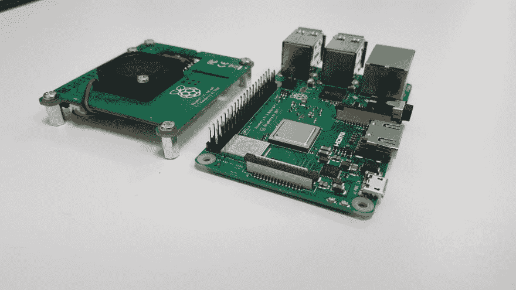](https://res.cloudinary.com/practicaldev/image/fetch/s---mLXFeUk--/c_limit%2Cf_auto%2Cfl_progressive%2Cq_auto%2Cw_880/https://thepracticaldev.s3.amazonaws.com/i/7fkdbqytrcvqp6sgzmb1.jpg)

4.  此时，如果您只组装一个 Pi，您将通过将垫片对准 Pi 上的孔并将垫片从 Pi 的下侧拧入来将 Pi 连接到帽子上，同时确保小心地将 Pi GPIO 和 PoE 引脚插入帽子上的 GPIO 和 PoE 插槽。

    [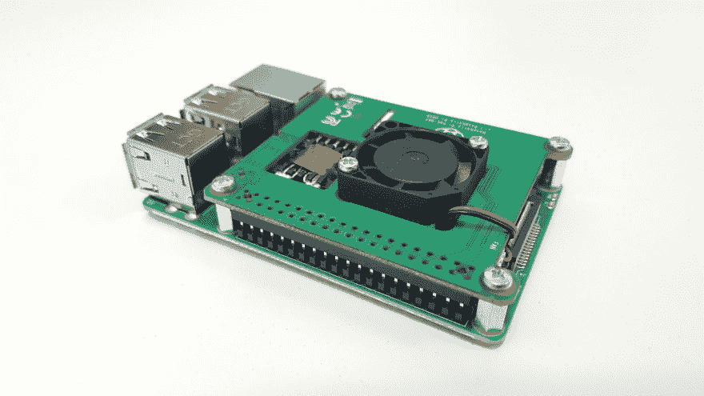](https://res.cloudinary.com/practicaldev/image/fetch/s--glrbLO1V--/c_limit%2Cf_auto%2Cfl_progressive%2Cq_auto%2Cw_880/https://thepracticaldev.s3.amazonaws.com/i/hudokf7xq9lr4iyra5bn.jpg)

    然而，对于我的集群，我将所有 pi 组装在一个 C4Labs Cloudlet / Cluster 案例中，因此 pi 需要连接到 plexiglas 底座。我从树脂玻璃上取下保护纸，加上金属垫片和螺丝，如下图所示:

    [](https://res.cloudinary.com/practicaldev/image/fetch/s--oALkn1VG--/c_limit%2Cf_auto%2Cfl_progressive%2Cq_auto%2Cw_880/https://thepracticaldev.s3.amazonaws.com/i/zwlj1d4c5kt11jd97125.jpg)

    确保使用*更长的*螺钉，因为它们需要穿过树脂玻璃、金属垫片、Pi 电路板，并进入 PoE 帽垫片:

    [](https://res.cloudinary.com/practicaldev/image/fetch/s--kPnf8Seo--/c_limit%2Cf_auto%2Cfl_progressive%2Cq_auto%2Cw_880/https://thepracticaldev.s3.amazonaws.com/i/o0nxrwsr4mwalap26max.jpg)

    一旦所有部件都拧紧在一起，Pi 就应该安全地连接到树脂玻璃支架上:

    [](https://res.cloudinary.com/practicaldev/image/fetch/s--66apYme0--/c_limit%2Cf_auto%2Cfl_progressive%2Cq_auto%2Cw_880/https://thepracticaldev.s3.amazonaws.com/i/sj55s6n3rasn3bj1rivf.jpg)

...就是这样！PoE HAT 已成功安装。

**如果您试图在将 PoE 帽按到 Pi 销上后再取下它，请非常小心**。在试图取下 PoE 帽子时，很容易将这些引脚从电路板上拧下来。如果发生这种情况，您必须将引脚重新焊接到 Pi 上，或者改用 microUSB 电源(或者购买新的 Pi)。

[【返回顶部】](#top)

## 

### 操作系统

[树莓派](https://www.techrepublic.com/pictures/choosing-a-raspberry-pi-os-heres-the-definitive-list/)的[操作系统](https://www.fossmint.com/operating-systems-for-raspberry-pi/)有[几十个](https://www.makeuseof.com/tag/7-operating-systems-you-can-run-with-raspberry-pi/)。一些比较著名的例子包括:

*   [**Raspbian**](https://www.raspberrypi.org/downloads/raspbian/)——基于 Debian 的 OS，由 Raspberry Pi 基金会开发维护(该基金会对系统的推荐 OS)

    [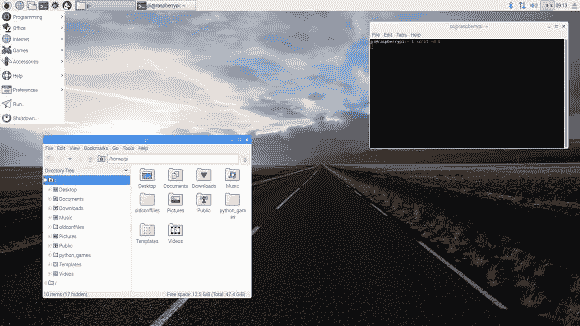](https://res.cloudinary.com/practicaldev/image/fetch/s--Epm9_i0r--/c_limit%2Cf_auto%2Cfl_progressive%2Cq_auto%2Cw_880/https://thepracticaldev.s3.amazonaws.com/i/d947kckorec5s1t9fq9c.jpg)

*   [**Windows 物联网核心**](https://docs.microsoft.com/en-us/windows/iot-core/windows-iot-core)——Windows 的物联网(IoT)操作系统，针对小型设备；外观和感觉与 [Windows 10](https://www.microsoft.com/en-gb/software-download/windows10) 相似

    [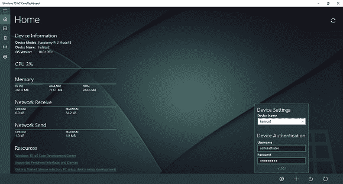](https://res.cloudinary.com/practicaldev/image/fetch/s--SnVP7d5C--/c_limit%2Cf_auto%2Cfl_progressive%2Cq_auto%2Cw_880/https://thepracticaldev.s3.amazonaws.com/i/u0qua1jmpx51hmcho7q0.png)

*   [**Ubuntu 核心**](https://ubuntu.com/core)——最流行的 Linux 发行版之一的精简版， [Ubuntu](https://ubuntu.com/)

    [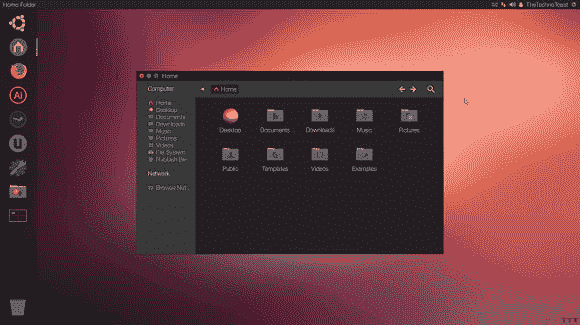](https://res.cloudinary.com/practicaldev/image/fetch/s--7CUaavl5--/c_limit%2Cf_auto%2Cfl_progressive%2Cq_auto%2Cw_880/https://thepracticaldev.s3.amazonaws.com/i/ytnhi77i77nc768lvd72.png)

*   [**安卓**](https://www.android.com/) - [世界上最流行的操作系统](https://en.wikipedia.org/wiki/Android_(operating_system))；安装在超过 20 亿台设备上，其中大部分是手机

    [](https://res.cloudinary.com/practicaldev/image/fetch/s--lq4oWizO--/c_limit%2Cf_auto%2Cfl_progressive%2Cq_auto%2Cw_880/https://thepracticaldev.s3.amazonaws.com/i/amutk0z7irccc4lv5e8h.png)

*   [**RaspBSD**](https://www.raspbsd.org/)——树莓 Pi 的 UNIX 的 Berkeley 软件发行版(BSD)的一个分支；macOS 也基于 BSD

*   [**Chromium OS**](https://en.wikipedia.org/wiki/Chromium_OS)——谷歌基于浏览器的操作系统

*   [**retro pie**](https://retropie.org.uk/)——一个把你的树莓皮变成复古游戏机的操作系统(不允许有版权的游戏！)

*   [**RISC OS Pi**](https://www.raspberrypi.org/blog/risc-os-for-raspberry-pi/)——一个 Pi 优化版本的 [RISC OS](https://en.wikipedia.org/wiki/RISC_OS) ，一个专门为精简指令集芯片(RISC)开发的操作系统，就像 Raspberry Pi 中使用的 AMD 系列

尽管安装 RetroPie 会很有趣，但我认为我会坚持使用 Raspbian，因为它是树莓 Pi 基金会推荐的操作系统，并且已经针对树莓 Pi 的低性能硬件进行了[特别优化。](https://en.wikipedia.org/wiki/Raspbian)

Raspbian 的**(新的开箱即用软件)安装程序是让 Raspbian 安装到树莓派的最简单的方法。下载就好，按照[树莓派网站上列出的说明](https://projects.raspberrypi.org/en/projects/raspberry-pi-setting-up)操作。你需要将 microSD 卡格式化为 FAT ( **而不是 ExFAT** ！)，解压 NOOBS `*.zip`档案，将其中的文件复制到你新格式化的 microSD 卡上。然后，将 microSD 卡插入 Pi；Pi 底部有一个插槽，位于 USB 端口的对面:**

 **[](https://res.cloudinary.com/practicaldev/image/fetch/s--xmZl-p2u--/c_limit%2Cf_auto%2Cfl_progressive%2Cq_auto%2Cw_880/https://thepracticaldev.s3.amazonaws.com/i/xbatddkk0lfovv0rgdmv.jpg)

[](https://res.cloudinary.com/practicaldev/image/fetch/s--qL-E9Gn3--/c_limit%2Cf_auto%2Cfl_progressive%2Cq_auto%2Cw_880/https://thepracticaldev.s3.amazonaws.com/i/sjbnkdo7ax51chca5okr.jpg)

将以太网电缆插入 Pi，将电缆的另一端插入支持 PoE 的网络交换机，为 Pi 供电。插入网络交换机并打开它。一两秒钟后，Pi 应该通电:以太网端口旁边的黄灯和 microSD 卡旁边的红灯都应该亮起。

[](https://res.cloudinary.com/practicaldev/image/fetch/s--JUe5qrDT--/c_limit%2Cf_auto%2Cfl_progressive%2Cq_auto%2Cw_880/https://thepracticaldev.s3.amazonaws.com/i/do7okzp99nl2zbrvgj2n.jpg)

然后，使用 GPIO 接头对面的 HDMI 端口将 Pi 连接到显示器。

[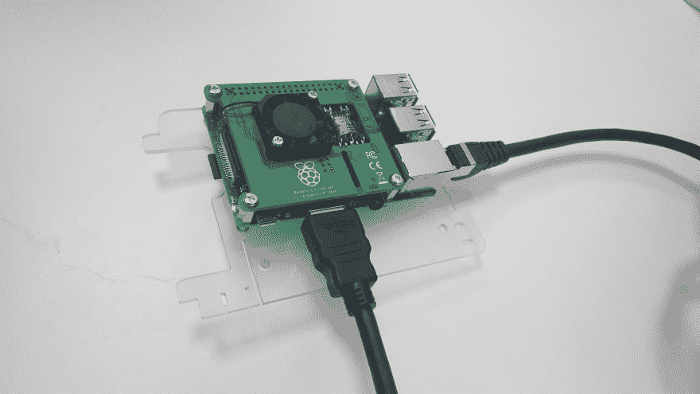](https://res.cloudinary.com/practicaldev/image/fetch/s--tP-bAE5h--/c_limit%2Cf_auto%2Cfl_progressive%2Cq_auto%2Cw_880/https://thepracticaldev.s3.amazonaws.com/i/biytxqqmwzwzmcy1j51h.jpg)

通过 USB 将鼠标和键盘连接到 Pi，并按照操作系统安装向导中的屏幕说明进行操作(看起来应该与下面的屏幕截图类似)。


<figure>[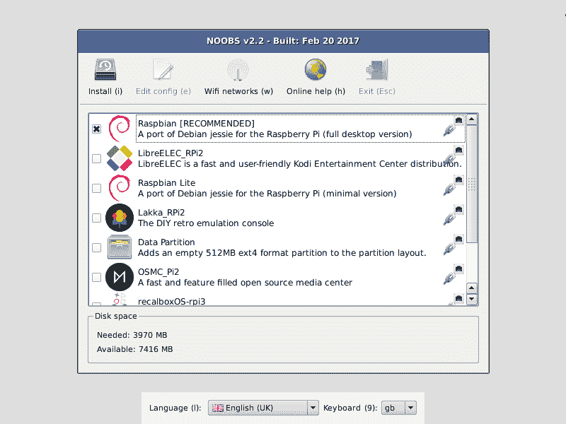

<figcaption>NOOBS 安装工上了一个覆盆子</figcaption>](https://www.raspberrypi.org/documentation/installation/noobs.md) </figure>


一旦你成功地在一个 Pi 上安装了你选择的操作系统，你可以简单地[克隆 microSD 卡](https://beebom.com/how-clone-raspberry-pi-sd-card-windows-linux-macos/)来在其他 Pi 上安装相同的操作系统。没有必要多次通过安装向导。在本教程的后面，我将解释如何轻松地在集群上的所有 pi 上同时运行一个特定的命令(包括用`apt`安装软件),这样您就不需要像一只猴子在打字机前一样一遍又一遍地重复相同的手动任务——这就是我们拥有技术的原因，不是吗？

### 

#### 配置静态 IP 地址

为了方便 Pi 的联网，我将为网络交换机上的每个 Pi 设置静态 IP 地址。我将根据 pi1 在网络交换机上和便携包中的位置为其编号 1-8(包括 1-8)。当查看 Pi(机箱的“前面”)上的端口时，#1 是最右边的 Pi，#8 是最左边的 Pi。

为了启用用户定义的静态 IP 地址，我在每个 Pi 上编辑了文件`/etc/dhcpcd.conf`，并取消注释/编辑了行:

```
interface eth0
static ip_address=192.168.0.10X/24 
```

Enter fullscreen mode Exit fullscreen mode

...其中，Pi #1 的`X`应替换为`1`，Pi #2 的`2`，以此类推。在特定的 Pi 上完成这一更改后，我重新启动了机器。一旦所有八个 pi 都完成了这一步，它们应该都能够在这些地址上`ping`彼此通信。

我还在 Pi #1 上安装了`nmap`，这样就可以很容易地检查所有八个 Pi 的状态:

```
$ sudo nmap –sP 192.168.0.0/24 
```

Enter fullscreen mode Exit fullscreen mode

...将显示所有其他七个 pi 的状态，不包括运行该命令的 pi。“`N hosts up`”显示了根据上述正确配置的、当前连接的和通电的 pi 的数量。

#### 启用`ssh`

要在每个 Pi 上启用`ssh`，我们需要遵循[这些指令](https://www.raspberrypi.org/documentation/remote-access/ssh/)(此处复制以避免链接损坏):

> 截至 2016 年 11 月发布，Raspbian 默认禁用 SSH 服务器。可以从桌面手动启用它:
> 
> 1.  从`Preferences`菜单启动`Raspberry Pi Configuration`
> 2.  导航至`Interfaces`选项卡
> 3.  选择`SSH`旁边的`Enabled`
> 4.  点击`OK`
> 
> 或者，可以在终端中使用 [`raspi-config`](https://www.raspberrypi.org/documentation/configuration/raspi-config.md) :
> 
> 1.  在终端窗口中输入`sudo raspi-config`
> 2.  选择`Interfacing Options`
> 3.  导航并选择`SSH`
> 4.  选择`Yes`
> 5.  选择`Ok`
> 6.  选择`Finish`
> 
> 或者，使用 systemctl 启动该服务
> 
> ```
>  $ sudo systemctl enable ssh
>  $ sudo systemctl start ssh 
> ```
> 
> 在可能连接到互联网的 Pi 上启用 SSH 时，您应该更改其默认密码，以确保其安全。更多详情见[安全页面](https://www.raspberrypi.org/documentation/configuration/security.md)。

#### 主机名

最初，所有的 pi 都被称为`raspberrypi`，并且只有一个用户`pi` :

```
$ hostname raspberrypi

$ whoami pi 
```

Enter fullscreen mode Exit fullscreen mode

如果我们经常在网络上不同的 pi 之间来回移动，这可能会变得非常混乱。为了简化，我们将根据每个 Pi 在机箱/网络交换机中的位置为其分配一个主机名。Pi #1 将被称为`pi1`，Pi #2 将被称为`pi2`，以此类推。

为此，必须编辑两个文件:`/etc/hosts`和`/etc/hostname`。在这些文件中，`raspberrypi`应该只出现一次，这是默认的主机名。我们将它们分别改为`piX`，其中`X`是 1-8 中合适的数字。最后，仅在`/etc/hosts`中，我们还在文件末尾添加了所有其他 pi 的 IP，比如:

```
192.168.0.101 pi1
192.168.0.102 pi2
...
192.168.0.108 pi8 
```

Enter fullscreen mode Exit fullscreen mode

这必须在每个 Pi 上手动完成。

一旦为适当的 Pi 完成了上述任务，我们就重新启动那个特定的 Pi。现在，当终端打开时，而不是:

```
pi@raspberrypi:~ $ 
```

Enter fullscreen mode Exit fullscreen mode

...你应该看到

```
pi@piX:~ $ 
```

Enter fullscreen mode Exit fullscreen mode

...其中`X`是该 Pi 在集群上的索引。我们在每个 Pi 上这样做，并在完成后重新启动它们。从现在开始，在这些指令中，命令提示符将简称为`$`。任何其他代码都是文件的输出或文本。

#### 化简`ssh`

仅按照上面的指令从一个 Pi 连接到另一个 Pi，将需要下面的一系列命令:

```
$ ssh pi@192.168.0.10X
pi@192.168.0.10X's password: <enter password – 'raspberry' default> 
```

Enter fullscreen mode Exit fullscreen mode

当然，这并不需要太多的输入，但是如果我们必须经常这样做，这可能会变得很麻烦。为了避免这种情况，我们可以用公钥/私钥对设置`ssh`别名和无密码`ssh`连接。

*ssh 别名*

为了设置一个`ssh`别名，我们在一个特定的 Pi 上编辑`~/.ssh/config`文件，并添加以下几行:

```
Host piX
User pi
Hostname 192.168.0.10X 
```

Enter fullscreen mode Exit fullscreen mode

...将八个 Pis 中的每一个的`X`替换为 1-8。请注意，这是在单个 Pi 上完成的，因此一个 Pi 应该在`~/.ssh/config`中有八个代码块，除了`X`字符之外，它们看起来与上面的代码块相同，它应该针对网络上的每个 Pi 而改变。然后，`ssh`命令序列就变成了:

```
$ ssh piX
pi@192.168.0.10X's password: <enter password> 
```

Enter fullscreen mode Exit fullscreen mode

这可以通过建立公钥/私钥对来进一步简化。

*公钥/私钥对*

在每个 Pi 上，运行以下命令:

```
$ ssh-keygen –t ed25519 
```

Enter fullscreen mode Exit fullscreen mode

这将在目录`~/.ssh/`中生成一个公钥/私钥对，可以用来安全地`ssh`而无需输入密码。其中一个文件将被称为`id_ed25519`，这是*私钥*。另一个`id_ed25519.pub`是*公钥*。不需要密码来保护对密钥对的访问。公钥用于与其他 pi 通信，私钥永远不会离开其主机，也永远不会被移动或复制到任何其他设备。

每个公钥需要连接到每隔一个 Pi 上的`~/.ssh/authorized_keys`文件。对于单个 Pi，最简单的方法是这样做一次，然后简单地将`authorized_keys`文件复制到另一个 Pi。让我们假设 Pi #1 将包含“主”记录，然后将它复制到另一个 Pi。

在 Pi #2(和#3、#4 等)上。)，运行以下命令:

```
$ cat ~/.ssh/id_ed25519.pub | ssh pi@192.168.0.101 'cat >> .ssh/authorized_keys' 
```

Enter fullscreen mode Exit fullscreen mode

这将 Pi #2 的公钥文件连接到 Pi #1 的授权密钥列表，给予 Pi #2 在没有密码的情况下`ssh`进入 Pi #1 的权限(公钥和私钥用于验证连接)。我们需要对每台机器都这样做，将每个公钥文件连接到 Pi #1 的授权密钥列表。我们也应该为 Pi #1 这样做，这样当我们将完成的`authorized_keys`文件复制到其他 Pi 时，它们都有权限将`ssh`复制到 Pi #1 中。在 Pi #1 上运行以下命令:

```
$ cat .ssh/id_ed25519.pub >> .ssh/authorized_keys 
```

Enter fullscreen mode Exit fullscreen mode

一旦这样做了，和前面的部分一样，`ssh` -ing 就像:
一样简单

```
$ ssh pi1 
```

Enter fullscreen mode Exit fullscreen mode

...就是这样！可以在`~/.bashrc`文件中配置额外的别名来进一步缩短(见下文),尽管我们的系统上没有配置:

```
alias p1="ssh pi1" # etc. 
```

Enter fullscreen mode Exit fullscreen mode

*复制配置*

最后，要在所有 Pi 间复制无密码的`ssh`，只需使用`scp` :
将上述两个文件从 Pi #1 复制到另一个 Pi

```
$ scp ~/.ssh/authorized_keys piX:~/.ssh/authorized_keys
$ scp ~/.ssh/config piX:~/.ssh/config 
```

Enter fullscreen mode Exit fullscreen mode

现在，您应该能够通过`ssh piX`从任何其他 Pi 进入集群上的任何 Pi。

#### 易用性

最后，对集群进行一些简单易用的增强。

*获取除此之外的每个 Pi 的主机名*

要获得一个 Pi 的主机名，只需使用:

```
$ hostname pi1 
```

Enter fullscreen mode Exit fullscreen mode

...要获得集群上所有其他*pi 的主机名，请定义函数:* 

```
function otherpis {
  grep "pi" /etc/hosts | awk '{print $2}' | grep -v $(hostname)
} 
```

Enter fullscreen mode Exit fullscreen mode

> `-v`标志告诉`grep`到*反转*选择。仅返回与`hostname`不匹配的*行。*

...在你的`~/.bashrc`中，然后，`source`你的`~/.bashrc`文件中带有:

```
$ source ~/.bashrc 
```

Enter fullscreen mode Exit fullscreen mode

(注意，无论何时编辑`~/.bashrc`，为了使这些更改生效，您必须`source`文件或注销并重新登录。)然后，您可以在命令行上用:
调用这个新函数

```
$ otherpis
pi2
pi3
pi4
... 
```

Enter fullscreen mode Exit fullscreen mode

注意，这个函数依赖于您已经在`/etc/hosts`文件中列出了 pi 的所有 IP 和主机名。

*向所有 pi 发送相同的命令*

要向每个 Pi 发送相同的命令，将下面的函数添加到您想要从中口述命令的 Pi 的`~/.bashrc`(我将它添加到 Pi #1 的`~/.bashrc`，然后使用下面的指令将`~/.bashrc`文件复制到所有其他 Pi):

```
function clustercmd {
  for pi in $(otherpis); do ssh $pi "$@"; done
  $@
} 
```

Enter fullscreen mode Exit fullscreen mode

这会在每个 Pi 上运行给定的命令，然后在这个 Pi 上:

```
$ clustercmd date Tue Apr  9 00:32:41 IST 2019
Tue Apr  9 05:58:07 IST 2019
Tue Apr  9 06:23:51 IST 2019
Tue Apr  9 23:51:00 IST 2019
Tue Apr  9 05:58:57 IST 2019
Tue Apr  9 07:36:13 IST 2019
Mon Apr  8 15:19:32 IST 2019
Wed Apr 10 03:48:11 IST 2019 
```

Enter fullscreen mode Exit fullscreen mode

...从上面我们可以看到，我们所有的 pi 都有不同的系统时间。让我们解决这个问题。

*跨集群同步时间*

只需告诉每个 Pi 安装软件包`htpdate`，日期就会更新。就是这样:

```
$ clustercmd "sudo apt install htpdate -y > /dev/null 2>&1"

$ clustercmd date Wed Jun 19 16:04:22 IST 2019 
Wed Jun 19 16:04:18 IST 2019 
Wed Jun 19 16:04:19 IST 2019
Wed Jun 19 16:04:20 IST 2019 
Wed Jun 19 16:04:48 IST 2019 
Wed Jun 19 16:04:12 IST 2019 
Wed Jun 19 16:04:49 IST 2019
Wed Jun 19 16:04:25 IST 2019 
```

Enter fullscreen mode Exit fullscreen mode

注意现在所有的日期和时间都精确到一分钟以内。如果我们重新启动所有的 pi，它们会更加一致:

```
$ clustercmd date Wed Jun 19 16:09:28 IST 2019 
Wed Jun 19 16:09:27 IST 2019 
Wed Jun 19 16:09:29 IST 2019
Wed Jun 19 16:09:31 IST 2019 
Wed Jun 19 16:09:28 IST 2019 
Wed Jun 19 16:09:30 IST 2019 
Wed Jun 19 16:09:24 IST 2019
Wed Jun 19 16:09:28 IST 2019 
```

Enter fullscreen mode Exit fullscreen mode

他们现在可以在 10 秒内校准。请注意，跨集群运行该命令需要几秒钟时间。为了精确地将所有的时钟同步到一个远程服务器(一个受人尊敬的标准，如`time.nist.gov`或`google.com`)，你可以做:

```
$ clustercmd sudo htpdate -a -l time.nist.gov 
```

Enter fullscreen mode Exit fullscreen mode

...这将需要几分钟的时间，因为程序会以< 30ms so there are no "jumps" in any system file timestamps. Once this command finishes, the clocks will be synchronised (remember, it takes a second or two to communicate across the network, so they're still "off" by two or three seconds):
的间隔缓慢调整时钟

```
$ clustercmd date Wed Jun 19 16:36:46 IST 2019 
Wed Jun 19 16:36:47 IST 2019 
Wed Jun 19 16:36:47 IST 2019
Wed Jun 19 16:36:48 IST 2019 
Wed Jun 19 16:36:49 IST 2019 
Wed Jun 19 16:36:49 IST 2019 
Wed Jun 19 16:36:49 IST 2019
Wed Jun 19 16:36:49 IST 2019 
```

Enter fullscreen mode Exit fullscreen mode

*重启集群*

我将下面的函数添加到 Pi #1 上的`~/.bashrc`中:

```
function clusterreboot {
  clustercmd sudo shutdown -r now
} 
```

Enter fullscreen mode Exit fullscreen mode

该功能使重启整个集群变得容易。另一个让我不用重启就可以关闭整个集群:

```
function clustershutdown {
  clustercmd sudo shutdown now
} 
```

Enter fullscreen mode Exit fullscreen mode

*向所有 pi 发送相同的文件*

要将一个文件从一个 Pi 复制到所有其他 Pi，让我们将一个名为`clusterscp`(集群安全复制)的函数添加到任何特定 Pi:
的`~/.bashrc`文件中

```
function clusterscp {
  for pi in $(otherpis); do cat $1 | ssh $pi "sudo tee $1" > /dev/null 2>&1
  done
} 
```

Enter fullscreen mode Exit fullscreen mode

然后我们可以将我们在`~/.bashrc`中定义的所有易用函数复制到集群上的所有其他 Pi:

```
$ source ~/.bashrc && clusterscp ~/.bashrc 
```

Enter fullscreen mode Exit fullscreen mode

### 保护集群

您构建 Hadoop 集群可能只是为了好玩，但我构建它是为了做一些数据分析工作。由于我的集群将保存专有数据，因此集群安全性至关重要。

[我们可以做很多事情来保护电脑免受未经授权的访问。可以做的最简单(也是最有效)的事情(按照上一节“简化`ssh`”中的说明设置无密码`ssh`之后)是禁用基于密码的认证。这意味着用户只有拥有与其中一个 pi 上的一个私钥相对应的公钥，才能登录到系统中。虽然(理论上)破解这些密钥是可能的，但](https://medium.com/@jasonrigden/hardening-ssh-1bcb99cd4cef) [ed25519 是迄今为止最安全的公钥/私钥对算法](https://security.stackexchange.com/a/90083/183193)，并且在可预见的未来很可能不会被破解。

#### 禁用基于密码的认证& `root`登录

为了禁用基于密码的认证，我们编辑了文件`/etc/ssh/sshd_config`。我们特别想改变 6 个选项。在该文件中搜索以下键，并对它们进行更改，使它们与下面的示例相匹配。确保下面的行都不是以'【T1]'开头的，这将注释掉该行，使其被系统忽略。

```
PermitRootLogin no
PasswordAuthentication no
ChallengeResponseAuthentication no
UsePAM no
X11Forwarding no
PrintMotd no 
```

Enter fullscreen mode Exit fullscreen mode

上述命令将分别:防止黑客试图以`root`的身份登录(因此他们需要知道用户名是`pi`)；[不允许基于密码的认证](https://superuser.com/a/374234/728488)(所以他们需要相应的 ed25519 公钥到给定 Pi 上的特定私钥)；禁用 Pis 之间/从 Pis 到 Pis 的 X11 (GUI)转发(所有操作都必须通过命令行完成)；并禁用“今日消息”(MOTD)，其中有时可能包括泄露信息。编辑`/etc/ssh/sshd_config`并在特定 Pi 上进行上述更改，然后用...

**警告:对以下步骤要格外小心。**如果你在`sshd_config`中打错了，然后在一个 Pi 上重启`ssh`服务，它会抛出一个错误，你将不能再`ssh`到那个 Pi 中。您将需要手动(将 HDMI 电缆连接到视频输出)连接到 Pi 来重新配置！

```
$ clusterscp /etc/ssh/sshd_config 
```

Enter fullscreen mode Exit fullscreen mode

...并使用
在所有 pi 上重启`ssh`服务(重新加载配置)

```
$ clustercmd sudo service ssh restart 
```

Enter fullscreen mode Exit fullscreen mode

要完全删除 MOTD，删除文件`/etc/motd` :

```
$ clustercmd sudo rm /etc/motd 
```

Enter fullscreen mode Exit fullscreen mode

#### [用`fail2ban`监视`ssh`的活动](#monitor-raw-ssh-endraw-activity-with-raw-fail2ban-endraw-)

为了监控和保护集群的完整性，我们可以做的另一件大事是安装一个名为`fail2ban`的程序。`fail2ban`“基于可能的恶意活动记录并暂时禁止 IP”。要在集群中的每台机器上安装这个程序，运行命令:

```
$ clustercmd sudo apt install fail2ban –y 
```

Enter fullscreen mode Exit fullscreen mode

然后，将配置文件复制到单个 Pi:

```
$ cp /etc/fail2ban/jail.conf /etc/fail2ban/jail.local 
```

Enter fullscreen mode Exit fullscreen mode

...并在以`[sshd]`开头的点附近编辑`jail.local`内的行。注意`[sshd]`出现在文件顶部附近的注释块中——忽略它。`[sshd]`应配置如下:

```
[sshd]
enabled = true
port    = ssh
logpath = %(sshd_log)s
backend = %(sshd_backend)s 
```

Enter fullscreen mode Exit fullscreen mode

编辑完`jail.local`后，使用
将其复制到集群上的所有其他 pi

```
$ clusterscp /etc/fail2ban/jail.local 
```

Enter fullscreen mode Exit fullscreen mode

...并使用
在所有 pi 上重新启动`fail2ban`服务

```
$ clustercmd sudo service fail2ban restart 
```

Enter fullscreen mode Exit fullscreen mode

[【返回顶部】](#top)

## 

### 单节点设置

#### Hadoop

Apache Hadoop v2.7+ [需要 Java 7+](https://wiki.apache.org/hadoop/HadoopJavaVersions) 才能运行。我在我的 Pis 上安装 Raspbian 的时候用的是 [NOOBS](https://www.raspberrypi.org/downloads/noobs/) v3.0.1 (2019-04-08)。这将安装 Raspbian 和 Java 1 . 8 . 0 _ 65(HotSpot aka 的 Java 8。甲骨文)。所以所有 pi 都默认安装了可接受的 Java 版本。接下来，我们可以下载安装 Hadoop。

我将首先在主节点(Pi #1)上构建一个单节点设置，然后我将工作节点创建一个多节点集群。在 Pi #1 上，用命令获取 Hadoop:

```
$ cd && wget https://bit.ly/2wa3Hty 
```

Enter fullscreen mode Exit fullscreen mode

(这是`hadoop-3.2.0.tar.gz` )
的缩短链接

```
$ sudo tar -xvf 2wa3Hty -C /opt/
$ rm 2wa3Hty && cd /opt
$ sudo mv hadoop-3.2.0 hadoop 
```

Enter fullscreen mode Exit fullscreen mode

然后，确保更改该目录的权限:

```
$ sudo chown pi:pi -R /opt/hadoop 
```

Enter fullscreen mode Exit fullscreen mode

最后，通过编辑`~/.bashrc`并将下面几行放在文件的末尾，将这个目录添加到`$PATH`中:

```
export JAVA_HOME=$(readlink –f /usr/bin/java | sed "s:bin/java::")
export HADOOP_HOME=/opt/hadoop
export PATH=$PATH:$HADOOP_HOME/bin:$HADOOP_HOME/sbin 
```

Enter fullscreen mode Exit fullscreen mode

...并编辑`/opt/hadoop/etc/hadoop/hadoop-env.sh`以添加以下行:

```
export JAVA_HOME=$(readlink –f /usr/bin/java | sed "s:bin/java::") 
```

Enter fullscreen mode Exit fullscreen mode

您可以通过检查版本来验证 Hadoop 是否已正确安装:

```
$ cd && hadoop version | grep Hadoop
Hadoop 3.2.0 
```

Enter fullscreen mode Exit fullscreen mode

#### 火花

我们将以类似于我们下载 Hadoop 的方式下载 Spark，如上:

```
$ cd && wget https://bit.ly/2HK6nTW 
```

Enter fullscreen mode Exit fullscreen mode

(这是`spark-2.4.3-bin-hadoop2.7.tgz` )
的缩短链接

```
$ sudo tar –xvf 2HK6nTW –C /opt/
$ rm 2HK6nTW && cd /opt
$ sudo mv spark-2.4.3-bin-hadoop2.7 spark 
```

Enter fullscreen mode Exit fullscreen mode

然后，确保更改该目录的权限:

```
$ sudo chown pi:pi -R /opt/spark 
```

Enter fullscreen mode Exit fullscreen mode

最后，通过编辑`~/.bashrc`并将下面几行放在文件的末尾，将这个目录添加到您的`$PATH`中:

```
export SPARK_HOME=/opt/spark
export PATH=$PATH:$SPARK_HOME/bin 
```

Enter fullscreen mode Exit fullscreen mode

您可以通过检查版本来验证 Spark 安装是否正确:

```
$ cd && spark-shell --version
... version 2.4.3 ... Using Scala version 2.11.12 ... 
```

Enter fullscreen mode Exit fullscreen mode

#### HDFS

为了启动并运行 Hadoop 分布式文件系统(HDFS ),我们需要修改一些配置文件。所有这些文件都在`/opt/hadoop/etc/hadoop`内。第一个是 **`core-site.xml`** 。编辑它，如下所示:

```
<configuration>
  <property>
    <name>fs.defaultFS</name>
    <value>hdfs://pi1:9000</value>
  </property>
</configuration> 
```

Enter fullscreen mode Exit fullscreen mode

接下来是 **`hdfs-site.xml`** ，应该是这样的:

```
<configuration>
  <property>
    <name>dfs.datanode.data.dir</name>
    <value>file:///opt/hadoop_tmp/hdfs/datanode</value>
  </property>
  <property>
    <name>dfs.namenode.name.dir</name>
    <value>file:///opt/hadoop_tmp/hdfs/namenode</value>
  </property>
  <property>
    <name>dfs.replication</name>
    <value>1</value>
  </property>
</configuration> 
```

Enter fullscreen mode Exit fullscreen mode

...这将配置 DataNode 和 NameNode 信息的存储位置，还会将 replication(跨集群复制块的次数)设置为 1(我们稍后会对此进行更改)。确保您也使用命令:
创建这些目录

```
$ sudo mkdir -p /opt/hadoop_tmp/hdfs/datanode
$ sudo mkdir -p /opt/hadoop_tmp/hdfs/namenode 
```

Enter fullscreen mode Exit fullscreen mode

...并调整这些目录的所有者:

```
$ sudo chown pi:pi -R /opt/hadoop_tmp 
```

Enter fullscreen mode Exit fullscreen mode

下一个文件是 **`mapred-site.xml`** ，应该是这样的:

```
<configuration>
  <property>
    <name>mapreduce.framework.name</name>
    <value>yarn</value>
  </property>
</configuration> 
```

Enter fullscreen mode Exit fullscreen mode

...最后是 **`yarn-site.xml`** ，应该是这样的:

```
<configuration>
  <property>
    <name>yarn.nodemanager.aux-services</name>
    <value>mapreduce_shuffle</value>
  </property>
  <property>
    <name>yarn.nodemanager.auxservices.mapreduce.shuffle.class</name>  
    <value>org.apache.hadoop.mapred.ShuffleHandler</value>
  </property>
</configuration> 
```

Enter fullscreen mode Exit fullscreen mode

编辑完这四个文件后，我们就可以格式化 HDFS 了(**警告:如果您已经有了 HDFS 的数据，请不要这样做！它将会丢失！** ):

```
$ hdfs namenode -format -force 
```

Enter fullscreen mode Exit fullscreen mode

...然后，我们用以下两个命令引导 HDFS:

```
$ start-dfs.sh
$ start-yarn.sh 
```

Enter fullscreen mode Exit fullscreen mode

...并通过创建一个临时目录来测试它是否工作:

```
$ hadoop fs -mkdir /tmp

$ hadoop fs -ls /
Found 1 items
drwzr-xr-x   - pi supergroup          0 2019-04-09 16:51 /tmp 
```

Enter fullscreen mode Exit fullscreen mode

...或者通过运行命令`jps` :

```
$ jps
2736 NameNode
2850 DataNode
3430 NodeManager
3318 ResourceManager
3020 SecondaryNameNode
3935 Jps 
```

Enter fullscreen mode Exit fullscreen mode

这表明 HDFS 已经启动并运行，至少在 Pi #1 上是这样。为了检查 Spark 和 Hadoop 是否协同工作，我们可以做:

```
$ hadoop fs -put $SPARK_HOME/README.md /

$ spark-shell 
```

Enter fullscreen mode Exit fullscreen mode

...这将打开 Spark shell，并提示`scala>` :

```
scala> val textFile = sc.textFile("hdfs://pi1:9000/README.md")
...

scala> textFile.first()
res0: String = # Apache Spark 
```

Enter fullscreen mode Exit fullscreen mode

#### 隐藏`execstack`警告

在运行上面的 Hadoop 命令时，您可能会得到如下警告...

> “你已经加载了库...这可能会禁用堆栈保护。

...在我们的 Raspberry Pis 上发生这种情况的原因是因为 Hadoop 二进制文件构建的 32 位运行时与我们运行的 64 位 Raspbian 版本不匹配。要忽略这些警告，请更改行

```
# export HADOOP_OPTS="-Djava.net.preferIPv4Stack=true" 
```

Enter fullscreen mode Exit fullscreen mode

...在`/opt/hadoop/etc/hadoop/hadoop-env.sh`到
中

```
export HADOOP_OPTS="-XX:-PrintWarnings –Djava.net.preferIPv4Stack=true" 
```

Enter fullscreen mode Exit fullscreen mode

这将隐藏将来的警告。(或者，您也可以下载 Hadoop 源代码并从头开始构建。)

#### 隐藏`NativeCodeLoader`警告

你可能看到的另一个警告是`util.NativeCodeLoader`是“`Unable to load [the] native-hadoop library for your platform`”。这个警告不容易解决。这是因为 Hadoop 是为 32 位架构编译的，而我们的 Raspbian 版本是 64 位的。我们可以在 64 位机器上从头开始重新编译这个库，但是我不希望看到这个警告。为此，我们可以在我们的`~/.bashrc`文件的底部添加以下几行:

```
export HADOOP_HOME_WARN_SUPPRESS=1
export HADOOP_ROOT_LOGGER="WARN,DRFA" 
```

Enter fullscreen mode Exit fullscreen mode

这将防止那些`NativeCodeLoader`警告被打印出来。

### 集群设置

此时，您应该有一个单节点集群，并且该单节点同时充当主节点和工作节点。要设置工作节点(并将计算分布到整个集群)，我们必须采取以下步骤...

#### 创建目录

使用
在所有其他 pi 上创建所需的目录

```
$ clustercmd sudo mkdir -p /opt/hadoop_tmp/hdfs
$ clustercmd sudo chown pi:pi –R /opt/hadoop_tmp
$ clustercmd sudo mkdir -p /opt/hadoop
$ clustercmd sudo chown pi:pi /opt/hadoop 
```

Enter fullscreen mode Exit fullscreen mode

#### 复制配置

使用:
将/opt/hadoop 中的文件复制到对方 Pi 中

```
$ for pi in $(otherpis); do rsync –avxP $HADOOP_HOME $pi:/opt; done 
```

Enter fullscreen mode Exit fullscreen mode

这会花很长时间，所以去吃午饭吧。

当您返回时，通过使用以下命令查询每个节点上的 Hadoop 版本来验证文件复制是否正确:

```
$ clustercmd hadoop version | grep Hadoop
Hadoop 3.2.0
Hadoop 3.2.0
Hadoop 3.2.0
... 
```

Enter fullscreen mode Exit fullscreen mode

#### 在集群上配置 Hadoop

很难找到一个好的指南来在一个联网的机器集群上安装 Hadoop。[此链接](https://www.linode.com/docs/databases/hadoop/how-to-install-and-set-up-hadoop-cluster/)指向我关注的那一个，大多没有事件。为了让 HDFS 在集群中运行，我们需要修改之前编辑的配置文件。所有这些文件都在`/opt/hadoop/etc/hadoop`内。第一个是 **`core-site.xml`** 。编辑它，如下所示:

```
<configuration>
  <property>
    <name>fs.default.name</name>
    <value>hdfs://pi1:9000</value>
  </property>
</configuration> 
```

Enter fullscreen mode Exit fullscreen mode

接下来是 **`hdfs-site.xml`** ，应该是这样的:

```
<configuration>
  <property>
    <name>dfs.datanode.data.dir</name>
    <value>/opt/hadoop_tmp/hdfs/datanode</value>
  </property>
  <property>
    <name>dfs.namenode.name.dir</name>
    <value>/opt/hadoop_tmp/hdfs/namenode</value>
  </property>
  <property>
    <name>dfs.replication</name>
    <value>4</value>
  </property>
</configuration> 
```

Enter fullscreen mode Exit fullscreen mode

下一个文件是 **`mapred-site.xml`** ，应该是这样的:

```
<configuration>
  <property>
    <name>mapreduce.framework.name</name>
    <value>yarn</value>
  </property>
  <property>
    <name>yarn.app.mapreduce.am.resource.mb</name>
    <value>256</value>
  </property>
  <property>
    <name>mapreduce.map.memory.mb</name>
    <value>128</value>
  </property>
  <property>
    <name>mapreduce.reduce.memory.mb</name>
    <value>128</value>
  </property>
</configuration> 
```

Enter fullscreen mode Exit fullscreen mode

...最后是 **`yarn-site.xml`** ，应该是这样的:

```
<configuration>
  <property>
    <name>yarn.acl.enable</name>
    <value>0</value>
  </property>
  <property>
    <name>yarn.resourcemanager.hostname</name>
    <value>pi1</value>
  </property>
  <property>
    <name>yarn.nodemanager.aux-services</name>
    <value>mapreduce_shuffle</value>
  </property>
  <property>
    <name>yarn.nodemanager.auxservices.mapreduce.shuffle.class</name>  
    <value>org.apache.hadoop.mapred.ShuffleHandler</value>
  </property>
  <property>
    <name>yarn.nodemanager.resource.memory-mb</name>
    <value>900</value>
  </property>
  <property>
    <name>yarn.scheduler.maximum-allocation-mb</name>
    <value>900</value>
  </property>
  <property>
    <name>yarn.scheduler.minimum-allocation-mb</name>
    <value>64</value>
  </property>
  <property>
    <name>yarn.nodemanager.vmem-check-enabled</name>
    <value>false</value>
  </property>
</configuration> 
```

Enter fullscreen mode Exit fullscreen mode

对这些文件进行这些更改，然后从所有 pi 中删除所有旧文件。我假设您正在一步一步地学习本教程，并且还没有向单节点 Pi #1 集群添加任何重要的大数据。您可以使用
清除所有 pi

```
$ clustercmd rm –rf /opt/hadoop_tmp/hdfs/datanode/*
$ clustercmd rm –rf /opt/hadoop_tmp/hdfs/namenode/* 
```

Enter fullscreen mode Exit fullscreen mode

**如果不这样做**，可能会出现 Pis 无法相互识别的错误。如果您无法启动 datanode(Pi # 2-# 8)，或者无法与 NameNode (Pi #1)通信，那么清除上面的文件可能是解决方案(对我来说就是这样)。

接下来，我们需要在`$HADOOP_HOME/etc/hadoop/`中创建两个文件，这两个文件告诉 Hadoop 使用哪个 Pi 作为工作节点，哪个 Pi 应该作为主(NameNode)节点。在前面提到的目录中创建一个名为`master`的文件，并只添加一行:

```
pi1 
```

Enter fullscreen mode Exit fullscreen mode

然后，在同一个目录下创建一个名为`workers` ( **而不是`slaves`** ，就像 Hadoop 以前的版本一样)的文件，并添加所有其他的 pi:

```
pi2
pi3
pi4
... 
```

Enter fullscreen mode Exit fullscreen mode

然后，你需要再次编辑`/etc/hosts`。在任何 Pi 上，删除类似于
的线

```
127.0.0.1 PiX 
```

Enter fullscreen mode Exit fullscreen mode

...其中`X`是该特定圆周率的指数。然后，用
将该文件复制到所有其他 pi

```
$ clusterscp /etc/hosts 
```

Enter fullscreen mode Exit fullscreen mode

我们现在可以这样做，因为这个文件不再是特定于 Pi 的。最后，重新启动集群以使这些更改生效。当所有 Pi 都重新启动后，在 Pi #1 上运行命令:

警告:如果您在 HDFS 已经有数据，请不要这样做！它将会丢失！

```
$ hdfs namenode -format -force 
```

Enter fullscreen mode Exit fullscreen mode

...然后，我们用以下两个命令引导 HDFS:

```
$ start-dfs.sh && start-yarn.sh 
```

Enter fullscreen mode Exit fullscreen mode

我们可以通过将文件从任何 Pi(使用`hadoop fs -put`)放入 HDFS 来测试集群，并确保它们出现在其他 Pi 上(使用`hadoop fs -ls`)。您还可以通过打开 web 浏览器并导航到 [http://pi1:9870](http://pi1:9870) 来检查集群是否启动并运行。这个 web 界面为您提供了一个文件浏览器以及有关集群运行状况的信息。

<figure>[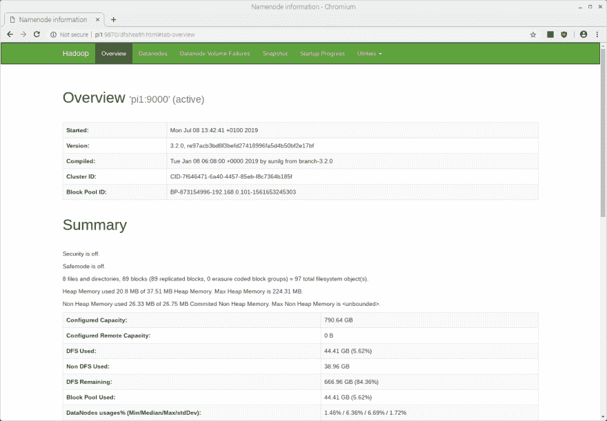](https://res.cloudinary.com/practicaldev/image/fetch/s--2mSuluVg--/c_limit%2Cf_auto%2Cfl_progressive%2Cq_auto%2Cw_880/https://thepracticaldev.s3.amazonaws.com/i/5rrkjy0stc0xkzlk2upw.png) 

<figcaption>运行在端口 9870 上的 Hadoop web UI。</figcaption>

</figure>

<figure>[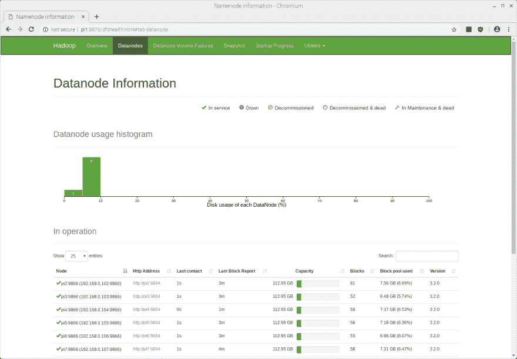](https://res.cloudinary.com/practicaldev/image/fetch/s--qdyQJyaG--/c_limit%2Cf_auto%2Cfl_progressive%2Cq_auto%2Cw_880/https://thepracticaldev.s3.amazonaws.com/i/hf1pupsq87cdq4gtntpc.png) 

<figcaption>Hadoop web UI 显示 DataNode 统计数据。</figcaption>

</figure>

<figure>[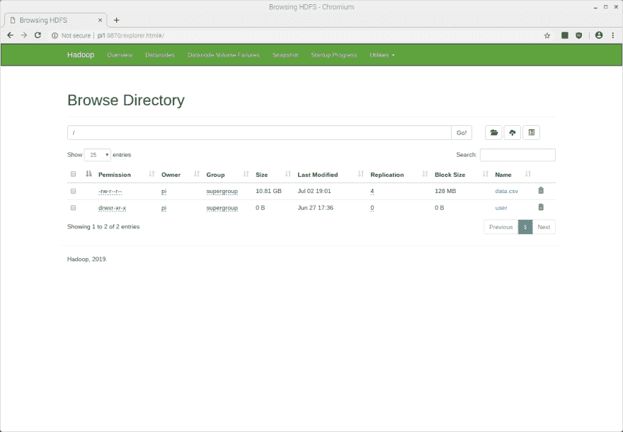](https://res.cloudinary.com/practicaldev/image/fetch/s--3SdPUjoa--/c_limit%2Cf_auto%2Cfl_progressive%2Cq_auto%2Cw_880/https://thepracticaldev.s3.amazonaws.com/i/bp7e3bn5pbq8q3oqnp4q.png)

<figcaption>Hadoop web UI 中的文件浏览器。</figcaption>

</figure>

#### 在集群上配置火花

Spark 在单台机器上运行良好，因此我们可能会欺骗自己，认为我们正在使用 Hadoop 集群的全部功能，而实际上我们并没有。我们上面执行的一些配置是针对 Hadoop YARN(另一个资源协商者)的。这是 HDFS 的“资源协商者”,协调文件如何在群集内移动和分析。为了让 Spark 能够与 YARN 通信，我们需要在 Pi #1 的`~/.bashrc`中再配置两个环境变量。之前，我们定义了

```
export SPARK_HOME=/opt/spark
export PATH=$PATH:$SPARK_HOME/bin 
```

Enter fullscreen mode Exit fullscreen mode

...在`~/.bashrc`里。就在这下面，我们现在将再添加两个环境变量:

```
export HADOOP_CONF_DIR=$HADOOP_HOME/etc/hadoop
export LD_LIBRARY_PATH=$HADOOP_HOME/lib/native:$LD_LIBRARY_PATH 
```

Enter fullscreen mode Exit fullscreen mode

`$HADOOP_CONF_DIR`是包含我们在上面编辑的所有`*-site.xml`配置文件的目录。接下来，我们创建 Spark 配置文件:

```
$ cd $SPARK_HOME/conf
$ sudo mv spark-defaults.conf.template spark-defaults.conf 
```

Enter fullscreen mode Exit fullscreen mode

...我们在这个文件的末尾添加了下面几行:

```
spark.master            yarn
spark.driver.memory     465m
spark.yarn.am.memory    356m
spark.executor.memory   465m
spark.executor.cores    4 
```

Enter fullscreen mode Exit fullscreen mode

这些值的含义在[链接](https://www.linode.com/docs/databases/hadoop/install-configure-run-spark-on-top-of-hadoop-yarn-cluster/)中解释。但是注意，上面的**是非常机器专用的**。上面的配置对我来说在 Raspberry Pi 3 Model B+上运行良好，但对功能不太强大或更强大的机器来说可能不适合(或不是最佳的)。Spark 还对可分配的内存量实施了严格的下限。您在上面看到的`465m`处，是该条目的最小可配置值——小于这个值，Spark 将拒绝运行。

> 树莓 Pi 3 型号 B+在空闲时使用 9-25%的 RAM。由于 Hadoop 和 Spark 总共有 926MB 内存，因此它们每个 Pi 最多可以访问 840MB 内存。

完成所有这些配置后，重新启动集群。请注意，当您重新启动时，您不应该再次格式化 HDFS 命名节点。相反，只需使用
停止并重新启动 HDFS 服务

```
$ stop-dfs.sh && stop-yarn.sh

$ start-dfs.sh && start-yarn.sh 
```

Enter fullscreen mode Exit fullscreen mode

现在，您可以在命令行上向 Spark 提交一个作业:

```
pi@pi1:~ $ spark-submit --deploy-mode client --class org.apache.spark.examples.SparkPi $SPARK_HOME/examples/jars/spark-examples_2.11-2.4.3.jar 7
OpenJDK Client VM warning: You have loaded library /opt/hadoop/lib/native/libhadoop.so.1.0.0 which might have disabled stack guard. The VM will try to fix the stack guard now.
It's highly recommended that you fix the library with 'execstack -c <libfile>', or link it with '-z noexecstack'.
2019-07-08 14:01:24,408 WARN util.NativeCodeLoader: Unable to load native-hadoop library for your platform... using builtin-java classes where applicable
2019-07-08 14:01:25,514 INFO spark.SparkContext: Running Spark version 2.4.3
2019-07-08 14:01:25,684 INFO spark.SparkContext: Submitted application: Spark Pi
2019-07-08 14:01:25,980 INFO spark.SecurityManager: Changing view acls to: pi
2019-07-08 14:01:25,980 INFO spark.SecurityManager: Changing modify acls to: pi
2019-07-08 14:01:25,981 INFO spark.SecurityManager: Changing view acls groups to: 
2019-07-08 14:01:25,981 INFO spark.SecurityManager: Changing modify acls groups to: 
2019-07-08 14:01:25,982 INFO spark.SecurityManager: SecurityManager: authentication disabled; ui acls disabled; users  with view permissions: Set(pi); groups with view permissions: Set(); users  with modify permissions: Set(pi); groups with modify permissions: Set()
2019-07-08 14:01:27,360 INFO util.Utils: Successfully started service 'sparkDriver' on port 46027.
2019-07-08 14:01:27,491 INFO spark.SparkEnv: Registering MapOutputTracker
2019-07-08 14:01:27,583 INFO spark.SparkEnv: Registering BlockManagerMaster
2019-07-08 14:01:27,594 INFO storage.BlockManagerMasterEndpoint: Using org.apache.spark.storage.DefaultTopologyMapper for getting topology information
2019-07-08 14:01:27,596 INFO storage.BlockManagerMasterEndpoint: BlockManagerMasterEndpoint up
2019-07-08 14:01:27,644 INFO storage.DiskBlockManager: Created local directory at /tmp/blockmgr-e5479834-d1e4-48fa-9f5c-cbeb65531c31
2019-07-08 14:01:27,763 INFO memory.MemoryStore: MemoryStore started with capacity 90.3 MB
2019-07-08 14:01:28,062 INFO spark.SparkEnv: Registering OutputCommitCoordinator
2019-07-08 14:01:28,556 INFO util.log: Logging initialized @10419ms
2019-07-08 14:01:28,830 INFO server.Server: jetty-9.3.z-SNAPSHOT, build timestamp: unknown, git hash: unknown
2019-07-08 14:01:28,903 INFO server.Server: Started @10770ms
2019-07-08 14:01:28,997 INFO server.AbstractConnector: Started ServerConnector@89f072{HTTP/1.1,[http/1.1]}{0.0.0.0:4040}
2019-07-08 14:01:28,997 INFO util.Utils: Successfully started service 'SparkUI' on port 4040.
2019-07-08 14:01:29,135 INFO handler.ContextHandler: Started o.s.j.s.ServletContextHandler@1b325b3{/jobs,null,AVAILABLE,@Spark}
2019-07-08 14:01:29,137 INFO handler.ContextHandler: Started o.s.j.s.ServletContextHandler@b72664{/jobs/json,null,AVAILABLE,@Spark}
2019-07-08 14:01:29,140 INFO handler.ContextHandler: Started o.s.j.s.ServletContextHandler@34b7b8{/jobs/job,null,AVAILABLE,@Spark}
2019-07-08 14:01:29,144 INFO handler.ContextHandler: Started o.s.j.s.ServletContextHandler@1e8821f{/jobs/job/json,null,AVAILABLE,@Spark}
2019-07-08 14:01:29,147 INFO handler.ContextHandler: Started o.s.j.s.ServletContextHandler@b31700{/stages,null,AVAILABLE,@Spark}
2019-07-08 14:01:29,150 INFO handler.ContextHandler: Started o.s.j.s.ServletContextHandler@165e559{/stages/json,null,AVAILABLE,@Spark}
2019-07-08 14:01:29,153 INFO handler.ContextHandler: Started o.s.j.s.ServletContextHandler@1ae47a0{/stages/stage,null,AVAILABLE,@Spark}
2019-07-08 14:01:29,158 INFO handler.ContextHandler: Started o.s.j.s.ServletContextHandler@5a54d{/stages/stage/json,null,AVAILABLE,@Spark}
2019-07-08 14:01:29,161 INFO handler.ContextHandler: Started o.s.j.s.ServletContextHandler@1ef722a{/stages/pool,null,AVAILABLE,@Spark}
2019-07-08 14:01:29,165 INFO handler.ContextHandler: Started o.s.j.s.ServletContextHandler@1d9b663{/stages/pool/json,null,AVAILABLE,@Spark}
2019-07-08 14:01:29,168 INFO handler.ContextHandler: Started o.s.j.s.ServletContextHandler@14894fc{/storage,null,AVAILABLE,@Spark}
2019-07-08 14:01:29,179 INFO handler.ContextHandler: Started o.s.j.s.ServletContextHandler@567255{/storage/json,null,AVAILABLE,@Spark}
2019-07-08 14:01:29,186 INFO handler.ContextHandler: Started o.s.j.s.ServletContextHandler@362c57{/storage/rdd,null,AVAILABLE,@Spark}
2019-07-08 14:01:29,191 INFO handler.ContextHandler: Started o.s.j.s.ServletContextHandler@4ee95c{/storage/rdd/json,null,AVAILABLE,@Spark}
2019-07-08 14:01:29,195 INFO handler.ContextHandler: Started o.s.j.s.ServletContextHandler@1c4715d{/environment,null,AVAILABLE,@Spark}
2019-07-08 14:01:29,200 INFO handler.ContextHandler: Started o.s.j.s.ServletContextHandler@a360ea{/environment/json,null,AVAILABLE,@Spark}
2019-07-08 14:01:29,204 INFO handler.ContextHandler: Started o.s.j.s.ServletContextHandler@148bb7d{/executors,null,AVAILABLE,@Spark}
2019-07-08 14:01:29,209 INFO handler.ContextHandler: Started o.s.j.s.ServletContextHandler@27ba81{/executors/json,null,AVAILABLE,@Spark}
2019-07-08 14:01:29,214 INFO handler.ContextHandler: Started o.s.j.s.ServletContextHandler@336c81{/executors/threadDump,null,AVAILABLE,@Spark}
2019-07-08 14:01:29,217 INFO handler.ContextHandler: Started o.s.j.s.ServletContextHandler@156f2dd{/executors/threadDump/json,null,AVAILABLE,@Spark}
2019-07-08 14:01:29,260 INFO handler.ContextHandler: Started o.s.j.s.ServletContextHandler@1e52059{/static,null,AVAILABLE,@Spark}
2019-07-08 14:01:29,265 INFO handler.ContextHandler: Started o.s.j.s.ServletContextHandler@159e366{/,null,AVAILABLE,@Spark}
2019-07-08 14:01:29,283 INFO handler.ContextHandler: Started o.s.j.s.ServletContextHandler@1dc9128{/api,null,AVAILABLE,@Spark}
2019-07-08 14:01:29,288 INFO handler.ContextHandler: Started o.s.j.s.ServletContextHandler@c4944a{/jobs/job/kill,null,AVAILABLE,@Spark}
2019-07-08 14:01:29,292 INFO handler.ContextHandler: Started o.s.j.s.ServletContextHandler@772895{/stages/stage/kill,null,AVAILABLE,@Spark}
2019-07-08 14:01:29,304 INFO ui.SparkUI: Bound SparkUI to 0.0.0.0, and started at http://pi1:4040
2019-07-08 14:01:29,452 INFO spark.SparkContext: Added JAR file:/opt/spark/examples/jars/spark-examples_2.11-2.4.3.jar at spark://pi1:46027/jars/spark-examples_2.11-2.4.3.jar with timestamp 1562590889451
2019-07-08 14:01:33,070 INFO client.RMProxy: Connecting to ResourceManager at pi1/192.168.0.101:8032
2019-07-08 14:01:33,840 INFO yarn.Client: Requesting a new application from cluster with 7 NodeManagers
2019-07-08 14:01:34,082 INFO yarn.Client: Verifying our application has not requested more than the maximum memory capability of the cluster (900 MB per container)
2019-07-08 14:01:34,086 INFO yarn.Client: Will allocate AM container, with 740 MB memory including 384 MB overhead
2019-07-08 14:01:34,089 INFO yarn.Client: Setting up container launch context for our AM
2019-07-08 14:01:34,101 INFO yarn.Client: Setting up the launch environment for our AM container
2019-07-08 14:01:34,164 INFO yarn.Client: Preparing resources for our AM container
2019-07-08 14:01:35,577 WARN yarn.Client: Neither spark.yarn.jars nor spark.yarn.archive is set, falling back to uploading libraries under SPARK_HOME.
2019-07-08 14:02:51,027 INFO yarn.Client: Uploading resource file:/tmp/spark-ca0b9022-2ba9-45ff-8d63-50545ef98e55/__spark_libs__7928629488171799934.zip -> hdfs://pi1:9000/user/pi/.sparkStaging/application_1562589758436_0002/__spark_libs__7928629488171799934.zip
2019-07-08 14:04:09,654 INFO yarn.Client: Uploading resource file:/tmp/spark-ca0b9022-2ba9-45ff-8d63-50545ef98e55/__spark_conf__4579290782490197871.zip -> hdfs://pi1:9000/user/pi/.sparkStaging/application_1562589758436_0002/__spark_conf__.zip
2019-07-08 14:04:13,226 INFO spark.SecurityManager: Changing view acls to: pi
2019-07-08 14:04:13,227 INFO spark.SecurityManager: Changing modify acls to: pi
2019-07-08 14:04:13,227 INFO spark.SecurityManager: Changing view acls groups to: 
2019-07-08 14:04:13,228 INFO spark.SecurityManager: Changing modify acls groups to: 
2019-07-08 14:04:13,228 INFO spark.SecurityManager: SecurityManager: authentication disabled; ui acls disabled; users  with view permissions: Set(pi); groups with view permissions: Set(); users  with modify permissions: Set(pi); groups with modify permissions: Set()
2019-07-08 14:04:20,235 INFO yarn.Client: Submitting application application_1562589758436_0002 to ResourceManager
2019-07-08 14:04:20,558 INFO impl.YarnClientImpl: Submitted application application_1562589758436_0002
2019-07-08 14:04:20,577 INFO cluster.SchedulerExtensionServices: Starting Yarn extension services with app application_1562589758436_0002 and attemptId None
2019-07-08 14:04:21,625 INFO yarn.Client: Application report for application_1562589758436_0002 (state: ACCEPTED)
2019-07-08 14:04:21,680 INFO yarn.Client: 
     client token: N/A
     diagnostics: [Mon Jul 08 14:04:20 +0100 2019] Scheduler has assigned a container for AM, waiting for AM container to be launched
     ApplicationMaster host: N/A
     ApplicationMaster RPC port: -1
     queue: default
     start time: 1562591060331
     final status: UNDEFINED
     tracking URL: http://pi1:8088/proxy/application_1562589758436_0002/
     user: pi
2019-07-08 14:04:22,696 INFO yarn.Client: Application report for application_1562589758436_0002 (state: ACCEPTED)
2019-07-08 14:04:23,711 INFO yarn.Client: Application report for application_1562589758436_0002 (state: ACCEPTED)
2019-07-08 14:04:24,725 INFO yarn.Client: Application report for application_1562589758436_0002 (state: ACCEPTED)
...
2019-07-08 14:05:45,863 INFO yarn.Client: Application report for application_1562589758436_0002 (state: ACCEPTED)
2019-07-08 14:05:46,875 INFO yarn.Client: Application report for application_1562589758436_0002 (state: ACCEPTED)
2019-07-08 14:05:47,883 INFO yarn.Client: Application report for application_1562589758436_0002 (state: RUNNING)
2019-07-08 14:05:47,884 INFO yarn.Client: 
     client token: N/A
     diagnostics: N/A
     ApplicationMaster host: 192.168.0.103
     ApplicationMaster RPC port: -1
     queue: default
     start time: 1562591060331
     final status: UNDEFINED
     tracking URL: http://pi1:8088/proxy/application_1562589758436_0002/
     user: pi
2019-07-08 14:05:47,891 INFO cluster.YarnClientSchedulerBackend: Application application_1562589758436_0002 has started running.
2019-07-08 14:05:47,937 INFO util.Utils: Successfully started service 'org.apache.spark.network.netty.NettyBlockTransferService' on port 46437.
2019-07-08 14:05:47,941 INFO netty.NettyBlockTransferService: Server created on pi1:46437
2019-07-08 14:05:47,955 INFO storage.BlockManager: Using org.apache.spark.storage.RandomBlockReplicationPolicy for block replication policy
2019-07-08 14:05:48,178 INFO storage.BlockManagerMaster: Registering BlockManager BlockManagerId(driver, pi1, 46437, None)
2019-07-08 14:05:48,214 INFO storage.BlockManagerMasterEndpoint: Registering block manager pi1:46437 with 90.3 MB RAM, BlockManagerId(driver, pi1, 46437, None)
2019-07-08 14:05:48,265 INFO storage.BlockManagerMaster: Registered BlockManager BlockManagerId(driver, pi1, 46437, None)
2019-07-08 14:05:48,269 INFO storage.BlockManager: Initialized BlockManager: BlockManagerId(driver, pi1, 46437, None)
2019-07-08 14:05:49,426 INFO cluster.YarnClientSchedulerBackend: Add WebUI Filter. org.apache.hadoop.yarn.server.webproxy.amfilter.AmIpFilter, Map(PROXY_HOSTS -> pi1, PROXY_URI_BASES -> http://pi1:8088/proxy/application_1562589758436_0002), /proxy/application_1562589758436_0002
2019-07-08 14:05:49,441 INFO ui.JettyUtils: Adding filter org.apache.hadoop.yarn.server.webproxy.amfilter.AmIpFilter to /jobs, /jobs/json, /jobs/job, /jobs/job/json, /stages, /stages/json, /stages/stage, /stages/stage/json, /stages/pool, /stages/pool/json, /storage, /storage/json, /storage/rdd, /storage/rdd/json, /environment, /environment/json, /executors, /executors/json, /executors/threadDump, /executors/threadDump/json, /static, /, /api, /jobs/job/kill, /stages/stage/kill.
2019-07-08 14:05:49,816 INFO ui.JettyUtils: Adding filter org.apache.hadoop.yarn.server.webproxy.amfilter.AmIpFilter to /metrics/json.
2019-07-08 14:05:49,829 INFO handler.ContextHandler: Started o.s.j.s.ServletContextHandler@136bd1{/metrics/json,null,AVAILABLE,@Spark}
2019-07-08 14:05:49,935 INFO cluster.YarnClientSchedulerBackend: SchedulerBackend is ready for scheduling beginning after waiting maxRegisteredResourcesWaitingTime: 30000(ms)
2019-07-08 14:05:50,076 INFO cluster.YarnSchedulerBackend$YarnSchedulerEndpoint: ApplicationMaster registered as NettyRpcEndpointRef(spark-client://YarnAM)
2019-07-08 14:05:52,074 INFO spark.SparkContext: Starting job: reduce at SparkPi.scala:38
2019-07-08 14:05:52,479 INFO scheduler.DAGScheduler: Got job 0 (reduce at SparkPi.scala:38) with 7 output partitions
2019-07-08 14:05:52,481 INFO scheduler.DAGScheduler: Final stage: ResultStage 0 (reduce at SparkPi.scala:38)
2019-07-08 14:05:52,485 INFO scheduler.DAGScheduler: Parents of final stage: List()
2019-07-08 14:05:52,492 INFO scheduler.DAGScheduler: Missing parents: List()
2019-07-08 14:05:52,596 INFO scheduler.DAGScheduler: Submitting ResultStage 0 (MapPartitionsRDD[1] at map at SparkPi.scala:34), which has no missing parents
2019-07-08 14:05:53,314 WARN util.SizeEstimator: Failed to check whether UseCompressedOops is set; assuming yes
2019-07-08 14:05:53,404 INFO memory.MemoryStore: Block broadcast_0 stored as values in memory (estimated size 1936.0 B, free 90.3 MB)
2019-07-08 14:05:53,607 INFO memory.MemoryStore: Block broadcast_0_piece0 stored as bytes in memory (estimated size 1256.0 B, free 90.3 MB)
2019-07-08 14:05:53,625 INFO storage.BlockManagerInfo: Added broadcast_0_piece0 in memory on pi1:46437 (size: 1256.0 B, free: 90.3 MB)
2019-07-08 14:05:53,639 INFO spark.SparkContext: Created broadcast 0 from broadcast at DAGScheduler.scala:1161
2019-07-08 14:05:53,793 INFO scheduler.DAGScheduler: Submitting 7 missing tasks from ResultStage 0 (MapPartitionsRDD[1] at map at SparkPi.scala:34) (first 15 tasks are for partitions Vector(0, 1, 2, 3, 4, 5, 6))
2019-07-08 14:05:53,801 INFO cluster.YarnScheduler: Adding task set 0.0 with 7 tasks
2019-07-08 14:06:08,910 WARN cluster.YarnScheduler: Initial job has not accepted any resources; check your cluster UI to ensure that workers are registered and have sufficient resources
2019-07-08 14:06:23,907 WARN cluster.YarnScheduler: Initial job has not accepted any resources; check your cluster UI to ensure that workers are registered and have sufficient resources
2019-07-08 14:06:38,907 WARN cluster.YarnScheduler: Initial job has not accepted any resources; check your cluster UI to ensure that workers are registered and have sufficient resources
2019-07-08 14:06:47,677 INFO cluster.YarnSchedulerBackend$YarnDriverEndpoint: Registered executor NettyRpcEndpointRef(spark-client://Executor) (192.168.0.106:44936) with ID 1
2019-07-08 14:06:48,266 INFO storage.BlockManagerMasterEndpoint: Registering block manager pi6:39443 with 90.3 MB RAM, BlockManagerId(1, pi6, 39443, None)
2019-07-08 14:06:48,361 INFO scheduler.TaskSetManager: Starting task 0.0 in stage 0.0 (TID 0, pi6, executor 1, partition 0, PROCESS_LOCAL, 7877 bytes)
2019-07-08 14:06:48,371 INFO scheduler.TaskSetManager: Starting task 1.0 in stage 0.0 (TID 1, pi6, executor 1, partition 1, PROCESS_LOCAL, 7877 bytes)
2019-07-08 14:06:48,375 INFO scheduler.TaskSetManager: Starting task 2.0 in stage 0.0 (TID 2, pi6, executor 1, partition 2, PROCESS_LOCAL, 7877 bytes)
2019-07-08 14:06:48,379 INFO scheduler.TaskSetManager: Starting task 3.0 in stage 0.0 (TID 3, pi6, executor 1, partition 3, PROCESS_LOCAL, 7877 bytes)
2019-07-08 14:06:50,877 INFO storage.BlockManagerInfo: Added broadcast_0_piece0 in memory on pi6:39443 (size: 1256.0 B, free: 90.3 MB)
2019-07-08 14:06:52,001 INFO scheduler.TaskSetManager: Starting task 4.0 in stage 0.0 (TID 4, pi6, executor 1, partition 4, PROCESS_LOCAL, 7877 bytes)
2019-07-08 14:06:52,024 INFO scheduler.TaskSetManager: Starting task 5.0 in stage 0.0 (TID 5, pi6, executor 1, partition 5, PROCESS_LOCAL, 7877 bytes)
2019-07-08 14:06:52,039 INFO scheduler.TaskSetManager: Starting task 6.0 in stage 0.0 (TID 6, pi6, executor 1, partition 6, PROCESS_LOCAL, 7877 bytes)
2019-07-08 14:06:52,115 INFO scheduler.TaskSetManager: Finished task 2.0 in stage 0.0 (TID 2) in 3733 ms on pi6 (executor 1) (1/7)
2019-07-08 14:06:52,143 INFO scheduler.TaskSetManager: Finished task 0.0 in stage 0.0 (TID 0) in 3891 ms on pi6 (executor 1) (2/7)
2019-07-08 14:06:52,144 INFO scheduler.TaskSetManager: Finished task 1.0 in stage 0.0 (TID 1) in 3776 ms on pi6 (executor 1) (3/7)
2019-07-08 14:06:52,156 INFO scheduler.TaskSetManager: Finished task 3.0 in stage 0.0 (TID 3) in 3780 ms on pi6 (executor 1) (4/7)
2019-07-08 14:06:52,217 INFO scheduler.TaskSetManager: Finished task 4.0 in stage 0.0 (TID 4) in 222 ms on pi6 (executor 1) (5/7)
2019-07-08 14:06:52,249 INFO scheduler.TaskSetManager: Finished task 6.0 in stage 0.0 (TID 6) in 215 ms on pi6 (executor 1) (6/7)
2019-07-08 14:06:52,262 INFO scheduler.TaskSetManager: Finished task 5.0 in stage 0.0 (TID 5) in 247 ms on pi6 (executor 1) (7/7)
2019-07-08 14:06:52,270 INFO cluster.YarnScheduler: Removed TaskSet 0.0, whose tasks have all completed, from pool 
2019-07-08 14:06:52,288 INFO scheduler.DAGScheduler: ResultStage 0 (reduce at SparkPi.scala:38) finished in 59.521 s
2019-07-08 14:06:52,323 INFO scheduler.DAGScheduler: Job 0 finished: reduce at SparkPi.scala:38, took 60.246659 s
Pi is roughly 3.1389587699411
2019-07-08 14:06:52,419 INFO server.AbstractConnector: Stopped Spark@89f072{HTTP/1.1,[http/1.1]}{0.0.0.0:4040}
2019-07-08 14:06:52,432 INFO ui.SparkUI: Stopped Spark web UI at http://pi1:4040
2019-07-08 14:06:52,473 INFO cluster.YarnClientSchedulerBackend: Interrupting monitor thread
2019-07-08 14:06:52,602 INFO cluster.YarnClientSchedulerBackend: Shutting down all executors
2019-07-08 14:06:52,605 INFO cluster.YarnSchedulerBackend$YarnDriverEndpoint: Asking each executor to shut down
2019-07-08 14:06:52,640 INFO cluster.SchedulerExtensionServices: Stopping SchedulerExtensionServices
(serviceOption=None,
 services=List(),
 started=false)
2019-07-08 14:06:52,649 INFO cluster.YarnClientSchedulerBackend: Stopped
2019-07-08 14:06:52,692 INFO spark.MapOutputTrackerMasterEndpoint: MapOutputTrackerMasterEndpoint stopped!
2019-07-08 14:06:52,766 INFO memory.MemoryStore: MemoryStore cleared
2019-07-08 14:06:52,769 INFO storage.BlockManager: BlockManager stopped
2019-07-08 14:06:52,825 INFO storage.BlockManagerMaster: BlockManagerMaster stopped
2019-07-08 14:06:52,851 INFO scheduler.OutputCommitCoordinator$OutputCommitCoordinatorEndpoint: OutputCommitCoordinator stopped!
2019-07-08 14:06:52,902 INFO spark.SparkContext: Successfully stopped SparkContext
2019-07-08 14:06:52,927 INFO util.ShutdownHookManager: Shutdown hook called
2019-07-08 14:06:52,935 INFO util.ShutdownHookManager: Deleting directory /tmp/spark-1d1b5b79-679d-4ffe-b8aa-7e84e6be10f2
2019-07-08 14:06:52,957 INFO util.ShutdownHookManager: Deleting directory /tmp/spark-ca0b9022-2ba9-45ff-8d63-50545ef98e55 
```

Enter fullscreen mode Exit fullscreen mode

如果你仔细检查上面命令的输出，你可以看到下一个结果是:

```
took 60.246659 s
Pi is roughly 3.1389587699411 
```

Enter fullscreen mode Exit fullscreen mode

我想建议你做的最后一件事是在你的`clusterreboot`和`clustershutdown`函数中添加`stop-dfs.sh`和`stop-yarn.sh`，如果你已经定义了它们的话。您应该在关闭所有机器的电源之前关闭 Hadoop 集群，然后在机器重新启动时重新启动它:

```
function clusterreboot {
  stop-yarn.sh && stop-dfs.sh && \
  clustercmd sudo shutdown -r now
} 
```

Enter fullscreen mode Exit fullscreen mode

```
function clustershutdown {
  stop-yarn.sh && stop-dfs.sh && \
  clustercmd sudo shutdown now
} 
```

Enter fullscreen mode Exit fullscreen mode

[【返回顶部】](#top)

## 

原来如此！希望本指南对您有所帮助，无论您是在设置 Raspberry Pi、构建自己的 Hadoop 和 Spark 集群，还是只想了解一些大数据技术。如果您发现上述指南有任何问题，请告诉我；我很乐意修改它或使它更清楚。

如果你想了解更多关于[命令的信息，你可以在 HDFS 上运行](https://hadoop.apache.org/docs/r2.4.1/hadoop-project-dist/hadoop-common/FileSystemShell.html)或者[如何向 Spark](https://spark.apache.org/docs/latest/submitting-applications.html) 提交任务，请点击那些链接。谢谢你坚持到最后！

如果你喜欢这样的内容，一定要在 Twitter 上关注我，在 Dev 上关注 T2。到。我发布关于 Java、Hadoop 和 Spark、R 等等的内容。

[【返回顶部】](#top)*****