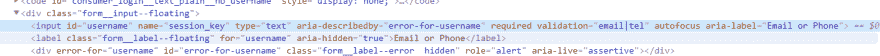
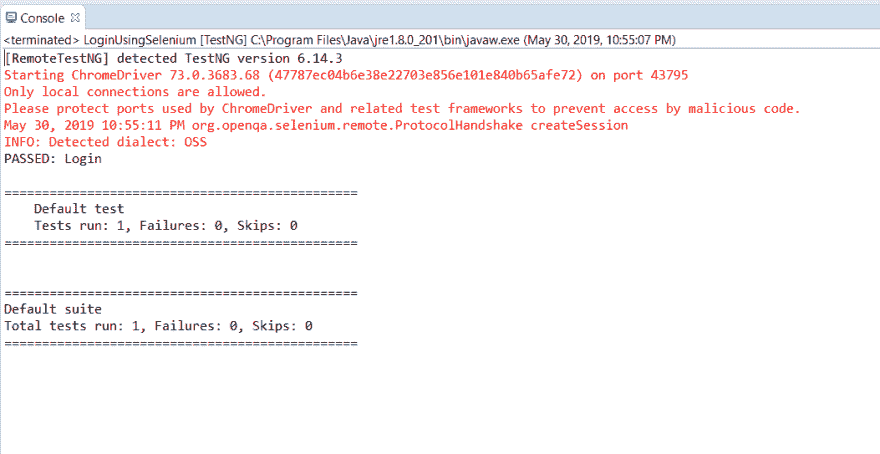
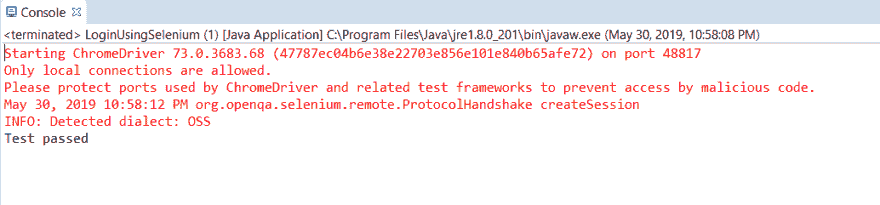
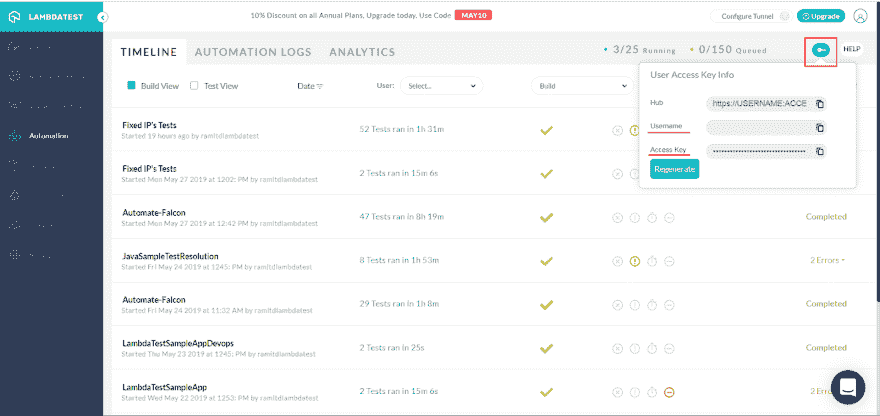
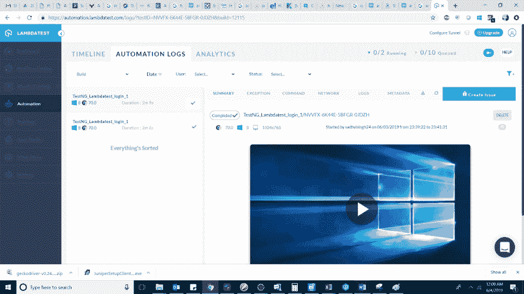

# Selenium Java 教程——如何测试登录过程？

> 原文：<https://dev.to/lambdatest/selenium-java-tutorial-how-to-test-login-process-2987>

自动化测试起初可能听起来像一场噩梦，尤其是当你已经从事手工测试业务相当长时间的时候。看看自动化测试需求的增长速度，网站测试人员不可避免地要深入自动化的河流并开始游泳。成为一名职业游泳运动员需要时间，成为一名成功的自动化测试员也是如此。它需要大量自动化工具和框架的知识和深刻理解。作为自动化测试的初学者，您可能期待接触开源测试框架。这样做之后，接下来的问题是什么？我该如何使用开源工具、框架或平台，我会在这方面帮助你。今天，我们将关注最著名的开源自动化测试框架之一，称为 [Selenium](https://www.lambdatest.com/selenium?utm_source=devto&utm_medium=organic&utm_campaign=sep09_sd&utm_term=sd&utm_content=webpage) 。在这篇 **Selenium Java 教程**中，我将演示一个使用 Java 的 Selenium 登录示例，以帮助您自动化登录过程。

使用 Selenium 和 Java 或任何其他编程语言实现登录过程自动化是成为一名成功的自动化测试人员的第一步。事不宜迟，我们开始吧。

## Selenium Java 教程的一些先决条件

在我们开始学习登录过程的 Selenium Java 教程之前，我们需要了解一些先决条件。首先，所有的应用程序，不管它们面向哪个领域，95%的时间都有一个与之相关的登录功能流。无论是电子商务，银行，医疗，教育等都要求用户登录到应用程序的进一步使用。顾名思义“ **Selenium Java 教程**”，本教程提供了基本的理解，帮助初学者开始使用 Selenium & Java 进行自动化测试。我们将研究一个使用 Java(用于多种技术和领域的最通用的语言之一)的 Selenium 登录示例。为了起步，您需要对 Java 有一个基本的了解。不要因为听到 Java & Selenium 这个词而惊慌失措。我们会一步一步来。那么，如何开始呢？首先，确保您具备使用 Java & Selenium 编写第一个登录脚本的所有先决条件。您需要具备以下条件:

*   从这里下载并安装 JDK(Java 开发工具包)。

*   从官网安装 Eclipse。

*   从这里下载 Selenium Java 客户端版本。

*   驱动程序可执行文件——根据您希望执行脚本的浏览器，您可以选择从这里下载 Selenium 可执行文件。沿着页面往下走，各种浏览器如 Chrome、Mozilla、Opera、Edge 等驱动程序都可以下载，以帮助您执行 Selenium。

仅此而已。打开 eclipse 并创建您的项目。将 Selenium jar 添加到 Java 构建路径中，就可以开始了。有关如何设置项目和 jar 文件的详细信息，请参考以下链接:

## 硒测试用例的基本步骤

在我们使用 Selenium & Java 对登录验证进行自动化测试之前，无论您打算编写哪个测试用例，无论是登录、注销、配置文件、仪表板等等，都需要遵循一些基本步骤。如果您遵循它们，您的自动化套件中就永远不会有不完整的测试用例:

1.  创建 Selenium WebDriver 实例。

2.  如果需要，配置您的浏览器(例如，最大化浏览器，禁用浏览器通知等。).

3.  导航到所需的 URL(网页)。

4.  找到 HTML 元素。

5.  对找到的 HTML 元素执行操作。

6.  验证并确认行动(结束步骤)。

7.  使用测试用例的框架截取屏幕截图并生成报告。

如果您计划为您的组织设计一个自动化测试策略，但是不知道从哪里开始？关注我的博客，从头开始自动化测试。

[](https://res.cloudinary.com/practicaldev/image/fetch/s--5COU1g8J--/c_limit%2Cf_auto%2Cfl_progressive%2Cq_auto%2Cw_880/https://cdn-images-1.medium.com/max/2000/0%2AdqiaYYmSA0dmOZ1K.png)

该认证证明了您对 Selenium 和 Java 的了解，以及您在任何项目的自动化测试方面的专业技能。

下面是来自 LambdaTest 的 Selenium Java 101 认证的简要介绍:

[https://www.youtube.com/embed/vUxfvuAI7kE](https://www.youtube.com/embed/vUxfvuAI7kE)

***使用我们可扩展的云手机[模拟器在线](https://www.lambdatest.com/mobile-emulator-online?utm_source=devto&utm_medium=organic&utm_campaign=sep06_sd&utm_term=sd&utm_content=webpage)此处*** 测试您的手机网站和智能手机应用

## 让我们用 Java 自动化 Selenium 登录

我将在下面的文章中提到的脚本将引用这些步骤。我们不会考虑第七步，因为这需要一篇专门的文章&我计划在我即将发布的博客中这样做，所以请继续关注！现在，让我们详细研究这些步骤，以帮助我们使用 Selenium for login with Java 执行自动化测试:

## 1。创建 Selenium WebDriver 实例

web driver driver = new chrome driver()；

为了在所需的浏览器中启动网站，您需要将系统属性设置为所需浏览器的驱动程序路径。在本 **Selenium Java** 教程中，我们将使用 chromedriver 演示 Selenium Java 登录示例。相同的语法将是:
system . set property(" web driver . chrome . driver "，" Exe 的文件路径")；

## 2。如果需要，配置您的浏览器

根据需要，我们可以配置浏览器。比如在这个 [**Selenium Java](https://www.lambdatest.com/blog/selenium-webdriver-tutorial-with-examples/) 教程**关于 Selenium 用 Java 登录，一个浏览器默认情况下，会是最小化模式，我们可以把浏览器设置在最大化模式。下面是用于相同的语法。
司机管理()。窗口()。最大化()；

配置浏览器的其他方法是设置不同的选项，如禁用信息栏、浏览器通知、添加扩展等。您还可以使用**功能类**在各种浏览器上运行您的脚本，从而有助于跨浏览器测试。

## 3。导航到所需的 URL

非常简单，打开带有所需 URL 的浏览器。你所要做的就是写下下面的语法，然后你就可以在你想要的浏览器中打开你的 URL 了。
driver . get([https://www.linkedin.com/login](https://www.linkedin.com/login))；

## 4。找到 HTML 元素

这是编写 Selenium 脚本的核心。要做到这一点，您需要清楚地了解用于查找 HTML 元素的不同定位器。您可以参考我下面的文章，这些文章讨论了 selenium 中可用的不同定位器，以及如何通过不同的示例定位元素:

*   [Selenium web driver 中的 ID 定位器](https://www.lambdatest.com/blog/making-the-move-with-id-locator-in-selenium-webdriver/)

*   [Selenium web driver 中的名称定位器](https://www.lambdatest.com/blog/how-to-use-name-locator-in-selenium-automation-scripts/)

*   [Selenium web driver 中的标记名定位器](https://www.lambdatest.com/blog/locating-elements-by-tagname-in-selenium/)

*   [Selenium web driver 中的 CSS 选择器](https://www.lambdatest.com/blog/how-pro-testers-use-css-selectors-in-selenium-automation-scripts/)

*   [Selenium web driver 中的 XPath](https://www.lambdatest.com/blog/complete-guide-for-using-xpath-in-selenium-with-examples/)

例如，让我们尝试定位 LinkedIn 登录表单的电子邮件和密码字段

下面是电子邮件输入框的 DOM 结构:

[](https://res.cloudinary.com/practicaldev/image/fetch/s--HERSw-0Y--/c_limit%2Cf_auto%2Cfl_progressive%2Cq_auto%2Cw_880/https://cdn-images-1.medium.com/max/2838/0%2ArnjoS5adMzi4SwRk.png)

可以通过 Selenium WebDriver 中的 ID locator 定位如下:
driver . find element(by . ID(" username "))；

由于这返回了一个 webelement，所以可以将其存储在 webelement 变量中，如下图
web element username = driver . find element(by . id(" username "))；

对于密码和登录按钮字段也是如此

```
driver.findElement(By.id(“password”));

WebElement password=driver.findElement(By.id(“password”));

driver.findElement(By.xpath(“//button[text()=’Sign in’]”));

WebElement login= driver.findElement(By.xpath(“//button[text()=’Sign in’]”)); 
```

Enter fullscreen mode Exit fullscreen mode

## 5。对找到的 HTML 元素执行操作

找到后，您需要执行所需的操作，在我们的例子中是将文本发送到电子邮件和密码字段，然后单击登录按钮。为了用 Java 在 Selenium 登录示例中执行这个动作，我们使用了 Selenium 提供的如下方法，如 **sendKeys** 和 **click** :

```
username.sendKeys(“xyz@gmail.com”);

password.sendKeys(“exampleAboutSelenium123”);

login.click(); 
```

Enter fullscreen mode Exit fullscreen mode

你猜怎么着，你刚刚写完剧本最重要的部分。现在，在本 **Selenium Java** 教程中，您只需要确保这些操作已经成功登录到用户，这是我们使用 Selenium 登录 Java 的脚本创建的最后一步。

## 6。验证&验证动作

为了验证结果，你需要做的就是使用断言。断言对于比较预期结果和实际结果至关重要。几乎与您的测试用例相似，其中每个测试用例都有一个实际的和预期的行为。如果匹配，测试用例通过，如果不匹配，测试用例失败。断言做的完全一样。JUnit 和 TestNG 框架都提供了断言类，您可以选择任何一个。下面的语法将通过使用 Java 执行 Selenium 登录来帮助断言(验证)操作的结果。

Assert.assertEquals(实际字符串，预期字符串)；

因此，在本例中，我们将把我们的实际 url post 登录保存到一个字符串值中，该值为:
String actual URL = "[https://www.linkedin.com/feed/"](https://www.linkedin.com/feed/%E2%80%9D)；

预期的 URL 可以通过下面的方法找到:

string expected URL = driver . getcurrenturl()；

所以你最后的断言会变成:

Assert.assertEquals(actualUrl，expected URL)；

**注意:**为了使用断言，您需要使用 TestNG 或 JUnit ' [@test](https://dev.to/test) '的注释来使断言起作用。如果您现在不想陷入框架关键字的麻烦中，您可以简单地使用“if”语句匹配字符串，并相应地在控制台中打印结果，如下所示:

```
if(actualUrl.equalsIgnoreCase(expectedUrl))
{
System.out.println(“Test passed”)
}
else
{
System.out.println(“Test failed”)
} 
```

Enter fullscreen mode Exit fullscreen mode

答对了。！您已经使用带有 Java 的 Selenium 登录示例执行了自动化测试。

如果您对使用注释感兴趣，请关注我们关于 Selenium Java 教程的博客，在 Selenium 中使用 JUnit 注释并提供示例。

下面是上面使用断言解释的所有语句的集合代码。

```
import java.util.concurrent.TimeUnit;

import org.openqa.selenium.By;
import org.openqa.selenium.WebDriver;
import org.openqa.selenium.WebElement;
import org.openqa.selenium.chrome.ChromeDriver;
import org.testng.Assert;
import org.testng.annotations.Test;

public class LoginUsingSelenium {

[@Test](http://twitter.com/Test)
    public void login() {
        // TODO Auto-generated method stub

        System.setProperty("webdriver.chrome.driver", "path of driver");
        WebDriver driver=new ChromeDriver();
        driver.manage().window().maximize();
        driver.get("[https://www.linkedin.com/login](https://www.linkedin.com/login)");

        WebElement username=driver.findElement(By.id("username"));
        WebElement password=driver.findElement(By.id("password"));
        WebElement login=driver.findElement(By.xpath("//button[text()='Sign in']"));

        username.sendKeys("[example@gmail.com](mailto:example@gmail.com)");
        password.sendKeys("password");
        login.click();

        String actualUrl="[https://www.linkedin.com/feed/](https://www.linkedin.com/feed/)";
        String expectedUrl= driver.getCurrentUrl();

        Assert.assertEquals(expectedUrl,actualUrl);

    }

} 
```

Enter fullscreen mode Exit fullscreen mode

**控制台输出:**

[](https://res.cloudinary.com/practicaldev/image/fetch/s--YeMDOGG7--/c_limit%2Cf_auto%2Cfl_progressive%2Cq_auto%2Cw_880/https://cdn-images-1.medium.com/max/2106/0%2AN8M34zpwiCWP69Ph.png)

下面是上面使用 if 语句解释的所有语句的集合代码:

```
import java.util.concurrent.TimeUnit;

import org.openqa.selenium.By;
import org.openqa.selenium.WebDriver;
import org.openqa.selenium.WebElement;
import org.openqa.selenium.chrome.ChromeDriver;
import org.testng.Assert;

public class LoginUsingSelenium {

public static void main(String[] args) {
        // TODO Auto-generated method stub

        System.setProperty("webdriver.chrome.driver", " path of driver ");
        WebDriver driver=new ChromeDriver();
        driver.manage().window().maximize();
        driver.get("[https://www.linkedin.com/login](https://www.linkedin.com/login)");

        WebElement username=driver.findElement(By.id("username"));
        WebElement password=driver.findElement(By.id("password"));
        WebElement login=driver.findElement(By.xpath("//button[text()='Sign in']"));

        username.sendKeys("[example@gmail.com](mailto:example@gmail.com)");
        password.sendKeys("password");
        login.click();

        String actualUrl="[https://www.linkedin.com/feed/](https://www.linkedin.com/feed/)";
        String expectedUrl= driver.getCurrentUrl();

        if(actualUrl.equalsIgnoreCase(expectedUrl))
        {
            System.out.println("Test passed");
        }
        else
        {
            System.out.println("Test failed");
        }

    }

} 
```

Enter fullscreen mode Exit fullscreen mode

**控制台输出:**

[](https://res.cloudinary.com/practicaldev/image/fetch/s--JcMawfci--/c_limit%2Cf_auto%2Cfl_progressive%2Cq_auto%2Cw_880/https://cdn-images-1.medium.com/max/2068/0%2A58n8XA4XOotPz5Pq.png)

***使用我们可扩展的云手机[模拟器在线](https://www.lambdatest.com/mobile-emulator-online?utm_source=devto&utm_medium=organic&utm_campaign=sep06_sd&utm_term=sd&utm_content=webpage)此处*** 测试您的手机网站和智能手机应用

## 云上动硒试验

Selenium 使自动化测试人员能够快速跟踪他们的工作和测试周期。然而，除了 Selenium WebDriver 的好处之外，还有一些缺点。最突出的包括测试的顺序执行，这对于较大的自动化测试套件来说需要一段时间。记住这一点，Selenium 网格的引入是为了帮助人们并行运行 Selenium 测试。然而，这也有不好的一面&那就是测试覆盖率和 CPU 消耗。您只能对安装在本地计算机上的浏览器执行浏览器兼容性测试。安装众多的浏览器不是一个可行的考虑。

这就是为什么现在都是通过多个浏览器并行地在云上运行 Selenium 测试，以使用 LambdaTest 等工具执行更快的跨浏览器测试。
LambdaTest 是一个跨浏览器测试云，提供一个包含 3000 多个真实浏览器的 Selenium 网格&运行在各种操作系统上的浏览器版本。您可以集成众多 CI/CD 工具&提取 Selenium 测试报告，而无需使用我们的 RESTful API 登录 LambdaTest。

查看 LambdaTest 与多个 CI/CD 工具、项目管理工具、基于 IM 的协作工具的所有集成。

通过定义运行这个脚本的平台、浏览器和版本，我们可以运行在前面的 LambdaTest 小节中使用的相同的登录脚本。这有助于在多种浏览器上运行您的脚本，无论您的项目/产品支持哪种浏览器。

为了用 Java 运行 Selenium 登录脚本，您所要做的就是设置 RemoteWebDriver URL，通过它您将连接到您的 LambdaTest 平台。这个 URL 是您的用户名、访问密钥和 LamdaTest hub URL 的组合。

[](https://res.cloudinary.com/practicaldev/image/fetch/s--_tO2b38j--/c_limit%2Cf_auto%2Cfl_progressive%2Cq_auto%2Cw_880/https://cdn-images-1.medium.com/max/3200/0%2Azt7xtpnpMtqXlG9q.png)

使用期望的功能类，你可以设置平台，如 Windows 8 或 10 或 Mac 等。然后定义您希望运行测试的浏览器及其版本。还可以提供构建名称和其他属性，如视频、截图、日志等。您可以利用我们的 Selenium Desired Capabilities Generator 来获取基于您期望的能力的值。就是这样！现在使用上面定义的相同登录脚本在基于云的平台上运行您的测试。下面是它的参考代码片段:

```
import java.net.URL;
import java.util.concurrent.TimeUnit;

import org.openqa.selenium.By;
import org.openqa.selenium.JavascriptExecutor;
import org.openqa.selenium.WebDriver;
import org.openqa.selenium.WebElement;
import org.openqa.selenium.chrome.ChromeDriver;
import org.openqa.selenium.remote.DesiredCapabilities;
import org.openqa.selenium.remote.RemoteWebDriver;
import org.testng.Assert;
import org.testng.annotations.BeforeClass;
import org.testng.annotations.Test;

public class LoginUsingSelenium {

public RemoteWebDriver driver = null;
    public String url = "[https://www.lambdatest.com/](https://www.lambdatest.com/)";
    public static final String  username= "sadhvisingh24";
    public static final String auth_key = "auth key generated";
    public static final String URL = "[@hub](http://twitter.com/hub).lambdatest.com/wd/hub";
    boolean status = false;

[@Test](http://twitter.com/Test)
    public void login () {
        // TODO Auto-generated method stub
        try {

driver.manage().window().maximize();
            driver.get("[https://www.linkedin.com/login](https://www.linkedin.com/login)");

WebElement username = driver.findElement(By.id("username"));
            WebElement password = driver.findElement(By.id("password"));
            WebElement login = driver.findElement(By.xpath("//button[text()='Sign in']"));

username.sendKeys("linkedin username");
            password.sendKeys("fake password");
            login.click();

String actualUrl = "[https://www.linkedin.com/feed/](https://www.linkedin.com/feed/)";
            String expectedUrl = driver.getCurrentUrl();

if (actualUrl.equalsIgnoreCase(expectedUrl)) {
                System.out.println("Test passed");
                status = true; //Lambda status will be reflected as passed
              } else {
                System.out.println("Test failed"); //Lambda status will be reflected as passed

}
        } catch (Exception e) {
            System.out.println(e.getMessage());
        }
        finally {
            tearDown();
        }

}

[@BeforeClass](http://twitter.com/BeforeClass)
    public void setUp() {
        DesiredCapabilities capabilities = new DesiredCapabilities();
        capabilities.setCapability("browserName", "chrome");
        capabilities.setCapability("version", "72.0");
        capabilities.setCapability("platform", "win8"); // If this cap isn't specified, it will just get the any available one
        capabilities.setCapability("build", "TestNG_login_1");
        capabilities.setCapability("name", "TestNG_login_1");
        capabilities.setCapability("network", true); // To enable network logs
        capabilities.setCapability("visual", true); // To enable step by step screenshot
        capabilities.setCapability("video", true); // To enable video recording
        capabilities.setCapability("console", true); // To capture console logs
        try {

driver = new RemoteWebDriver(new URL("https://" + username + ":" + auth_key + URL), capabilities);

} catch (Exception e) {

System.out.println("Invalid grid URL" + e.getMessage());
        }

}
    private void tearDown () {
        if (driver != null) {
            ((JavascriptExecutor) driver).executeScript("lambda-status=" + status); //Lambda status will be reflected as either passed/ failed

driver.quit();

System.out.println("The setup process is completed");

}
    }
} 
```

Enter fullscreen mode Exit fullscreen mode

开始您的测试自动化。LambdaTest 为您提供测试运行的状态及其相应的视频、日志、网络细节以及截图。

下面是我们在 LambdaTest Selenium Grid 上执行 Selenium 脚本的截图。

[](https://res.cloudinary.com/practicaldev/image/fetch/s--n5NyBtVp--/c_limit%2Cf_auto%2Cfl_progressive%2Cq_auto%2Cw_880/https://cdn-images-1.medium.com/max/3840/0%2Ah8J2tJcMLJy6p2ww.png)

***在 3000+真实浏览器和操作系统在线*** 上进行自动化的、现场互动的跨浏览器[测试 web](https://www.lambdatest.com/?utm_source=devto&utm_medium=organic&utm_campaign=sep06_sd&utm_term=sd&utm_content=webpage)

## 这是怎么回事？

太棒了。您已经使用 Selenium & Java 成功地执行了登录流程的自动化测试。你是怎么找到这个 **Selenium Java** 登录流程教程的？请在下面的评论区告诉我你的想法。我期待你的回复。测试愉快！🙂