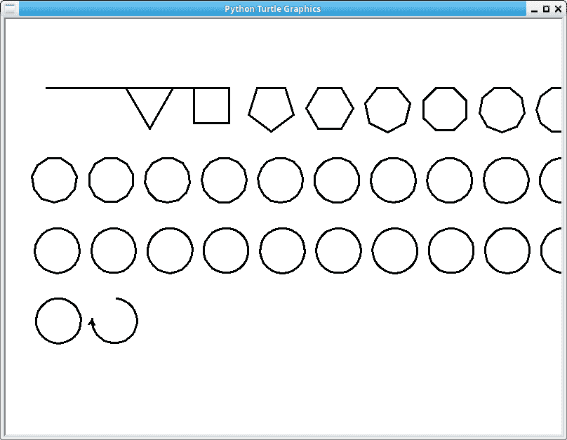

# 用蟒蛇龟画出所有形状

> 原文：<https://dev.to/petercour/draw-all-shapes-with-python-turtle-4i34>

你可以用 Python Turtle 画出所有可能的形状。Turtle 是一个 Python 模块绘制。

为此，取 360 度，除以边数。海龟会转多少圈。

一边，它会画一条线。有三条边，它会画一个三角形。有四条边的正方形等等。

[](https://res.cloudinary.com/practicaldev/image/fetch/s--tagMk_ru--/c_limit%2Cf_auto%2Cfl_progressive%2Cq_auto%2Cw_880/https://thepracticaldev.s3.amazonaws.com/i/pzeds56w9j7vkmefl4kz.png)

在如下所示的代码中:

```
#!/usr/bin/python3
def draw_shape(sides):
    t.pensize(3)
    t.pencolor("black")
    for i in range(sides):
        t.right(360/sides)
        t.fd(200/sides) 
```

所以形状是 360/边。200/边是什么？这就是形状的大小。自然，形状会随着边的增加而变大。所以根据边来缩小。边越多，乌龟走的步数越少。

现在为了不把所有东西都画在彼此的上面，乌龟需要在空间上移动。我们简单地用 x，y 移动把每个空间放在一个独特的位置。

```
#!/usr/bin/python3

import turtle as t
t.setup(800,600,200,200)

def draw_shape(sides):
    t.pensize(3)
    t.pencolor("black")
    for i in range(sides):
        t.right(360/sides)
        t.fd(200/sides)

x = -400
y = 200
for i in range(0,100):
    t.up()
    t.goto(x,y)
    t.down()
    draw_shape(i)
    x = x + 80
    print(x)
    if x > 400:
        x = x - 800
        y = y - 100
t.done() 
```

咻，那很有趣:)你看到所有这些形状是如何关联的了吧。只有边数把一条线变成三角形、正方形、圆形。有趣不是吗？

相关链接:

*   [Python 教程](https://pythonbasics.org)
*   [Python 的练习](https://pythonbasics.org/exercises/)
*   [Python 文章](https://pythonprogramminglanguage.com)