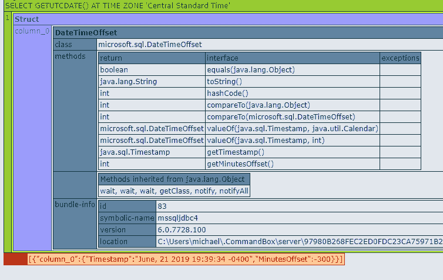

# 在 Lucee 中存储和使用 DateTimeOffsets

> 原文：<https://dev.to/mikeborn/storing-and-using-datetimeoffsets-in-lucee-m8>

最近在 [Impelos](https://impelos.com/) 我开始使用 SQL Server 的 [DateTimeOffset](https://docs.microsoft.com/en-us/sql/t-sql/data-types/datetimeoffset-transact-sql?view=sql-server-2017) 字段存储日期，它允许我们存储嵌入了 UTC 偏移量的日期和时间**。不幸的是，我遇到了 Lucee 对数据类型支持的几个问题。**

这篇文章详细介绍了我如何解决这些问题，甚至详细介绍了如何将日期格式化为 ISO 8601 JS 安全格式。

## 问题一:UTC 偏移量截断

我遇到的关于`DateTimeOffset`字段的第一个问题是在插入/更新时丢失了 UTC 偏移量。使用`datetime` cfsqltype 时，UTC 偏移量被截断。

所以我们得到的不是`2019-07-07 13:22:01 -5:00`，而是`2019-07-07 13:22:01 +0:00`。请注意，UTC 偏移量更改为 UTC +0，但日期从不转换为 UTC +0 或 GMT。这将导致插入的时间偏离 UTC 偏移量的完整值。在 UTC +1 的晚上 7 点插入一个日期时间，它指示的是 GMT 的晚上 7 点，实际上是 UTC +1 的晚上 8 点。

我选择的解决方法是使用一个`varchar` cfsqltype，并手动格式化该值以适应 MSSQL 的`datetimeoffset`格式:`YYYY-MM-DD hh:mm:ss[.nnnnnnn] [{+|-}hh:mm]`。

这里有一个使用`QueryExecute()` :
的简单例子

```
var params = [
    datesaved: {
        value: dateTimeFormat(now(), "YYYY-mm-dd HH:nn:ss XXX"),
        cfsqltype: "varchar"
    },
    title: "My crazy title"
];
queryExecute( "UPDATE blogposts SET title=:title, datesaved=:datesaved", params ); 
```

这对我很有效。注意`XXX`是一个目前 CFDocs.org 上没有记录的掩码序列。我在 Lucee 使用的 [Java SimpleDateFormat](https://docs.oracle.com/javase/7/docs/api/java/text/SimpleDateFormat.html) 类的文档页面上找到了这个。我计划很快在 CFDocs 上记录下来！

## 问题二:DateTimeOffset 作为 Java 对象检索

下面是第二个问题。查询 datetimeoffset 字段或值实际上会返回一个...*等一下*...Java 对象。没错。

这样一个简单的查询:

```
var query = queryExecute(" SELECT getUTCDate()
    AT TIME ZONE 'Central Standard Time' "); 
```

返回如下所示的奇妙的小物体:

[](https://res.cloudinary.com/practicaldev/image/fetch/s--EnCHASdG--/c_limit%2Cf_auto%2Cfl_progressive%2Cq_auto%2Cw_880/https://thepracticaldev.s3.amazonaws.com/i/wvwy9y3xlbno2pixrstd.png)

如果你想知道，将它序列化为 JSON 并没有像我想象的那样爆炸(至少在 ColdBox 中是这样。我承认我没有在本地人身上尝试过。)这个日期时间 java 对象呈现为以下结构:

```
"column_0": {
    "Timestamp": "June, 13 2019 07:55:00 -0400",
    "MinutesOffset": 0
} 
```

我试图使用`toString`方法:
将它转换成某种可用的日期格式

```
for ( var row in query ) {
    row["datesaved"] = row["datesaved"].toString()
} 
```

但是我很快就收到抱怨，说前端不能解析我的日期字符串。换句话说，`row["datesaved"].toString()`没有输出 JS 安全日期。

## 用 ISO 8601 格式格式化日期

JS 到底需要什么样的日期格式？根据堆栈溢出:

> JavaScript 官方支持 ISO 8601 扩展格式的简化。格式如下:YYYY-MM-DDTHH:mm:ss.sssZ。字母 T 是日期/时间分隔符，Z 是时区偏移量，指定为 UTC)或+或-后跟时间表达式 HH:mm。该格式的某些部分(如时间)可以省略。

*[回答“JavaScript 中什么是有效的日期时间字符串？”](https://stackoverflow.com/a/51715260/1525594)T3】*

将日期整理成适当的 ISO 8601 格式的简单方法如下:

```
DateTimeFormat(now(), "YYYY-mm-dd'T'HH:nn:ss.SSSXXX"); 
```

同样，我们使用`XXX`掩码输出类似于`-5:00`的 UTC 偏移量，并使用单引号对日期字符串中间的`T`进行转义。这应该会显示出一个合适的 ISO 8601 日期，如下所示:`2019-07-05T17:16:29.029Z`。我仍然有点不确定毫秒，因为它们对我来说不太合适，但我不认为毫秒精度非常重要，至少现在是这样。

至此，我的约会灾难暂时结束了。找到我不知道的额外的日期格式掩码很有帮助，而在 Lucee DateTimeOffset 支持中找到两年前的错误有点令人沮丧。

***注:**这两个问题都提到了[卢斯·吉拉的第 1680 号票](https://luceeserver.atlassian.net/browse/LDEV-1680)。*