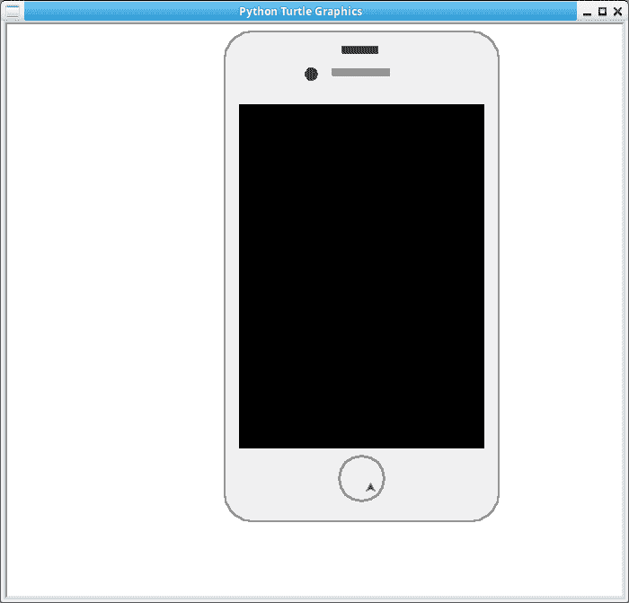
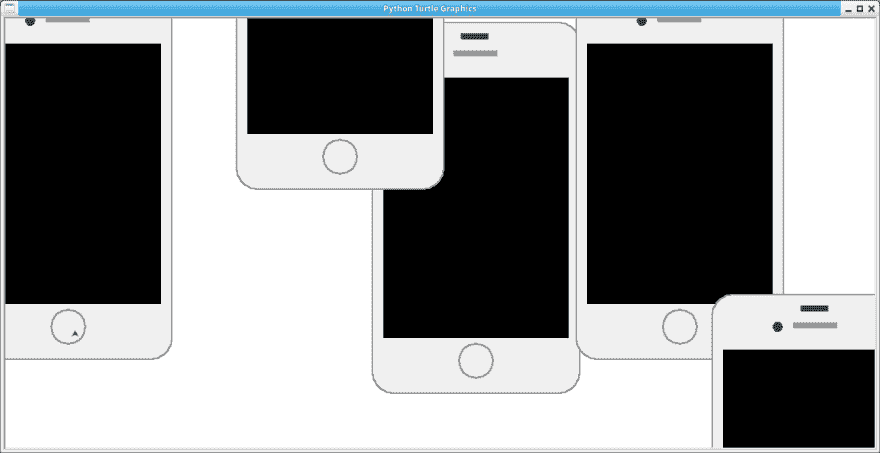

# 用乌龟画手机

> 原文：<https://dev.to/petercour/draw-phone-with-turtle-2nhm>

海龟模块让你画画。最初它是为孩子们设计的，但它是学习编程概念的有用工具。

要加载模块，只需输入

```
import turtle 
```

然后就可以开始画画了。你得到一张纸，可以移动笔。

例如，你可以用乌龟画一个手机。比如截图中显示的手机，它是用基本形状(矩形、圆形和所有形状)制作的

[](https://res.cloudinary.com/practicaldev/image/fetch/s--3jD4cIfn--/c_limit%2Cf_auto%2Cfl_progressive%2Cq_auto%2Cw_880/https://thepracticaldev.s3.amazonaws.com/i/2g4dk1ug1h0ifsn1mxcl.png)

```
#!/usr/bin/python3
import turtle

def round_rectangle(length,high,cor_angle,cor_rad):    
    for i in range(2):
        turtle.fd(high)
        turtle.circle(cor_rad,cor_angle)
        turtle.fd(length)
        turtle.circle(cor_rad,cor_angle)      

def main():
    turtle.setup(1300,800,0,0)
    pythonsize=3
    turtle.pensize(pythonsize)
    turtle.speed(10)
    turtle.seth(90)

    turtle.pencolor("#8E8e8e")
    turtle.penup()  
    turtle.goto(202,-202)
    turtle.pendown()
    round_rectangle(244,484,90,30)

    turtle.penup()  
    turtle.goto(200,-200)
    turtle.pendown()
    turtle.begin_fill()
    turtle.color("#F0F0F0")
    round_rectangle(240,480,90,30)
    turtle.end_fill()

    turtle.pencolor("black")
    turtle.penup()  
    turtle.goto(185,-150)
    turtle.pendown()
    turtle.begin_fill()
    turtle.color("black")
    round_rectangle(270,380,90,0)
    turtle.end_fill()

    turtle.penup()  
    turtle.goto(80,265)
    turtle.pendown()
    turtle.begin_fill()
    turtle.color("#9d9d9d")
    round_rectangle(60,4,90,1)
    turtle.end_fill()

    turtle.penup()  
    turtle.goto(67,290)
    turtle.pendown()
    turtle.begin_fill()
    turtle.color("#3c3c3c")
    round_rectangle(36,4,90,1)
    turtle.end_fill()

    turtle.penup()  
    turtle.goto(0,265)
    turtle.pendown()
    turtle.begin_fill()
    turtle.color("#3c3c3c")
    turtle.circle(6,360)
    turtle.end_fill()

    turtle.pencolor("#9d9d9d")
    turtle.penup()  
    turtle.goto(75,-185)
    turtle.pendown()
    turtle.circle(25,360)

    turtle.pencolor("#9d9d9d")
    turtle.penup()  
    turtle.goto(60,-190)
    turtle.pendown()    

    turtle.exitonclick()

main() 
```

你可以画很多，如果你把它包装在一个函数里

[](https://res.cloudinary.com/practicaldev/image/fetch/s--5VMB7qFa--/c_limit%2Cf_auto%2Cfl_progressive%2Cq_auto%2Cw_880/https://thepracticaldev.s3.amazonaws.com/i/0cgbstdzg09w6fuhfetf.png)

像这样:

```
#!/usr/bin/python3
import turtle
turtle.setup(1300,800,0,0)

def round_rectangle(length,high,cor_angle,cor_rad):    
    for i in range(2):
        turtle.fd(high)
        turtle.circle(cor_rad,cor_angle)
        turtle.fd(length)
        turtle.circle(cor_rad,cor_angle)      

def draw_phone(x,y):    
    pythonsize=3
    turtle.pensize(pythonsize)
    turtle.speed(30)
    turtle.seth(90)

    turtle.pencolor("#8E8e8e")
    turtle.penup()  
    turtle.goto(x+202,y+-202)
    turtle.pendown()
    round_rectangle(244,484,90,30)

    turtle.penup()  
    turtle.goto(x+200,y+-200)
    turtle.pendown()
    turtle.begin_fill()
    turtle.color("#F0F0F0")
    round_rectangle(240,480,90,30)
    turtle.end_fill()

    turtle.pencolor("black")
    turtle.penup()  
    turtle.goto(x+185,y+-150)
    turtle.pendown()
    turtle.begin_fill()
    turtle.color("black")
    round_rectangle(270,380,90,0)
    turtle.end_fill()

    turtle.penup()  
    turtle.goto(x+80,y+265)
    turtle.pendown()
    turtle.begin_fill()
    turtle.color("#9d9d9d")
    round_rectangle(60,4,90,1)
    turtle.end_fill()

    turtle.penup()  
    turtle.goto(x+67,y+290)
    turtle.pendown()
    turtle.begin_fill()
    turtle.color("#3c3c3c")
    round_rectangle(36,4,90,1)
    turtle.end_fill()

    turtle.penup()  
    turtle.goto(x+0,y+265)
    turtle.pendown()
    turtle.begin_fill()
    turtle.color("#3c3c3c")
    turtle.circle(6,360)
    turtle.end_fill()

    turtle.pencolor("#9d9d9d")
    turtle.penup()  
    turtle.goto(x+75,y+-185)
    turtle.pendown()
    turtle.circle(25,360)

    turtle.pencolor("#9d9d9d")
    turtle.penup()  
    turtle.goto(x+60,y+-190)
    turtle.pendown()    

def main():
    draw_phone(0,0)
    draw_phone(300,50)
    draw_phone(500,-400)
    draw_phone(-200,300)
    draw_phone(-600,50)
    turtle.exitonclick()

main() 
```

学 Python？以下是一些 Python 资源:

*   [Python 基础教程](https://pythonbasics.org)
*   [Python 的练习](https://pythonbasics.org/exercises/)
*   [Python 教程](https://pythonprogramminglanguage.com)
*   [官方 Python 网站](https://python.org)