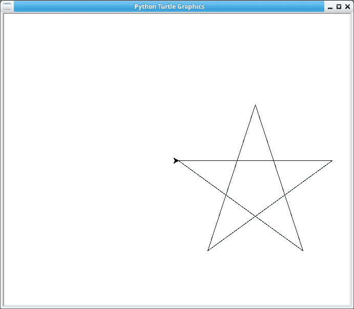

# 用蟒蛇龟画星星

> 原文：<https://dev.to/petercour/draw-stars-with-python-turtle-3eme>

海龟模块让你画画。这是一个儿童模块，可以让海龟移动并留下踪迹。

它就像一张纸，你可以在里面移动一支笔。默认情况下，笔在纸上。

让我们画星星，下面的程序有 5 个面。

```
#!/usr/bin/python3
import turtle

def main():
    count = 1
    while count <= 5:
        turtle.forward(300)
        turtle.right(144)
        count = count + 1
        print(count)
    turtle.exitonclick()

if __name__ == "__main__":
    main() 
```

然后

[](https://res.cloudinary.com/practicaldev/image/fetch/s--tFxHs94B--/c_limit%2Cf_auto%2Cfl_progressive%2Cq_auto%2Cw_880/https://thepracticaldev.s3.amazonaws.com/i/zci0yph1mpg6333aiufb.png)

这是一个有五个面的星星。6 面呢？它可以由两个三角形组成。因为它们不是相连的三角形，所以笔需要上下移动。

```
#!/usr/bin/python3
import turtle

def main():
    count = 1
    while count <= 3:
        turtle.forward(300)
        turtle.right(120)
        count = count + 1
        print(count)

    turtle.penup()
    turtle.goto( turtle.pos() + (0,-160) )
    turtle.pendown()

    count = 1
    while count <= 3:
        turtle.forward(300)
        turtle.right(-120)
        count = count + 1
        print(count)

    turtle.exitonclick()

if __name__ == "__main__":
    main() 
```

然后:

[](https://res.cloudinary.com/practicaldev/image/fetch/s--U0FPspwl--/c_limit%2Cf_auto%2Cfl_progressive%2Cq_auto%2Cw_880/https://thepracticaldev.s3.amazonaws.com/i/gyltcijr5x82qh46n3wr.png)

这就是用乌龟画星星的方法。如果你想要一个挑战，试着用不同数量的线条来画它。

Python 资源:

*   [海龟网站](http://pythonturtle.org/)
*   [Python 教程](https://pythonbasics.org)
*   [Python 练习](https://pythonbasics.org/exercises/)