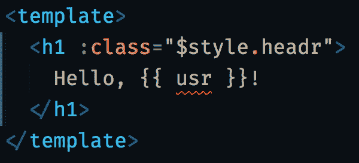
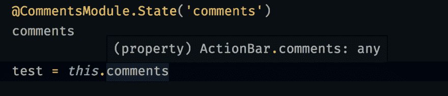
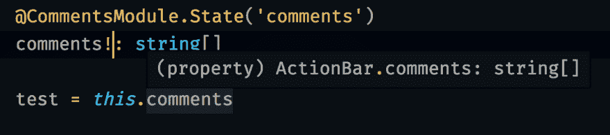
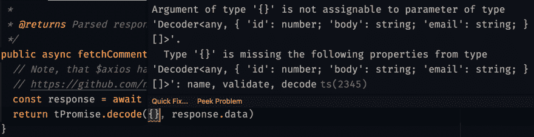
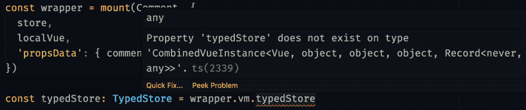
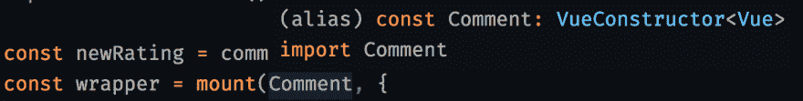

# 真的打字 Vue

> 原文：<https://dev.to/wemake-services/really-typing-vue-6j2>

*最初发表于我的博客*:【https://sobolevn.me/2019/06/really-typing-vue T2】

inb4:这不是另一个用 Vue 和 TypeScript 教程“设置”新项目。让我们深入探讨更复杂的话题吧！

`typescript`很牛逼。`Vue`就是牛逼。毫无疑问，很多人[试图将它们捆绑在一起](https://sobolevn.me/2019/03/from-flow-to-typescript)。但是，由于不同的原因，很难**真正**打出你的`Vue` app。让我们找出问题是什么，可以做些什么来解决它们(或者至少将影响降到最低)。

## TLDR

我们有[这个很棒的模板](https://github.com/wemake-services/wemake-vue-template)，里面的`Nuxt`、`Vue`、`Vuex`和`jest`已经全部打好了。只需安装它，一切都会为您覆盖。前往[文档](https://wemake-services.gitbook.io/wemake-vue-template/)了解更多信息。

正如我所说，我不打算指导您完成基本设置，原因有三:

1.  有很多关于它的现有教程
2.  有很多工具只需点击一下就可以开始使用，比如`Nuxt`和`vue-cli`的`typescript`插件
3.  我们已经有了 [`wemake-vue-template`](https://github.com/wemake-services/wemake-vue-template) ，我将要谈到的每一个细节都已经包括在内了

## 组件类型化

当你开始使用`Vue`和`typescript`并且已经输入了你的类组件之后，第一个被打破的期望是`<template>`和`<style>`标签仍然没有被输入。让我给你看一个例子:

```
<template>
  <h1 :class="$style.headr">
    Hello, {{ usr }}!
  </h1>
</template>

<script lang="ts">
import Vue from 'vue'
import Component from 'vue-class-component'
import { Prop } from 'vue-property-decorator'

@Component({})
export default class HelloComponent extends Vue {
  @Prop()
  user!: string
}
</script>

<style module>
.header { /* ... */ }
</style> 
```

我这里打错了两个错别字:`{{ usr }}`代替了`{{ user }}`和`$style.headr`代替了`$style.header`。`typescript`会把我从这些错误中拯救出来吗？不，不会的。

可以做些什么来修复它？嗯，有几个黑客。

### 键入模板

你可以使用带有`vetur.experimental.templateInterpolationService`选项的`Vetur`对你的模板进行类型检查。是的，这只是基于编辑器的检查，还不能在配置项中使用。但是，`Vetur`团队正在努力提供一个 CLI 来实现这一点。跟踪[原刊](https://github.com/vuejs/rfcs/issues/64#issuecomment-505990139)有兴趣的话。

[](https://res.cloudinary.com/practicaldev/image/fetch/s--Ohi_kjct--/c_limit%2Cf_auto%2Cfl_progressive%2Cq_auto%2Cw_880/https://thepracticaldev.s3.amazonaws.com/i/xqhobu1d7td40jxru2gn.png)

第二个选项是用`jest`进行两次写快照测试。它将捕获许多基于模板的错误。而且维护费用也很便宜。

因此，这两个工具的结合为您提供了一个良好的开发人员体验，快速的反馈和一个可靠的方法来捕捉 CI 中的错误。

### 打字风格

键入`css-module` s 也被几个外部工具覆盖:

*   [CSS 模块加载器的类型化](https://github.com/Jimdo/typings-for-css-modules-loader)
*   [CSS-模块-类型脚本-加载器](https://github.com/seek-oss/css-modules-typescript-loader)

这些工具的主要思想是获取`css-module`然后用它们创建`.d.ts`声明文件。然后你的风格就会完全定型。对于`Nuxt`或`Vue`仍未实现，但您可以跟踪[这一期](https://github.com/nuxt/nuxt.js/issues/5426)以取得进展。

然而，我个人并没有在我的项目中使用这些工具。它们可能对有大量代码库和许多风格的项目有用，但是我对快照很满意。

带有可视化回归测试的样式指南也很有帮助。 [`@storybook/addon-storyshots`](https://www.npmjs.com/package/@storybook/addon-storyshots) 就是这种手法的一个很好的例子。

## Vuex

下一件大事是`Vuex`。它有一些内置的输入复杂性:

```
const result: Promise<number> = this.$store.dispatch('action_name', { payload: 1 }) 
```

问题是`'action_name'`可能不存在，接受其他参数，或者返回不同的类型。这不是你对全类型应用程序的期望。

现有的解决方案有哪些？

### vuex-class

[`vuex-class`](https://github.com/ktsn/vuex-class) 是一组装饰器，允许从基于类的组件轻松访问`Vuex`内部。

但是，它[不是类型安全的](https://github.com/ktsn/vuex-class/issues/2)，因为它不能干扰状态、getters、突变和动作的类型。

[](https://res.cloudinary.com/practicaldev/image/fetch/s--iiG0q7Ra--/c_limit%2Cf_auto%2Cfl_progressive%2Cq_auto%2Cw_880/https://thepracticaldev.s3.amazonaws.com/i/2fd8fpvpta6a7qqar3x5.png)

当然，您可以手动注释属性类型。

[](https://res.cloudinary.com/practicaldev/image/fetch/s--nGdy-e67--/c_limit%2Cf_auto%2Cfl_progressive%2Cq_auto%2Cw_880/https://thepracticaldev.s3.amazonaws.com/i/3xcb8k642a2e4lhek6ao.png)

但是，当您的状态、getters、突变或动作的真实类型将发生变化时，您该怎么办呢？您将有一个隐藏的类型不匹配。

### vuex-simple

这就是`vuex-simple`帮助我们的地方。它实际上提供了一种完全不同的方式来编写你的`Vuex`代码，这就是它使类型安全的原因。让我们来看看:

```
import { Action, Mutation, State, Getter } from 'vuex-simple'

class MyStore {

  // State

  @State()
  public comments: CommentType[] = []

  // Getters

  @Getter()
  public get hasComments (): boolean {
    return Boolean(this.comments && this.comments.length > 0)
  }

  // Mutations

  @Mutation()
  public setComments (payload: CommentType[]): void {
    this.comments = updatedComments
  }

  // Actions

  @Action()
  public async fetchComments (): Promise<CommentType[]> {
    // Calling some API:
    const commentsList = await api.fetchComments()
    this.setComments(commentsList) // typed mutation
    return commentsList
  }
} 
```

稍后这个类型化的模块可以注册到你的`Vuex`中，就像这样:

```
import Vue from 'vue'
import Vuex from 'vuex'
import { createVuexStore } from 'vuex-simple'

import { MyStore } from './store'

Vue.use(Vuex)

// Creates our typed module instance:
const instance = new MyStore()

// Returns valid Vuex.Store instance:
export default createVuexStore(instance) 
```

现在，我们有了一个 100%原生的`Vuex.Store`实例，以及与之捆绑的所有类型信息。要在组件中使用这种类型化存储，我们只需编写一行代码:

```
import Vue from 'vue'
import Component from 'nuxt-class-component'
import { useStore } from 'vuex-simple'

import MyStore from './store'

@Component({})
export default class MyComponent extends Vue {
  // That's all we need!
  typedStore: MyStore = useStore(this.$store)

  // Demo: will be typed as `Comment[]`:
  comments = typedStore.comments
} 
```

现在我们已经键入了可以在我们的项目中安全使用的`Vuex`。
当我们在我们的商店定义中改变一些东西时，它会自动反映到使用这个商店的组件中。如果出现故障，我们会尽快知道。

也有不同的库做同样的事情，但是有不同的 API。选择最适合自己的。

## API 调用

当我们正确设置了`Vuex`之后，我们需要用数据填充它。
让我们再来看看我们的动作定义:

```
@Action()
public async fetchComments (): Promise<CommentType[]> {
  // Calling some API:
  const commentsList = await api.fetchComments()
  // ...
  return commentsList
} 
```

我们怎么知道它真的会返回一个`CommentType`列表，而不是一个`number`或一堆`AuthorType`实例？

我们无法控制服务器。服务器可能真的违反了合同。或者我们可以简单地传递错误的`api`实例，在 URL 中打个错别字，等等。

怎么才能安全？我们可以使用运行时类型！我来给你介绍一下[`io-ts`](https://github.com/gcanti/io-ts):

```
import * as ts from 'io-ts'

export const Comment = ts.type({
  'id': ts.number,
  'body': ts.string,
  'email': ts.string,
})

// Static TypeScript type, that can be used as a regular `type`:
export type CommentType = ts.TypeOf<typeof Comment> 
```

我们在这里做什么？

1.  我们用字段定义了一个`ts.type`实例，当我们从服务器收到响应时，需要在运行时检查这些字段
2.  我们定义了一个在注释中使用的静态类型，没有任何额外的样板文件

稍后我们可以在我们的`api`调用中使用它:

```
import * as ts from 'io-ts'
import * as tPromise from 'io-ts-promise'

public async fetchComments (): Promise<CommentType[]> {
  const response = await axios.get('comments')
  return tPromise.decode(ts.array(Comment), response.data)
} 
```

在 [`io-ts-promise`](https://github.com/aeirola/io-ts-promise) 的帮助下，如果来自服务器的响应与`ts.array(Comment)`类型不匹配，我们可以返回一个处于失败状态的`Promise`。这真的像是一种验证。

```
fetchComments()
   .then((data) => /* ... */
   .catch(/* Happens with both request failure and incorrect response type */) 
```

此外，返回类型注释与`.decode`方法同步。你不能把随机的废话放在那里:

[](https://res.cloudinary.com/practicaldev/image/fetch/s--96uhGWfQ--/c_limit%2Cf_auto%2Cfl_progressive%2Cq_auto%2Cw_880/https://thepracticaldev.s3.amazonaws.com/i/jcfwd5frskia9b1fccxq.png)

通过结合运行时和静态检查，我们可以确保我们的请求不会因为类型不匹配而失败。
但是，为了 100%确定一切正常，我推荐使用基于契约的测试:看看 [`pact`](https://github.com/pact-foundation) 作为例子。并且用 [`Sentry`](https://docs.sentry.io/platforms/javascript/vue/) 监控你的 app。

## 视图路由器

下一个问题是`this.$router.push({ name: 'wrong!' })`没有按照我们想要的方式工作。

我想说的是，如果编译器警告我们正在向错误的方向行进，而这条路线并不存在，那就太好了。
但是，这是不可能的。而且也没什么可做的:有很多动态路由、正则表达式、回退、权限等最终都会被破坏。唯一的选择是测试应用程序中的每个`this.$router`调用。

## 视图-测试-有用

谈到考试，我没有任何借口，更不用说打字也有问题。

当我们试图用`typedStore`属性测试我们新的闪亮组件时，我们会发现根据`typescript`我们实际上不能这样做:

[](https://res.cloudinary.com/practicaldev/image/fetch/s--YIBlQlKh--/c_limit%2Cf_auto%2Cfl_progressive%2Cq_auto%2Cw_880/https://thepracticaldev.s3.amazonaws.com/i/stvaddcj8yg8uz8eh9r0.png)

为什么会这样？发生这种情况是因为`mount()`调用不知道任何关于组件类型的信息，因为默认情况下所有组件都有一个`VueConstructor<Vue>`类型:

[](https://res.cloudinary.com/practicaldev/image/fetch/s--gmPEcFYz--/c_limit%2Cf_auto%2Cfl_progressive%2Cq_auto%2Cw_880/https://thepracticaldev.s3.amazonaws.com/i/zfvrvtjfzrc88bmukms2.png)

这就是所有问题的来源。能做些什么？
您可以使用 [`vuetype`](https://github.com/ktsn/vuetype) 来产生`YouComponent.vue.d.ts`类型，这将告诉您的测试所安装组件的确切类型。

您也可以跟踪[这一期](https://github.com/vuejs/vue-test-utils/issues/255#issuecomment-356730130)的进度。

但是，我不喜欢这个主意。这些是测试，它们可能会失败。没什么大不了的。
这就是我坚持`(wrapper.vm as any).whatever`方法的原因。这为我节省了大量编写测试的时间。但是稍微破坏了开发者的体验。

在此做出您自己的决定:

*   一路使用`vuetype`
*   将它部分应用到测试量最大的最重要的组件上，并定期更新
*   使用`any`作为退路

## 结论

在过去几年里，`Vue`生态系统中`typescript`的平均支持水平有所提高:

*   `Nuxt`首次推出`nuxt-ts`，现在默认推出`ts`版本
*   `Vue@3`将增强对`typescript`的支持
*   更多的第三方应用和插件将提供类型定义

但是，它现在已经可以生产了。这些只是需要改进的地方！编写类型安全的`Vue`代码确实改善了你的开发体验，让你在把繁重的工作留给编译器的同时专注于重要的事情。

你最喜欢的输入`Vue`应用的技巧和工具是什么？大家在评论区讨论一下吧。