# 解释(并庆祝)我的第一个 Twitter 机器人

> 原文：<https://dev.to/maxwell_dev/explaining-and-celebrating-my-first-twitter-bot-gpm>

几个月前，我在推特上发布了这个绝对真实的声明。

> Max Anton ucci[@ Maxwell _ dev](https://dev.to/maxwell_dev)表白时间:我的秘密颠覆目标是让互联网淹没在尽可能多的动漫艺术品中。编程和博客只是这方面的前沿。2019 年 4 月 22 日上午 11:10

在过去的一年里，我与动漫相关的副业项目推动了这个情节的发展:

1.  每天早上从一个动漫图像数据库中抓取一些给我发邮件。
2.  将这些抓取的数据链接到一个定制的 API 端点来显示随机图像。
3.  利用这个 API 端点让[成为动漫报价镜像制作者](http://www.quotemaker.maxwellantonucci.com/)。

我在这个滑坡上采取的下一步行动包括:

1.  创建一个整天在 Twitter 上分享随机动漫引用图片的机器人。

上周，这个愿景终于从幻想变成了现实，[@ AnimeQuoteImage 机器人诞生了](https://twitter.com/AnimeQuoteImage)！是的，我现在用机器人来满足我的动漫瘾。

为了庆祝我在通往书呆子收容所的道路上迈出的最新一步，我想分享它是如何工作的基础知识以及迄今为止我最喜欢的作品。

## 机器人如何工作

如果你想查看实际代码，你可以查看带有机器人代码的开源 repo】。

为了更好地理解 bot，它运行在 Node 上，并使用一些第三方 JavaScript 模块。我加入了粗糙的卡通视觉效果来满足需要和无聊。

该机器人使用木偶师在一个无头的 Chrome 浏览器中打开[我的动漫报价器](http://www.quotemaker.maxwellantonucci.com/)。它被编程为从一个随机的图像，一个随机的报价开始，并从可用的(配色方案，过滤器，对齐等)中随机选择报价的样式。

Puppeteer 在一个 700 乘 700 像素的窗口中调整浏览器的大小，这使得随机引用正好填充它，并截图。它还从 DOM 中获取引用的文本和作者。

Node 将这些信息传递给 Twit，Twit 是一个流行的使用 Twitter API 的节点插件。它用图片、引用和作者组成一条推文，然后发送出去。

[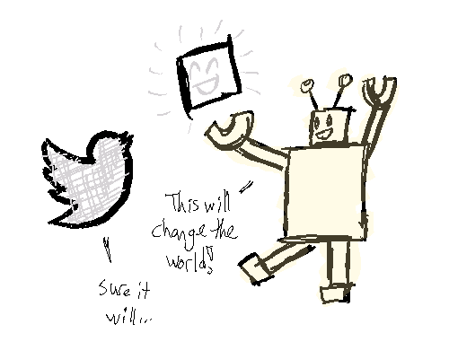](https://res.cloudinary.com/practicaldev/image/fetch/s--5w2NTYFQ--/c_limit%2Cf_auto%2Cfl_progressive%2Cq_auto%2Cw_880/https://thepracticaldev.s3.amazonaws.com/i/57vq7ro7uguvcgxym42e.png)

所有这些都交给 Heroku，它使用 Heroku Scheduler 插件每 30 分钟重新运行一次所有这些步骤。

[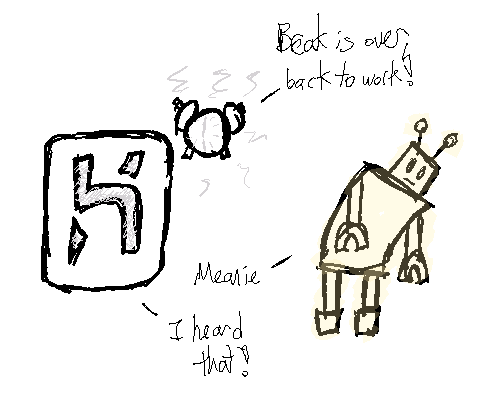](https://res.cloudinary.com/practicaldev/image/fetch/s--Ya2aT1oA--/c_limit%2Cf_auto%2Cfl_progressive%2Cq_auto%2Cw_880/https://thepracticaldev.s3.amazonaws.com/i/ksb4mfisscg5jbd3mp0a.png)

我在上传所有的木偶依赖关系时遇到了麻烦，但之后就没什么问题了，Twitter 机器人就诞生了！

## 我的 Bot 目前为止最喜欢的作品

我将从一些引用、图像和样式的正面例子开始，它们几乎完美地结合在一起。

> 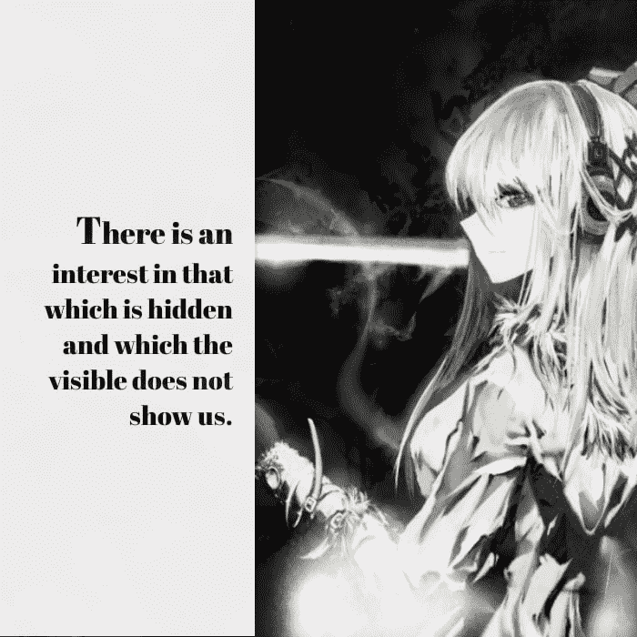动漫引用 Image Bot@ animequoteimage“对隐藏的和可见的不展示给我们的事物有兴趣。”
> 
> ~雷内·玛格利特02:36AM-03 2019 年 7 月

> 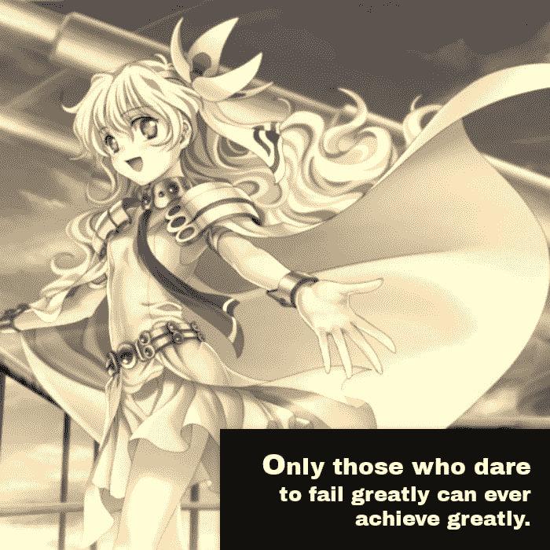动漫引用 Image Bot@ animequoteimage“只有敢于大失败的人，才能有大成就。”
> 
> ~罗伯特·肯尼迪2019 年 7 月 04 日下午 16:31

> 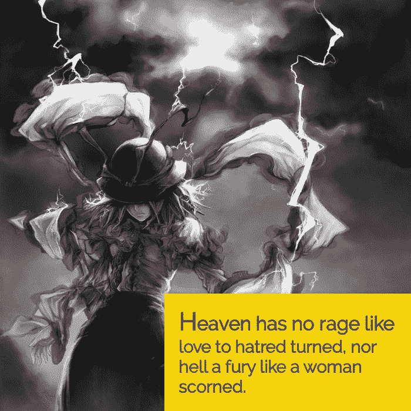动漫引用 Image Bot@ animequoteimage“天堂没有爱转恨般的暴怒，地狱也没有被蔑视的女人般的暴怒。”
> 
> ~威廉·康格里夫09:02AM-05 2019 年 7 月

其中一个看起来很奇怪，虽然有点晚，是对骄傲月的致敬。

> 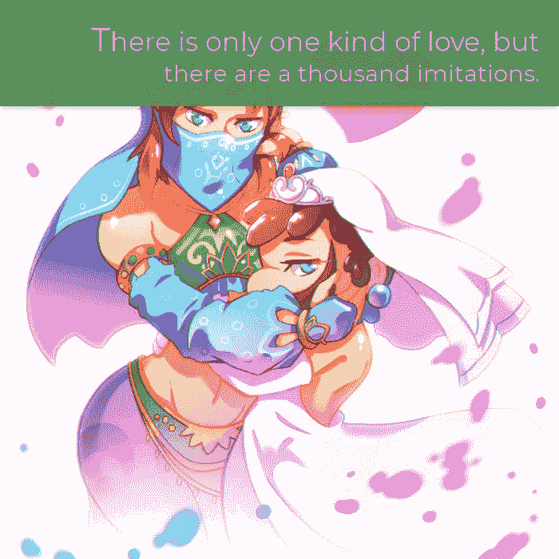动漫引用形象 Bot@ animequoteimage“爱情只有一种，模仿却有一千种。”
> 
> ~弗朗索瓦·德拉罗什福科2019 年 7 月 03 日上午 10:31

一些发人深省的引用实际上似乎被它们的图像所强化。

> 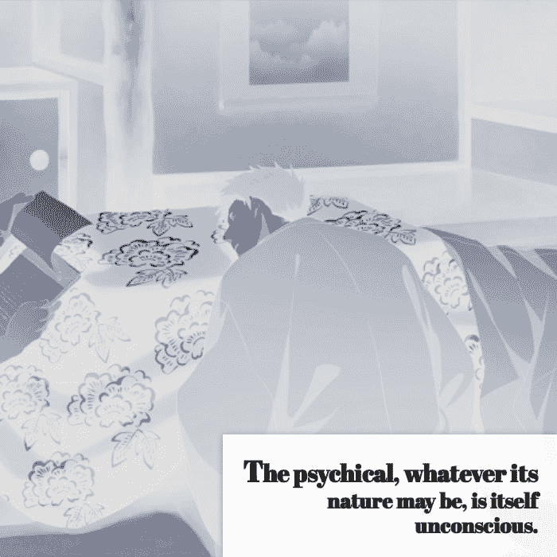动漫引用 Image Bot@ animequoteimage“灵媒，无论其本性如何，本身就是无意识的。”
> 
> ~西格蒙德弗洛伊德2019 年 7 月 05 日下午 17:00

> 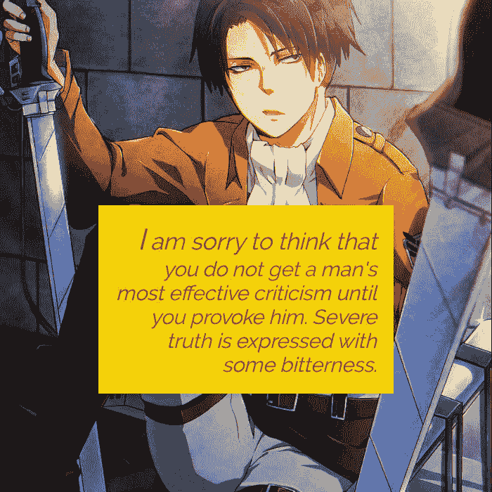动漫引用图片 Bot@ animequoteimage“我很遗憾地认为，你没有得到一个男人最有效的批评，直到你激怒了他。严峻的真实，表达得有些苦涩。”
> 
> ~亨利大卫梭罗2019 年 7 月 12:02PM-05

其他人没有让我思考，而是让我不寒而栗。

> 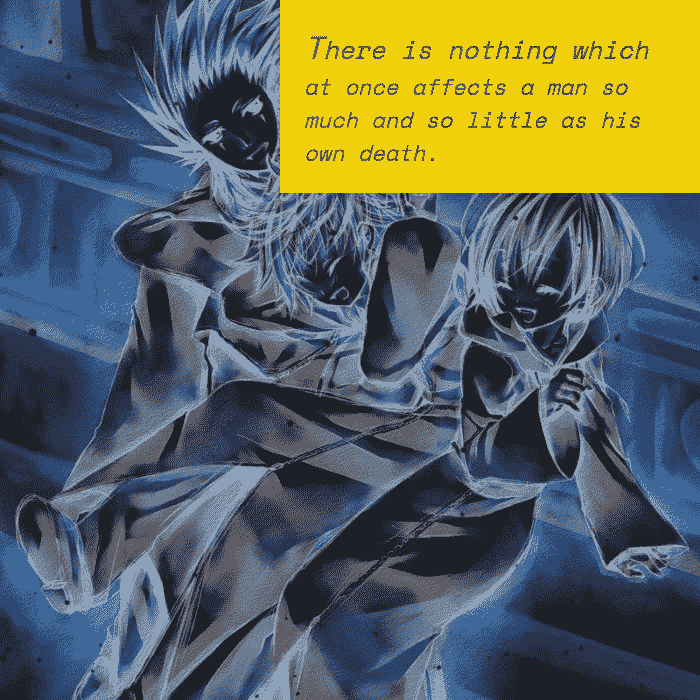动漫引用 Image Bot@ animequoteimage“没有什么比自己的死亡对一个人的影响更大又更小。”
> 
> ~塞缪尔·巴特勒00:35AM-03 2019 年 7 月

> 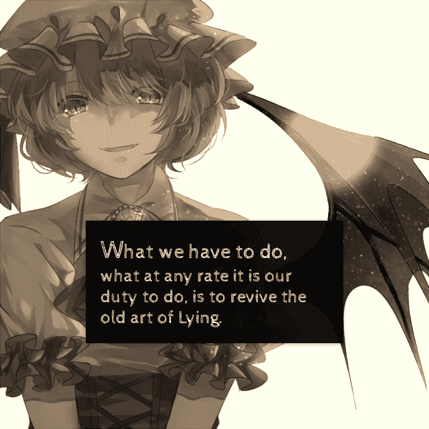动漫引用图片 Bot@ animequoteimage“我们要做的，无论如何是我们的职责所在，就是复兴古老的说谎艺术。”
> 
> ~王尔德07:01AM-05 2019

尤其是这一个仍然让我害怕。一句关于“积极的视觉”的引语，搭配一个衬衫上有血、隐藏着脸的人的倒像。我真的希望这是随机的，而不是对未来世界末日的秘密预言。

> 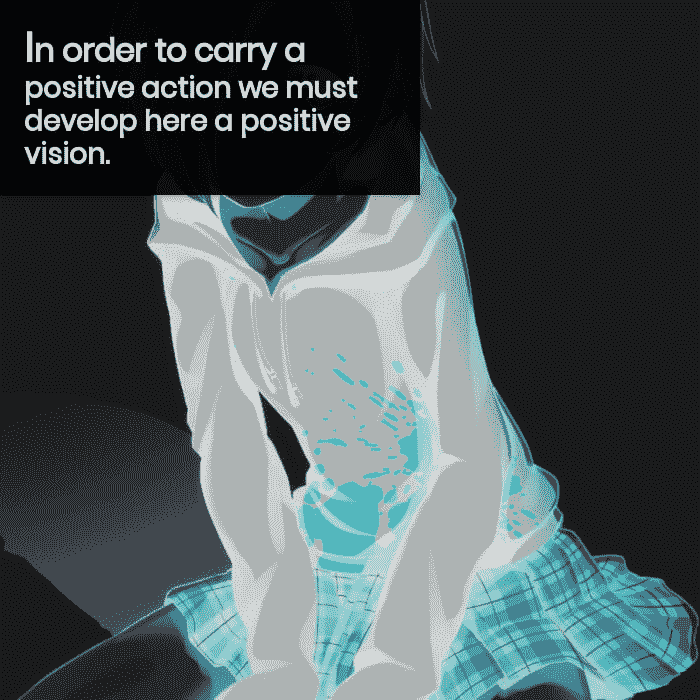动漫引用 Image Bot@ animequoteimage“为了采取积极的行动，我们必须培养积极的愿景。”
> 
> ~达赖2019 年 7 月 04 日上午 10:30

也有很多政治引语混杂其中。将现实世界的政治与动漫结合在一起...尴尬。

> 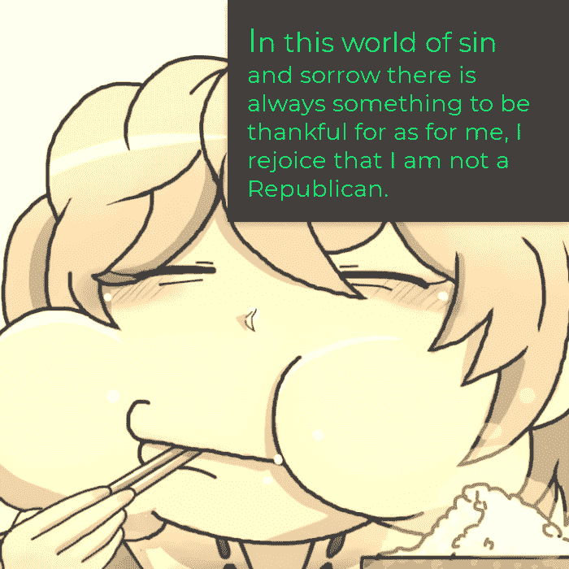动漫引用 Image Bot@ animequoteimage“在这个充满罪恶和悲伤的世界里，总有一些值得感恩的东西，至于我，我庆幸自己不是一个共和党人。”
> 
> ~ H. L .门肯2019 年 7 月 03 日下午 12:30

> 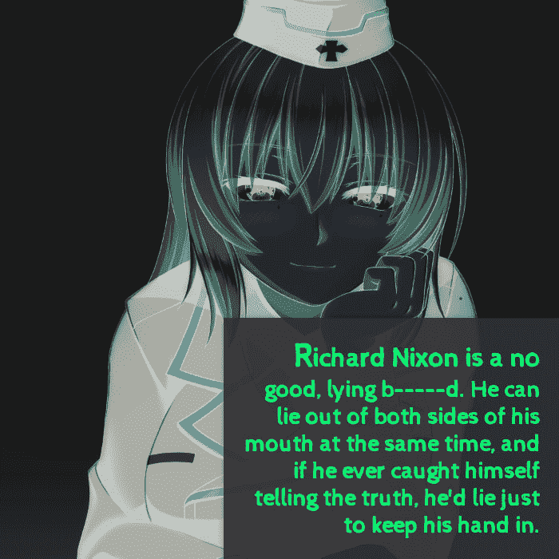动漫引用 Image Bot@ animequoteimage“理查德·尼克松是个没用的骗子，他可以同时从两边嘴里撒谎，如果他发现自己说了真话，他会为了不露馅而撒谎。”
> 
> ~哈里·S·杜鲁门2019 年 7 月 05 日上午 11:02

当然会有一些我不知道如何回应的创作。

> 动漫引用图片 Bot@ animequoteimage【大自然讨厌计算器】
> 
> ~拉尔夫·沃尔多·爱默生09:31AM-04 2019 年 7 月

> 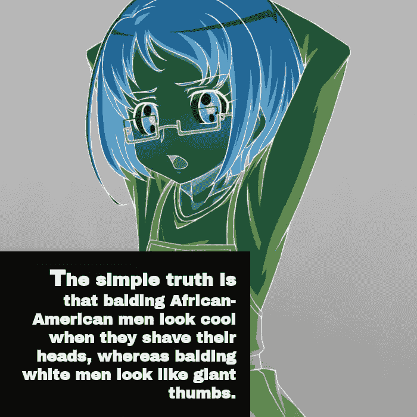动漫引用图片 Bot@ animequoteimage“一个简单的事实是，秃顶的非洲裔男性剃光头时看起来很酷，而秃顶的白人男性看起来像巨大的拇指。”
> 
> ~戴夫巴里04:01AM-05 2019 年 7 月

> 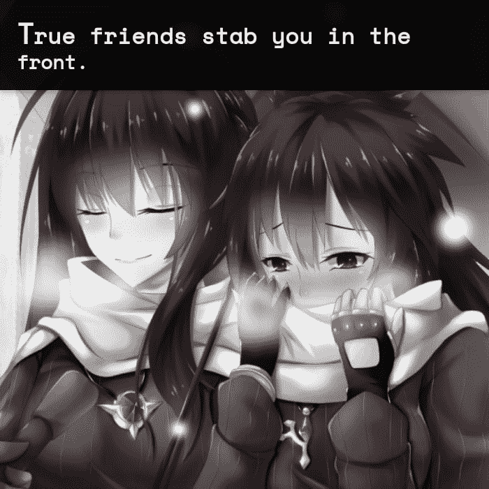动漫引用图片 Bot@ animequoteimage“真朋友在前面捅你一刀。”
> 
> ~王尔德21:02PM-04 2019 年 7 月

最后，这是我一直以来最喜欢的，也是独一无二的，其他使用过 API 的程序员可能会喜欢它。

> 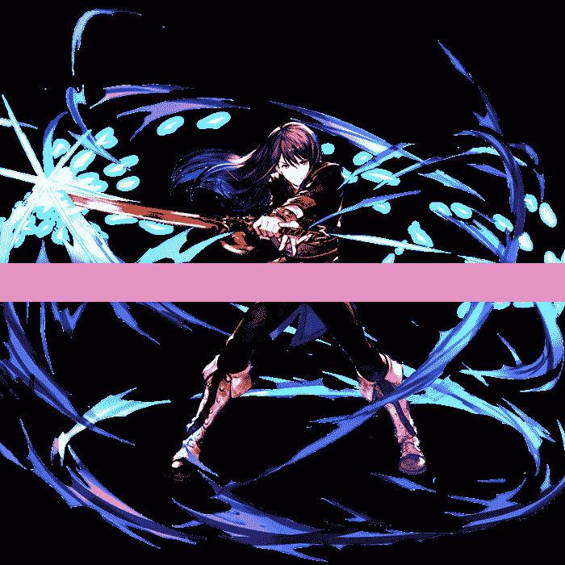动漫引用图片 Bot@ animequoteimage
> 
> ~14:31PM-04 2019 年 7 月

要么是 API 把我搞砸了，要么这是一个“想象你自己的报价”的场景。如果是这样，我会引用计算机科学中关于单元测试的一句话。

## 包装完毕

制作这样的机器人一直是我的一个遥远目标，让它成为现实让我想起了为什么我这么喜欢编程。如果你坚持下去，尝试足够多的不同方法，许多看似不可能完成的事情通常都不是不可能的。在最终选择 Node 之前，我看了几个 Ruby 的设置，在 Heroku 上努力工作了几天之后，它终于走到了一起。

现在我可以放松一下，享受为我做这项工作的乐趣。至少在这个循环重复之前，我会有另一个想法，既提高了我的编程技能，满足了我对动漫的热爱，又让我在这个过程中睡了一会儿。

> 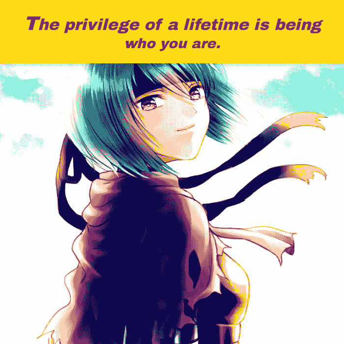动漫引用图片 Bot@ animequoteimage“一生的特权就是做你自己。”
> 
> ~坎贝尔·约瑟夫上午 10:11-07 2019 年 7 月

另外，自从我收集了这些例子后，by bot 又发了一百多条推特。我鼓励你浏览它们，并在评论中分享你最喜欢的！

*[封面图片由 SafeBooru.org](https://safebooru.org/index.php?page=post&s=view&id=947559)提供。*