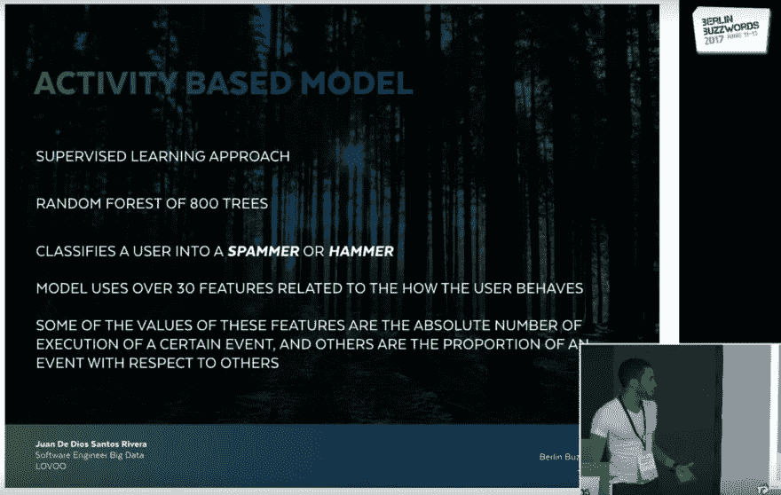

# 亲爱的兰登森林

> 原文：<https://dev.to/juandes/dear-random-forest-kcl>

亲爱的兰登森林，我叫胡安，我是你的超级粉丝。

最近，我想了很多关于你的事情，想知道你感觉如何，思考你的未来。你看，我很难过，你的树叶沙沙作响的声音不再像以前那样被听到了。自从几年前，你的其他粉丝和实践者决定离开你的森林小径，以换取一个更加神经化和网络化的生活。虽然我肯定他们有他们的理由，但这让我很难过。让我告诉你一些事情。

<figure>

<figcaption>Photo by [Sebastian Unrau](https://unsplash.com/@sebastian_unrau) on Unsplash</figcaption>

</figure>

当我开始学习机器学习时，我很难理解我们热爱的领域中的许多基本概念。哦，我的朋友，是的。你不知道。然而，当我遇见你最小的兄弟，决策树，我称之为 *Detri* 时，我的运气开始转变。

那时，通过 Detri，我学到了我迫切需要的基础和基本概念。我不知道为什么，但当我开始从树枝、树叶和流程图的角度看待事物时，我有了一个顿悟的时刻，突然之间，许多难以理解的话题变得更容易理解了。我是多么高兴啊！

<figure>

<figcaption>Photo by [Jeremy Bishop](https://unsplash.com/@jeremybishop) on Unsplash</figcaption>

</figure>

明白了这一点后，我开始在我的许多项目中使用决策树；口袋妖怪数据、游戏数据和不可避免的虹膜数据集是遍历你枝叶繁茂的兄弟的一些数据。不仅如此，对于我的论文，你猜我用了什么？没错。

在其中一次爬树探险中，我决定成为一名树木学家，并学习这种算法是如何构建的。因此，我试图回答以下一些问题:节点到底是什么？树是怎么做出来的？哦，等等，我也可以用它来回归吗？我纯粹是惊讶。在这次冒险中，我发现了你。你随意的森林，我喜爱的树木的合奏。那是多么美好的一天啊。

<figure>

<figcaption>Photo by [Lukasz Szmigiel](https://unsplash.com/@szmigieldesign) on Unsplash</figcaption>

</figure>

认识你之后，我去了很多很多次穿越你的森林的徒步旅行。突然，我更新了我以前的大部分模型，献给你——结束孤独树的时代，欢迎来到多重树的时代！嗯，我不想吹牛，但我知道你的一些事情；我从树木学家变成了森林学家。想知道一些伟大的事情吗？当我得到我的第一份工作时，我用你完成了我的第一个监督学习任务！当然，我做到了！我记得我装修了一个春天般的，广阔的，但不深的，看起来像国家公园的森林。哇，你是多么优雅。一波又一波的垃圾邮件，你控制住了(顺便说一句，信心十足！)，让我(和我的老板们)真的很满意。

不幸的是，过了一段时间，我们不得不换掉你。你只是变得有点太重了，不适合训练。我无意冒犯你！只是我们的要求变了，我们的策略也变了…或者我们只是没有准备好迎接你的伟大。即使在你离开后，我仍在我自己的代码森林中不断发现你的小枝、树叶和树枝的痕迹，每一次它都给我带来微笑；“啊哈！“看谁来了”，当我在第 37 行看到你的部分作品时，我说。走了，但没有被遗忘。

<figure>

<figcaption>Me talking about you at Berlin Buzzwords 2017</figcaption>

</figure>

就像我在工作中不再利用你一样，似乎世界上大多数人也是这样做的。尽管 [Google Trends 的数据显示并非如此](https://trends.google.com/trends/explore?date=today%205-y&q=random%20forest)，但我感觉你的沙沙声没有以前那么大了。现在，我很少看到由你统治的用例，也很少看到人们在会议上谈论你；就像秋天终于来到了树林。

但是，嘿，我也听到了好的故事！最近，你的堂兄 gradient boosted trees 或者我称之为*Boostry*已经遍布新闻，这太棒了。我是说，有你这个导师，还能有什么问题。

所以，是的，我的好朋友，这就是我的原话。我真诚地希望你一切都好。然而，以积极的语气结束，我要说的是，如果我学到了什么，那就是在这个领域，春天总是在拐角处，所以我肯定会收到你的来信。

你的粉丝，胡安。

<figure>

<figcaption>Photo by [Johannes Plenio](https://unsplash.com/@jplenio) on Unsplash</figcaption>

</figure>