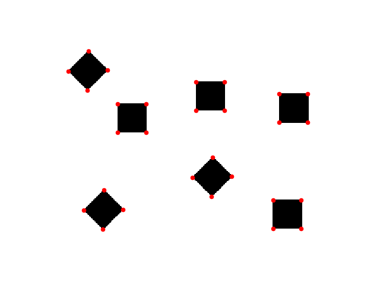
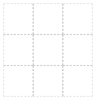
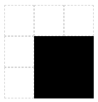
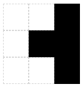

# 一种在图像上寻找角点的简单方法

> 原文：<https://dev.to/victorqribeiro/a-naive-approach-to-finding-corners-on-an-image-f87>

# 天真的角落

一种寻找图像角点的简单算法。

[](https://res.cloudinary.com/practicaldev/image/fetch/s--v0ZgUd07--/c_limit%2Cf_auto%2Cfl_progressive%2Cq_auto%2Cw_880/https://thepracticaldev.s3.amazonaws.com/i/u0vavmokchcwh8ik7ro1.png)

## 关于

当我还在学习数字图像处理的基础知识时，我想出了这个“算法”来检测图像上的角点。

## 工作原理

嗯，顾名思义，这是一种非常幼稚的方法。

给定任何图像，我们将每次在 3×3 的窗口中查看它。(我们可以调整图像的大小来加速这个过程，但是谁会着急呢？)

3x3 窗口。

[T4】](https://res.cloudinary.com/practicaldev/image/fetch/s--5fgWPyiW--/c_limit%2Cf_auto%2Cfl_progressive%2Cq_auto%2Cw_880/https://thepracticaldev.s3.amazonaws.com/i/migplp8u4l45793ct37v.png)

然后我们将计算在那个窗口中有多少彩色像素。如果有 4 个彩色像素，它一定是一个角。

角落。

[T4】](https://res.cloudinary.com/practicaldev/image/fetch/s--hxQEkGry--/c_limit%2Cf_auto%2Cfl_progressive%2Cq_auto%2Cw_880/https://thepracticaldev.s3.amazonaws.com/i/w0glm34ck5ayzvc58gtn.png)

旋转角。

[T4】](https://res.cloudinary.com/practicaldev/image/fetch/s--bURMXaVh--/c_limit%2Cf_auto%2Cfl_progressive%2Cq_auto%2Cw_880/https://thepracticaldev.s3.amazonaws.com/i/n17k9hi7t0g9s25n67v4.png)

其他任何东西，都不是一个角落。

不是一个角落。

[T4】](https://res.cloudinary.com/practicaldev/image/fetch/s--XBDHf3nD--/c_limit%2Cf_auto%2Cfl_progressive%2Cq_auto%2Cw_880/https://thepracticaldev.s3.amazonaws.com/i/pjyaqai1vy1i66x5bbuc.png)

也不是一个角落。

[T4】](https://res.cloudinary.com/practicaldev/image/fetch/s--5XWb-Mmi--/c_limit%2Cf_auto%2Cfl_progressive%2Cq_auto%2Cw_880/https://thepracticaldev.s3.amazonaws.com/i/vyp0t7v7ij7pnap1hh39.png)

## 见其运转

通过调用
运行

```
python corner.py img/mess.png 
```

我还用这种算法处理了一个实时网络视频的角点。

这个算法的 python 实现在这里[托管](https://github.com/victorqribeiro/naiveCorners)