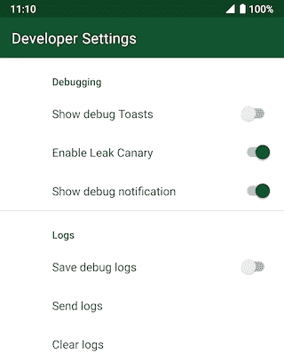
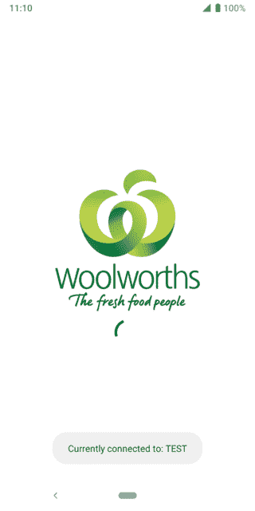

# 在设备上调试第四部分:记录所有的事情！

> 原文：<https://dev.to/zmdominguez/on-device-debugging-part-iv-log-all-the-things-g27>

在过去的一年里，我的团队一直在为我们的应用程序构建一个开发者选项屏幕。它是一个简单的 [`PreferenceScreen`](https://developer.android.com/reference/androidx/preference/PreferenceScreen.html) ，可以在调试构建中帮助我们:

*   不需要连接到电脑就能知道发生了什么
*   无需重新安装即可测试各种配置
*   主持我们正在尝试探索的各种实验

在这一系列的帖子中，我将分享这些不同的选项是什么，以及我们是如何做出它们的。

阅读本系列的其他文章:

*   第一部分:现在开了，现在关了
*   第二部分:Timbeeeeeeer！
*   [第三部分:检查、复位、重复](https://zarah.dev/2019/07/01/debug-options-info.html)

(如果你不熟悉 [`PreferenceFragmentCompat`](https://developer.android.com/reference/kotlin/androidx/preference/PreferenceFragmentCompat.html) ，我强烈建议在继续之前先阅读一下。你可以从这个 [AndroidX 指南](https://developer.android.com/guide/topics/ui/settings.html)开始设置。)

* * *

正如我在[第二部分](https://dev.to/zmdominguez/on-device-debugging-part-ii-timbeeeeeeer-1827)中提到的，我们大量利用木材。当应用程序运行不正常时，这些堆栈跟踪日志屏幕真的很有用，但当我们在使用应用程序时只想设置检查点时，情况又会如何呢？

输入我们的下一组开发人员选项:

<small>More debugging!</small>

### 显示调试祝酒词

[`Toast`](https://developer.android.com/guide/topics/ui/notifiers/toasts) 是在应用程序中设置视觉检查点的好方法。它们相对不引人注目，易于创建。

在我们的开发人员设置中启用“显示调试祝酒词”允许我们在测试一些不可预测的东西时暴露这些检查点:

 <small></small> 

 <small>我之前谈到了我们必须实现的地理围栏功能，我们要感谢这个功能摒弃了这个调试功能的想法。

在此功能中，我们希望应用程序在用户进入地理围栏时通知用户。在市中心测试地理围栏可能会很棘手，拥有视觉线索让我们知道我们是否进入或退出了地理围栏对我们非常有帮助。

这个函数存在于我们的`DebugExtensions`类中:</small>