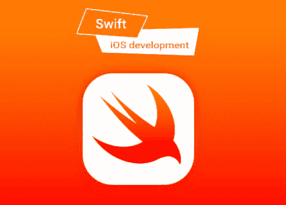

# 开始我的 100 天代码挑战

> 原文：<https://dev.to/dhairyachandra/starting-my-100-days-of-code-challenge-1p5f>

大家好，

我公开承诺从今天开始参加 100 天代码挑战！我会每天在 Twitter 上分享我的进度报告。如果有任何疑问和问题，你可以在 [@dhairyachandra](https://twitter.com/dhairyachandra) 上发微博给我。每天的日志和工作都会上传到 [GitHub](https://github.com/dhairyachandra) 上。我也会在我的博客上分享我的日常学习。

我将开始学习 Swift 语言，然后我将设计 iOS 应用程序，我的所有工作都将在 Twitter、GitHub 和我的网站上分享。

## 什么是 100 天代码挑战？

100 天的代码是一个挑战/社区，在这里你公开承诺在接下来的 100 天里用 1 个小时编写代码(然而它比这更灵活)。你也成为了一个友好的大型开发社区的一部分。

两条主要规则:

–在接下来的 100 天里，每天至少编码一小时。

–每天用#100DaysOfCode 标签发布你的进度。