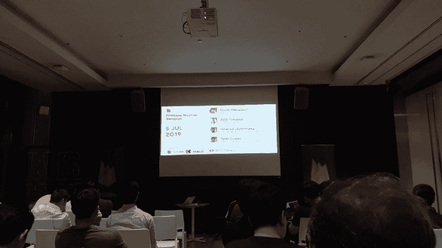
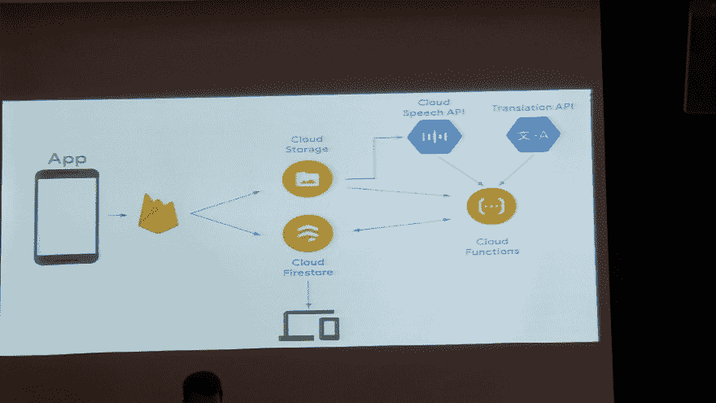
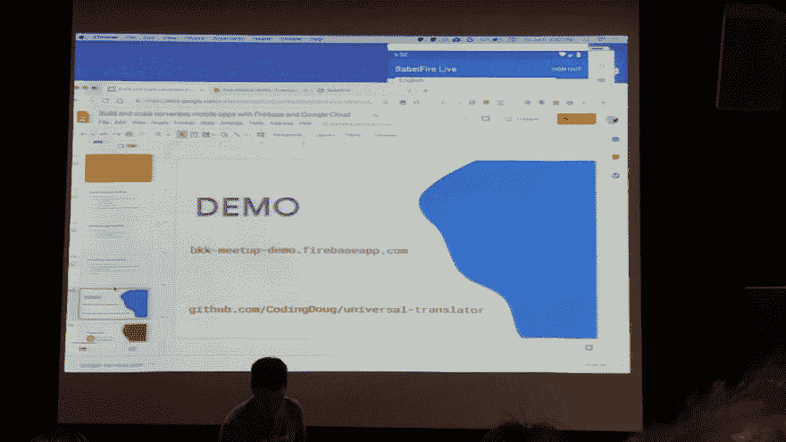
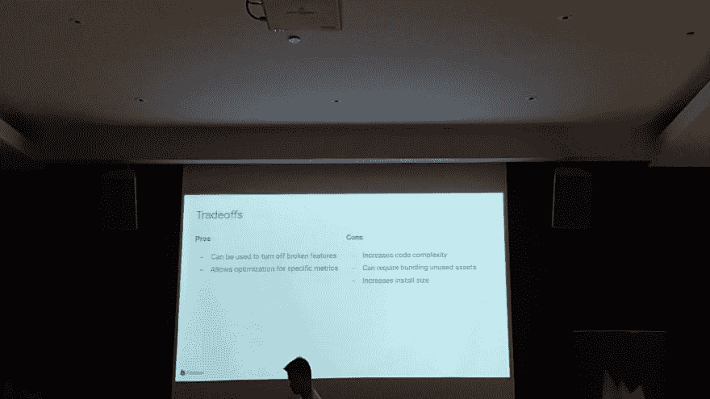
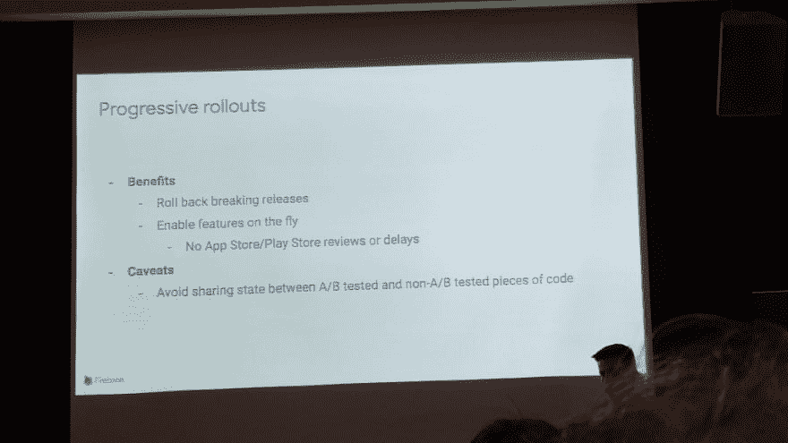
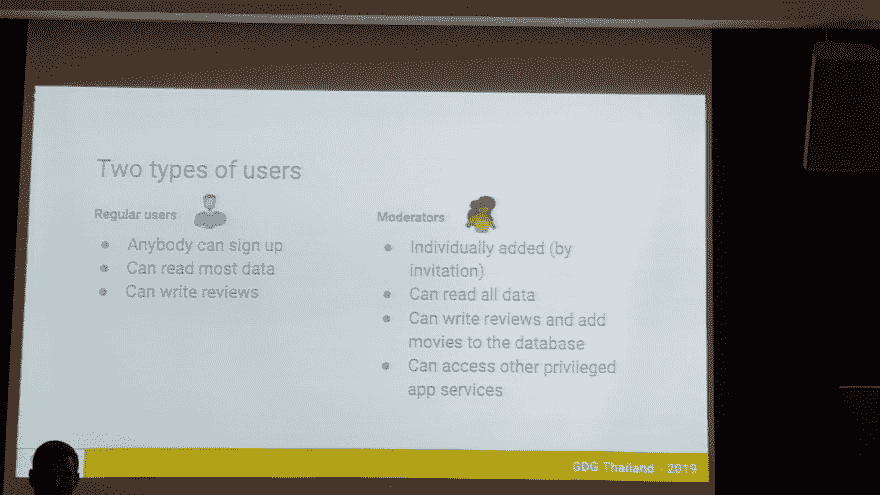
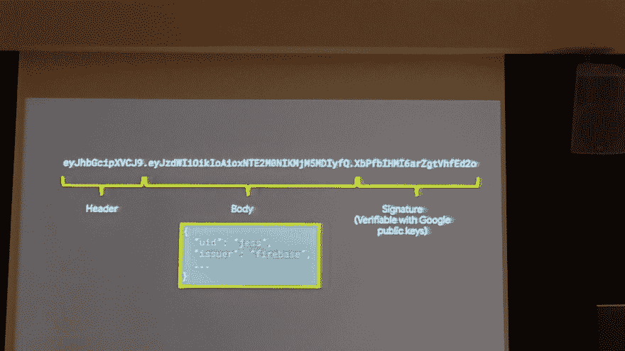
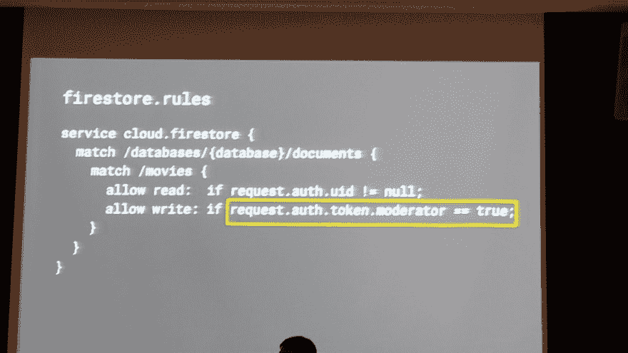
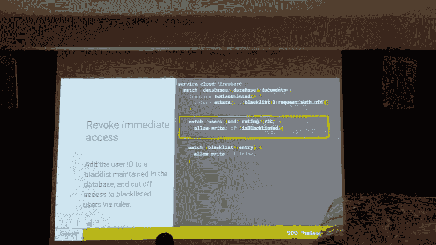

# Firebase Meeting at AIS DC Centre

> 原文：[https://dev.to/ookbee/firebase-meeting-at-ais-dc-centre-10np](https://dev.to/ookbee/firebase-meeting-at-ais-dc-centre-10np)

วันนี้ได้ตั๋วฟรีจากที่ office ไปงาน meeting ของ Firebase สถานที่ ๆ จะไปอยู่ที่ห้าง The Emporium เผื่อเวลาเดินทางไว้ตั้งหนึ่งชั่วโมง แต่รถอย่างติด เอาเข้าจริงใช้เวลาขับไปตั้งชั่วโมงครึ่ง พอไปถึงเดินหลงอยู่พักหนึ่งเพราะหาที่จัดงานไม่เจอ เดินไปถาม Information เขาบอกว่าอยู่หลังโรงหนัง

เข้ามาถึงเห็นคนยังไม่เยอะเท่าไหร่ ที่นั่งยังว่างหลายที่อยู่ อ้าว งานยังไม่เริ่มนี่

#### Doung Stevenson

เริ่มมาถึงจะฟังไม่ค่อยทันเขาพูดถึงอะไร แต่หลักๆเลยเขาเอา sample project มาให้ดู ซึ่งจะทำงานของ Firebase ได้ครบ Loop ตามนี้

ซึ่งเราจะได้เห็นเขาใช้ cloud storage เก็บไฟล์ และ Firestore ในการทำ API สำหรับเก็บข้อมูลเหมือน Database รวมไปถึง Translate API แปลภาษาด้วย ซึ่งโค้ดที่เขาแสดงให้ดูคือ มันจะรับ Input ภาษาเข้าไปแล้วแปลออกมาหลาย ๆ ภาษา ทดสอบให้ดูมันเจ๋งมาก แปลออกมาทุกประโยคตรงหมดเลย เขาเลยหาอาสาสมัครในห้องมาลองใช้กับภาษาไทยดู คนแรกพูดว่า “ เมื่อไหร่ Remote Config จะมีให้ใช้บนเว็บบ้าง” ผลที่ได้คืออ่านตรงหมดยกเว้นคำว่า “Remote Config” ได้ผลออกมาเป็นคำอื่นแทน เสียดายถ่ายรูปเก็บไว้ไม่ทัน สาเหตุที่ผลออกมาไม่ตรง น่าจะเพราะคำนี้มันเป็นคำที่ไม่ได้ใช้ทั่วไปหละมั้ง มันเลยออกมาแปลกๆ

คนที่สองเลยอยากลองบ้าง ขึ้นไปพูดใส่ไมค์ที่ใช้รับ Input ว่า “ไก่ จิก เด็ก ตาย เด็ก ตาย บน ปาก โอ่ง” ภาษาไทยตรงหมด ภาษาอังกฤษ output ออกมารู้สึกจะเป็นคำคาราโอเกะให้นะ

<figure>

<figcaption>เผื่อมีคนอยากได้เอาไปลองเล่นบ้าง</figcaption>

</figure>

#### Aziz Yusupov

วิทยากรคนต่อมาสอนเกี่ยวกับ Remote Config ใช้กับ A/B Testing ส่วนตัวชอบอยู่ สไลด์หนึ่งที่เขาพูดว่าการทำหรือไม่ทำ Remote Config มันมีข้อดีและข้อเสียยังไง เราเห็นด้วยนะที่ว่าการทำอะไรขึ้นมาอย่างหนึ่งมันต้องมีได้มีเสียอะไรบ้าง มันไม่มีอะไรได้มาฟรี ๆ หรอก อย่างน้อยที่สุดที่ต้องแลกกับการทำอะไรเพิ่มขึ้นมาคือ “เวลา” อย่างที่เขาบอก ทำ Remote Config ข้อดีของมันคือเรารู้ว่า user ต้องการอะไร แก้ไขข้อมูล app โดยไม่ต้องส่ง Store Review หรือจะเปิด Feature ที่อยู่ใน App เราเมื่อไหร่ก็ได้

ส่วนข้อเสียคือ App มีขนาดใหญ่ขึ้น โค้ดเยอะขึ้น ดูแลยากขึ้น ซับซ้อนขึ้น บางทีหา บัคแสดงผลไม่เจออีก (อันนี้จากประสบการณ์จริง XD)

เดี๋ยวจะออกนอกเรื่องไปไกล เข้าประเด็นเลยดีกว่า วิทยากรคนนี้เอา sample project มาโชว์การทำงานให้ดู หลัก ๆ คือแสดงคำว่า “สวัสดี” ตามภาษาของเครื่องนั้น ๆ แล้วก็เปิด Emulator มา 3 เครื่อง ตั้งค่า 3 ภาษา จบ….

#### Hiranya Jayathilaka

คนนี้มาสอน Integrate Infrastructure ที่มีอยู่แล้วเข้ากับ Firebase เขายกตัวอย่างการทำ Login Authentication 2 Level และแบ่ง Permission ให้ user 2 ประเภทนี้

และแล้วก็ได้เจอความรู้ใหม่ ว่า Authen Token Firebase มันมี header, body กับ signature มาด้วย

และที่ชอบสุดในงานเลย คืออันนี้สอนการตั้ง rule ของ Firebase ซึ่งเราไปหาอ่าน เอกสารก็มีน้อยมากไม่มีบอกแพทเทิร์นที่ชัดเจน ปัจจุบันก็ตั้งมั่ว ๆ แล้วลองเทสต์ดู

<figure>

<figcaption>ความลับไขกระจ่างแล้ว</figcaption>

</figure>

ส่วน sample project เขาก็โชว์ login และไปโพสต์ Twitter ผลจะได้หรือไม่ได้ขึั้นอยู่กับเลเวลของ user

สรุป งานนี้ที่มาสำหรับเราได้ความรู้ใหม่ๆเรื่อง Firebase rules อย่างเดียว แต่สำหรับคนอื่นๆอาจจะได้อะไรมากกว่านี้ เผื่อใครสนใจ Firebase เขาก็มีจัดงาน Meeting อยู่เรื่อยๆไม่แพ้ Android