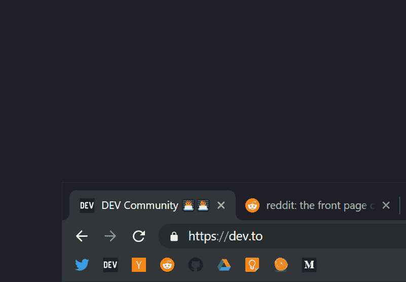
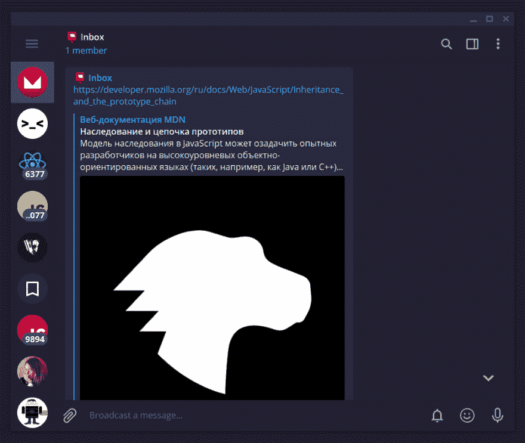
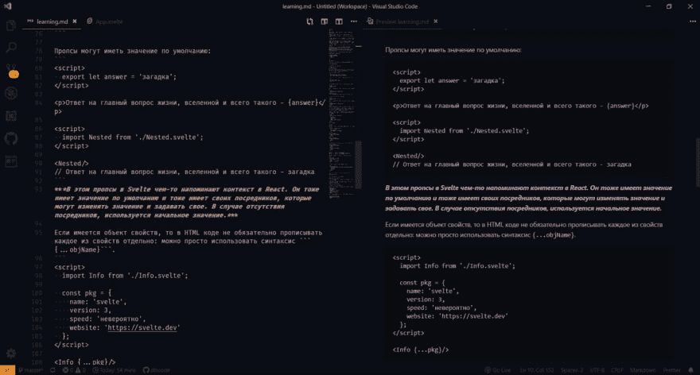

# 想学习新的框架？从这个开始

> 原文：<https://dev.to/dtroode/want-to-learn-a-new-framework-start-with-this-j63>

*保存它，学习它，写它*——只有这个顺序。今天我想告诉你我的工作学习过程。工作和学习是结合在一起的，因为在编程世界中，要想工作得好，我们需要学习得好，并且学习很多。

我可以把一篇文章分成几部分。*我如何储存:*

*   [书签](#bookmarks)
*   [链接](#links)
*   [知识](#knowledges)

## 书签

我用的是 Chrome 和 Firefox，在这两款浏览器中，我都经常打开书签栏。在它上面，我只有我现在使用的网站，那是因为它是动态的，经常更新。

此外，我不喜欢溢出栏，我不得不保存没有名字的书签，只有图标。图标重要性的另一个证明。

*书签位置的一般原则:*

*   社交媒体和新闻网站
*   工具
*   学习材料

**社交媒体和新闻网站。**我的主要社交媒体是 Twitter。此外，我使用当地流行的 VK，但不经常使用。我每天都要打开 10 次以上的 Twitter，那是因为 Twitter 在工具栏上，而 VK 没有。

新闻 I 从 *Dev .到*、 *Hackernews* 和 *Reddit* 。但是我并不经常使用它们，因为所有有用的内容都被官方账户或一些用户在 Twitter 上复制了。

**工具。**在前端开发领域，我们需要许多工具，如调色板、在线代码格式化程序、管理面板和文档。但是这些工具大部分只在开始一个新项目或支持它的时候使用。书签栏上没有这些工具。

我只有云存储，任务，源码管理器之类的东西。

作为我的任务管理器，我使用 *Google Keep* 。它帮助了我，我曾经用它来管理我所有的项目。我为每个新项目创建一个新的白板，添加任务和子任务，并按表情符号排序。

**学习的材料。**这是书签栏中最不稳定的部分，因为我添加了新的材料，即我正在学习的材料，并删除了旧的材料。更多时候是课程、文章和最重要的文档。这很重要，因为它是由学习对象的作者写的，并且经常更新。

例如:最近我学会了 React，在我的书签栏里有了官方文档和一些附加链接。在这之后，我决定在 JS 中重复 OOP，并在 ES6 中增加了一门课程和一篇关于 OOP 的文章。

## 链接存储

尽管我在书签中的链接很短，但我喜欢极简主义，并缩短了它们的数量。

所以我需要存储有用的链接和链接，我想以后在某个地方阅读。为了这些目的，我使用电报。电报和信使一样善于存储链接。

在 Telegram 中，我有两个私人频道:收件箱和链接。

**收件箱。**在这个频道里，我储存了我想马上阅读/学习的不同材料。我经常更新但不经常检查的列表。

缓存呢？大多数网站现在都支持即时浏览——一种电报技术，允许快速打开网站上的文章并改变阅读模式。这项功能会自动缓存所有链接，即使我从笔记本上共享了一个链接，但没有在移动设备上打开它。

**链接。**这个频道很少更新，只更新我不需要的文章和视频。我可以在这里存储一篇关于某件事的文章，我想在未来学习或链接，作为争论中的一个论点。

## 我如何学习

> 大卫·基斯托瑞[@ dt roode](https://dev.to/dtroode)昨天开始学习 [@sveltejs](https://twitter.com/sveltejs) 。正在将所有内容写入降价文件。所有文字都是我写的，代码来自例子。可以看到粗斜体的文字(左边红色):这是我自己为了更好的记忆2019 年 6 月 11 日下午 12:1600

在前端和编程的现代世界中，开发人员每次都需要学习一些东西并更新知识基础，这是因为我学习新的东西并重复旧的东西。

在过去的时间里，我开启了一种新的，尽管是原始的记忆方式——写。我写文档，并行地在邻居窗口写它。重要！*我自己写的文字*，不是抄袭，否则，它只是另一个文档。因为我的母语不是英语，所以学习英语文档，尤其是写作有助于提高英语技能。

对于每一个新的材料，我都会为代码示例创建一个新的文件夹，其中包含用于编写的文件`learn.md`。我在 Markdown 和定期备份中包含的所有文件。

## 结论

我的收藏需要新链接，请将我发送到 [Twitter](https://twitter.com/dtroode) 或 [Telegram](https://t.me/dtroode) 。