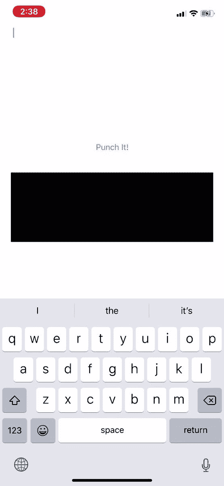

# 在 iOS 上运行 Ruby？！

> 原文：<https://dev.to/darthknoppix/running-ruby-on-ios-3273>

我周末一直在研究 iOS，并设法将 Ruby 嵌入到一个 iOS 应用程序中。这是我第一次成功地将编程语言嵌入到任何东西中！

我认为这很酷，它可以在设备上运行 ruby，而不需要互联网连接。一切都包含在应用程序中！

如果 dev.to 上的视频没有你想要的那么高，看看我在推特上发布的应用程序运行的视频吧！

> <video loop="" controls=""><source src="https://video.twimg.com/ext_tw_video/1147864579478867968/pu/vid/592x1280/60Wari_h-UiS-gcW.mp4?tag=10" type="video/mp4"></video>赛斯考克@达斯 _ 克诺皮克斯刚刚把 Ruby 嵌入了一个 iOS app！这太不可思议了，我需要温习一下我的 C 语言知识，但它确实有效。
> 
> 👨‍💻🤯
> 
> [# weekend hack](https://twitter.com/hashtag/weekendhack)[# Hacking](https://twitter.com/hashtag/Hacking)[# swift](https://twitter.com/hashtag/swift)[# swift](https://twitter.com/hashtag/swift)# lang[# ruby](https://twitter.com/hashtag/ruby)[# ruby](https://twitter.com/hashtag/ruby)lang[# xcode](https://twitter.com/hashtag/xcode)[# IOs dev](https://twitter.com/hashtag/iosdev)[# app development](https://twitter.com/hashtag/appdevelopment)13:47PM-07 2019 年 7 月

让我知道你的想法，如果你想看到我进一步发展它。欢迎提问或提出一些建议！