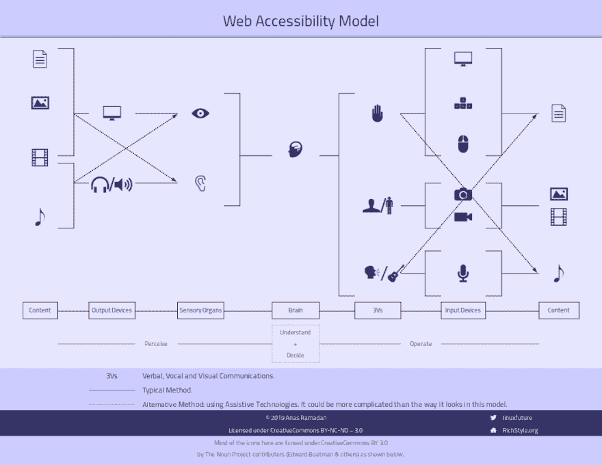
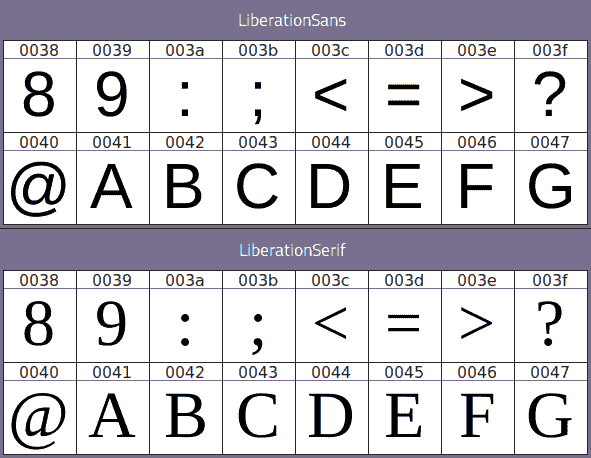
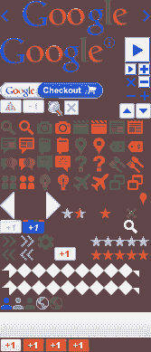
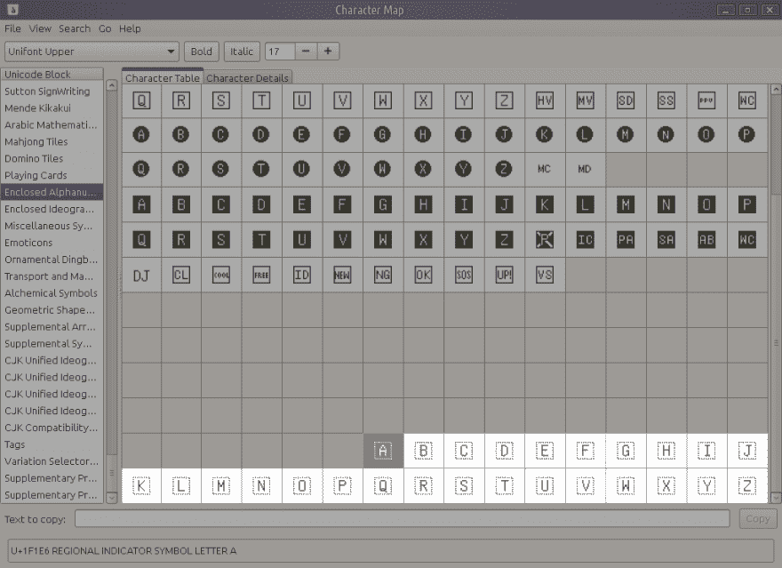
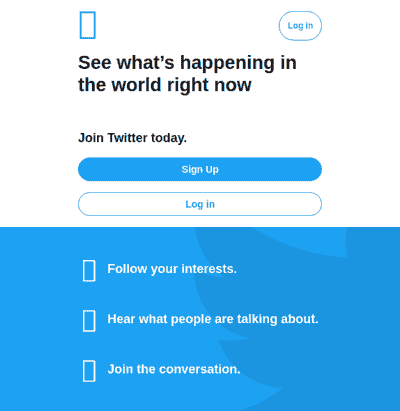
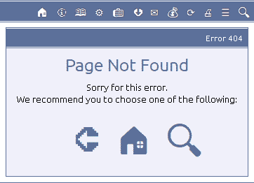
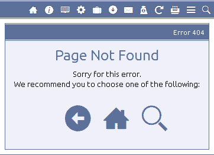
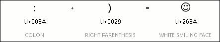
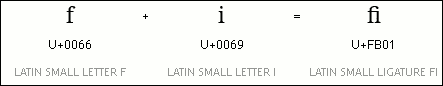

# 图标字体与 SVG:可访问网络图标的终极指南

> 原文：<https://dev.to/linuxfuture/icon-fonts-vs-svgs-an-ultimate-guide-to-accessible-web-icons-2lh6>

## 前言

如今，许多 web 设计人员和开发人员将 SVG 作为字体技术的替代技术，用于在 web 世界中表示图标。这个决定在多大程度上是明智和正确的？

这是本文试图回答的问题。

首先，在这项研究中，我们从两个假设出发:

*   浏览器或屏幕阅读器没有任何错误或限制:所有推荐的标准都受到支持并且没有错误，屏幕阅读器能够正确读取所有 Unicode 字符，它们中的任何错误或故障都是它们的开发人员的责任。
*   这里我们关心的是将图标作为 CSS 指令显示的属性来处理的解决方案，而不是作为 HTML 标签调用的对象，如``、`<object>`或`<svg>`等，因为图标不是内容的一部分，它们是可重用资源和软件组件的一部分，所以应该注意只从服务器请求一次。那些 CSS 属性通常要么是`background`属性，要么是`content`属性，我们排除了其中的第一个，因为它是一个表示属性，没有任何语义意义——所以它是不可访问的——首先，它不太可能在打印第二个时出现。我们唯一剩下的财产是`content`。

## 词汇表

Accessibility

对于图标来说，它意味着用对图标的本质和功能有意义的语义串来表达图标的能力。在 Unicode 符号中，语义文本是分配给正式 Unicode 块中的字符的描述。在 SVG 文件中，它可以是 [Spritesheet](#spritesheet) 中的[片段标识符](#fragment-identifier)，或者是单个 SVG 文件中的`<title>`标签。

图标的可访问性有助于有特殊需求的用户(尤其是视力障碍者)使用专门针对这类用户的软件<q>屏幕阅读器</q>来识别和演示图标的内容。这也有助于搜索引擎理解图标的含义和语义，这使得语义对于站长来说是一个非常重要的问题。

你可以把搜索引擎想象成一类有特殊需求的用户，但是他们的需求属于开发者需求的范畴，而不是实践中的用户需求，因为搜索引擎不是人类用户，除了你热衷于吸引真实的和最终的用户到你的站点，没有任何东西迫使你去满足它的需求。

[可扩展性](#scalability)是图标可访问性的另一个方面，帮助有特殊需求的用户(尤其是视障人士)看到更大尺寸的图标。

<figure>

<figcaption>Web Accessibility Model
[[Icon credits]](https://richstyle.org/media/a11y-model-icon-credits.png)</figcaption>

</figure>

Code Point

Unicode 代码空间中的任何值；即从`0`到`10FFFF` <sub>十六进制</sub>的整数范围(即十六进制数字系统)。它是文本字符串的原子单位。

并非所有代码点都必须分配给编码字符。相反，Unicode 标准中有七种基本的代码点类别:

1.  Graphic(最常见的用法):代码点存储一个字形，它是一个字符(如字母、数字、标点符号或象形文字等字符)的可视化表示。
2.  格式。
3.  控制。
4.  私人使用。
5.  代孕。
6.  非字符。
7.  保留。

<figure>

<figcaption>The main different between a font and another: different glyphs in the same code point.</figcaption>

</figure>

Emoji

以 Unicode 标准正式编码(索引)的符号。它是典型的彩色的。它的复数形式可以是*表情符号*或*表情符号*。然而，Unicode Consortium 使用*表情符号*作为复数。

表情符号可以是一种情感表达，一个动词，一个物体，甚至是一个抽象的符号。

下表展示了表情符号的简史。

A brief history of emoji

| 旅行箱 | 根 | 意义 | 描述 | 创造者 | 年 | 例子 |
| --- | --- | --- | --- | --- | --- | --- |
| 表情符号 | 反相+图示 | 情感+图标 | 使用常规键盘字符组合键入的垂直情感符号。 | 斯科特·法尔曼 | One thousand nine hundred and eighty-two | :-) |
| 考莫吉 | 花王+莫吉 | 脸+性格 | 使用常规键盘字符组合键入的水平情感符号。 | Kim Tong Ho | One thousand nine hundred and eighty-six | ^_^ |
| 象形文字 |  |  | 以 Unicode 标准正式编码(索引)的符号。 |  | One thousand nine hundred and ninety-three | ☺ |
| 表情符号 | e +莫吉 | 图片+文字 | 一个[象形文字](#pictograph)的彩色版本。 | 栗田茂高 | One thousand nine hundred and ninety-nine |  |

附加说明:

*   *表情符号*实际上起源于 1972 年的 PLATO IV 计算机系统。
*   金东浩[将这一创新归功于他自己，但有些人认为他没有足够的证据证明他的说法。](https://groups.google.com/forum/#!msg/fj.questions.misc/-6DJXmcI13c/JIc3AWmvmlcJ)
*   *象形字*:当时，也就是 1993 年，Unicode 1.1 发布的时候只有几个象形字。
*   那时表情符号还没有被编码(在 Unicode 表中被索引)。相反，自 2010 年 Unicode 6.0 发布以来，它们已经正式编码为表情符号。

Fragment Identifier

SVG [spritesheet](#spritesheet) 中的文本字符串，用于唯一标识整个图像(子图像)的一部分。

SVGs 中的片段标识符要么是`<view>`标签，要么是`ID`属性，或者两者都是。

Maintainability

在本文中，我们指的是使用简单的文本编辑器或简单的图像编辑器编辑代码的能力，而不需要额外的软件和工具。

Performance

在这个上下文中，我们指的是加载图标时更少的 HTTP 请求。在实践中，理想的性能是将调用图标的过程限制为一个 HTTP 请求。

Private Use Area (PUA)

Unicode 表之一，位于范围`U+E000-F8FF`中。它旨在允许字体开发人员插入非标准字符。

出于同样的目的，还有另外两个表格:

*   补充私用面积- A，位于`U+E0000-FFFFF`范围内。
*   补充私用区- B，位于`U+100000-10FFFF`范围内。

Replacement Glyph

> 一种字形，用于呈现在特定字体中无法以正确外观呈现的字符。它通常显示为开放的或黑色的矩形。也称为缺失字形。
> 
> <cite>[Unicode Glossary](http://unicode.org/glossary/#replacement_glyph)</cite>

Resizibility

在本文的上下文中，我们指的是通过以下方式更改图像大小的能力:

*   性质:即[伸缩性](#scalability)。
*   能够通过 CSS 指令控制其大小(主要是`width`和`height`)。

Scalability

放大图像而不失真的能力。是[图标无障碍](#accessibility)的一个方面。

Spritesheet

图像文件表示并排堆叠的一组图像的容器，形成由一组图像组合而成的单个图像。

该图像可以是位图、PNG、JPG 或 GIF 格式，也可以是矢量。SVG 格式，但大多数 spritesheet 图像都是位图。

<figure>

<figcaption>The old Google icons grouped into a single image file in PNG format</figcaption>

</figure>

SVG Container

任何文件格式都允许在单个文件中存储一组 SVG 图标和图形。

## 历史概述

有两类在网络上表示图标的解决方案:

### 旧解决方案:光栅图像

一些最常见的格式是 PNG、JPG、GIF 和最近的 WebP 格式。这种类型的图像的主要缺点是大小固定，不能在不变形的情况下放大。这种类型的图像有两种用途:

*   每个图标都在一个文件中:一个废弃的方法，大概只在互联网早期使用，因为它需要多个 HTTP 请求:每个图像(图标)一个请求。这里每个图标的地址取决于它的名字，这既符合用户的利益([可访问性](#accessibility)针对有特殊需求的用户)，也符合开发者的利益([可维护性](#maintainability)，以及[可访问性](#accessibility)针对搜索引擎)。
*   所有的图标被并排堆叠在一个文件中( [spritesheet](#spritesheet) ):每个图标的地址是通过从图像文件的总区域中选择一个与所需图标空间和位置一样多的空间，并通过用 CSS 编写的特定指令对其进行裁剪来确定的，以在浏览器中被裁剪(截断)显示。结果是对所有图标的一个 HTTP 请求。与第一种方法不同，它依赖算术指令(CSS 指令)来访问所需的图标，而不是特定的语义名称，因此与第一种方法相比，它也存在维护困难(对于开发人员)和可访问性困难(对于有特殊需求的用户和搜索引擎)。

### 当前的解决方案:矢量图像

这些图像是[可缩放的](#scalability)，有两种主要格式:

*   字体:图标也存储在一个文件中，但它不是一个图像文件，而是一个字体文件，TTF 或其他常见的字体格式，所以每个图标在其中占据一个字符(或者说:一个[代码点](#code-point))。在这种方法中，只需在 CSS 代码中键入字符，就可以用*工程*而不是*艺术*的方式调用(编码和请求)图标。这个方法共享第一个旧方法的[可维护性](#maintainability)和[可访问性](#accessibility)，以及第二个旧方法的[性能](#performance)，因为它依赖于一次一个 HTTP 请求图标；直到今天，这一特性一直是该解决方案在网络世界中传播和流行的秘密，但它:
    *   还有[可缩放](#scalability):即有能力放大图像(图标)而不损失其平滑度。
    *   直到最近，彩色化(在单个图标中显示多种颜色)的能力还很有限。但是现在这种情况已经改变了，彩色字体已经成为现实。通过预览[Color.TypeKit.com](https://color.typekit.com/)，你现在可以看到 Firefox 在其最新版本中对这种字体的支持。
*   SVG 格式:允许你同时使用多种颜色和可缩放的图标。为了避免多个 HTTP 请求，在一个文件中一起提供 SVG 图标的问题(我们在这里称之为 [SVG 容器](#svg-container))，类似于旧的第二个解决方案(一个位图)或第一个当前的解决方案(字体)，是一个可能的问题，但问题是这些解决方案在优缺点方面各不相同，我们将在后面详细讨论每个解决方案。

毫无疑问，我们将排除基于光栅(固定位图)图像的旧解决方案的类别。我们的研究仅限于第二类解决方案:更好地满足[可访问性](#accessibility)需求的当前解决方案，由字体和 [SVG 容器](#svg-container)表示。

## 图标类别

在探讨可用的解决方案和它们之间的平衡之前，让我们试着根据图标和符号的特性和功能，对目前在网络世界中流通的图标和符号进行分类。

从功能上来说，图标可以分为三类:

*   UI 图标:这些是任何数字平台中常见的图标，用于表示系统中的特定对象、功能或状态，例如表示文件的弯纸图标、表示**剪切**功能的剪刀图标，以及指示危险状态或警告消息的三角形警告图标。
*   商业标识:如脸书、推特、安卓、视窗、苹果等。
*   各国国旗。

就特性和功能而言，我们关注两个因素:

*   标准化:这些符号适合 Unicode 支持的程度，不一定是它们当前实际拥有的支持。这种适合性与代码的流行程度及其持续使用有关。
*   他们需要多种颜色的程度:也就是说，这些符号从本质上来说需要一种以上的颜色，或者一种颜色足以表达它吗？

因此，图标类别可以分类如下:

Categories of web icons

|  | 标准化 | 多色 |
| --- | --- | --- |
| 用户界面图标 | -好的 | ✕ |
| 商业标志 | ✕ | -好的 |
| 各国国旗 | -好的 | -好的 |

与 UI 图标和国家的国旗相反，商业徽标受其背后的商业组织的约束，如变更、修改、上升、下降和合并，它们不应包含在 Unicode 块中。

另一方面，第一个类别(UI 图标类别)仍然是设计者可以自由着色或不着色的唯一类别，而商业标志和国旗原则上并不给予开发者介入其设计或修改其中任何一个的自由，然而他/她仍然受制于标志或国旗的原始设计者的意愿。

用 Unicode 字符表示国家的国旗通常使用 ISO-3166 国家代码，如 US 符号代表美国，de 符号代表德国等，但使用地区指示符号字母而不是常规的 ASCII 字符，这在范围`U+1F1E6-1F1FF`内，所以美国的符号用🇺🇸表示，德国的用🇩🇪…表示，以此类推。至于这些符号如何变成各国国旗，这个我们以后再说。

<figure>

[](https://res.cloudinary.com/practicaldev/image/fetch/s--tbHS6seL--/c_limit%2Cf_auto%2Cfl_progressive%2Cq_auto%2Cw_880/https://richstyle.org/media/regional-indicator-symbol-letters.png)

<figcaption>Regional Indicator Symbol Letters</figcaption>

</figure>

为了更好地预览旗帜以这种方式显示的方式，请使用最新版本的 Firefox 浏览以下页面:[Color.TypeKit.com/#Flags](https://color.typekit.com/#flags)。

如果你的设备上安装了 Noto 表情字体，你会注意到美国和德国的符号已经被转换为相应的国旗图像，但没有着色。如果安装了 Noto Color 表情符号字体，旗帜将会是彩色的(使用 Firefox 直到写这篇文章的时候)。Noto 表情符号和 Noto 颜色表情符号字体使用了[连字](#ligatures)技术，我们将在后面讨论。

## 字体技术

对使用字体来表示图标的批评者认为这只是一个不符合标准实践的把戏，我们在这里的一个充分证据是等待字体加载或加载失败时[空白矩形](#replacement-glyph)现象的传播。

<figure>

[](https://res.cloudinary.com/practicaldev/image/fetch/s--x5v7nrw1--/c_limit%2Cf_auto%2Cfl_progressive%2Cq_auto%2Cw_880/https://richstyle.org/media/blank-rectangles-in-twitter.png)

<figcaption>Blank-rectangles phenomenon before a web-page loading is completed.</figcaption>

</figure>

在表情符号出现并越来越受到 Unicode 标准的支持之前，他们拥有一切权利。今天，对于设计者来说，根据 Unicode 标准，小心地在所用字体中使用正确的字符，以确保服务器端的图标和客户端的图标之间的匹配就足够了。

<figure>

[](https://res.cloudinary.com/practicaldev/image/fetch/s--8HxRhE9a--/c_limit%2Cf_auto%2Cfl_progressive%2Cq_auto%2Cw_880/https://richstyle.org/media/noto-emoji-and-unifont-fonts.png)

<figcaption>Local icons (before downloading RichStyle font from the server)</figcaption>

</figure>

<figure>

[](https://res.cloudinary.com/practicaldev/image/fetch/s--c9q9weOl--/c_limit%2Cf_auto%2Cfl_progressive%2Cq_auto%2Cw_880/https://richstyle.org/media/richstyle-font.png)

<figcaption>Server-side icons (RichStyle font)</figcaption>

</figure>

客户端环境可能涉及表示这些图标的字体，甚至在服务器加载该字体之前或者在加载失败时。

如果在用户的设备上预先安装了诸如 Symbola、Noto 表情符号或 Unifont 等字体，则在等待从服务器下载所需字体时，将首先向他/她显示安装在他/她的设备上的图标，就像在等待从服务器加载自定义字体(网站的字体)时使用本地字体显示网页一样。

然而，现代浏览器通过其默认行为阻止了本地字体作为这种情况下的备用字体的出现，因为一些人认为这种行为劫持了用户体验，扭曲了(尽管是暂时的)正在加载的页面图像，而其他人(包括我在内)则认为使用任何字体的可读文本的出现总比没有好。

设计者用术语“隐藏不可见文本”或 FOIT 表示第一种情况，即在加载自定义字体之前阻止任何字体出现；用术语“隐藏未设置样式的文本”或 FOUT 表示第二种情况，即在加载自定义字体之前显示备用字体。下面的视频展示了现场表演中两种情况的区别。

<figure> <video src="https://richstyle.org/media/FOIT-vs-FOUT.mp4" alt="FOIT vs. FOUT" width="640" height="360"><figcaption>FOIT vs. FOUT</figcaption></video> </figure>

我们说“通过它们的默认行为”,因为 CSS 标准现在允许你修改和覆盖这种行为。你可以在 [font-display | CSS-Tricks](https://css-tricks.com/almanac/properties/f/font-display/) 中看到分配给该任务的`font-display`属性的详细信息。

也许[莫尼卡·丁库莱斯库](https://meowni.ca/)的下一幅插图是`font-display`财产的价值以及这些价值在时间线上的行为的最佳表现。

<figure>

 [
T4】](https://speakerdeck.com/notwaldorf/fontastic-web-performance?slide=74)

<figcaption>`font-display` values</figcaption>

</figure>

简而言之，我认为加载符合 Unicode 标准的图标字体的最佳选择是如下所示的值`fallback`。

```
@font-face {
    font-family: 'RichStyle';
    src: …;
    font-display: fallback;
}

```

`fallback`选项允许您临时阻止用户计算机中的备用字体(如果有的话),希望自定义字体将直接出现，而不经过备用字体可能导致的页面设计的临时变形阶段，直到自定义字体加载完成并出现在页面的折叠中。

这一选择代表了 FOIT 和 FOUT 之间的妥协。

这种匹配还保证了图标具有出色的[可访问性](#accessibility)，这意味着能够使用有意义的标准字符来表达和访问这些图标和符号及其语义，而不是使用 [spritesheets](#spritesheet) 的图形尺寸，这将不允许搜索引擎或屏幕阅读器从中提取任何语义数据。

因为我们在这里讨论的是一个直到最近才允许多色显示的解决方案，所以对于第一类图标:UI 图标来说，这是一个可以接受的解决方案。

有；设计师不需要在这里使用颜色，也就是在 UI 图标中，但是用户呢？他或她的观点是什么:图标应该是单色的还是多色的？

我们现在可能还没有统计上的答案，但是从我们的角度来看；单色图标更好。

具体来说，这些图标日复一日，通过经验和实践，变成了一个*字母*，就像任何其他字母一样，这意味着用于实际的短暂阅读，而不是冥想和享受，但它是一个图片字母，如象形文字字母和其他基于图片的字母，它们依赖于绘画和图像进行编纂，在古代盛行，然后被摧毁，但又重新复兴是两个因素:

*   速度:需要以比依赖于一串字符的文本表达更快的方式来表达系统的过程、对象和状态，因为例如看到一幅鸟的图画比阅读单词“鸟”更快地接收和访问用户的大脑，一张图片胜过一千个单词。想象一下，如果人行道上全是文字牌，而不是当时的交通标志，道路上的交通会是什么样子！
*   全球化(打破语言障碍):超越语言障碍，以全球方式表达的需求，这在世界各地因地理区域而异。回归图解字母表的开端可以追溯到机场走廊，在那里，在一个充满来自不同语言的人的环境中，迫切需要一种统一的交流语言。

<figure>

[](https://res.cloudinary.com/practicaldev/image/fetch/s--KaC0LC9E--/c_limit%2Cf_auto%2Cfl_progressive%2Cq_auto%2Cw_880/https://richstyle.org/media/airport-signs.jpg)

<figcaption>The language of symbols in airports</figcaption>

</figure>

从 1920 年到 1940 年，维也纳的奥图·纽拉特试图发展一种被称为 IsoTypes 的视觉语言，试图再次复兴象形符号，但它并不流行或成功，也许它在当时不常见的原因是它在个人层面的使用需要相当多的手工绘图技能，而当时数字平台尚未出现。这些符号将只用于大众传播，即通过当时的传统大众媒体，如道路广告、报纸、印刷品、电视和电影，因为那时对个人来说，写下字符比绘画更快。

今天，这一尝试通过[表情符号](#emoji)得以重复，但获得了巨大的成功，因为数字环境已经颠倒了等式:今天在屏幕上打印图形比书写文字更快！

虽然 Unicode Consortium 并不认为表情符号是一种新语言，但象形字母今天告诉我们:

*   当我在屏幕上看到剪刀的图形时，我意识到我前面的一个按钮执行**剪切**功能。
*   当我连续看到两张图纸时，我明白我前面的一个按钮执行了**复制**功能。
*   当我看到一个音符时，我明白我在一个音频文件前。
*   当我看到摄像机时，我明白我正站在一个视频文件前。

诸如此类。

这是关于用户界面图标的，但是这也适用于商业标识和国旗吗？

最初没有，这是:

*   正如我们在研究开始时指出的那样，由于直到最近字体中缺乏多色功能，因此目前缺乏生产这种类型字体的工具，这意味着——根据这项研究的标准——缺乏[可维护性](#maintainability)。
*   正如我们在研究开始时指出的那样，商业徽标没有 Unicode 支持。

但是，这两个问题可以在商业标识中解决，如下所示:

### 绳索

连字是字体中的一个字符属性，允许使用一组其他字符在文本中调用该字符。

最简单的例子是将值`:)`分配给特定字体中的笑脸字符(☺ `U+263A WHITE SMILING FACE`)的连字属性；一旦在使用该字体的特定文本的上下文中接收到字符串`:)`，它将自动转换为笑脸字符。

<figure>

[](https://res.cloudinary.com/practicaldev/image/fetch/s--XPVQpZDq--/c_limit%2Cf_auto%2Cfl_progressive%2Cq_auto%2Cw_880/https://richstyle.org/media/ligatures-smile.png)

<figcaption>The Ligatures feature can be used to replace the string :) with the smile symbol</figcaption>

</figure>

连字通常用于表示某些字符相遇时的特殊组合，例如，衬线字体中 f 和 I 字符的汇合，它们在此处连接，如下图所示。

<figure>

[](https://res.cloudinary.com/practicaldev/image/fetch/s--U72e1nbE--/c_limit%2Cf_auto%2Cfl_progressive%2Cq_auto%2Cw_880/https://richstyle.org/media/ligatures-fi.png)

<figcaption>The character LATIN SMALL LIGATURE FI (its [code point](#code-point) is: `U+FB01`) is used to join the letters f and i in a single glyph</figcaption>

</figure>

<figure>

[](https://res.cloudinary.com/practicaldev/image/fetch/s--LI6KoUaV--/c_limit%2Cf_auto%2Cfl_progressive%2Cq_auto%2Cw_880/https://richstyle.org/media/ligatures-in-fontforge.png)

<figcaption>Noto Serif font uses the ligatures feature to join the letters f and i in a single glyph</figcaption>

</figure>

阿拉伯字体在使用这一功能时非常具有扩展性。这些是[在阿拉伯字符](https://richstyle.org/?reviews/arabic-calligraphy-in-computing-era-ar#arabic-ligatures "Using Ligatures in Arabic Characters")中使用连字的例子。

这种技术对商业徽标非常有用，如下所示:

*   在[私人使用区](#pua)(范围:`U+E000-F8FF`)下放置你想要的标志符号，例如 WordPress 标志，这样它就不会与系统保留的字符发生冲突。
*   为该字符的连字属性设置值“wordpress”。

然后，当使用下面的 CSS 代码时:

```
.wordpress-blog:before {
    content: 'wordpress';
}

```

短语“wordpress”不会出现在屏幕上，而是 WordPress 的标志。

因此，我们已经能够在 Unicode 块中表示一个没有常规[代码点](#code-point)的商业标志，而没有*抢夺*他人的字符并首先导致字符之间的冲突状态，其次通过语义字符串为有特殊需求的人和搜索引擎服务。

如果浏览器无法加载字体，将会出现连字(我们示例中的短语“wordpress ”)而不是[空白矩形](#replacement-glyph)。

但是，也可以通过尝试匹配徽标以及 Unicode 表中符号之间可能对应或表达的内容来避免连字短语的出现。例如:

*   将 Apple 标志插入苹果的[代码点](#code-point) ( `U+1F34E RED APPLE`或`U+1F34F GREEN APPLE`)。
*   将 Linux logo(企鹅)插入企鹅的代码点(`U+1F427 PENGUIN`)。
*   将 Twitter 标志插入 Bird 的代码点(`U+1F426 BIRD`)。

诸如此类。

然后，您将能够在 CSS 代码中使用连字短语或原始代码。要么写:

```
.twitter:before {
    content: 'twitter';
}

```

或者写:

```
.twitter:before {
    content: '🐦';
}

```

然而，使用原始代码在某种程度上意味着图标可访问性的损失。例如，屏幕阅读器不会将 Twitter 图标读作“Twitter”，而是读作“Bird”。

通常，作为开发人员，您现在有了一个徽标，可以使用标准 QWERTY 键盘上易于阅读和修改的文本以编程方式调用该徽标，而不是处理不常见或无法通过该键盘访问的 unicode 字符，显示一个富有表现力的字符串(连字短语)或与原始字符串相似的符号，并在一定程度上具有表现力，作为浏览器无法加载字体时的备用方法。

最后，关于连字技术，有两个非常重要的注意事项:

*   您在连字短语中使用的字符应该在字体本身中可用。当然，这里需要的是角色的[码点](#code-point)(它的码和单元格)；而不是字形(它的图像)。然而，也建议将字符的[代码点](#code-point)留空，以节省字体大小，只要我们说的是图标专用字体，你可能不需要超过基本的拉丁字符和数字。
*   连字区分大小写。

### 平面设计

在多色的问题上，值得注意的是，这些品牌背后的许多商业和非商业组织已经开始采用平面设计的原则，符合目前流行的艺术品味，在他们的标志中使用单一的平面(无渐变)颜色，这也符合传统图标字体(无色)粉丝的利益。

如果至少有一个多色标志，则无法避免使用:

*   Color fonts,
*   或者用 [SVG 容器](#svg-container)来表示它们，即表示彩色标志，而传统(非彩色)字体仍然作为无色图标的存储。

## SVG 容器:理论

[SVG 容器](#svg-container)包括以下选项:

### SVG 方法中的 SVG

*   SVG [Spritesheet](#spritesheet) (视图框)

    ```
    content: url('brands-sprite.svg#svgView(viewBox(100,0,100,100))');
    ```

*   SVG Spritesheet(预定义视图)

    ```
    content: url('brands-sprite.svg#Linux-view');
    ```

*   SVG 堆栈

    ```
    content: url('brands-stack.svg#Linux');
    ```

您可以在[图标方法](http://betravis.github.io/icon-methods/)页面上看到该方法的实例。

### CSS 方法中的 SVGs(使用 DataURL)

*   DataURL as base64:

    ```
    content: url(data:image;base64, PD94bWwgdmVyc2lvbj…);
    ```

*   XML 格式的数据 URL(原样):

    ```
    content: url('data:image/svg+xml;charset=utf8, <svg … /></svg>');
    ```

### 两种方法的比较

我们排除了前两个 spritesheet 选项；第一种方法中的视图框和预定义视图，由于维护它们的困难，这又由于在单个文件中堆叠图标的困难。SVG 堆栈选项值得一试，尽管生成的 SVG 文件无法通过常规图像查看器显示。

第一种方法(SVG 中的 SVGs)的所有选项的主要共同缺点是，不能通过 CSS 直接使用`height`和`width`属性来控制图标大小，但是每当您想要修改图标大小时，您必须深入到 SVG 代码中。

第二种方法是 CSS 中的 SVGs，它依赖于一种称为 DataURL 的技术，这种技术将图像的实际数据直接嵌入到 URL 字段中，而不是包含到该图像的链接。

在这种情况下，SVG 文件可以存储为:

*   称为 base64 的二进制代码，不[适合维护和修改](#maintainability)。
*   以其原始格式:即作为 XML 代码。

毫无疑问，第二种格式更可取，因为它的[可维护性](#maintainability)和[可访问性](#accessibility)。

## SVG 容器:实践

因此，到目前为止，我们在 SVG 容器中选择了 DataURL as XML 方法作为避风港:

*   对于商业标识，如果它们是彩色的，
*   以及各国国旗(原则上)。

### 多彩的商业标识

首先，我们指出，在使用时，应注意:

*   SVG 代码满足以下条件:
    *   用字符串`%23`替换`#`字符。例如，下面的文本:

        ```
        <g fill="#fff">
        ```

        应该转换为下面的公式:

        ```
        <g fill="%23fff">
        ```

    *   最好在一行中，即没有换行符，如下:

        ```
        content: url('data:image/svg+xml;charset=utf8, <svg … /></svg>');
        ```

        或者在每次转换到新行之前插入转义字符`\`，如下:

        ```
        content: url('data:image/svg+xml;charset=utf8,\
                <svg … />\
                </svg>');
        ```

    *   不要在单个标签中包含制表符或换行符(即使带有转义符`\`)，否则 Firefox 将无法显示 SVG 图像。

*   将图标(假设它由一个`a:before`伪元素表示)设置为一个`inline-block`，以正确的大小显示它。

    ```
    a:before {
        display: inline-block;
    }

    ```

我们建议将这些代码存储在一个单独的 CSS 文件中，例如`svg-icons.css`。该程序有两个目标:

*   防止加载原始 CSS 文件的延迟，从而防止所需格式的页面呈现过程被延迟。
*   原始 CSS 文件的可维护性更好，因为它没有可能很长的 SVG 行。

我们再说一遍:尽管有这些限制，根据我们的估计，DataURL 作为 XML 方法仍然存在，并且查看最新的表格[Web Icons Solutions by Available technologies](#solutions-according-to-available-techniques)，在 [SVG 容器](#svg-container)中最好的解决方案。

最后还有两点:

*   图标悬停时添加特效的问题(`a:hover`选择器)。
*   最后一个解决方案(XML 格式的 DataURL)与非彩色商业徽标字体之间的比较。

#### 鼠标悬停效果

在字体的情况下，`color`属性通常用于此目的，如下所示:

```
.wordpress-blog:before {
    content: 'wordpress';
    color: gray;            /* Effect: monochrome. */

}
.wordpress-blog:hover:before {
    color: #464646;         /* Formal color. */
}

```

但是这种方法不适用于 SVG 图标和彩色字体，那么解决方案是什么呢？

解决方案是使用`mix-blend-mode`属性，该属性可用于禁用应用于任何图像或对象的颜色。例如:

```
.wordpress-blog:before {
    content: 'wordpress';
    mix-blend-mode: luminosity; /* Effect: monochrome */

}

.wordpress-blog:hover:before {
    mix-blend-mode: normal;     /* Formal color */
}

```

#### 非彩色商业标志:作为 XML 或字体的 DataURL？

我们可以说，与字体相比，DataURL 作为 XML 方法的区别在于[易于维护和修改](#maintainability)，因为生成字体的过程需要特殊的软件——尤其是当我们谈论彩色字体时——并且涉及可以被认为是编译的过程，而更新使用 DataURL 作为 XML 方法存储的图标只需要*复制和粘贴*过程到用户的 CSS 文件中，并进行一些小的修改。

字体文件的大小可能小于存储在 CSS 文件中的 SVG 代码的总大小。换句话说，结果字体文件的大小通常小于使用 DataURL 作为 XML 格式的 SVG 容器的大小。

### 各国国旗

各国国旗的列表可以被视为一个稳定的标准组件，不像商业标识那样容易在一夜之间改变和修改。无论是使用标准 ASCII 字符还是使用[区域指示符号字母](#regional-indicator-symbol-letters)，它都可以很容易地链接到 ISO-3166 国家代码。

然而，现在的问题是:

*   在一个大小不小于 5.5 MB 的文件中存储超过 250 个旗帜图像的效果如何？
*   国家的字母符号将如何被大小适合屏幕上图标的旗帜所取代？

答案是——只要我们谈论的是具有稳定标准的组件——就应该预先在浏览器中为其提供自动替换功能。

也就是说，国家标志及其与符号的链接应该是客户端的内置组件，而不是服务器端的组件，DataURL 作为 XML 方法在这里不会有效。

在表情图标的[实时预览框的**输入**栏插入微笑符号☺。](https://demos.emojione.com/latest/live-preview.html "Live Preview Box at EmojiOne")

注意图标如何作为彩色图像出现在**输出**字段中。

各国国旗需要的是提前在浏览器或操作系统中提供这样的解决方案*，这样插入符号🇺🇸导致出现美国国旗，插入符号🇩🇪导致出现德国国旗，等等。*

由于 Google 的 Noto Color 表情符号字体的可用性，这个解决方案最近在新的 Linux 发行版中变得可用，但是，直到我写这些内容的时候，还仅限于几个标志。它在现代 Firefox 版本中也受支持和可用。

## 结论

下表总结了不同图标类别的理想解决方案:

Web icons solutions by icon categories

|  | 标准化 | 多色 | 理想溶液 |
| --- | --- | --- | --- |
| 用户界面图标 | -好的 | ✕ | 字体[表情符号](#emoji) |
| 单色标志 | ✕ | ✕ | 字体 [PUA](#pua) + [键](#ligatures) |
| 彩色标志 | ✕ | -好的 | DataURL as XML |
| 各国国旗 | -好的 | -好的 | 客户端(内置于浏览器或操作系统中) |

下表显示了在 web 中表示图标的各种解决方案之间的简单比较；包括理想的和非理想的(排除在我们的研究之外):

Web icons solutions by available techniques

|  | [可维护性](#maintainability) | [可访问性](#accessibility) | [弹性](#resizibility) | 多色 | [性能](#performance) |
| --- | --- | --- | --- | --- | --- |
| 单一位图 | -好的 | -好的 | ✕ | -好的 | ✕ |
| Spritesheet 位图 | ✕ | ✕ | ✕ | -好的 | -好的 |
| 传统字体(单色) | ✕ | -好的 | -好的 | ✕ | -好的 |
| 彩色字体 | ✕ | -好的 | -好的 | -好的 | -好的 |
| SVG Spritesheet(视图框) | ✕ | ✕ | 50% | -好的 | -好的 |
| SVG Spritesheet(预定义视图) | ✕ | -好的 | 50% | -好的 | -好的 |
| SVG Stack | 50% | -好的 | 50% | -好的 | -好的 |
| CSS 中的 SVG(DataURL 为 base64) | ✕ | ✕ | -好的 | -好的 | -好的 |
| CSS 中的 SVG(XML 格式的数据 URL) | -好的 | -好的 | -好的 | -好的 | -好的 |

## 最后的话

我认为，随着时间的推移，几年后，操作系统将预装[表情符号](#emoji)颜色字体，作为一个真实的组件。如果这种类型字体的丰富伴随着不同浏览器对彩色字体的支持，这将最有可能意味着，在商业标志的例外之后，web 开发人员将从开发 web 图标及其问题的负担中解放出来。开发者能够使用两个值中的一个:`monochrome`和`polychrome`作为 web 标准中`<generic-font-family>`的新值，在可用的彩色图标([表情符号](#emoji)呈现样式)和非彩色图标(文本呈现样式，或[象形图](#pictograph)样式)之间进行选择，作为中间解决方案，而不是求助于在负责控制[表情符号呈现样式(彩色或单色)](http://www.unicode.org/reports/tr51/#Emoji_vs_Text_Display "Emoji versus Text Display")的两个*变体选择器*之间进行手动切换，这就足够了:

*   `U+FE0F VARIATION SELECTOR-16` =表情符号变化选择器。
*   `U+FE0E VARIATION SELECTOR-15` =文本变化选择器。

```
font-family: [ serif | sans-serif | cursive | fantasy | monospace ] [ monochrome | polychrome ]?

```

这将允许出现此类符号的新用途，包括但不限于:

*   桌面和移动环境中的 UI 图标。但奇怪的是， [Unicode 没有将 UI 图标视为 Unicode 标准](http://www.unicode.org/emoji/proposals.html#emoji_proposals_form)的一部分，尽管事实上今天的 Unicode 标准充斥着许多适合这一目的的表情符号！
*   桌面环境中文件夹和文件的标志。这是一个由 Ubuntu Linux 发行版及其衍生版本提供的简单解决方案，允许用户在文件和文件夹上放置一些彩色符号(图标),以便在视觉上区分它们。

* * *

###### 本文由-NC-ND 3.0 在[知识共享许可下授权。](https://creativecommons.org/licenses/by-nc-nd/3.0/deed.en)

###### t0±t1±本条也可在阿拉伯文版上查到:T2±T3±SVG 图形和图标之间:可访问 web 图标的完整目录±T4±23；在阿拉伯文版上找到；在阿拉伯文版上找到；在阿拉伯文版上找到；在阿拉伯文版上找到；在阿拉伯文版上找到；在阿拉伯文版上找到；在阿拉伯文版上找到；在阿拉伯文版上找到；在阿拉伯文版上找到；在阿拉伯文版上找到；在阿拉伯文版上找到；在阿拉伯文版上找到；在阿拉伯文版上找到。