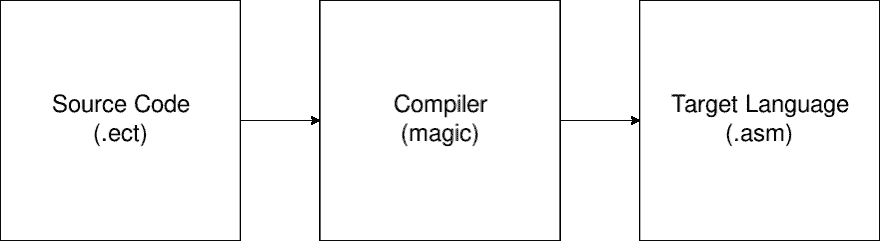
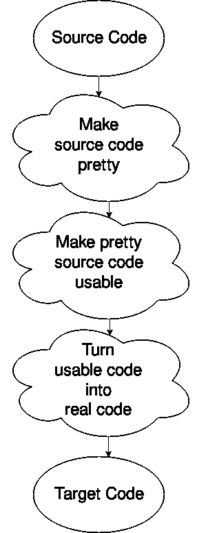
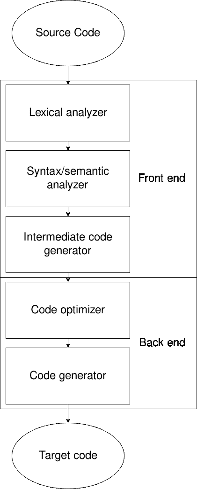

# 如何让你自己的编程语言从头开始编写一个简单的编程语言-第 1 部分

> 原文：<https://dev.to/evantypanski/writing-a-simple-programming-language-from-scratch-part-1-54a2>

如果你是一名开发人员，你使用过编程语言。它们是让电脑做你想让它做的事情的绝妙方法。也许你已经深入研究过汇编或机器码编程了。许多人再也不想回来了。但是有些人想知道，我怎样才能通过做更多的低级编程来折磨自己呢？想多了解一下编程语言是怎么做出来的！玩笑归玩笑，写一门新语言并不像听起来那么糟糕，所以如果你有一点好奇心，我建议你留下来看看它是关于什么的。

这篇文章的目的是简单地探究一门编程语言是如何被创造出来的，以及你如何创造你自己的特殊语言。甚至可能以你的名字命名。谁知道呢。

我还打赌，这似乎是一个令人难以置信的艰巨任务。别担心，我已经考虑过了。我尽最大努力相对简单地解释了一切，没有过多地跑题。在这篇文章的结尾，你将能够创建你自己的编程语言(将会有一些部分)，但是还有更多。了解幕后发生的事情会让你更好地调试。你会更好地理解新的编程语言，以及它们为什么做出这样的决定。你可以拥有一门以你自己命名的编程语言，如果我之前没有提到的话。还有，真的很好玩。至少对我来说是这样。

## 编译器和解释器

编程语言一般都是高级的。也就是说，你看的不是 0 和 1，也不是寄存器和汇编代码。但是，你的计算机只理解 0 和 1，所以它需要一种方法来从你容易阅读的内容转移到机器可以容易阅读的内容。翻译可以通过编译或解释来完成。

编译是将源语言的整个源文件转换成目标语言的过程。出于我们的目的，我们将考虑从你全新的、最先进的语言开始编译，一直到可运行的机器代码。

[](https://res.cloudinary.com/practicaldev/image/fetch/s--KX1JOMMO--/c_limit%2Cf_auto%2Cfl_progressive%2Cq_auto%2Cw_880/https://thepracticaldev.s3.amazonaws.com/i/c5difsv2s2rvk1iwzcih.png)

我的目标是让“魔法”消失

解释是或多或少直接执行源文件中代码的过程。我会让你觉得这很神奇。

那么，如何从易读的源语言到难懂的目标语言呢？

## 编译器的阶段

编译器可以用各种方式分成几个阶段，但有一种方式是最常见的。当你第一次看到它的时候，它只有很小的意义，但是它是这样的:

[](https://res.cloudinary.com/practicaldev/image/fetch/s--s2sFruz3--/c_limit%2Cf_auto%2Cfl_progressive%2Cq_auto%2Cw_880/https://thepracticaldev.s3.amazonaws.com/i/cq1uo0x1gp7k73jldp7o.png)

哎呀，我选错了图，但是这个可以。基本上，你得到源文件，把它转换成计算机想要的格式(去掉空格之类的东西)，把它转换成计算机能很好地适应的格式，然后从中生成代码。还有更多。那是另一个时间，或者你自己的研究，如果你的好奇心正在杀死你。

## 词法分析

### 又名“使源代码漂亮”

考虑以下完全虚构的语言，它基本上只是一个带有分号的计算器:

```
 //  source.ect  3  +  3.2;  5.0  /  1.9;  6  *  2; 
```

<svg width="20px" height="20px" viewBox="0 0 24 24" class="highlight-action crayons-icon highlight-action--fullscreen-on"><title>Enter fullscreen mode</title></svg> <svg width="20px" height="20px" viewBox="0 0 24 24" class="highlight-action crayons-icon highlight-action--fullscreen-off"><title>Exit fullscreen mode</title></svg>

计算机不需要所有这些。空间只适合我们狭隘的思想。还有新台词？没人需要这些。计算机将你看到的这段代码转换成一串可以代替源文件使用的标记。基本上，它知道`3`是一个整数，`3.2`是一个浮点数，`+`是对这两个值进行运算的东西。这就是电脑*真正需要*应付的一切。提供这些标记是**词法分析器**的工作，而不是源程序。

它是如何做到的真的很简单:给 lexer(词法分析器的一种不那么自命不凡的说法)一些预期的东西，然后告诉它当它看到这些东西时该做什么。这些被称为*规则*。这里有一个例子:

```
int     cout << "I see an integer!" << endl; 
```

<svg width="20px" height="20px" viewBox="0 0 24 24" class="highlight-action crayons-icon highlight-action--fullscreen-on"><title>Enter fullscreen mode</title></svg> <svg width="20px" height="20px" viewBox="0 0 24 24" class="highlight-action crayons-icon highlight-action--fullscreen-off"><title>Exit fullscreen mode</title></svg>

当一个 int 通过 lexer 时，这条规则被执行，你会看到一个非常明显的“我看到一个整数！”感叹。这不是我们使用 lexer 的方式，但是看到代码执行是任意的是很有用的:没有规则要求你必须创建某个对象并返回它，这只是常规的旧代码。甚至可以用大括号将多行括起来。

顺便说一下，我们将使用一种叫做 [FLEX](https://github.com/westes/flex) 的东西来进行 lexing。它使事情变得非常简单，但是没有什么能阻止你自己做一个程序来做这件事。

为了理解我们将如何使用 flex，请看这个例子:

```
 // scanner.lex
    /* Definitions */
    %{
      #include <iostream>       using namespace std;
      extern "C" int yylex();
    %}

    /* Rules next */
    %%
    [0-9]+.[0-9]+ cout << "FLOAT: (" << yytext << ")" << endl;
    [0-9]+        cout << "INT: (" << yytext << ")" << endl;
    "+"           cout << "PLUS" << endl;
    "-"           cout << "MINUS" << endl;
    "*"           cout << "TIMES" << endl;
    "/"           cout << "DIVIDED BY" << endl;
    ";"           cout << "SEMICOLON" << endl;
    [\t\r\n\f]    ; /* ignore whitespace */

    %%
    /* Code */

    int main() {
      yylex();
    } 
```

<svg width="20px" height="20px" viewBox="0 0 24 24" class="highlight-action crayons-icon highlight-action--fullscreen-on"><title>Enter fullscreen mode</title></svg> <svg width="20px" height="20px" viewBox="0 0 24 24" class="highlight-action crayons-icon highlight-action--fullscreen-off"><title>Exit fullscreen mode</title></svg>

这引入了一些新概念，所以让我们回顾一下:

`%%`用于分隔章节。lex 文件。第一部分是声明——基本上是使 lexer 可读性更好的变量。它也是你进口的地方，被`%{`和`%}`包围着。

第二部分是规则，我们之前见过。这些基本上都是一大块`if` `else if`。它将执行*最长匹配*的行。因此，即使你改变了 float 和 int 的顺序，float 仍然会匹配，因为匹配 3 个字符的`3.2`比匹配 1 个字符的`3`多。请注意，如果这些规则都不匹配，它将使用默认规则，只是将字符打印到标准输出。然后，您可以使用`yytext`来引用它所看到的符合该规则的内容。

第三部分是代码，它是在执行时运行的简单的 C 或 C++源代码。`yylex();`是运行 lexer 的函数调用。您也可以让它从文件中读取输入，但是默认情况下，它从标准输入中读取。

假设您创建了这两个文件`source.ect`和`scanner.lex`。我们可以使用`flex`命令创建一个 C++程序(假设你已经安装了`flex`)，然后编译它并输入我们的源代码，得到我们令人敬畏的打印语句。让我们付诸行动吧！

```
evan:ectlang/ $ flex scanner.lex
evan:ectlang/ $ g++ lex.yy.c -lfl
evan:ectlang/ $ ./a.out < source.ect
INT: (3)
PLUS
FLOAT: (3.2)
SEMICOLON
FLOAT: (5.0)
DIVIDED BY
FLOAT: (1.9)
SEMICOLON
INT: (6)
TIMES
INT: (2)
SEMICOLON
evan:ectlang/ $ 
```

<svg width="20px" height="20px" viewBox="0 0 24 24" class="highlight-action crayons-icon highlight-action--fullscreen-on"><title>Enter fullscreen mode</title></svg> <svg width="20px" height="20px" viewBox="0 0 24 24" class="highlight-action crayons-icon highlight-action--fullscreen-off"><title>Exit fullscreen mode</title></svg>

嘿，酷！你只是在编写 C++代码，将输入与规则相匹配，以便做一些事情。

现在，编译器如何使用它呢？一般来说，每个规则会返回一些东西——一个令牌，而不是打印一些东西。这些标记可以在编译器的下一部分中定义...

## 语法分析器

### 又名“使漂亮的源代码可用”

是时候开心一下了！一旦我们到达这里，我们开始定义程序的结构。解析器只是得到一个令牌流，它必须匹配这个流中的元素，以使源代码具有可用的结构。为了做到这一点，它使用了[语法](https://en.wikipedia.org/wiki/Formal_grammar)，这种东西你可能在理论课上见过，或者听过你的古怪朋友在外面谈论。它们非常强大，有太多的内容需要深入研究，但是我将只给出您需要知道的关于我们那种愚蠢的解析器的内容。

基本上，语法将非终结符与终结符和非终结符的某种组合进行匹配。终端是树的叶子；非终端有孩子。如果这没有意义，不要担心，代码可能会更容易理解。

我们将使用名为 [Bison](https://www.gnu.org/software/bison/) 的解析器生成器。这一次，为了便于解释，我将把文件分成几个部分。首先，申报:

```
 // parser.y
    %{
      #include <iostream>       using namespace std;
      extern "C" void yyerror(char *s);
      extern "C" int yyparse();
    %}

    %union{
      int intVal;
      float floatVal;
    }

    %start program

    %token <intVal> INTEGER_LITERAL
    %token <floatVal> FLOAT_LITERAL
    %token SEMI
    %type <floatVal> exp
    %type <floatVal> statement
    %left PLUS MINUS
    %left MULT DIV 
```

<svg width="20px" height="20px" viewBox="0 0 24 24" class="highlight-action crayons-icon highlight-action--fullscreen-on"><title>Enter fullscreen mode</title></svg> <svg width="20px" height="20px" viewBox="0 0 24 24" class="highlight-action crayons-icon highlight-action--fullscreen-off"><title>Exit fullscreen mode</title></svg>

第一部分应该看起来很熟悉:我们正在导入我们想要使用的东西。之后事情就变得有点棘手了。

这个联合是一个“真正的”C++类型到我们在整个程序中所称的 c++类型的映射。所以，当我们看到`intVal`时，你可以用`int`代替你头脑中的那个，当我们看到`floatVal`时，你可以用`float`代替你头脑中的那个。稍后你会明白为什么。

接下来我们来看符号。你可以在头脑中把它们分为终结符和非终结符，就像我们之前讨论的语法一样。大写字母表示终端，所以不继续扩展。小写表示非终结符，所以继续扩展。那只是惯例。

每个声明(以`%`开始)声明一些符号。首先，我们看到我们从一个非终结符`program`开始。然后，我们定义一些记号。`<>`括号定义了返回类型:所以`INTEGER_LITERAL`终端返回一个`intVal`。`SEMI`端子不返回任何信息。使用`type`可以对非终结符做类似的事情，正如将`exp`定义为返回`floatVal`的非终结符时所看到的。

最后，我们进入优先顺序。我们知道 PEMDAS，或者其他你可能学过的缩写，它告诉你一些简单的优先规则:乘法先于加法，等等。现在，我们以一种奇怪的方式在这里声明。首先，列表中较低的位置意味着较高的优先级。第二，你可能想知道`left`是什么意思。这就是关联性:非常多，如果我们有`a op b op c`，`a`和`b`一起去，或者`b`和`c`？我们的大多数操作符都是前者，其中`a`和`b`先结合在一起:这叫做左结合性。一些操作符，比如指数运算，则相反:`a^b^c`期望你先提高`b^c`，然后再提高`a^(b^c)`。但是，我们不会处理那个。如果你想了解更多的细节，请查看 Bison 页面。

好吧，我可能用声明让你厌烦了，这里是语法规则:

```
 // parser.y
    %%
    program: /* empty */
        | program statement { cout << "Result: " << $2 << endl; }
        ;

    statement: exp SEMI

    exp:
        INTEGER_LITERAL { $$ = $1; }
        | FLOAT_LITERAL { $$ = $1; }
        | exp PLUS exp  { $$ = $1 + $3; }
        | exp MINUS exp { $$ = $1 - $3; }
        | exp MULT exp  { $$ = $1 * $3; }
        | exp DIV exp   { $$ = $1 / $3; }
        ; 
```

<svg width="20px" height="20px" viewBox="0 0 24 24" class="highlight-action crayons-icon highlight-action--fullscreen-on"><title>Enter fullscreen mode</title></svg> <svg width="20px" height="20px" viewBox="0 0 24 24" class="highlight-action crayons-icon highlight-action--fullscreen-off"><title>Exit fullscreen mode</title></svg>

这就是我们之前谈论的语法。如果你不熟悉语法，这很简单:左手边可以变成右手边的任何东西，用`|`(逻辑`or`)隔开。如果它可以有多条路径，这是不允许的，我们称之为*模糊语法*。由于我们的优先声明，这一点并不含糊——如果我们改变它，使 plus 不再是左关联的，而是声明为像`SEMI`一样的`token`,我们会看到我们得到了一个 shift/reduce 冲突。想了解更多？查找 Bison 如何工作，提示，它使用 LR 解析算法。

好的，所以`exp`可以变成这些情况中的一种:一个`INTEGER_LITERAL`，一个`FLOAT_LITERAL`，等等。注意这也是递归的，所以`exp`可以变成两个`exp`。这允许我们使用复杂的表达式，比如`1 + 2 / 3 * 5`。记住，每个`exp`返回一个浮点类型。

括号内的内容与我们看到的 lexer: arbitrary C++代码是一样的，但是语法上更奇怪。在这种情况下，我们在特殊变量前添加了`$`。变量`$$`基本就是返回的内容。`$1`是第一个参数返回的内容，`$2`是第二个参数返回的内容，等等。我说的“参数”是指语法规则的一部分:所以规则`exp PLUS exp`有参数 1 `exp`、参数 2 `PLUS`和参数 3 `exp`。因此，在我们的代码执行中，我们将第一个表达式的结果添加到第三个表达式中。

最后，一旦它返回到`program`非终结符，它将打印语句的结果。在这种情况下，程序是一串语句，其中语句是一个表达式，后跟一个分号。

现在我们来写代码部分。这是我们在解析器中实际运行的内容:

```
 // parser.y
    %%
    int main(int argc, char **argv) {
      if (argc < 2) {
        cout << "Provide a filename to parse!" << endl;
        exit(1);
      }
      FILE *sourceFile = fopen(argv[1], "r");

      if (!sourceFile) {
        cout << "Could not open source file " << argv[1] << endl;
        exit(1);
      }

      // Sets input for flex to the file instead of standard in
      yyin = sourceFile;
      // Now let's parse it!
      yyparse();
    }

    // Called on error with message s
    void yyerror(char *s) {
      cerr << s << endl;
    } 
```

<svg width="20px" height="20px" viewBox="0 0 24 24" class="highlight-action crayons-icon highlight-action--fullscreen-on"><title>Enter fullscreen mode</title></svg> <svg width="20px" height="20px" viewBox="0 0 24 24" class="highlight-action crayons-icon highlight-action--fullscreen-off"><title>Exit fullscreen mode</title></svg>

好吧，这开始变得有趣了。我们的 main 函数现在从第一个参数提供的文件中读取，而不是从标准 in 中读取，并且我们添加了一些错误代码。这是不言自明的，注释很好地解释了正在发生的事情，所以我将它作为一个练习留给读者来解决。您需要知道的是，现在我们回到了 lexer，向解析器提供标记！这是我们的新词汇

```
 // scanner.lex
    %{
      extern "C" int yylex();
      #include "parser.tab.c" // Defines the tokens     %}

    %%
    [0-9]+        { yylval.intVal = atoi(yytext); return INTEGER_LITERAL; }
    [0-9]+.[0-9]+ { yylval.floatVal = atof(yytext); return FLOAT_LITERAL; }
    "+"           { return PLUS; }
    "-"           { return MINUS; }
    "*"           { return MULT; }
    "/"           { return DIV; }
    ";"           { return SEMI; }
    [ \t\r\n\f]   ; /* ignore whitespace */ 
```

<svg width="20px" height="20px" viewBox="0 0 24 24" class="highlight-action crayons-icon highlight-action--fullscreen-on"><title>Enter fullscreen mode</title></svg> <svg width="20px" height="20px" viewBox="0 0 24 24" class="highlight-action crayons-icon highlight-action--fullscreen-off"><title>Exit fullscreen mode</title></svg>

嘿，那现在实际上更小了！我们看到的不是打印，而是返回终端符号。其中一些，像 int 和 floats，我们在继续之前首先设置值(`yylval`是终端符号的返回值)。除此之外，它只是给了解析器一个终端令牌流，供解析器自由使用。

太好了，那我们就开始吧！

```
evan:ectlang/ $ bison parser.y
evan:ectlang/ $ flex scanner.lex
evan:ectlang/ $ g++ lex.yy.c -lfl
evan:ectlang/ $ ./a.out source.ect
Result: 6.2
Result: 2.63158
Result: 12 
```

<svg width="20px" height="20px" viewBox="0 0 24 24" class="highlight-action crayons-icon highlight-action--fullscreen-on"><title>Enter fullscreen mode</title></svg> <svg width="20px" height="20px" viewBox="0 0 24 24" class="highlight-action crayons-icon highlight-action--fullscreen-off"><title>Exit fullscreen mode</title></svg>

我们开始了——我们的解析器打印出正确的值！但这不是真正的编译器，它只是运行 C++代码，执行我们想要的。要做一个编译器，我们要把这个变成机器码。为了做到这一点，我们需要添加一点点...

## 直到下一次...

我现在意识到这篇文章会比我想象的长很多，所以我想我会在这里结束这篇文章。我们基本上有一个工作的词法分析器和语法分析器，所以这是一个很好的停止点。

如果你想看看最终产品，我已经把源代码放到了我的 Github 上。随着更多帖子的发布，回购将会有更多的活动。

给定我们的词法分析器和语法分析器，我们现在可以生成代码的中间表示，最终可以转换成真正的机器代码，我将向您展示具体如何做。

第二部分开始了！

### 附加资源

如果你碰巧想了解更多这里涉及的信息，我已经链接了一些资料来开始。我讲了很多，所以这是我向你们展示如何深入这些话题的机会。

*   Flex 代码库:[https://github.com/westes/flex](https://github.com/westes/flex)——我们使用的词法分析工具。
*   Bison 文档:[https://www.gnu.org/software/bison/](https://www.gnu.org/software/bison/)——我们使用的解析器生成器。这里有很棒的文档。
*   LALR 解析:[https://web.cs.dal.ca/~sjackson/lalr1.html](https://web.cs.dal.ca/%7Esjackson/lalr1.html)-一个关于 LALR(1)解析器的很好的解释(像 Bison 生成的！)工作。
*   解析解析冲突:[http://www . cs . ECU . edu/Karl/5220/SPR 16/Notes/Bottom-up/conflict . html](http://www.cs.ecu.edu/karl/5220/spr16/Notes/Bottom-up/conflict.html)-如何修复 shift/reduce 或 reduce/reduce 冲突，就像我们之前看到的。
*   乔姆斯基层次结构:[https://en.wikipedia.org/wiki/Chomsky_hierarchy](https://en.wikipedia.org/wiki/Chomsky_hierarchy)-对此没有太多的细节，但我们使用了上下文无关的语法，所以 Bison 可以编译它。如果您想要上下文敏感，那是在后面的阶段。
*   符号表:[https://www . tutorialspoint . com/compiler _ design/compiler _ design _ symbol _ table . htm](https://www.tutorialspoint.com/compiler_design/compiler_design_symbol_table.htm)-使用符号表，编译器如何处理变量。

哦，顺便说一下，如果你不喜欢我的编译器阶段，这里有一个实际的图表。我仍然没有提到符号表和错误处理程序。还要注意，许多图表与此不同，但这最好地展示了我们所关心的内容。

[](https://res.cloudinary.com/practicaldev/image/fetch/s--tNjVnW1D--/c_limit%2Cf_auto%2Cfl_progressive%2Cq_auto%2Cw_880/https://thepracticaldev.s3.amazonaws.com/i/4bgv9blwleizrmcfw2fq.png)