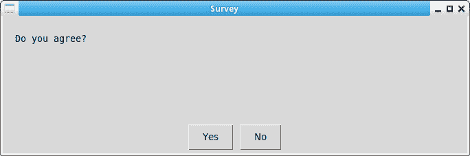
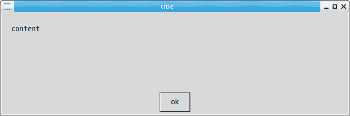
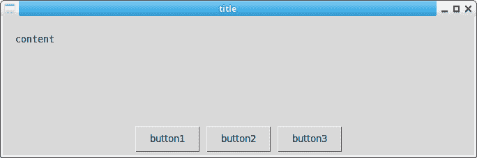

# 使用 Python 的 EasyGUI，示例

> 原文：<https://dev.to/petercour/easygui-with-python-example-45h5>

EasyGui 为与用户的简单 Gui 交互
提供了一个易于使用的界面。

它不需要程序员了解任何关于 tkinter、框架、窗口小部件、回调或 lambda 的知识。

所有 GUI 交互都由返回结果的简单函数调用来调用。

例子

```
#!/usr/bin/python3         
# https://pythonbasics.org                                                                                                                                                
import easygui as g
import sys

def ccbox():
    if g.ccbox('Do you agree?','Survey',choices=('Yes','No')):
        g.msgbox('Hockey')
    else:
        sys.exit(0)

ccbox() 
```

创建以下输出:

[](https://res.cloudinary.com/practicaldev/image/fetch/s--rsCbmn2a--/c_limit%2Cf_auto%2Cfl_progressive%2Cq_auto%2Cw_880/https://thepracticaldev.s3.amazonaws.com/i/xppylvgta3aabbfxwhvm.png)

这需要安装 tkinter(在 ubuntu 上)，

```
sudo apt-get install python3-tk 
```

因为它使用 tkinter 来制作它的 gui。

easygui 可以创建不同类型的弹出窗口:

```
#!/usr/bin/python3         

import easygui as g
def msgbox(msg,title):
    g.msgbox(msg, title, ok_button='ok',image=None)

msgbox(msg = 'content',title = 'title') 
```

[](https://res.cloudinary.com/practicaldev/image/fetch/s--c-uulvb0--/c_limit%2Cf_auto%2Cfl_progressive%2Cq_auto%2Cw_880/https://thepracticaldev.s3.amazonaws.com/i/7766a9u3zr69mqjv6qfw.png)

### 选择

允许您在选项之间进行选择

```
#!/usr/bin/python3         

import easygui as g

def buttonbox(msg,title):
    g.buttonbox(msg, title, choices=('button1','button2','button3'),image=None)

buttonbox(msg = 'content',title = 'title') 
```

然后

[](https://res.cloudinary.com/practicaldev/image/fetch/s--OCp2k9J5--/c_limit%2Cf_auto%2Cfl_progressive%2Cq_auto%2Cw_880/https://thepracticaldev.s3.amazonaws.com/i/lekq90qynrvo14ovtlod.png)

资源:

*   [Python Tkinter 视频教程](https://gumroad.com/l/ErLc)
*   [t inter stuff](https://pythonbasics.org/tkinter/)
*   [Python 教程](https://pythonbasics.org/)