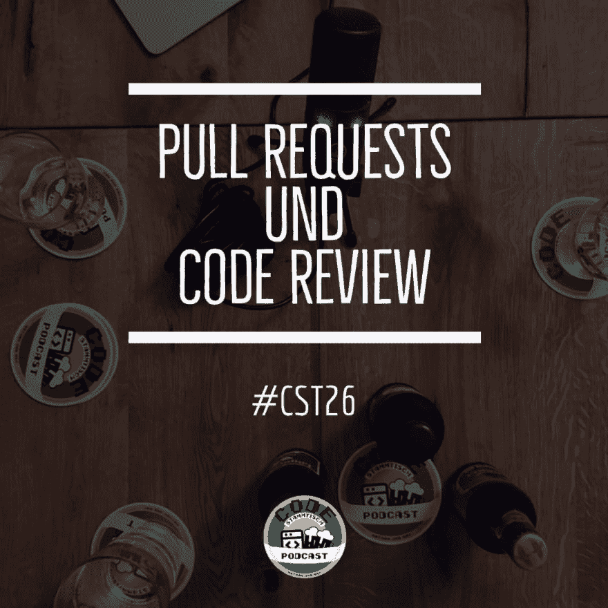

# CST026 —拉取请求和代码审查

> [https://dev . to/code base/CST 026-pull 请求和代码审查-5k2](https://dev.to/codestammtisch/cst026-pull-requests-und-code-review-5k2)

Mac 奶酪是面条和大多数奶酪的最佳选择。难道真的有这样一家餐馆，就是要先吃完成品菜的原料，然后才能好好地烤熟，才能收获和珍惜最后的成果吗？我看到这里有个市场缺口！

无论如何，我们将依次讨论拉式请求、代码审查以及代码审查和拉式请求。我们如何在各自的团队中处理这些问题？如果没有它，我们又会有什么好处呢？扰流板:大概不会。Max 正与[samal ADAMS rebel IPA](https://www.samueladams.com/our-beers/rebel-ipa-family/ipa/rebel-ipa)一起为即将到来的红色婚礼做准备，而 Nathan 与 [stino](https://www.duden.de/rechtschreibung/Stino) [Bi(他)onade 柠檬佛塔](https://www.bionade.de/zitrone-bergamotte/)更喜欢安全号码。

Max 还可以说[【活着】](https://store.pantone.com/de/de/color-of-the-year-2019)是 2019 年的颜色，内森看到了一只鹰的视频，[滑过阿尔卑斯山脉](https://www.langweiledich.net/flug-ueber-die-alpen-aus-der-sicht-eines-adlers/%20)。此序列中提到的其他链接包括:

*   [Pro Git，一本关于 git-git-SCM . com](https://git-scm.com/book/en/v2)的书
*   [der Praxis-heise . de](https://www.heise.de/developer/artikel/Nachgebessert-Pull-Request-Workflows-in-der-Praxis-4341944.html?seite=all)中的拉式请求工作流
*   [人性化拉取请求的艺术——dev . to](https://dev.to/kulkarniankita9/the-art-of-humanizing-pull-requests-prs-2238)

我们一如既往地感谢您的聆听。改进建议、饮料建议、爱的表达和批评，请一如既往地通过 Twitter 发送至【或通过电子邮件发送至[【您好-at-code tamitis . ch】](mailto:hallo@codestammtis.ch)

结尾的简短广告:[支持稳定](https://steadyhq.com/de/codestammtisch)上的代码表。非常感谢！

结果如下:[https://codes tamitis . ch/2019/04/22/CST 026-拉式请求和代码审查/](https://codestammtis.ch/2019/04/22/cst026-pull-requests-und-code-review/)