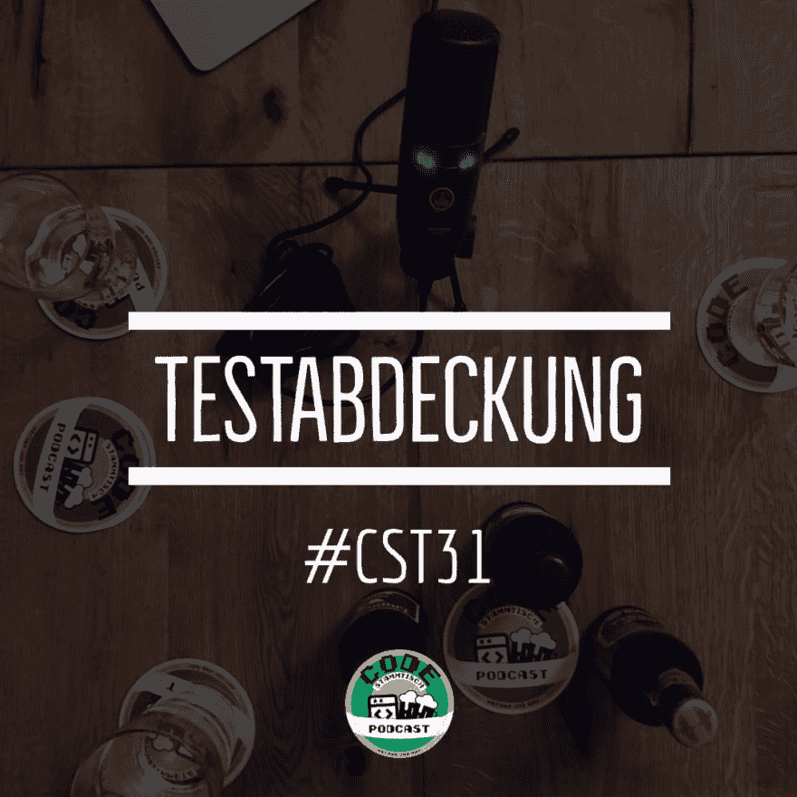

# cst 031 测试范围

> [https://dev . to/code base/CST 031-测试复盖范围-hf5](https://dev.to/codestammtisch/cst031-testabdeckung-hf5)

Max 最近开始了一个新项目 max started a new project last night，他想把一切都做得更好 where he wants to make everything right and everything better .其中还包括与团队一起开发测试业务，其中还包括较高的测试复盖率。

那是什么？为什么一定要高？这有什么好处？我如何说服其他人？如果我不像 Max 一样站在绿色草地上而是用“历史编码”工作，我怎么能得到更高的测试复盖率呢？and how the hell do I actually get a high test cover if I ' m not standing on green grass，but working with“历史编码”？

这是 Max 在一个轻便的[手套 badish hell](https://www.ganter.com/produkte/ganter-spezialitaeten/ganter-badisch-hell.html)和 Nathan 在一个重型[木板套 maibok](https://www.riedenburger.de/startseite/biere/plankstettener-biere/plankstettener-maibock/article/maibock-fest-im-kloster-plankstetten.html)和折扣式巧克力布丁残羹剩饭上讨论的！和 Cat 内容。

我们一如既往地感谢您的聆听。改进建议、饮料建议、爱的表达和批评，请一如既往地通过 Twitter 发送至【或通过电子邮件发送至[【您好-at-code tamitis . ch】](mailto:hallo@codestammtis.ch)

结尾的简短广告:[支持稳定](https://steadyhq.com/de/codestammtisch)上的代码表。非常感谢！

这就是为什么:https://codes tamitis . ch/2019/07/01/CST 031-测试复盖/