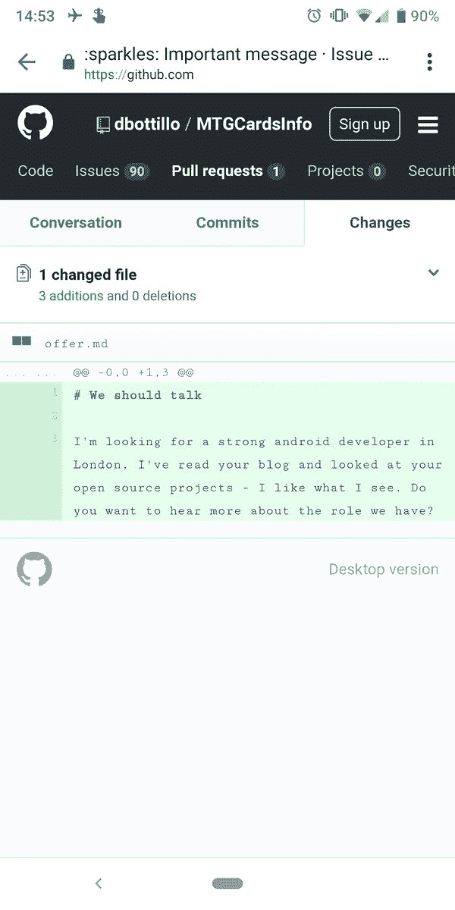

# What is your´s worst experience with recruiters?

> 原文：[https://dev.to/brpaz/what-is-your-s-worst-experience-with-recruiters-2ld1](https://dev.to/brpaz/what-is-your-s-worst-experience-with-recruiters-2ld1)

If you work in tech and have a Linkedin account, the probability that you receive daily messages from recruiters is pretty high.

While a few might be interesting and realistic proposals, I would say most of them could be considered close to SPAM and show a lack of preparation and understanding of the field. (Like saying that are looking for Java devs, for someone who has Javascript in their profile).

This morning, I was reading my Twitter feed and saw this tweet:

> Daniele Bottillo[@dbottillo](https://dev.to/dbottillo)Recruiter also in GitHub opening PRs on my personal open source project, that's next level for me.13:55 PM - 04 Jul 2019  

A guy who was contacted by a recruiter via a Pull Request in one of his Open source repos!

It seems that recruiters are getting more and more "creative" and start using all the possible means just to get your attention!

While I understand creativity is important to get noticed in a very crowded field like tech, some actions might be too much invasive.

This inspired me to write this post and to talk about which was probably my worst experience ever with a recruiter.

Some years ago, It was another normal working day at my company when the receptionist came to me saying I had a phone call from someone saying claiming to be from the University where I graduated some years ago.

I was very surprised but went to the phone.

When I pick it up, the guy starts talking that he had an opportunity for me and if I want to schedule an interview and so on.

I ended up not understanding If he really worked at the university or not, but I believe it was a just bait to get my attention. He probably got that info as well as the company info by looking at my Linkedin profile.

He also gave me a name that I couldn't find anywhere on Linkedin, so I believe it was fake too.

And by his voice, seemed very anxious and not really secure of himself.

What can lead to someone to have this kind of behavior? Calling to your work with a bunch of lies just to grab your attention?

I believe there are good and professional recruiters out there and that they have an important role, but I think the image of the field is getting very damaged by examples like these.

So, What are your experiences with recruiters?

If you work in the recruiting field and are reading this, please also feel free to share your opinion on the topic.