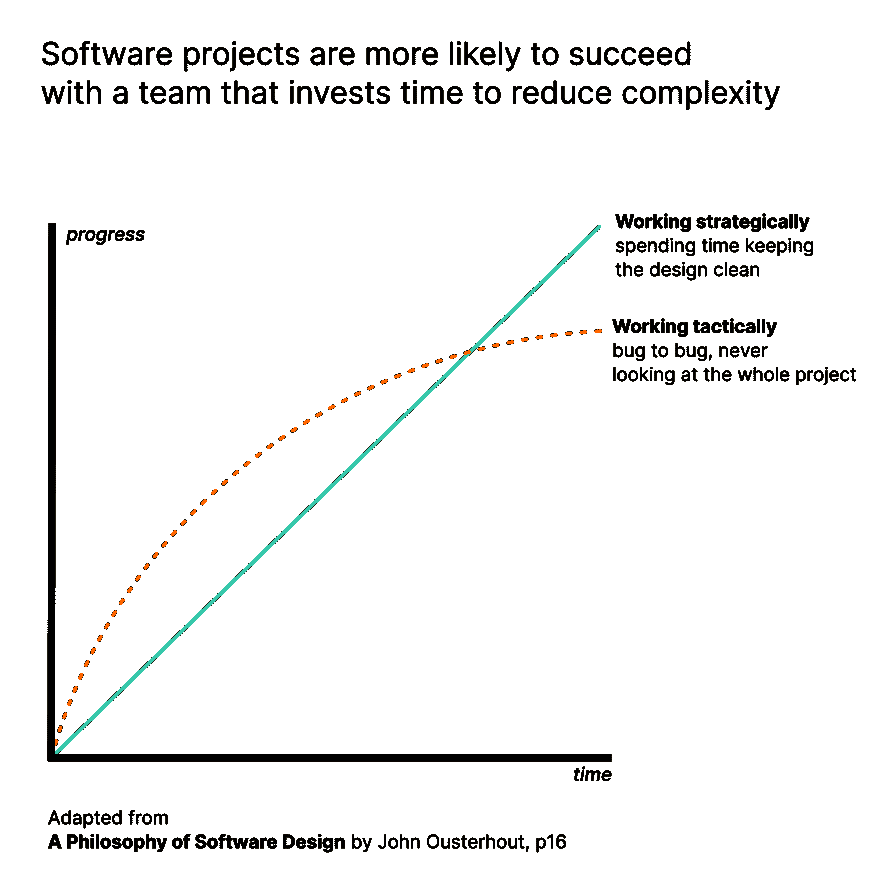

# 更短并不意味着更简单(以及其他关于代码复杂性的教训)

> 原文：<https://dev.to/timclicks/shorter-doesn-t-mean-simpler-and-other-lessons-about-code-complexity-279d>

随着软件系统变得越来越大，它们也变得越来越复杂。复杂的软件更难改进。斯坦福大学教授约翰·奥斯特尔豪特最近出版了一本非常简洁的书，提供了许多让生活变得更简单的技巧。

总的建议是，如果你的团队正在纠结于一个意大利面条式的代码库，其成员应该投入他们总开发时间的 10-20%来清理它。

这本书的标题有误导性。它提到了“哲学”，但这本书在本质上非常实用。它又小又短。它的信息是明确的。

## 为什么要费心清理代码？

如果你的团队工作聪明，完成项目的可能性更大。尽可能快地挤压每个 bug*感觉*更快，但是随着时间的推移，你可能会增加技术债务。

## 能做什么？

这本书提供了很多建议，通常来自于审查代码的经验。以下是我从书中获得的一些建议。

*   关注你的界面，仔细考虑你要抽象的东西。有效接口的标志是比实现简单。在某种意义上，新界面增加的复杂性需要证明其存在的合理性。
*   诸如“一个函数的长度不应该超过 n 行”这样的规则是任意且无效的。函数应该尽可能长，以完成它们的工作。将功能分解成多个子功能只会增加复杂性，不会带来任何好处。
*   注释应该记录代码不能做什么。纯粹是伪代码的评论是一种干扰。
*   围绕关键路径进行设计。这对我来说是一个非常有趣的问题。考虑从哪里开始清理一个大的代码库比担心整个任务的大小要容易得多。

## 对我有帮助吗？

我是一个拥有超过一百万行代码的[代码库的团队成员。经过近十年的发展，我们已经建立了一个又一个复杂的层次。许多降低复杂性的尝试实际上都失败了。它们从来都不完整。这意味着现在有两件事需要解决，而不是一件。](https://github.com/juju/juju)

这本书给了我一个全新的视角(&一些希望！).它也给了我一个新的工具包。我真的很感激几乎每一页都提供了真知灼见。

## 值得买吗？

如果你的团队在技术债务的重压下苦苦挣扎，那么毫无疑问。如果你是编程新手，可能会。这是一个容易理解的语言不可知的成为更好的程序员的指南。这对我有很大的好处。

* * *

图片来源:里克·梅森的封面图片。图由蒂姆·麦克纳马拉([@蒂姆点击](https://dev.to/timclicks))。