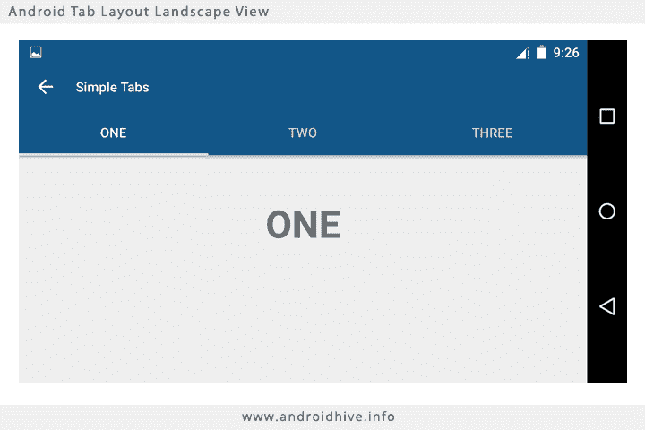
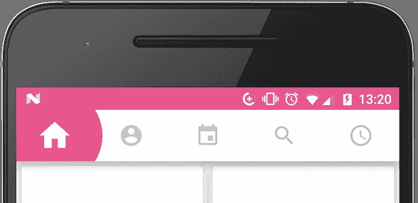
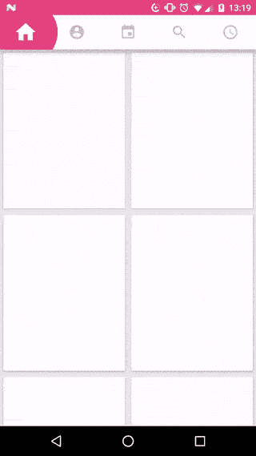

# Xamarin 中的新标签。安卓！

> 原文：<https://dev.to/fanmixco/fresh-tabs-in-xamarin-android-1cac>

我们能不能稍微打破 Android 的标准，设计出一些独特的东西？

我要说这是可能的，不久前我还在尝试重写我的一些严重依赖选项卡的应用程序，因为现在我们有非常大的手机，我们想到的下一个想法是底部选项卡！这实际上很酷，但是如果你只有两个标签，这可能会引起争议！谷歌甚至建议你不要这样做，你应该使用无聊和不时尚的常规标签！

[](https://res.cloudinary.com/practicaldev/image/fetch/s--xdShVTJm--/c_limit%2Cf_auto%2Cfl_progressive%2Cq_auto%2Cw_880/https://www.androidhive.info/wp-content/uploads/2015/09/android-tab-layout-landscape-view.png)

他们往往看起来很无聊，一点也不好看，让我们不要谈论添加图标，这是一个棘手的问题。如果你想支持最新版本的 Android，没有简单明了的代码。

在那之后，我开始思考和寻找一个替代方案，神奇的是，我找到了这个很酷的控件:[Florent CHAMPIGNY 的 bubble tabs](https://github.com/florent37)。好吃吗？好吧，让我们看看它的行动！

[](https://res.cloudinary.com/practicaldev/image/fetch/s--Js-pFNc9--/c_limit%2Cf_auto%2Cfl_progressive%2Cq_auto%2Cw_880/https://raw.githubusercontent.com/florent37/BubbleTab/master/media/withScreen_cropped.png)

你最喜欢哪一个？

我会说你和我一样更喜欢第二个，因此，我花了一些时间将控件带到 Xamarin 中。怎么用？让我们看看！

### **第一步。从 NuGet 下载软件包:**

[](https://www.nuget.org/packages/BubbleTabs.Xamarin)

### **第二步。创造你的新风格！**

**Style.xml**

```
<resources>
  <!-- Base application theme. -->
  <style name="AppTheme" parent="Theme.AppCompat.Light.NoActionBar">
    <!-- Customize your theme here. -->
    <item name="colorPrimary">@color/colorPrimary</item>
    <item name="colorPrimaryDark">@color/colorPrimaryDark</item>
    <item name="colorAccent">@color/colorAccent</item>
  </style>
</resources> 
```

<svg width="20px" height="20px" viewBox="0 0 24 24" class="highlight-action crayons-icon highlight-action--fullscreen-on"><title>Enter fullscreen mode</title></svg> <svg width="20px" height="20px" viewBox="0 0 24 24" class="highlight-action crayons-icon highlight-action--fullscreen-off"><title>Exit fullscreen mode</title></svg>

### **第三步。配置您的布局**

```
<LinearLayout
    xmlns:android="http://schemas.android.com/apk/res/android"
    xmlns:app="http://schemas.android.com/apk/res-auto"
    android:layout_width="match_parent"
    android:layout_height="match_parent"
    android:orientation="vertical">

    <com.github.florent37.bubbletab.BubbleTab
        android:id="@+id/bubbleTab"
        android:layout_width="match_parent"
        android:layout_height="wrap_content"
        android:clipToPadding="false"
        android:background="@android:color/white"
        android:elevation="10dp"
        app:bubbleTab_circleColor="@color/colorAccent"
        app:bubbleTab_circleRatio="1.25">
        <ImageView
            android:layout_width="match_parent"
            android:layout_height="match_parent"
            android:layout_weight="1"
            android:padding="16dp"
            android:src="@drawable/icon1" />
        <ImageView
            android:layout_width="match_parent"
            android:layout_height="match_parent"
            android:layout_weight="1"
            android:padding="16dp"
            android:src="@drawable/icon2" />
        <ImageView
            android:layout_width="match_parent"
            android:layout_height="match_parent"
            android:layout_weight="1"
            android:padding="16dp"
            android:src="@drawable/icon3" />
    </com.github.florent37.bubbletab.BubbleTab>

    <android.support.v4.view.ViewPager
        android:id="@+id/viewPager"
        android:layout_width="match_parent"
        android:layout_height="match_parent"/>
</LinearLayout> 
```

<svg width="20px" height="20px" viewBox="0 0 24 24" class="highlight-action crayons-icon highlight-action--fullscreen-on"><title>Enter fullscreen mode</title></svg> <svg width="20px" height="20px" viewBox="0 0 24 24" class="highlight-action crayons-icon highlight-action--fullscreen-off"><title>Exit fullscreen mode</title></svg>

此代码布局只是选项卡的一个示例:

**气泡包装 _ tab . XML** 

```
<?xml version="1.0" encoding="utf-8"?>
<android.support.v7.widget.RecyclerView
    xmlns:android="http://schemas.android.com/apk/res/android"
    android:id="@+id/recyclerView"
    android:layout_width="match_parent"
    android:layout_height="match_parent"
    android:background="#e9eaed"
    android:orientation="vertical">
</android.support.v7.widget.RecyclerView> 
```

<svg width="20px" height="20px" viewBox="0 0 24 24" class="highlight-action crayons-icon highlight-action--fullscreen-on"><title>Enter fullscreen mode</title></svg> <svg width="20px" height="20px" viewBox="0 0 24 24" class="highlight-action crayons-icon highlight-action--fullscreen-off"><title>Exit fullscreen mode</title></svg>

### **第四步。将您的选项卡添加到您的活动中，并构建您的适配器**

```
public class YourActivity : AppCompatActivity
{
    protected override void OnCreate(Bundle savedInstanceState)
    {
        base.OnCreate(savedInstanceState);

        // Set our view from the "main" layout resource
        SetContentView(Resource.Layout.Main);
        BubbleTab bubbleTab= FindViewById<BubbleTab>(Resource.Id.bubbleTab);
        ViewPager viewPager= FindViewById<ViewPager>(Resource.Id.viewPager);

        viewPager.Adapter = new FakeAdapter(SupportFragmentManager);

        bubbleTab.SetupWithViewPager(viewPager);
    }

    public class FakeAdapter : FragmentStatePagerAdapter
    {
        public FakeAdapter(Android.Support.V4.App.FragmentManager fm) : base(fm)
        {
            Fm = fm;
        }

        public override int Count
        {
            get { return 5; }
        }

        public Android.Support.V4.App.FragmentManager Fm { get; }

        public override Android.Support.V4.App.Fragment GetItem(int position)
        {
            switch (position)
            {
                default:
                    return FakeFragment.NewInstance();
            }
        }
    }

    public class FakeFragment : Android.Support.V4.App.Fragment
    {
        public override View OnCreateView(LayoutInflater inflater, ViewGroup container, Bundle savedInstanceState)
        {
            return inflater.Inflate(Resource.Layout.bubbletab_page, container, false);
        }

        public static Android.Support.V4.App.Fragment NewInstance()
        {
            return new FakeFragment();
        }
    }
} 
```

<svg width="20px" height="20px" viewBox="0 0 24 24" class="highlight-action crayons-icon highlight-action--fullscreen-on"><title>Enter fullscreen mode</title></svg> <svg width="20px" height="20px" viewBox="0 0 24 24" class="highlight-action crayons-icon highlight-action--fullscreen-off"><title>Exit fullscreen mode</title></svg>

仅此而已！现在你在 Xamarin 中有了漂亮而新鲜的标签！

[](https://res.cloudinary.com/practicaldev/image/fetch/s--sp7pbmPn--/c_limit%2Cf_auto%2Cfl_progressive%2Cq_66%2Cw_880/https://raw.githubusercontent.com/florent37/BubbleTab/master/media/video.gif)

### 关注我:

| 商务化人际关系网 | 油管（国外视频网站） | 照片墙 | 网络先知 | 分享您的故事 |
| --- | --- | --- | --- | --- |
| [](https://bit.ly/3xLCmvb) | [](https://youtube.com/c/FedericoNavarrete) | [](https://www.instagram.com/federico_the_consultant) | [](https://redcircle.com/shows/cyber-prophets) | [](https://redcircle.com/shows/sharing-your-stories) |

[](https://www.buymeacoffee.com/fanmixco)