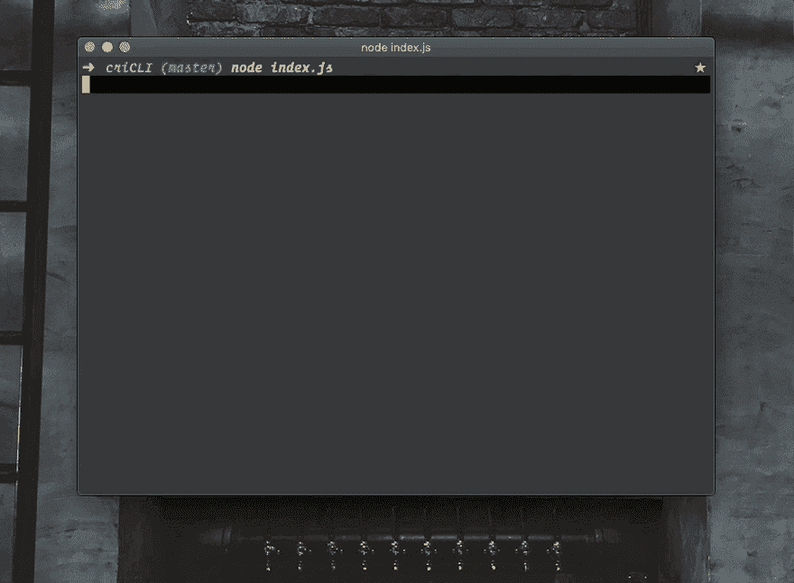
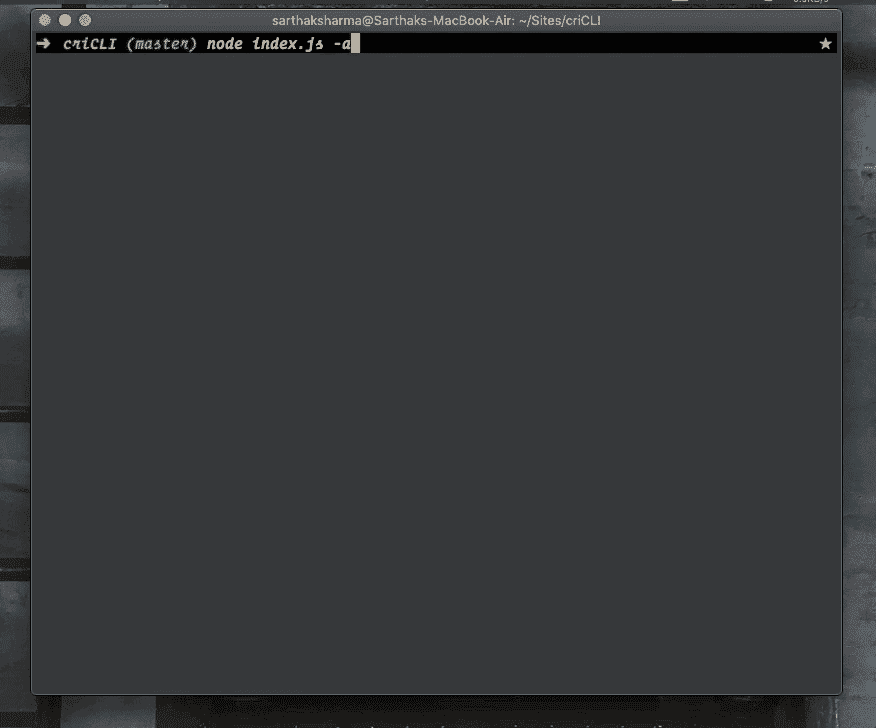
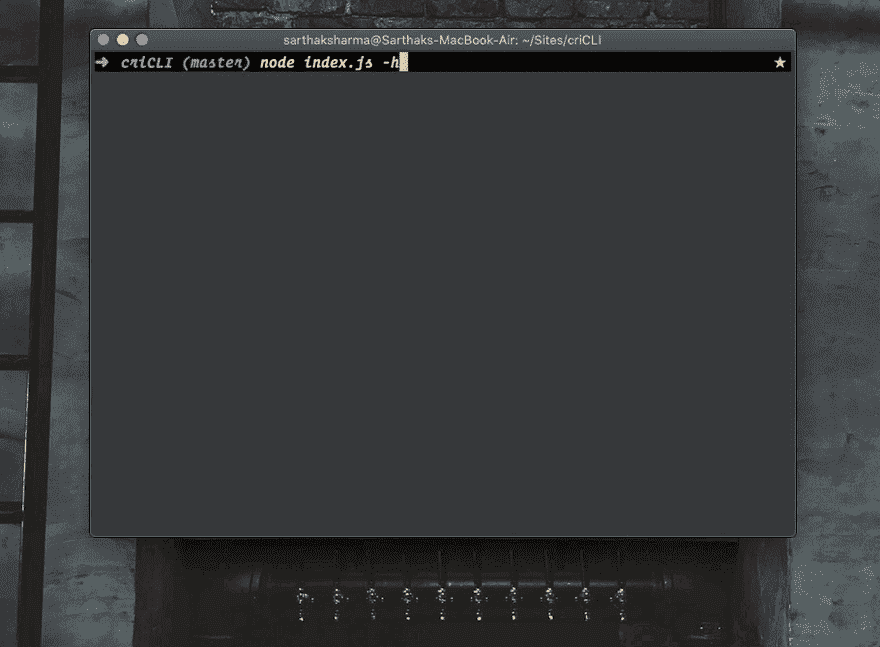
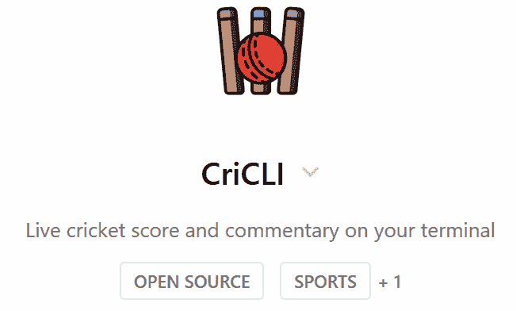

# 克里奇来了！房子里有板球迷吗？👀🏏

> 原文：<https://dev.to/xenoxdev/cricli-is-here-any-cricket-fans-in-the-house-18pb>

嘿嘿嘿，有什么好吃的？

是的，这是我们引入的另一个开源项目。我知道，我知道！我们上周日刚刚发布了一个开源项目，非常有趣。

## 文章不再可用

但我就是忍不住。我有机会，所以我抓住了。无论如何，让我先告诉你这个新项目。

事情是这样的。我在一个典型的印度家庭中长大，小时候，板球对我的生活产生了巨大的影响。🏏这是我和街区里所有其他孩子最喜欢的运动，每当印度进行国际比赛时，我父亲和我都会一起观看，几乎是虔诚地观看。📺对我们来说，这是亲密接触的时刻，就像数百万和我同龄的孩子一样。🙇🏻‍♂️

去年，当我对板球有点怀旧的时候，我开始研究 CriCLI。我对编程和板球的热爱汇集在一起，我做了一个很酷的小 CLI 应用程序，并把它放在那里。

但是上周当我开始着手 XenoX 多元宇宙时，XenoX 总部的事情开始变得忙碌起来🔥。我们有很多新成员想加入我们。令人兴奋的东西。有人甚至会说我们开始了...着火了。😆

大约在同一时间，我的一些 XenoX 伙伴有了一个好主意，并建议我们开展一个与板球相关的项目，因为 2019 年国际刑事法院世界杯正在进行。

**“嗯，你猜怎么着？我已经有那样的东西了！”我宣布，笑得合不拢嘴。**

我告诉他们我以前的 CriCLI 项目，所以我们花了几天时间对它进行了改进，并添加了更多的功能。现在看起来好多了，我想我的很多程序员同事，也是板球爱好者，会喜欢这个的，所以在这里。

## CriCLI -在你的终端获取实时板球比分和评论

安装超级简单。如果您有 node，只需通过 npm:
安装即可

```
 npm install -g cricli 
```

<svg width="20px" height="20px" viewBox="0 0 24 24" class="highlight-action crayons-icon highlight-action--fullscreen-on"><title>Enter fullscreen mode</title></svg> <svg width="20px" height="20px" viewBox="0 0 24 24" class="highlight-action crayons-icon highlight-action--fullscreen-off"><title>Exit fullscreen mode</title></svg>

您可以在您的终端上获得实时板球比分、过去时间、当前击球手和其他相关数据。

[](https://res.cloudinary.com/practicaldev/image/fetch/s--_Q9WDqH5--/c_limit%2Cf_auto%2Cfl_progressive%2Cq_66%2Cw_880/https://thepracticaldev.s3.amazonaws.com/i/1gx2ny9n0uq0psjeydyn.gif)

为此，只需运行命令:

```
 cricli 
```

<svg width="20px" height="20px" viewBox="0 0 24 24" class="highlight-action crayons-icon highlight-action--fullscreen-on"><title>Enter fullscreen mode</title></svg> <svg width="20px" height="20px" viewBox="0 0 24 24" class="highlight-action crayons-icon highlight-action--fullscreen-off"><title>Exit fullscreen mode</title></svg>

您还可以通过运行以下命令获得扩展摘要:

```
 cricli -a 
```

<svg width="20px" height="20px" viewBox="0 0 24 24" class="highlight-action crayons-icon highlight-action--fullscreen-on"><title>Enter fullscreen mode</title></svg> <svg width="20px" height="20px" viewBox="0 0 24 24" class="highlight-action crayons-icon highlight-action--fullscreen-off"><title>Exit fullscreen mode</title></svg>

它看起来有点像这样:

[](https://res.cloudinary.com/practicaldev/image/fetch/s--dfQPJNHa--/c_limit%2Cf_auto%2Cfl_progressive%2Cq_66%2Cw_880/https://thepracticaldev.s3.amazonaws.com/i/1yo13jetyqsg566040y3.gif)

如果您想查看所有命令的列表，只需运行:

```
 cricli -h 
```

<svg width="20px" height="20px" viewBox="0 0 24 24" class="highlight-action crayons-icon highlight-action--fullscreen-on"><title>Enter fullscreen mode</title></svg> <svg width="20px" height="20px" viewBox="0 0 24 24" class="highlight-action crayons-icon highlight-action--fullscreen-off"><title>Exit fullscreen mode</title></svg>

你会得到这样一个列表:

[](https://res.cloudinary.com/practicaldev/image/fetch/s--fVHJbHUc--/c_limit%2Cf_auto%2Cfl_progressive%2Cq_66%2Cw_880/https://thepracticaldev.s3.amazonaws.com/i/0ntym1o2yca98p6z0bqa.gif)

因此，请查看 CriCLI，让我知道你还想看什么功能！或者更好的是，帮助我自己构建特性！💪

在 ProductHunt 上也向 CriCLI 展示一些爱。我们刚刚推出！

[](https://www.producthunt.com/posts/cricli)

## 奖金

这一次，我们玩得太开心了。我们决定做一个小实验。我计划了一个小短剧来配合《克里奇利》的发行，并很快在办公室完成了拍摄。因为我们在不到 20 分钟的时间里写下并表演了整部电影，所以你可以肯定它充满了错误。🤣

[](https://res.cloudinary.com/practicaldev/image/fetch/s--8ZlEPEln--/c_limit%2Cf_auto%2Cfl_progressive%2Cq_66%2Cw_880/https://thepracticaldev.s3.amazonaws.com/i/tqeeuqz75jq68gc3bzur.gif)

[](https://res.cloudinary.com/practicaldev/image/fetch/s--gkhisNFo--/c_limit%2Cf_auto%2Cfl_progressive%2Cq_66%2Cw_880/https://thepracticaldev.s3.amazonaws.com/i/s6m2sayfx8nilrnkfd30.gif)

无论如何，点击这里查看完整视频:

[https://www.youtube.com/embed/0mFSaekz8iM](https://www.youtube.com/embed/0mFSaekz8iM)

## 感谢

非常感谢你来看克里奇。

我们度过了美好的一周。再次感谢大家，XenoX 团队每天都在壮大。如果你喜欢我们的工作，并想与我们合作，我们非常欢迎你。只要在这里加上你的名字，你就可以进去了！

##  [【团队异种】](https://github.com/teamxenox) / [异种多篇](https://github.com/teamxenox/XenoXMultiverse)

### 🔥🚀XenoX 集合！！

<article class="markdown-body entry-content container-lg" itemprop="text">

[](https://camo.githubusercontent.com/4a339cf0ab8e6df5b11d356b973993b9c2e5e9d5e54e1359f3c90ed944a1df9f/68747470733a2f2f692e696d6775722e636f6d2f6f576b534b576f2e706e67)

# XenoX 多元宇宙

随着 XenoX 多元宇宙的开始，我们正在使事情正式化。XenoX 团队最初是我的梦想，只是一个开发人员的小团队，为了好玩而从事开源项目。但几个月来，它变得越来越大，越来越强。因此，我想正式宣布团队 XenoX 开源计划。这是 XenoX 上所有项目和所有合作开发人员的主列表。

如果你也想成为开源英雄，只需写下你的名字，你就可以加入并开始贡献自己的力量！

## 如何加入团队？💪🏼

1.  叉回购。
2.  把你的名字加到这个文件上。
3.  提交拉取请求。

就是这样。你都准备好了。团队中会有人联系你，正式欢迎你加入团队。干杯！

## 接缝

*   萨尔萨克·夏尔马 <g-emoji class="g-emoji" alias="fire" fallback-src="https://github.githubassets.cimg/icons/emoji/unicode/1f525.png">🔥</g-emoji>
*   [乌特卡什塔尔瓦尔](https://github.com/sarthology)🎸
*   [拉杰特·夏尔马](https://github.com/sharmarajat01) <g-emoji class="g-emoji" alias="headphones" fallback-src="https://github.githubassets.cimg/icons/emoji/unicode/1f3a7.png">🎧</g-emoji>
*   [rajesh main Ali](https://github.com/Stereoraj)
*   帕万 …

</article>

[View on GitHub](https://github.com/teamxenox/XenoXMultiverse)

今天到此为止，朋友们！回头见！