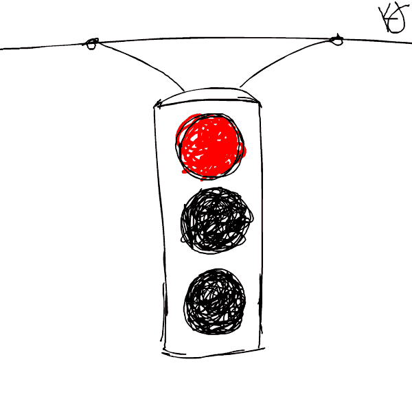

# 水果车:编写测试，第一部分

> 原文：<https://dev.to/sleepycecy/fruit-cart-writing-tests-part-i-ld9>

数据库建好了，框架和工具到位了，TDD 过程敲定了，所有的魔法都准备好了——施展魔法的时候到了！

[](https://res.cloudinary.com/practicaldev/image/fetch/s--UKs6UKum--/c_limit%2Cf_auto%2Cfl_progressive%2Cq_auto%2Cw_880/https://i.imgur.com/hrw7U4H.png)

## 单位。。。至少我是这么认为的

虽然我们将编写我们的代码，我们仍然必须决定一个基本的架构。例如，如果我们想要测试一个水果模型，那么我们必须首先决定我们需要一个水果模型。这是一个先有鸡还是先有蛋的问题:我们的原则是测试将推动生产，但是在编写测试之前，我们必须知道我们在测试什么。。。

[](https://res.cloudinary.com/practicaldev/image/fetch/s--GB4t-jTb--/c_limit%2Cf_auto%2Cfl_progressive%2Cq_66%2Cw_880/https://i.imgur.com/PEhP21h.gif)

那么，在水果模型的例子中，什么先出现:模型还是测试？先有鸡还是先有蛋？答案是:模型。算是吧。在我们的集体大脑中，它排在第一位。测试和产品代码相互依赖。测试的编写方式当然决定了代码的编写方式，但是对于要编写的测试来说，我们必须首先决定我们要测试的基本架构。换句话说，我们必须决定我们在测试什么。

Jeff 和我实际上从来没有在没有先设置测试的情况下编写过文件，但是我们心里知道我们提交的文件将会被测试。

所以我们必须弄清楚我们需要什么，也许更重要的是，我们不需要什么。这就是我们遇到 YAGNI 的地方:你不需要它。

[](https://res.cloudinary.com/practicaldev/image/fetch/s--mic-P3i6--/c_limit%2Cf_auto%2Cfl_progressive%2Cq_66%2Cw_880/https://i.imgur.com/3SyxXgD.gif)

YAGNI 来自极限编程方法论，意味着我们应该只写我们现在需要的代码，而不是我们认为将来需要的代码。是的，我们希望我们的代码是可扩展的，但是我们也不希望构建出未来的功能，这不是我们作为最低可行产品的一部分所期望交付的。虽然这似乎不是前瞻性的思考，但是如果我们在功能性产品的范围之外做了太多的预期，我们很可能最终会写出我们不需要的代码。

例如，说最终用户帐户和登录是我们希望水果购物车用户拥有和做的事情。我用 Google 策略安装了 OAuth 库。然后我开始构建创建水果的功能。突然我意识到我没有让用户登录的理由。为什么他们需要登录来创建水果？如果创建 fruit 只需要一个用户账号，任何人都可以拥有一个用户账号，那么让他们登录又有什么意义呢？嗯嗯。。。似乎对于 MVP，我们只需要用户创造水果；他们不需要账户。

将来，我们可能会需要这种功能，比如说，如果我们正朝着网上商店的方向发展。但这不是我们目前正在建设的。但是，你可能会说，让 OAuth 库或我们编写的任何登录代码挂在我们的代码库中没有什么坏处，为什么不呢？答案是双重的:是的，有危害，但是，为什么要把我们的精力和资源浪费在不属于手头任务的功能上呢？

[](https://res.cloudinary.com/practicaldev/image/fetch/s--zzsuPhhp--/c_limit%2Cf_auto%2Cfl_progressive%2Cq_auto%2Cw_880/https://i.imgur.com/v3TxHea.jpg)

首先是危害:你的依赖越多，坏人的攻击面就越大。尽管 OAuth 是一个我们信任的库，但它可能在某些时候被弃用和/或有我们不知道的漏洞。另外，如果你不用它，为什么它会在那里？

此外，我们编写的任何代码都有可能使我们的集成和功能测试出错。我们的代码部分之间的交互方式可能会产生意想不到的后果，或者对用户的旅程产生微妙的变化。保持测试绿色！

第二:建造成本。为什么要把时间花在我们现在还没有建立起来的东西上呢？构建新的功能需要花费时间和人力，所以让我们专注于我们现在想要的。我们可以解决授权问题，并在需要时登录。

想了解更多关于 YAGNI 的信息，请查看马丁·福勒的帖子。他以米纳斯提利斯的一家航运保险公司为例。希望它比奥斯吉力亚斯的好。

[](https://res.cloudinary.com/practicaldev/image/fetch/s--INoPHglR--/c_limit%2Cf_auto%2Cfl_progressive%2Cq_66%2Cw_880/https://i.imgur.com/7ahxHZ6.gif)

让我们来看看 API 的结构，这样我们甚至可以知道我们在测试什么:

1.  动作:一个调用碰到一个端点，姑且称之为“/fruits”，它触发一个数据库调用，这个调用有我们`getAll()`的果实。控制器 FruitCartController 将处理正确呼叫的动作和路由。

2.  逻辑:因为 FruitCartController 所做的只是路由和返回响应，所以我们需要一些东西来处理实际的业务逻辑。为此，我们有水果服务。FruitService 决定我们如何从数据库中获取信息(不是什么信息——那是由控制器决定的)。因此，我们将有一个叫做`getAllFruits()`的简便方法来做到这一点:从数据库中获取所有水果。

3.  数据:所以 FruitService 将使用一个名为 findAll()的内置 JPA 存储库方法来调用数据库。这个 FruitCartRepository 是一个映射器，它神奇地将数据转换成我们选择的 Java 对象，在本例中是 Fruit。

就是这样。

让我们从头开始，从马可·奥勒留开始。。。或者水果车控制器。

[](https://res.cloudinary.com/practicaldev/image/fetch/s--pya_VXjJ--/c_limit%2Cf_auto%2Cfl_progressive%2Cq_auto%2Cw_880/https://i.imgur.com/ud0hK36.jpg)

因为我看了太多遍《沉默的羔羊》,汉尼拔·莱克特认为是马库斯·奥勒留的名言“它本身是什么”,在我试图测试的时候不断在我脑海中闪现。《T2 沉思录》第八册的完整段落写道:“这个东西在它自己的结构中是什么？它的物质和材料的元素是什么，以及原因是什么？它在世界上的作用是什么？它的持续时间是多长？”

总的来说，这些都是问代码的好东西。我们希望这段代码做什么？我们需要它做什么？我们需要它有哪些代码？做这些事情要多长时间？像这样的期望将指导我们的测试

以下是我们需要 FruitCartController 提供的内容:

*   让端点成功返回状态为 OK 的 HTTP 响应。

*   这个端点还需要返回数据库中所有水果的列表。

酷毙了。让我们为第一个项目写一个测试。

[](https://res.cloudinary.com/practicaldev/image/fetch/s--1eWS8kg4--/c_limit%2Cf_auto%2Cfl_progressive%2Cq_66%2Cw_880/https://i.imgur.com/FxpdtiC.gif)

问:那么在 HTTP 请求中，我们如何知道响应是成功的呢？答:状态代码 200，或 OK。

所以我们在一个名为 FruitCartControllerTests 的班级里做了一个测试。Spring 为我们提供了 MockMVC，一个模仿 HTTP CRUD 请求的 servlet。如果您使用 IntelliJ(我强烈推荐 Java 使用它)，一旦您开始编写代码，就会提示您导入正确的库。我们的最终测试结果是:

```
@Test
public void shouldReturnHttpStatusOk() throws Exception {
  this.mockMvc.perform(get("/api/fruits").accept(MediaType.APPLICATION_JSON))
    .andExpect(status().isOk());
} 
```

Enter fullscreen mode Exit fullscreen mode

当我们运行它时，它失败了。太好了:我们有我们的红色。是时候得到绿色了。

[](https://res.cloudinary.com/practicaldev/image/fetch/s--AB-83yco--/c_limit%2Cf_auto%2Cfl_progressive%2Cq_auto%2Cw_880/https://i.imgur.com/7muNi57.jpg)

所以现在我们有了测试，我们需要编写代码来使它通过。

需要创建明显的文件(FruitCartController)和明显的路由("/fruits "-"/API "部分是命名空间，因为我们也将为前端创建具有相似名称的路由，并且希望在命名时尽可能清晰)。那么我们所做的就是以最明显的方式传递它，回到奥勒留先生那里——它本身是什么？它的行为是什么？现在我们所需要的是它返回一个 200 状态，所以让我们继续做一个端点来做这件事。

```
@Controller
@RestController
@RequestMapping(value="/api")
public class FruitCartController {

    @RequestMapping(value="/fruits")
    public ResponseEntity getAll(){
        return new ResponseEntity(HttpStatus.OK);
    }
} 
```

Enter fullscreen mode Exit fullscreen mode

运行这些测试，它应该通过！万岁！我们有我们的绿色。

[](https://res.cloudinary.com/practicaldev/image/fetch/s--NmmUeACh--/c_limit%2Cf_auto%2Cfl_progressive%2Cq_66%2Cw_880/https://i.imgur.com/lhk4wUN.gif)

现在通常我们会重构，要么重构我们的测试，要么重构我们的代码，但是在这种情况下，测试非常小，很难看出我们会在哪里重构。这个解决方案非常优雅，并且做了它需要做的事情。

所以让我们更进一步测试；毕竟，我们不只是想要一个地位——我们想要水果！

[](https://res.cloudinary.com/practicaldev/image/fetch/s--sJq_WfrY--/c_limit%2Cf_auto%2Cfl_progressive%2Cq_auto%2Cw_880/https://i.imgur.com/PBI6p0A.jpg)

我们将修改测试，要求返回一个 JSON fruit 对象数组。应该是这样的:

```
[{id: 1, name: "apple", description: "A fleshy red fruit"}, {id: 2, name: "banana", description: "A minion's favorite fruit"}] 
```

Enter fullscreen mode Exit fullscreen mode

我们希望能够访问数组中的第一个元素，并获得名称“apple”。下面是代码:

```
@WebMvcTest(FruitCartController.class)
public class FruitCartControllerTests {

  @Autowired
  MockMvc mockMvc;

  @Test
  public void shouldReturnAnArray() throws Exception {   
    this.mockMvc.perform(get("/api/fruits").accept
(MediaType.APPLICATION_JSON))
       .andExpect(status().isOk())
       .andExpect(MockMvcResultMatchers.jsonPath("$").isArray())
       .andExpect(MockMvcResultMatchers.jsonPath("$[0].id").value("1"))
  .andExpect(MockMvcResultMatchers.jsonPath("$[0].name").value("apple"));
    } 
```

Enter fullscreen mode Exit fullscreen mode

MockMVC 执行 GET 请求，但是在 OK 状态代码之上，我们还期待一些实际数据。当然，这很快就失败了。

回到瑞德。让它过去吧。

[](https://res.cloudinary.com/practicaldev/image/fetch/s--ys16UCIV--/c_limit%2Cf_auto%2Cfl_progressive%2Cq_66%2Cw_880/https://i.imgur.com/rdaAG5X.gif)

通过测试实际上非常容易:我们用一些标准的 setters、getters 和 constructor 创建一个 Fruit 模型，然后将我们想要的响应直接硬编码到 FruitCartController 的返回结果中:

```
 @RequestMapping(value="/fruits")
    public ResponseEntity getAll(){
        Fruit fruit = new Fruit("1", "apple");
        return new ResponseEntity(Arrays.asList(fruit), HttpStatus.OK);
    } 
```

Enter fullscreen mode Exit fullscreen mode

它是绿色的。该重构了。

[](https://res.cloudinary.com/practicaldev/image/fetch/s--vHINohgO--/c_limit%2Cf_auto%2Cfl_progressive%2Cq_66%2Cw_880/https://i.imgur.com/uW1XunU.gif)

但这真的是我们希望我们的系统运行的方式吗？数据库没有被查询，我们必须在控制器中实例化大量不同的水果对象，这不是它的工作。不。我们需要进行数据库查询以获取所有水果。

现在请记住，在我们的系统架构概要中，控制器只处理路由，告诉后端的其余部分它实际上想要获得什么数据。但是它并没有真正得到数据。因此，它实现其功能的能力依赖于另一层代码:服务。目前，FruitService 甚至还不存在；我们还没有为它写代码。但听起来，如果我们要接近我们实际上希望控制器如何工作，我们可能必须开始。

现在我们的小测试已经超越了单元测试。这是一个集成测试:我们正在测试两个层——控制器和服务——是否恰当地交互，以便返回期望的结果。

所以让我们写一些真正的单元测试；让我们创建我们的水果服务。

## 绝对单位

[](https://res.cloudinary.com/practicaldev/image/fetch/s--8HEnZ6fh--/c_limit%2Cf_auto%2Cfl_progressive%2Cq_auto%2Cw_880/https://i.imgur.com/evGtHVw.jpg)

最初我们认为 FruitService 也是一个集成测试。毕竟，它将调用 FruitCartRepository，这也需要测试，对吗？嗯，没那么多。

FruitCartRepository 虽然确实是一个文件，但却是一个接口。它是文件或层之间的契约。我们使用的所有功能都包含在 JPA 存储库中。所以最后我们得到的是这样一个文件:

```
@Repository
public interface FruitCartRepository extends JpaRepository<Fruit, Integer> {

} 
```

Enter fullscreen mode Exit fullscreen mode

里面什么都没有。我们所要做的就是告诉 Spring 这个接口是一个存储库(`@Repository`处理它),然后创建它，指定它将水果表中的水果数据映射到水果对象上，并且数据库中的主键是一个整数数据类型。所有实际的数据调用都是由库提供的。

因此，如果我们要测试我们的 FruitCartRepository，我们实际上不会测试我们编写的任何代码。我们将测试 JPA 存储库的代码。朋友们，这已经被验证过了。我们只需要确保它在我们自己的定制代码中被正确调用，这意味着测试 FruitService。

[](https://res.cloudinary.com/practicaldev/image/fetch/s--drZT3G1E--/c_limit%2Cf_auto%2Cfl_progressive%2Cq_auto%2Cw_880/https://i.imgur.com/NGOTXXS.jpg)

问:我们现在需要的水果服务的核心行为是什么？我们需要它来返回一组水果。

它能返回的最简单的东西是什么？空数组！经常为 null 或空的返回值是开始测试的最简单的方法。一步步来。

所以我们为我们的 FruitService 类制作了另一个测试文件，并做了一个测试来获得一个空数组:

```
public class FruitServiceTests {

    FruitService fruitService;

    @Before
    public void setUp() {
        this.fruitService = new FruitService();
    }

    @Test
    public void shouldReturnEmptyArray() {
        assertThat(fruitService.getAllFruits(), is(Arrays.asList()));
    }
} 
```

Enter fullscreen mode Exit fullscreen mode

首先，我们初始化一个名为 FruitService 的新 fruitService。然后我们断言它调用了一个方法`getAllFruits()`,我们期望这个值是一个空数组。

运行这些测试，然后嘣:红灯。

该重构了。

我们进去，创建 FruitService 类，并创建一个名为`getAllFruits()`的方法来返回`Arrays.asList()`。就是这样。

运行这些测试，然后嘣:绿灯。

[](https://res.cloudinary.com/practicaldev/image/fetch/s--IAsjtGBF--/c_limit%2Cf_auto%2Cfl_progressive%2Cq_66%2Cw_880/https://i.imgur.com/quhXlCn.gif)

但这不是我们真正想要的，对吗？我们想要那些水果！

所以我们重写了测试来寻找数组中的一个水果:

```
@Test
public void shouldReturnArrayOfFruit() {
  assertThat(fruitservice.getAllFruits().get(0).getId(), is("1"));
} 
```

Enter fullscreen mode Exit fullscreen mode

就是这样。我们试图从数组中的第一个元素获取 id，应该是 1。

做个测试，我们又回到红色了。

现在让我们修复我们的水果服务。我们用下面的内容替换`Arrays.asList()`的返回值:

```
 Fruit fruit = new Fruit("1", "apple");
        return Arrays.asList(fruit); 
```

Enter fullscreen mode Exit fullscreen mode

就是这样:运行测试，灯是绿色的。

但这真的是我们想要的吗？

[](https://res.cloudinary.com/practicaldev/image/fetch/s--hEoW0SCw--/c_limit%2Cf_auto%2Cfl_progressive%2Cq_auto%2Cw_880/https://i.imgur.com/49vra81.jpg)

我们的 FruitService 遇到了和 FruitCartController 同样的问题。它不是查询数据库，而是按照自己的逻辑创建对象，这不是它应该做的。它应该查询映射器(FruitCartRepository)，映射器应该查询数据库以获得它需要的内容。然后它应该返回这些对象的数组。所以我们需要测试它是否调用了 FruitCartRepository。我们希望测试它，以确保它不仅返回我们需要的内容，而且以我们需要的方式执行。为此，我们需要升级我们的测试游戏。

我们需要几个新的超级英雄:傻瓜和树桩。

[](https://res.cloudinary.com/practicaldev/image/fetch/s--MFQP1OU4--/c_limit%2Cf_auto%2Cfl_progressive%2Cq_66%2Cw_880/https://i.imgur.com/D2n90wj.gif)