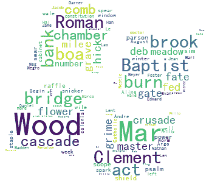

# 用 Python 生成文字徽标

> 原文：<https://dev.to/petercour/generate-words-logo-with-python-29cl>

你可以用 word 创建一个标志。要用的模块是“wordcloud”。然后创建一个标志的面具(黑白形状)。

你为什么想这么做？只是为了好玩。你可以选择任何单词列表和任何黑白遮罩的标志。

比方说 windows 徽标:

[](https://res.cloudinary.com/practicaldev/image/fetch/s--LERVFotl--/c_limit%2Cf_auto%2Cfl_progressive%2Cq_auto%2Cw_880/https://thepracticaldev.s3.amazonaws.com/i/eol7homyp8p5g4gtitk4.png)

## 用 Python 生成 logo

如前所说需要几样东西:

*   任何字体，说 [SimHei](https://github.com/azhon/Python/blob/master/wechat/SimHei.ttf?raw=true)
*   面具(黑白)
*   词表
*   下面的程序
*   已安装的模块(matplotlib、wordcloud)。你可以用 **pip** 来做

大众

[](https://res.cloudinary.com/practicaldev/image/fetch/s--WdBlGaCI--/c_limit%2Cf_auto%2Cfl_progressive%2Cq_auto%2Cw_880/https://thepracticaldev.s3.amazonaws.com/i/u6otn211fuhgzwtpuivb.png)

你需要一个单词列表。我使用 Ubuntu Linux 上的字典，但是任何单词列表都可以。单词列表应少于 5000 个单词。

运行下面的程序来创建徽标:

```
#!/usr/bin/python3
from wordcloud import WordCloud
import numpy as np
from PIL import Image
import os

with open('/usr/share/dict/american-english') as f:
    wordList = f.read().splitlines()

text = " ".join(wordList)
print(text)

src_dir = os.getcwd()
imagePath = src_dir + "/apple.png"
font = src_dir + "/SimHei.ttf"
resultPath = src_dir + "/output.png"

bg = np.array(Image.open(imagePath))
wc = WordCloud(
    mask=bg,
    background_color="white",
    max_font_size=150,
    min_font_size=5,
    max_words=5000,
    random_state=40,
    font_path=font,
).generate(text)
wc.to_file(resultPath) 
```

输出:

[](https://res.cloudinary.com/practicaldev/image/fetch/s--85lpowIx--/c_limit%2Cf_auto%2Cfl_progressive%2Cq_auto%2Cw_880/https://thepracticaldev.s3.amazonaws.com/i/rn6uwguyoijujpryp72x.png)

学习 Python:

*   [https://pythonbasics.org](https://pythonbasics.org)
*   [https://pythonprogramminglanguage.com](https://pythonprogramminglanguage.com)