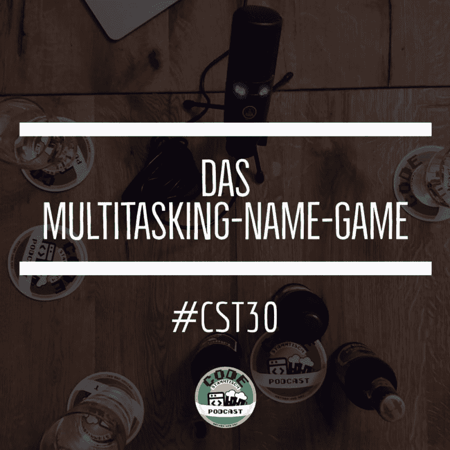

# CST030 — Das 多任务名称游戏

> [https://dev . to/code base/CST 030-das 多任务名称游戏-3e8j](https://dev.to/codestammtisch/cst030-das-multitasking-name-game-3e8j)

**CN:我们在第 32 分钟谈论伤情**

为了庆祝这一天——并再次庆祝第三十个年头 nathan 在巴塞尔，我们坐在 Max 的厨房里吃早餐。前天晚上，我们聊了很多关于[多任务处理和名称游戏](https://www.crisp.se/gratis-material-och-guider/multitasking-name-game)的话题，因为 Max 上次也是这样顺便提到的。

“名称游戏”是一个小模拟，它非常生动地描述了为什么多任务处理通常无法正常工作。而且，因为我们觉得这很有趣，所以我们用了一系列的周年纪念。包括最近的 Cat 内容！

所以我们坐在那里聊天喝酒[【rivella red】](https://www.rivella.ch/de/sortiment/rot)—顺便说一下，牛奶血清是从 Molke 中提取出来的──还有[【血腥玛丽】](https://de.wikipedia.org/wiki/Bloody_Mary)。据说这不是马克思的第一个血腥玛丽，从很可能是他第一个带[的血腥玛丽【三百六十伏特加酒黑色 42】](https://www.threesixty-vodka.com/three-sixty-vodka/)。

因为接下来我们会谈论其他有趣的链接，这里还有其他有趣的链接:

*   [Spotify 实验室](https://labs.spotify.com)
*   [最大电流强度](https://labs.spotify.com/2014/09/16/squad-health-check-model/)
*   硬币游戏又名。便士游戏

我们一如既往地感谢您的聆听。改进建议、饮料建议、爱的表达和批评，请一如既往地通过 Twitter 发送至【或通过电子邮件发送至[【您好-at-code tamitis . ch】](mailto:hallo@codestammtis.ch)

结尾的简短广告:[支持稳定](https://steadyhq.com/de/codestammtisch)上的代码表。非常感谢！

这里是:t0]https://codes tamitis . ch/2019/06/17/CST 030-das 多任务名称游戏/