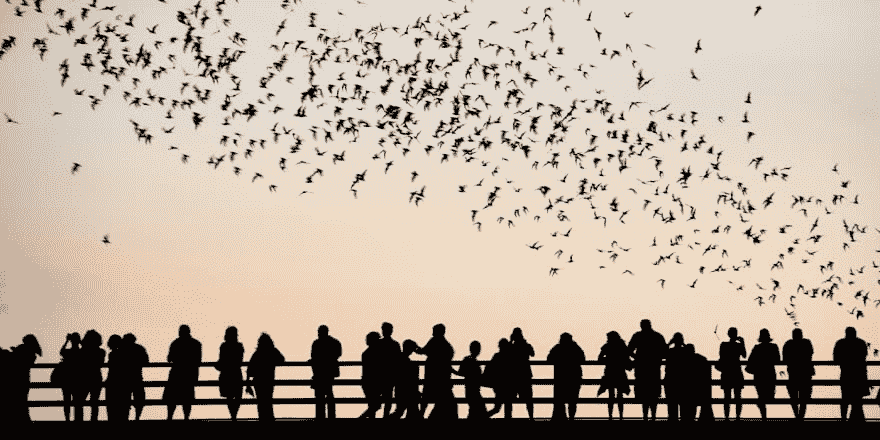

# 将静态照片卡通化和动画化

> 原文：<https://dev.to/alvaromontoro/cartoonifying-and-animating-a-still-photograph-39ce>

为了本周的 [CodePen challenge](https://codepen.io/challenges/2019/january/3) ，我用一个元素和一张静止的图片制作了一个蝙蝠飞过桥上的人的的[动画。这是一张 JPEG 格式的照片，没有透明度或矢量的可能性。](https://codepen.io/alvaromontoro/pen/exYOwd)

因此...我们如何从这样的静态照片([原始来源](http://www.batsinaustin.com/)):

[](https://res.cloudinary.com/practicaldev/image/fetch/s--K0w-_dol--/c_limit%2Cf_auto%2Cfl_progressive%2Cq_auto%2Cw_880/https://thepracticaldev.s3.amazonaws.com/i/jq8dqqcli80hu935g42d.jpg)

不需要在浏览器之外编辑图像，不需要改变图像格式，也不需要修改图像的原始内容。

[https://codepen.io/alvaromontoro/embed/exYOwd?height=600&default-tab=result&embed-version=2](https://codepen.io/alvaromontoro/embed/exYOwd?height=600&default-tab=result&embed-version=2)

我们如何使用一个 HTML 元素和几行 CSS 来实现呢？

我们一步一步来。

## HTML

首先是 HTML:我们需要创建一个包含图片的元素:

```
<div><div> 
```

<svg width="20px" height="20px" viewBox="0 0 24 24" class="highlight-action crayons-icon highlight-action--fullscreen-on"><title>Enter fullscreen mode</title></svg> <svg width="20px" height="20px" viewBox="0 0 24 24" class="highlight-action crayons-icon highlight-action--fullscreen-off"><title>Exit fullscreen mode</title></svg>

就是这样！这就是我们需要的所有 HTML。超过这一点的一切都将使用 CSS 样式。

## CSS

### 初始造型

`div`应该与图像具有相同的比例(宽/高比),因为我们将它作为背景，我们希望它占据整个容器。在我们的例子中，这很简单:图像的宽度是高度的两倍，所以比例是 2:1。

我们最初的 CSS 将包括调整`div`的大小，并以绝对的方式将其放置在屏幕的中心:

```
div {
  /* this height and width values are specific to this example */
  width: 100vw;
  height: 50vw;
  /* center the div vertically and horizontally to make it look nicer */
  position: absolute;
  top: 50%;
  left: 50%;
  transform: translate(-50%, -50%);
} 
```

<svg width="20px" height="20px" viewBox="0 0 24 24" class="highlight-action crayons-icon highlight-action--fullscreen-on"><title>Enter fullscreen mode</title></svg> <svg width="20px" height="20px" viewBox="0 0 24 24" class="highlight-action crayons-icon highlight-action--fullscreen-off"><title>Exit fullscreen mode</title></svg>

我们稍后将回到这个`div`上，但是我们现在可以让它休息一下，把注意力集中在包含图像的伪元素上。

### 图像

使用下面的样式，我们将使它占据整个父容器，将图像作为背景，并使图像适合整个容器的大小:

```
div::before {
  content: "";
  display: block;
  position: absolute;
  width: 100%;
  height: 100%;
  background: url("https://i.stack.imgur.com/w8noS.jpg");
  background-position: top left;
  background-size: 100% 100%;
} 
```

<svg width="20px" height="20px" viewBox="0 0 24 24" class="highlight-action crayons-icon highlight-action--fullscreen-on"><title>Enter fullscreen mode</title></svg> <svg width="20px" height="20px" viewBox="0 0 24 24" class="highlight-action crayons-icon highlight-action--fullscreen-off"><title>Exit fullscreen mode</title></svg>

是时候应用一些过滤器了！

### 滤镜

现在，照片是没有变化的原始图像:一群人在桥上，看着飞行的蝙蝠。

我们想要应用一些 [CSS 过滤器](https://developer.mozilla.org/en-US/docs/Web/CSS/filter):

*   这将从图片中移除亮度，将其转换为灰度，并使一些周围的颜色混合在一起。
*   `contrast(400%)`:通过设置高对比度值，我们将灰度照片变成黑白图像，留下原图的剪影。
*   `invert(1)`:翻转颜色。这样做是为了增加戏剧性:蝙蝠在夜间飞行，天空现在看起来是黑色而不是白色。

它的 CSS 是:

```
filter: saturate(0) contrast(400%) invert(1); 
```

<svg width="20px" height="20px" viewBox="0 0 24 24" class="highlight-action crayons-icon highlight-action--fullscreen-on"><title>Enter fullscreen mode</title></svg> <svg width="20px" height="20px" viewBox="0 0 24 24" class="highlight-action crayons-icon highlight-action--fullscreen-off"><title>Exit fullscreen mode</title></svg>

我们已经完成了目标图像的过滤:我们把它变成了一个轮廓，边缘更清晰了，现在看起来更像一幅漫画。是时候继续前进了...

### 调合

[`mix-blend-mode`](https://developer.mozilla.org/en-US/docs/Web/CSS/mix-blend-mode) 属性允许指定一个元素如何与其父元素和背景融合。通过将该值设置为`multiply`，白色将变为“透明”,并且可以透过它们看到父对象。

所以我们只需要向`div::before` :
添加一个 CSS 属性

```
mix-blend-mode: multiply 
```

<svg width="20px" height="20px" viewBox="0 0 24 24" class="highlight-action crayons-icon highlight-action--fullscreen-on"><title>Enter fullscreen mode</title></svg> <svg width="20px" height="20px" viewBox="0 0 24 24" class="highlight-action crayons-icon highlight-action--fullscreen-off"><title>Exit fullscreen mode</title></svg>

> 注意:由于我使用的是`mix-blend-mode`，这段代码无法在几种浏览器上运行(包括 IE 或 Edge)。[点击这里](https://caniuse.com/#feat=css-mixblendmode)查看支持的浏览器列表。

### 动画

完成动画只需要几个步骤，其中之一就是 CSS 动画本身。我们将创建一个从图片右下角移动到左上角的阴影。

为了实现这一点，我们使用常规的`@keyframes`规则，用一个黑色插图[阴影](https://developer.mozilla.org/en-US/docs/Web/CSS/box-shadow)来执行我们想要的动作:

```
@keyframes moveShadow {
  0% { 
    box-shadow: inset 0 -14vw 0 0 white,
                inset 50vmin 50vmin 15vmin 15vmax black;  
  }
  100% { 
    box-shadow: inset 0 -14vw 0 0 white,
                inset -75vmin -75vmin 25vmin 15vmax black; 
  }
} 
```

<svg width="20px" height="20px" viewBox="0 0 24 24" class="highlight-action crayons-icon highlight-action--fullscreen-on"><title>Enter fullscreen mode</title></svg> <svg width="20px" height="20px" viewBox="0 0 24 24" class="highlight-action crayons-icon highlight-action--fullscreen-off"><title>Exit fullscreen mode</title></svg>

我们需要把它和挑战的粉色背景一起添加到原始的`div`中:

```
animation: moveShadow 5s infinite;
background: #FF1EAD; 
```

<svg width="20px" height="20px" viewBox="0 0 24 24" class="highlight-action crayons-icon highlight-action--fullscreen-on"><title>Enter fullscreen mode</title></svg> <svg width="20px" height="20px" viewBox="0 0 24 24" class="highlight-action crayons-icon highlight-action--fullscreen-off"><title>Exit fullscreen mode</title></svg>

给人的印象是粉红色的影子在移动，但实际上背景是粉红色的，而且是黑色的影子在移动。

你可能已经注意到还有一个不动的白影。我们用那个来保持人们和桥的可见性。否则，图像会随着阴影的移动而完全变黑。

作为最后的润色，我将页面的背景设置为上黑下白，这样图像看起来更“流畅”，与页面一致。

这留下了来自静止照片的卡通式动画的结果:

[https://codepen.io/alvaromontoro/embed/exYOwd?height=600&default-tab=result&embed-version=2](https://codepen.io/alvaromontoro/embed/exYOwd?height=600&default-tab=result&embed-version=2)

## 最后的想法

有了这个挑战，我能够体验并了解更多关于 CSS 滤镜和混合模式的知识，尤其是后者，它包含了一些我过去不常使用的属性，关于它我还有很多要学。

我在做研究和完成这个 CodePen 挑战中获得了很多乐趣，我期待着下一个挑战:)

> <sup id="footnote">*</sup> 本文为[原载于 CodePen](https://codepen.io/alvaromontoro/post/cartoonify-and-animate-a-photo)2019 . 1 . 27。