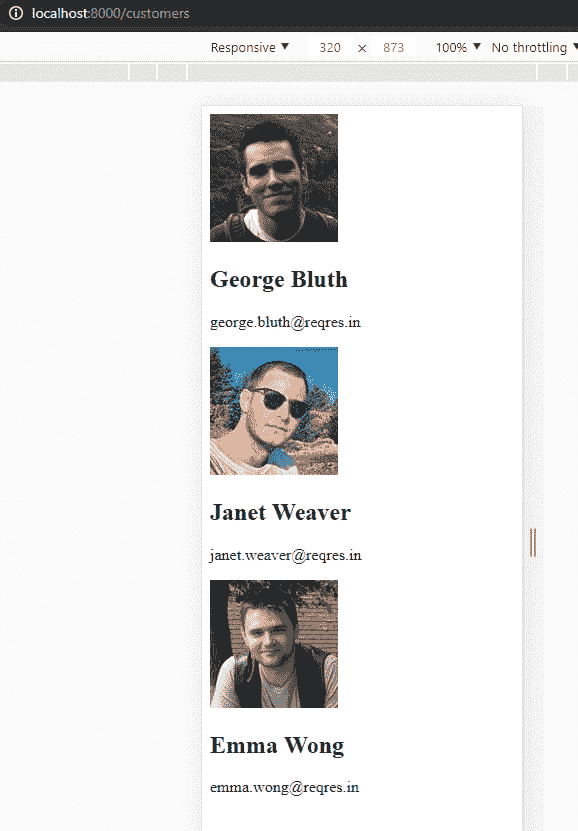
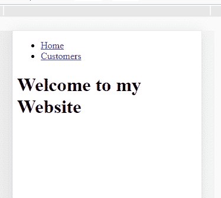
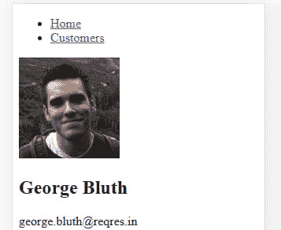

# 为 Gatsby/React 网站创建页面

> 原文：<https://dev.to/eperedo/creating-pages-for-a-gatsby-react-website-2g11>

现在你可以[创建一个新的盖茨比项目](https://blog.eperedo.com/2019/07/05/building-websites-with-react-gatsbyjs/)
让我们继续盖茨比已经内置的一个基本特性:**页面**

gatsby 页面只是一个 React 组件，但由于 gatsby，它将在我们的网站中生成一个页面。这意味着，如果你创建一个名为“users.js”的页面
，当你在开发服务器中访问 url **/users** 时，gatsby 会自动调用这个文件。

### 创建盖茨比页面

如果你打开我们在上一篇文章中创建的项目，你会看到这样的文件夹结构

```
/src
  /pages
    index.js
/static
...
# other files 
```

乍一看，很容易假设每次你在网站中需要一个新的路径/url 时，你都需要在**页面**文件夹中创建
一个 react 组件。

如果你打开 **index.js** 你可以看到一个简单的 React 组件，实际上是一个函数组件。

```
import React from "react"

export default () => <div>Hello world!</div> 
```

我喜欢箭头函数，但不是那么喜欢，所以我会把这个组件重写得更有趣(至少对我来说是这样！)

```
import React from "react"

function Index() {
  return (
    <div>Hello world!</div>
  );
}

export default Index; 
```

好了，现在我的大脑感觉好多了。

让我们创建一个有两个页面的网站:

```
/ # root of the project it will
/customers # a page that will show information about our customers 
```

因为已经创建了根页面，所以让我们创建客户页面。

```
import React from 'react';

const customers = [
  {
    id: 1,
    email: 'george.bluth@reqres.in',
    first_name: 'George',
    last_name: 'Bluth',
    avatar: 'https://s3.amazonaws.com/uifaces/faces/twitter/calebogden/128.jpg',
  },
  {
    id: 2,
    email: 'janet.weaver@reqres.in',
    first_name: 'Janet',
    last_name: 'Weaver',
    avatar:
      'https://s3.amazonaws.com/uifaces/faces/twitter/josephstein/128.jpg',
  },
  {
    id: 3,
    email: 'emma.wong@reqres.in',
    first_name: 'Emma',
    last_name: 'Wong',
    avatar:
      'https://s3.amazonaws.com/uifaces/faces/twitter/olegpogodaev/128.jpg',
  },
];

function Customers() {
  return customers.map((customer) => {
    return (
      <section key={customer.id}>
        
        <div>
          <h2>
            {customer.first_name} {customer.last_name}
          </h2>
          <p>{customer.email}</p>
        </div>
      </section>
    );
  });
}

export default Customers; 
```

让我们来看看这个组件，首先我们创建一个名为 **data** 的数组，这个数组将包含 3 个人的信息。
数据取自 API 中的[请求，因为我们不想因为涉及异步请求
而使事情变得复杂(然而！).之后，我们定义一个简单的 react 组件，它将遍历数组并显示每个客户的姓名、电子邮件和头像。有了这些信息，gatsby 会自动为我们生成一个 **/customers** url。您不需要重启服务器，只需进入
浏览器并打开以下网址:](https://reqres.in/api/users) 

```
http://localhost:8000/customers 
```

您应该会看到类似这样的内容:

[](https://res.cloudinary.com/practicaldev/image/fetch/s--x39bIHHx--/c_limit%2Cf_auto%2Cfl_progressive%2Cq_auto%2Cw_880/https://thepracticaldev.s3.amazonaws.com/i/nca8memmjo7rkf5xjgfl.PNG)

好吧，这很酷，但是我们需要一个在主页/客户页面之间导航的好方法，让我们看看如何实现这一点。

### 在 Gastby 页面间导航

Gatsby 有一个名为 **Link** 的特殊组件，它在页面之间导航非常有用，无需重新加载整个页面。
让我们为我们的网站创建一个导航部分，首先在我们的索引页面。

```
import React from 'react';
// Special Gatsby Component
import { Link } from 'gatsby';

function Index() {
  return (
    <div>
      <nav>
        <ul>
          <li>
            <Link to="/">Home</Link>
          </li>
          <li>
            <Link to="/customers">Customers</Link>
          </li>
        </ul>
      </nav>
      <h1>Welcome to my Website</h1>
    </div>
  );
}

export default Index; 
```

如果你以前用过 [react-router](https://reacttraining.com/react-router/web/guides/quick-start) ，它实际上是相同的组件。
它有一个**到**的道具，你需要在那里传递 url。

好了，现在将相同的代码复制到**客户**页面中。

```
import React from 'react';
import { Link } from 'gatsby';

const data = [
  {
    id: 1,
    email: 'george.bluth@reqres.in',
    first_name: 'George',
    last_name: 'Bluth',
    avatar: 'https://s3.amazonaws.com/uifaces/faces/twitter/calebogden/128.jpg',
  },
  {
    id: 2,
    email: 'janet.weaver@reqres.in',
    first_name: 'Janet',
    last_name: 'Weaver',
    avatar:
      'https://s3.amazonaws.com/uifaces/faces/twitter/josephstein/128.jpg',
  },
  {
    id: 3,
    email: 'emma.wong@reqres.in',
    first_name: 'Emma',
    last_name: 'Wong',
    avatar:
      'https://s3.amazonaws.com/uifaces/faces/twitter/olegpogodaev/128.jpg',
  },
];

function Customers() {
  return (
    <section>
      <nav>
        <ul>
          <li>
            <Link to="/">Home</Link>
          </li>
          <li>
            <Link to="/customers">Customers</Link>
          </li>
        </ul>
      </nav>
      {data.map((customer) => {
        return (
          <section key={customer.id}>
            
            <div>
              <h2>
                {customer.first_name} {customer.last_name}
              </h2>
              <p>{customer.email}</p>
            </div>
          </section>
        );
      })}
    </section>
  );
}

export default Customers; 
```

现在网站有了一个简单的方法在页面间导航

[](https://res.cloudinary.com/practicaldev/image/fetch/s--Ne4tQr2p--/c_limit%2Cf_auto%2Cfl_progressive%2Cq_auto%2Cw_880/https://thepracticaldev.s3.amazonaws.com/i/v6bs5brvit46nf45q6ju.PNG)
[T6】](https://res.cloudinary.com/practicaldev/image/fetch/s--lz217epK--/c_limit%2Cf_auto%2Cfl_progressive%2Cq_auto%2Cw_880/https://thepracticaldev.s3.amazonaws.com/i/d5webwjz94ryrj58tmhb.PNG)

但是在两个页面中重复相同的代码感觉不是很好，并且可能违背 react 哲学。因此，让我们提取 react 组件中的导航
。

### 在 Gatsby 中创建和使用 React 组件

由于 Gatsby use React 在幕后，我们可以在微小的可重用组件中创建我们的 UI。让我们创建一个名为**工具栏**的组件。
因为我们不想让 gatsby 把这个组件变成一个页面，所以让我们创建一个名为**组件**的文件夹，在里面放上导航条。

我们的文件夹结构将如下所示:

```
src
  /components
    TheNavBar.js
  /pages 
```

还有我们的组件:

```
import React from 'react';
import { Link } from 'gatsby';

function NavBar() {
  return (
    <nav>
      <ul>
        <li>
          <Link to="/">Home</Link>
        </li>
        <li>
          <Link to="/customers">Customers</Link>
        </li>
      </ul>
    </nav>
  );
}

export default NavBar; 
```

我们如何在页面中重用这个组件？就像我们通常在 react 应用程序中做的那样导入。首先我们的主页

```
import React from 'react';
import NavBar from './../components/TheNavBar';

function Index() {
  return (
    <div>
      <NavBar />
      <h1>Welcome to my Website</h1>
    </div>
  );
}

export default Index; 
```

而现在的**客户**页面

```
import React from 'react';
import NavBar from './../components/TheNavBar';

const data = [
  {
    id: 1,
    email: 'george.bluth@reqres.in',
    first_name: 'George',
    last_name: 'Bluth',
    avatar: 'https://s3.amazonaws.com/uifaces/faces/twitter/calebogden/128.jpg',
  },
  {
    id: 2,
    email: 'janet.weaver@reqres.in',
    first_name: 'Janet',
    last_name: 'Weaver',
    avatar:
      'https://s3.amazonaws.com/uifaces/faces/twitter/josephstein/128.jpg',
  },
  {
    id: 3,
    email: 'emma.wong@reqres.in',
    first_name: 'Emma',
    last_name: 'Wong',
    avatar:
      'https://s3.amazonaws.com/uifaces/faces/twitter/olegpogodaev/128.jpg',
  },
];

function Customers() {
  return (
    <section>
      <NavBar />
      {data.map((customer) => {
        return (
          <section key={customer.id}>
            
            <div>
              <h2>
                {customer.first_name} {customer.last_name}
              </h2>
              <p>{customer.email}</p>
            </div>
          </section>
        );
      })}
    </section>
  );
}

export default Customers; 
```

更干净，如果你打开你的浏览器，你不会看到任何变化，因为我们只是做了一个小的重构，功能是一样的！

### 我们学到的东西

1.  在这篇文章中，我们学习了 gatsby 如何将我们的 react 组件变成强大的页面。
2.  如何使用链接组件创建导航栏？
3.  如何在 gatsby 页面中重用 react 组件？

[Github 回购](https://github.com/eperedo/learning-gatsby/tree/gatsby-pages)