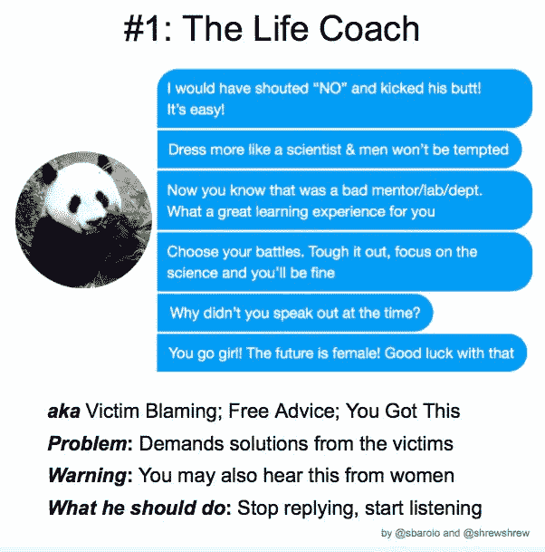

# 我(试图)作为技术盟友的九种方式

> 原文：<https://dev.to/maxwell_dev/nine-ways-i-try-to-act-as-a-tech-ally-41cb>

我想以说我不认为自己是一个技术盟友开始这篇文章，我并不声称自己在这篇文章中。我也希望没有人说我是，即使他们真的相信。我同意这篇文章的观点，联盟是你做的事情而不是成为的事情，声称自己是联盟会让我自满。

 [## 我是叶切尔，我不是你的盟友。

### yechiel kalmen son 3 月 8 日 192 分钟阅读

#shecodedally](/yechielk/im-yechiel-kalmenson-and-im-not-an-ally-3n7h)

也就是说，我想分享我作为一个技术盟友所做的努力。这既是为了帮助其他希望成为更好盟友的人，也是为了获得我可以改进的方法的反馈。

要知道，如果你是一个像我一样的白人男性，你之前没有读过的一些观点可能会让你感到不舒服或有所防备。那很好，我不会为此道歉。不久前，他们让我有了同样的感觉，这很艰难，但积极的改变往往很艰难。所以我们咬紧牙关，调整信念，更加努力，不浪费时间留下愤怒的回复。

## 1)承认我的特权

也许最重要也是最困难的一步是承认我拥有的特权。一个异性恋的白人男性不需要与不属于这一类的人必须面对的大量社会、结构和个人障碍作斗争。如果你要求我举例的话，我就不一一列举了，所以我会让你参考这本解释基本特权的漫画，然后让你去谷歌一下。

这并不是说拥有特权会让我不如那些没有特权的人有价值。拥有特权的人可能和没有特权的人一样有才华、努力工作或值得拥有。这只是意味着认识到我在生活中拥有别人没有的优势，这将影响我们走过的路和我们对世界的看法。因此，我不应该表现得好像其他人都经历过一样，我也不应该假设他们面临的困境是他们自己的错，而不是特权的不同。

有人没有意识到他们的特权的一个重要标志是当他们把“意识到它”和“被告知他们不值得拥有”混为一谈，变得脆弱。

液体错误:内部

充分认识到我的特权是至关重要的，因为其他积极的步骤或改变只能在这一步之后出现。

## 2)知道何时倾听并给予支持

看到有人讨论问题，我的第一反应通常是提供解决方案。这很适合我所知道的话题，比如网页可访问性或者用超大的皮手套击打东西。我已经看到我所知甚少甚至一无所知的事情并不好。

> 斯科特巴罗洛@斯巴罗洛我们将每天发布一个回复的家伙，我们欢迎您的想法和反馈。
> 
> 从一个非常好的小伙子开始，充满了有用的建议，有一个大问题:
> 
> 回复盖伊#1。生活蔻驰2018 年 9 月 03 日 18:44

我不知道如何处理一波不断暗示我价值更低的微攻击，然后当我指出它们时，人们说我反应过度了。那么我真的有资格提供处理它的建议吗？绝对不行。

有些人花了大半辈子的时间去体验和研究它们，结果只取得了有限的进展。如果一个从未处理过这些问题的人的即兴建议足以解决它们，那么它们早就消失了。如果我只是假设在这个问题上比他们知道得多，我会表现得居高临下，不屑一顾。即使我真的想帮忙，结果也是一样的。

> 阿里·斯皮特🐞[@ aspittel](https://dev.to/aspittel)你知道叫出来的东西最惨的是什么吗？人们给我处理事情的建议。我比任何人都更习惯于和巨魔打交道。不要质疑我或我的回答。谢了。这让我很困扰，比巨魔们自己还困扰。2019 年 4 月 19 日 12 点 52 分

因此，我不去告诉别人该怎么想和怎么感觉，而是试着去理解他们的感受。在科技和新闻领域，我发现仅仅理解和接受就能走得很远。这可以采取以下形式:

*   如果有人需要，我会让他们知道我在他们身边，即使他们听得更多。
*   如果我不知道如何回应，我只是诚实地告诉他们，他们仍然可以向我寻求帮助。
*   如果他们在谈论我做的冒犯或麻木不仁的事情，通常最好的回应是真诚的“我错了，我道歉，我会努力不再犯同样的错误。”

> 妮可·阿香博[@ lavie _ encode](https://dev.to/lavie_encode)[@ absoluty Simon](https://twitter.com/absolutelysimon)[@ LemongrassAsh](https://twitter.com/LemongrassAsh)[@ js _ tut](https://twitter.com/js_tut)问题是他翻倍了。
> 
> 如果我搞砸了一个概括，我会说“哦，妈的，我没想到这些人”。说真的，我甚至考虑过核磁共振透视。那很勇敢。真诚的道歉是你拥有的最强能力之一。2019 年 6 月 20 日上午 00:11

我尽量避免做的一些具体事情是:

*   我不玩“唱反调”像“有人做了这件事，结果我也有这种感觉”这样的故事没有两面性。没有其他信息能改变一个人做了什么，以及它给其他人的感觉。
*   我不会突然改变自己周围的对话。那在正常情况下是无礼的，在别人身上尤其无礼。

> <video loop="" controls=""><source src="https://video.twimg.com/ext_tw_video/1145702030452895744/pu/pl/_zeh07R2NPLItgxm.m3u8?tag=10" type="application/x-mpegURL"></video>克雷格·麦克·Á·戴德@克雷加迪当一名女子在 Twitter 上发布一条不需要随机男性互动的帖子时:
> 
> 20:56PM-019 年 7 月 1 日

## 良好的意图不是借口

我可以有最好的意图，但仍然像一个公开的种族主义者或性别歧视者一样造成伤害。这并不是说意图不重要。但是，如果我采取了伤害他人的行动，我的本意不会消除我造成的伤害。

想象一下，如果我边走边打电话，我不小心撞到了一个人，他们把手机掉进了下水道。我不会说“我很抱歉发生这种事，但我并不想让你丢了手机，所以你没有权利生我的气。”不，我会为没有看路而道歉，并尽我所能帮他们拿回手机。他们完全有理由因为我走神而生我的气。

> 【塔蒂亚娜】@塔蒂亚娜意图并不能抹去影响。
> 意图不会消除影响。
> 意图不会消除影响。
> 意图不会消除影响。
> 意图不会消除影响。
> 
> 在你设定目标之前，考虑一下你可能产生的影响。20:24PM-2019 年 6 月 30 日

在那次交易中受伤的不是我。我不是那个应该开始表现得像“真正的受害者”的人大多数时候根本不是我的问题。

## 不要质疑他人的生活经历

当人们告诉我他们在纠结什么的时候，不管是一件大事还是一系列堆积起来的小事，我都尽量不去想当然地认为他们误解了，或者告诉他们应该有不同的感受。

他们是经历过的人。他们有自己的感觉。有人总是比别人更了解自己的经历和感受。尤其是如果是一个从未处理过类似事情的人。

让某人怀疑他们的生活经历的基本做法是“煤气灯”已经有几十篇关于燃气照明的好文章，所以我建议你参考[这篇关于燃气照明的文章，了解基本介绍](https://everydayfeminism.com/2015/06/gaslighting-is-an-abuse-tactic/)。煤气灯不一定是故意的或恶意的，仍然是有害的。

液体错误:内部

> 林赛·科帕🐞@ little kope煤气点燃的迹象:
> 
> “很抱歉让你有那种感觉”
> 写着:对你不好不是我的错。你的感受不是因为我或我的行为。“我不知道你怎么会那样看待事情。”
> 上面写着:你的解释是错误的。你的经历是错误的。我的是对的。2019 年 7 月 05 日下午 16:06

值得庆幸的是，一旦我知道了什么是煤气灯，就很容易避免这样做，看看什么时候会发生。以下是我遵循的一些基本原则:

#### 不要轻易放弃顾虑

这可以包括说他们“太敏感”，他们“开不起玩笑”，或者只是为了“引起注意”而说话。以下是为什么这些是愚蠢的:敏感不是一个坏品质如果你的笑话没有让其他人发笑，那么讲笑话的人就是错的，如果有人真的想要引起注意，有比在 Twitter 上与愤怒的路人互动更好的方式。

即使我不完全同意或理解某人的担忧，但这并不意味着我不能倾听和认真对待它。

> 林赛·科帕🐞@ little kope该死的，试图让某人意识到他们说的话也许是伤人有很多公子哥儿说我过度敏感了。试图友善地教导人们要保持正念，也不过如此🤷🏼‍♀️2019 年 6 月 30 日下午 17:30

#### 经验胜过意见。

我的假设和想法不会推翻别人一遍又一遍反复处理的东西。有观点很容易。反复处理困难的经历并设法谈论它们要困难得多。

> 阿里·斯皮特🐞[@ aspittel](https://dev.to/aspittel)我:这里有一件事我是因为我的学历和工作经历才知道的
> 
> 人在网上:ur 错了因为我看到过一次别的事情发生过17:31PM-05 2019 年 7 月

#### 不要不断地要求穷举，不存在的证明。

想象一下，如果你必须记录下生活中的每一个艰难时刻，别人才会在意。这让人精疲力尽，考虑到需求，这几乎是不可能的，而且往往只是一个忽略让人不舒服的信息的借口。

## 不要假装我是完美的

我的一位教授曾经告诉我们班，试图消除我们的偏见(与种族主义、性别歧视或其他任何东西有关)是毫无意义的。我们能做的是不让他们影响我们的行动。

尽管我试图改善我对这些问题的看法，但我不会假装自己是完美的，也永远不会。我仍然偶尔会有种族主义或性别歧视的想法，这让我内心畏缩。我认识到它是不好的，让它褪色，而不采取任何行动。

液体错误:内部

如果我假装从未有过这种想法，事情会变得更糟。我会做一些性别歧视的事情，当被指出时，我会辩解说我没有性别歧视。我将无法意识到影响我行为的性别歧视。

当这些想法只是简单的想法时，它们不会造成伤害。在他们影响我如何对待他人之前，抓住并赶走他们才是最重要的。

## 6)做我自己的研究

有很多次有人提到一个我不知道的术语。不久前，我的第一反应是问这是什么。但那会让我陷入另一个人解释新词、系统、概念和我从未见过的不公正的兔子洞。学习它们需要花费大量的时间和精力，教它们就更是如此。

通常情况下，他们会告诉我自己去搜索术语。起初，这冒犯了我，好像我被认为不值得帮助而被拒绝。现在我明白了，自我教育是一种基本的礼貌。

想象一下，你被要求放下一切，就一个每天都会让你的情绪和焦虑付出代价的话题教育某人。然后被要求一天做多次。这些斗争的原因，直接或间接地。这些人经常不同意你的解释，或者认为你的解释“不合理”这可以采取“密封”的形式，这是密集和大声只是为了激怒和耗尽别人(有意或无意)。

液体错误:内部

液体错误:内部

这对某人来说是一个巨大的负担。作为对他们的恩惠，我把它放在我身上，教育我自己。我可以通过使用谷歌为别人节省很多浪费的时间，你也可以。

如果你不知道从哪里开始，这个回购是一个巨大的资源，让你了解有毒技术。有机会再看一遍！

## ⑦呼出不良行为

作为一个有特权的人，我经常能做的最有力的事情之一就是大声批评他人不敏感或具有破坏性的言论。

我经常看到这样的情况，一个女人试图向一个男人解释一些性别歧视的事情，却被反复说服或者屈尊俯就。然后第二个男的基本上和女的观点一致，第一个男的突然看出他们做错了什么，接受了。好几次我都是第二个人。有很多这样的故事，比如一个男人和一个女人交换电子邮件签名，看到他们被对待的方式突然改变。

作为一个特权群体中的一员，为那些没有特权的人说话是一种有效的方式来支付我的特权。有时候，我害怕任何阻力，但这通常比其他人得到的阻力(或公然的敌意)要少得多，而且到目前为止，没有什么是我不能应付的。

关键是不要对我呼唤的人做个混蛋(除非他们真的很可怕)。重点是告诉他们说什么是有害的，为什么有害，并告诉他们做一些研究。毕竟，教育他们也不是我的工作。

这是我最纠结的一个问题，因为我害怕被拒绝，害怕被拖入愤怒的兔子洞。但是我计划在这方面更加努力，希望能有所提高。

## 8)不觉得自己有权得到更好的待遇

做一个正派的人，帮助那些没有特权的人，应该是一个人行为的底线。所以我不断提醒自己，无论是大是小，好的行为都不能让我得到更好的待遇。表现得像个盟友并不能让我得到一块饼干。这就像是为每天的事情买一块饼干，比如走在人行道上、吃午餐或者喂我的攻击队秃鹰——它们是日常行为，没什么特别的。

液体错误:内部

我不能假装我没有这样做的冲动。有时候，当我大声谈论某件事时，我经常会想，它是否得到了很好的接受。但是我正在慢慢地更好地认识和避免这种冲动。这就是为什么我在这篇文章中要求不要评论我是否是一个好的盟友，这样写作时就不会有冲动。

这并不是说我应该拒绝任何积极的回应。如果其他人想感谢我或和我交朋友，那太好了！但这是因为他们选择这样做，而不是因为我觉得这是他们欠我的。我不应该告诉他们感恩或者要求回报。

## 如果我不确定自己的行为，我会问

即使我做了研究，破坏性的行为仍然可以逃脱。例如，意识到我向一个女人解释的事情可能会给人一种居高临下的感觉。所以我问是不是这样。

如果是这样的话，我接受任何挫折，看到错误，调整我的行为，感谢他们，生活继续。否则，我自嘲，继续前进。

谢天谢地，随着时间的推移，这种情况越来越少了。但它会继续发生，这没关系。我问如何改进，一切都会变得更好。

### 包装完毕

在我看来，成为技术盟友不是一个可以指出的标签或徽章。这是一种习惯，一个过程，一个人为了鼓励积极的改变而不断做的事情。

也不是由盟友来决定他们是否是盟友。这取决于他们想成为盟友的人。谁是盟友，谁是好盟友，他们永远说了算。

所以我不认为自己是盟友，也不认为我有权利这么做。但是我努力表现得像一个人，尽可能少犯错误。

这是我真正能做的，如果我能改善哪怕一点点，我就不会有很多遗憾。

*[封面图片由 SafeBooru.org](https://safebooru.org/index.php?page=post&s=view&id=2502431)提供*