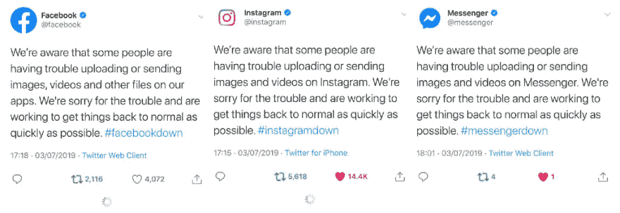
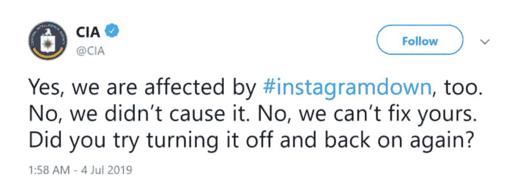
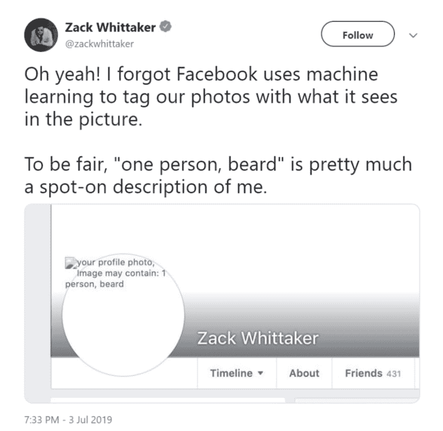
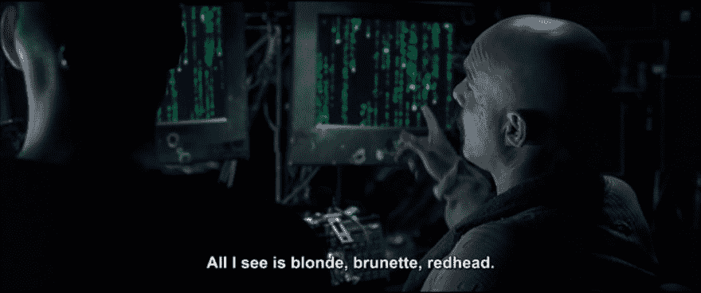
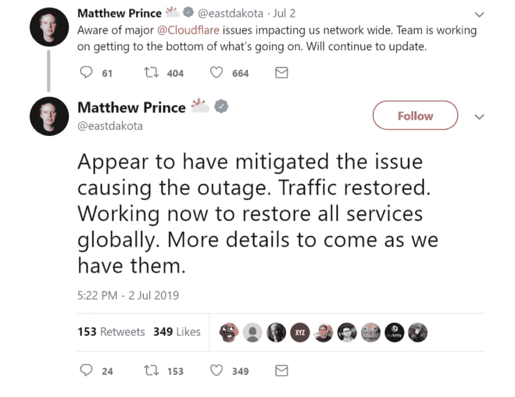
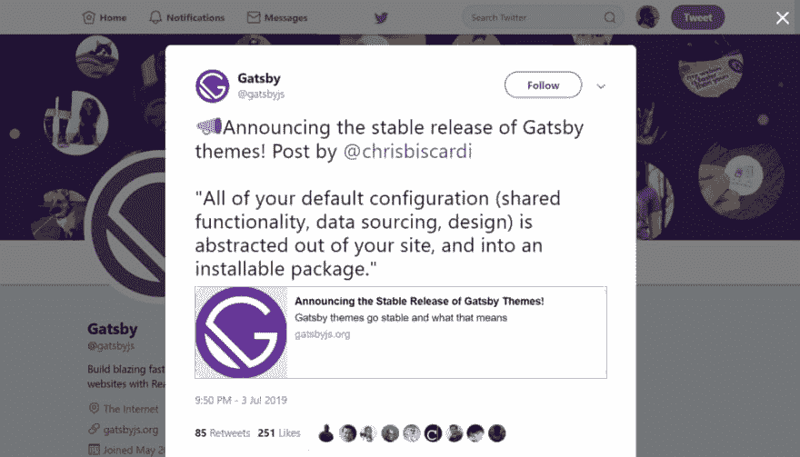

# Front End News #8: Facebook outage breaks the Internet, GatsbyJS Themes & software package updates

> 原文：[https://dev.to/adriansandu/front-end-news-8-facebook-outage-breaks-the-internet-gatsbyjs-themes-software-package-updates-1hff](https://dev.to/adriansandu/front-end-news-8-facebook-outage-breaks-the-internet-gatsbyjs-themes-software-package-updates-1hff)

<figure>

<figcaption>View the episode on YouTube at [https://youtu.be/5s1yI3U64Ug](https://youtu.be/5s1yI3U64Ug)</figcaption>

</figure>

Hello everyone and welcome to another edition of Front-End News, the show that brings you information on the latest events in the industry.

Here are the highlights of what I have prepared for you today:

*   Widespread outages break the Internet
*   GatsbyJS announces the stable release of Themes
*   Image Support for the Async Clipboard API coming in Chrome 76
*   Introducing a new section for notable software updates

As always, I have also prepared a video version for those that prefer listening instead of reading. If you enjoy this format, I would appreciate it if you would subscribe to the YouTube channel as well.

[https://www.youtube.com/embed/5s1yI3U64Ug](https://www.youtube.com/embed/5s1yI3U64Ug)

### It's outage season

It looks like being out of service is the new fashion among Internet giants. After Google Cloud went down a few weeks ago, there was a string of outages this week with some very big names featured in the lead role.

### #FacebookDown, #InstagramDown, and #WhatsAppDown

A big chunk of the Internet screeched to a halt when Facebook, Instagram, and WhatsApp decided to take a collective break.

Users all over the world reported issues and a lot of the chaos spread over on Twitter, as the only main social network still functional at that time. Even the CIA got into the game, although they denied any involvement in the incident.

Fortunately, for everyone’s sanity, the issue was solved in the end. As a side effect, the event did shed some light on how Facebook itself views the world. Besides the broken image icon, the missing pictures also showed the tags assigned by the machine vision system.

Anyone else having flashbacks of the Matrix? I thought so.

Sources and references:

*   [https://twitter.com/facebook/status/1146453213777936386](https://twitter.com/facebook/status/1146453213777936386)
*   [https://twitter.com/CIA/status/1146553713663893510](https://twitter.com/CIA/status/1146553713663893510)
*   [https://www.theverge.com/2019/7/3/20681231/facebook-outage-image-tags-captions-ai-machine-learning-revealed](https://www.theverge.com/2019/7/3/20681231/facebook-outage-image-tags-captions-ai-machine-learning-revealed)

### #CloudflareDown

Cloudflare messed up a software deployment that caused the equipment CPUs to spike at 100% on their entire platform. During this time anyone visiting any of the affected websites encountered a 502 “Bad Gateway” error.

Fortunately, the issue was solved in about 30 minutes, with traffic returning to normal shortly after that. For those passionate about the technical details, the post mortem analysis of the incident is now available on the Cloudflare blog.

Sources and references:

*   [https://blog.cloudflare.com/cloudflare-outage/](https://blog.cloudflare.com/cloudflare-outage/)
*   [https://techcrunch.com/2019/07/02/a-cloudflare-outage-is-impacting-sites-everywhere/](https://techcrunch.com/2019/07/02/a-cloudflare-outage-is-impacting-sites-everywhere/)

### #TwitterDown

Not even Twitter escaped unscathed this week.

<figure>

<figcaption>Source: [https://twitter.com/TwitterSupport/status/1146547673454919680](https://twitter.com/TwitterSupport/status/1146547673454919680)</figcaption>

</figure>

Their Direct Message service was down for a period of time on July 3rd. A few hours later, the official TwitterSupport account mentioned that the outage was solved and the service was once more functional.

All things considered, this was not a great week to be an Internet engineer.

### GatsbyJS announces the stable release of Themes

<figure>

<figcaption>Source: [https://twitter.com/gatsbyjs/status/1146491295331786752](https://twitter.com/gatsbyjs/status/1146491295331786752)</figcaption>

</figure>

GatsbyJS is a free and open source framework built on top of React and is one of the most used static site generators (first by the number of Twitter followers and forth by the number of GitHub stars). They have recently announced that their Theme system is now part of the stable code release.

As each Gatsby website is a stand-alone entity, the Theme system takes all the default configuration and packs it as an external dependency that can be updated independently of the main code. This makes it easy to update a theme or even switch to another theme compatible with your setup.

### Image Support for the Async Clipboard API is coming in Chrome 76

A new article on Google Developers portal announces that Chrome 76 will feature support for copying PNG images to the clipboard programmatically. There are a number of security concerns related to very large image files (that can overload the memory) or specially crafted malicious images that try to exploit known vulnerabilities in the native OS. The current solution is to transcode the images during the process. Happy copy and pasting!

Source:

*   [https://developers.google.com/web/updates/2019/07/image-support-for-async-clipboard](https://developers.google.com/web/updates/2019/07/image-support-for-async-clipboard)

### Notable software updates

I’m opening here a new section where I will cover releases that don’t warrant a full mention of their own. I am starting this first edition with three entries:

*   npm 6.10.0. — [https://npm.community/t/release-npm-6-10-0/8584](https://npm.community/t/release-npm-6-10-0/8584)
*   React Native 0.60 — [https://facebook.github.io/react-native/blog/2019/07/03/version-60](https://facebook.github.io/react-native/blog/2019/07/03/version-60)
*   Visual Studio Code 1.36 — [https://code.visualstudio.com/updates/v1_36](https://code.visualstudio.com/updates/v1_36)

### Question of the Day

What sort of events and news would you like to see in future episodes? Please let me know by leaving a comment or by leaving a message on [twitter.com/frontendnexus](https://twitter.com/frontendnexus).

That’s all there is in this edition. Follow Front End Nexus on Twitter at [https://twitter.com/frontendnexus](https://twitter.com/frontendnexus) to be notified as soon as a new update happens. I also want to encourage you to subscribe to the YouTube channel at [https://www.youtube.com/channel/UCgACtqiDmnSaskDIBsK54ww](https://www.youtube.com/channel/UCgACtqiDmnSaskDIBsK54ww). I can unlock some more options once the channel hits 100 subscribers, so your support is highly appreciated.

Thumbnail image credit goes to [Thought Catalog](https://unsplash.com/@thoughtcatalog) on Unsplash.

Have a great and productive week and I will see you next time!

* * *