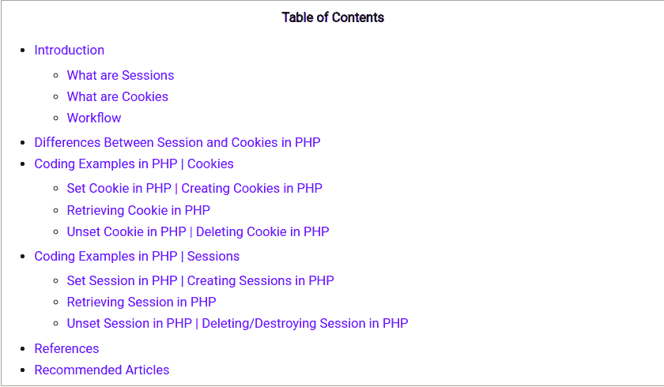
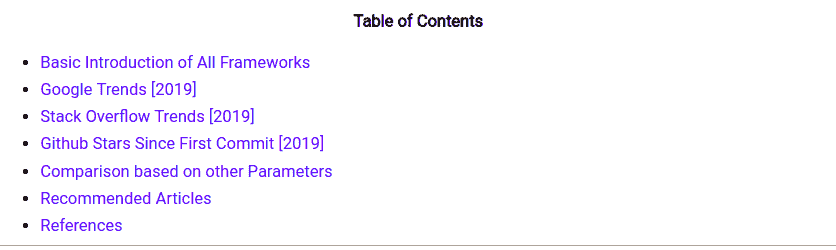
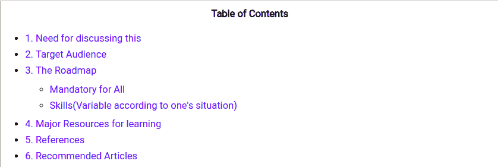
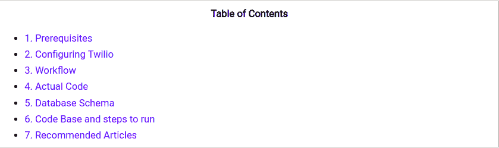
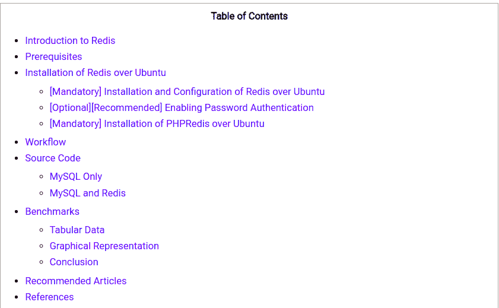
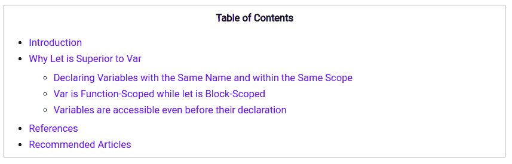
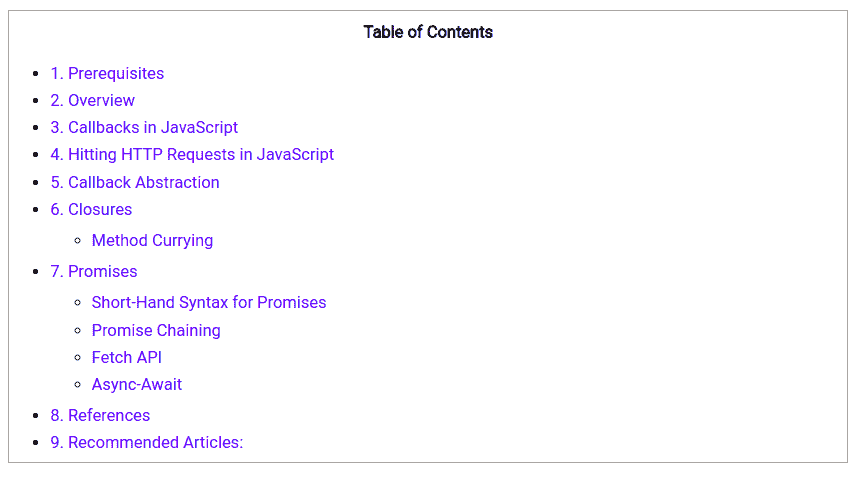
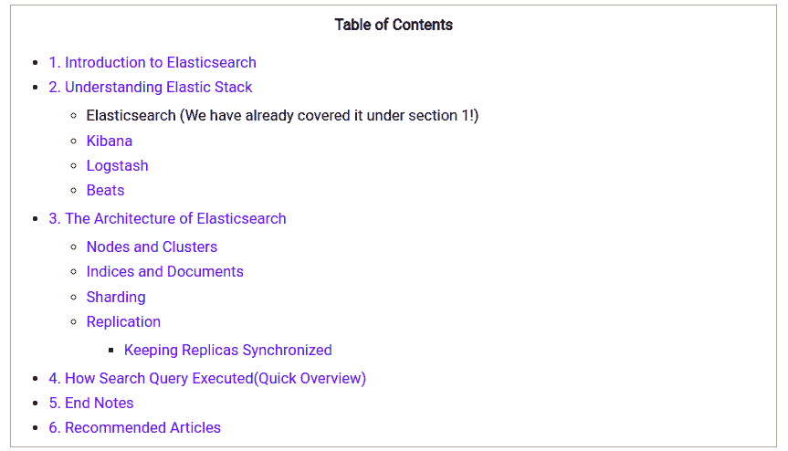
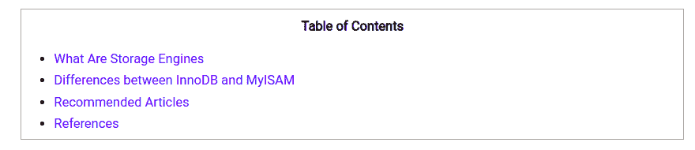
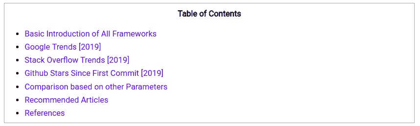

# 这个周末你可以阅读的网络开发文章

> 原文：<https://dev.to/full_stackgeek/web-development-articles-you-can-read-over-this-weekend-5bdn>

所以，我们再次列出了这个周末你可以阅读的与 web 开发相关的精选文章。

**1)PHP cookie 和 Sessions |详细解释|编码示例**
 
**关于本文:**
在本文中，我们将结合 PHP 中的编码示例，深入讨论 Sessions 和 cookie 等概念。我们将会看到 PHP 中会话和 Cookies 之间的区别。我们还将通过编码示例学习如何在 PHP 中设置会话和 Cookies。
**看这里: [PHP Cookies 和 Sessions |详解|编码示例](https://fullstackgeek.blogspot.com/2019/06/php-cookies-and-sessions-examples.html)** 

**2)最佳 PHP 框架(2019)**

**关于本文:**
在本文中，我们将深入讨论最佳 PHP 框架及其优缺点，以便人们可以清楚地了解选择哪一个。我们的综合研究将包括一些最新的 PHP 框架。
**看这里:[最佳 PHP 框架(2019)](https://fullstackgeek.blogspot.com/2019/05/best-php-frameworks.html)**

**3)PHP | Roadmap 2019**

**之后我应该学习什么关于本文:**
在本文中，我们将讨论一个开发人员在学习/使用 PHP 或任何其他语言相当长时间之后应该遵循的路线图。
**看这里:[PHP |路线图 2019](https://fullstackgeek.blogspot.com/2019/05/what-should-i-learn-after-php.html)** 以后要学什么

使用 Twilio

**在 PHP 中实现 OTP 关于本文:**
使用 OTP(一次性密码)验证电话号码是减少网站上垃圾邮件的一个可靠方法。在本文中，我们将详细讨论这个话题。我们将学习如何设置我们的 PHP 代码来发送动态口令到手机号码，从而验证用户。
**阅读这里:[使用 Twilio 在 PHP 中实现 OTP](https://fullstackgeek.blogspot.com/2019/03/implement-otp-in-php-with-example.html)**

**5) Redis vs MySQL 基准测试**
 
**关于本文:**
在本文中，我们将讨论 Redis 和 MySQL 的性能基准测试。首先，我们将从 Redis over Ubuntu Machine 的介绍和安装开始。然后，我们将朝着这两者之间的基准迈进。
**看这里: [Redis vs MySQL 基准测试](https://fullstackgeek.blogspot.com/2019/04/redis-vs-mysql-benchmark.html)**

6)JavaScript 中的 Var vs Let

**关于本文:**
在本文中，我们将讨论 JavaScript 中 Var vs Let 的长期争论。我们还将讨论为什么 let 的使用在开发社区越来越多。
**看这里:[Var vs Let in JavaScript](https://fullstackgeek.blogspot.com/2019/02/var-vs-let-javascript.html)**

**7)异步 JavaScript**

**关于本文:**
在本文中，我们将对异步任务进行有意义的深入讨论。我们将讨论什么是异步任务，什么是回调、闭包、承诺以及 JavaScript 上下文中的更多内容。
**看这里:[异步 JavaScript](https://fullstackgeek.blogspot.com/2019/02/asynchronous-javascript-explained-for-beginners.html)**

**8)Elasticsearch 及麋鹿栈简介**
 
**关于本文:**
在本文中，我们讨论的是 elastic search。我们将从 Elasticsearch 的介绍开始，对所谓的 ELK stack 进行简短的讨论。然后，我们将转向 Elasticsearch 的架构，以及什么是节点、集群、分片、索引、文档、复制等等
**阅读此处:[elastic search 和 ELK 堆栈简介](https://fullstackgeek.blogspot.com/2019/03/introduction-to-elasticsearch-and-elk-stack.html)**

**9) InnoDB vs MyISAM |存储引擎|表格差异** 
 
**关于本文:**
在本文中，我们将讨论 InnoDB 和 MyISAM 等存储引擎之间的主要差异，以表格形式编写，以便更好地理解。
**阅读此处: [InnoDB vs MyISAM |存储引擎|表格差异](https://fullstackgeek.blogspot.com/2019/05/main-differences-between-innodb-and-myisam.html)**

**10)最佳 PHP 框架(2019)| Google Trends | Stack Overflow Insights** 

**关于本文:**
在本文中，我们将深入讨论最佳 PHP 框架及其优缺点，以便人们可以清楚地了解选择哪一个。我们的综合研究将包括一些最新的 PHP 框架。
**看这里:[最佳 PHP 框架(2019)| Google Trends | Stack Overflow Insights](https://fullstackgeek.blogspot.com/2019/05/best-php-frameworks.html)**