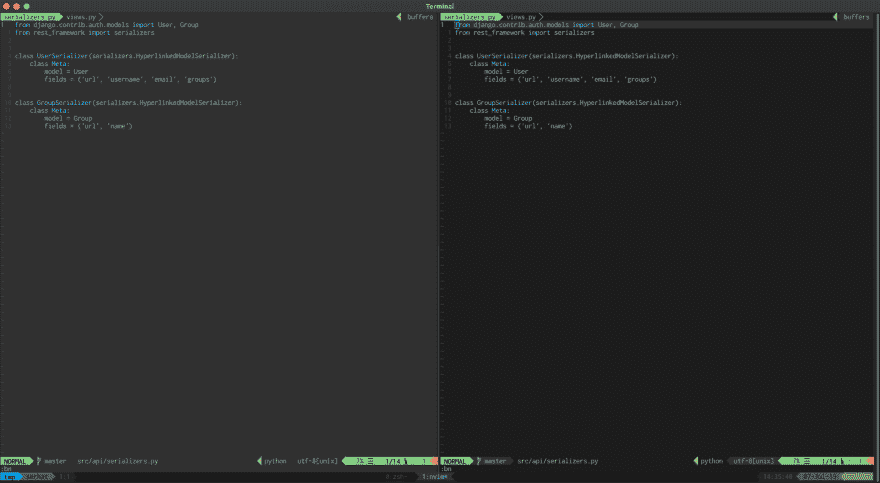

# Tmux Vim 活性面包聚焦

> 原文：<https://dev.to/serhatteker/tmux-vim-active-pane-focus-5378>

如果你是一个最好的文本编辑器——又名`Vim`,用户，并且你想使用我们的“活动-非活动窗格聚焦”特性，我们在这个 [tmux 活动聚焦帖子](https://dev.to/serhatteker/tmux-active-pane-focus-3h41)中为 tmux 窗格实现了这个特性，也为`vim/nvim`实现了这个特性，你需要在你的`vim colourscheme`中做一些调整。

[](https://res.cloudinary.com/practicaldev/image/fetch/s--ObRy2Jgg--/c_limit%2Cf_auto%2Cfl_progressive%2Cq_auto%2Cw_880/https://tech.serhatteker.com/img/vim-focus.png)

上图显示了非活动窗格是如何略微变灰的，而活动窗格的边框是蓝色的。

## 活动-非活动窗格颜色配置

为了将活动-非活动窗口样式应用于 Vim 窗格，有必要检查您的`colorscheme.vim`文件中以`hi Normal`开头的那一行。或者写:

```
:hi Normal 
```

<svg width="20px" height="20px" viewBox="0 0 24 24" class="highlight-action crayons-icon highlight-action--fullscreen-on"><title>Enter fullscreen mode</title></svg> <svg width="20px" height="20px" viewBox="0 0 24 24" class="highlight-action crayons-icon highlight-action--fullscreen-off"><title>Exit fullscreen mode</title></svg>

输出应该是这样的:

```
Normal          xxx ctermfg=145 ctermbg=234 guifg=#ABB2BF guibg=#1c1c1c 
```

<svg width="20px" height="20px" viewBox="0 0 24 24" class="highlight-action crayons-icon highlight-action--fullscreen-on"><title>Enter fullscreen mode</title></svg> <svg width="20px" height="20px" viewBox="0 0 24 24" class="highlight-action crayons-icon highlight-action--fullscreen-off"><title>Exit fullscreen mode</title></svg>

我们需要更新这些`background`设置，以使用我们之前设置的`.tmux.conf`设置。

删除:

```
highlight Normal ctermfg=145 guifg=#ABB2BF 
```

<svg width="20px" height="20px" viewBox="0 0 24 24" class="highlight-action crayons-icon highlight-action--fullscreen-on"><title>Enter fullscreen mode</title></svg> <svg width="20px" height="20px" viewBox="0 0 24 24" class="highlight-action crayons-icon highlight-action--fullscreen-off"><title>Exit fullscreen mode</title></svg>

或者设置为`none` :

```
highlight Normal ctermfg=145 ctermbg=none guifg=#ABB2BF guibg=none 
```

<svg width="20px" height="20px" viewBox="0 0 24 24" class="highlight-action crayons-icon highlight-action--fullscreen-on"><title>Enter fullscreen mode</title></svg> <svg width="20px" height="20px" viewBox="0 0 24 24" class="highlight-action crayons-icon highlight-action--fullscreen-off"><title>Exit fullscreen mode</title></svg>

我更喜欢后者，因为它更冗长。将此设置添加到您的`colorscheme xxx`行后的`.vimrc`中，并将其作为源代码。

在后面加上**非常重要，否则不会产生任何效果。**

完成了。