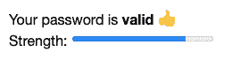
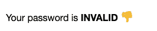

# 使用 lit-html 创建 web 组件(à la React)

> 原文：<https://dev.to/julcasans/using-lit-html-to-create-web-components-a-la-react-118g>

> 📣**更新！**📣
> *现在 lit-html 和 LitElement 统一在 [Lit](https://lit.dev/) 下。*
> *我正在写关于**点燃**的新帖子，同时你可以:*
> 
> *   *阅读这篇文章，因为原理是一样的*
> *   *用这个[指南](https://lit.dev/docs/releases/upgrade/)* 升级你的代码
> *   *访问 *Lit* 网站了解最新动态*
> 
> *你也可以使用 [lit-html 单机](https://lit.dev/docs/libraries/standalone-templates/)T3】*

这篇文章是关于`lit-html`中的指令，这是我们扩展库的方式，但是我不想一直推迟我们系列的中心主题`LitElement`的到来。所以我决定把指示留到以后，走进`LitElement`的大门。我将向您展示如何使用`lit-html`创建 web 组件，我们将看到如何从那里到达`LitElement`。我们开始吧！

# 想法

我们将只使用`lit-html`构建一个 web 组件，但是使用类似于 **React** 的方法，也就是说，我们将有一个声明性的模板，它准确地定义了组件 UI 在整个状态下的状态，并且我们还将在组件属性改变时，一个新的呈现将更新它的 UI。

为了定义 UI，我们将使用模板文字和`html`标签，而不是 JSX，就像我们在以前的帖子中看到的那样。
我们也知道`lit-html`是超级高效的渲染，所以如果我们在每次属性改变时调用`render`函数，我们不会有任何问题。

我们将创建的组件在视觉和功能层面上非常简单。不要指望我们会制造大型组件，至少现在不会。在这份出版物中，我们希望将重点放在创建 web 组件的基本概念上。

因此，我们的组件将是一个密码检查器:一个给定密码的组件，它告诉我们它是有效还是无效，如果它是有效的，它还告诉我们它有多强。

适用的规则如下:

*   在以下情况下，密码有效:
    *   它至少有 4 个
    *   它至少有一个小写字母。
    *   它至少有一个大写字母。
    *   它至少有一个数字
*   如果有效，将显示一个测量其强度的条。
*   如果无效，将不显示强度栏。

**有效密码示例**

```
<password-checker password="aB1sgX4"></password-checker> 
```

<svg width="20px" height="20px" viewBox="0 0 24 24" class="highlight-action crayons-icon highlight-action--fullscreen-on"><title>Enter fullscreen mode</title></svg> <svg width="20px" height="20px" viewBox="0 0 24 24" class="highlight-action crayons-icon highlight-action--fullscreen-off"><title>Exit fullscreen mode</title></svg>

[](https://res.cloudinary.com/practicaldev/image/fetch/s--Q20IFvO9--/c_limit%2Cf_auto%2Cfl_progressive%2Cq_auto%2Cw_880/https://thepracticaldev.s3.amazonaws.com/i/p4zm3aests24r5uac9rc.png)

**无效密码示例**

```
<password-checker password="aB1"></password-checker> 
```

<svg width="20px" height="20px" viewBox="0 0 24 24" class="highlight-action crayons-icon highlight-action--fullscreen-on"><title>Enter fullscreen mode</title></svg> <svg width="20px" height="20px" viewBox="0 0 24 24" class="highlight-action crayons-icon highlight-action--fullscreen-off"><title>Exit fullscreen mode</title></svg>

[](https://res.cloudinary.com/practicaldev/image/fetch/s--bFCCLbXG--/c_limit%2Cf_auto%2Cfl_progressive%2Cq_auto%2Cw_880/https://thepracticaldev.s3.amazonaws.com/i/v5faempe21zjwzu3o0ri.png)

# 代码

我们创建一个`password-checker.js`文件，在第一行我们将从`lit-html` :
导入`html`和`render`函数

```
import { html, render } from 'lit-html'; 
```

<svg width="20px" height="20px" viewBox="0 0 24 24" class="highlight-action crayons-icon highlight-action--fullscreen-on"><title>Enter fullscreen mode</title></svg> <svg width="20px" height="20px" viewBox="0 0 24 24" class="highlight-action crayons-icon highlight-action--fullscreen-off"><title>Exit fullscreen mode</title></svg>

然后，正如我们处理任何其他 web 组件一样，我们创建一个类:

1.  延伸`HTMLElement`。
2.  有一个创建组件影子 DOM 的构造函数。

此外，我们的组件有一个保存密码的属性，它应该用用户在 HTML 文件中定义的值进行初始化，正如我们在这里看到的:`<password-checker password="aB1">`。我们在构造函数的最后一行这样做。

```
class PasswordChecker extends HTMLElement {
  constructor() {
    super();
    this.attachShadow({mode: 'open'});
    this.password = this.getAttribute('password');
  } 
```

<svg width="20px" height="20px" viewBox="0 0 24 24" class="highlight-action crayons-icon highlight-action--fullscreen-on"><title>Enter fullscreen mode</title></svg> <svg width="20px" height="20px" viewBox="0 0 24 24" class="highlight-action crayons-icon highlight-action--fullscreen-off"><title>Exit fullscreen mode</title></svg>

现在让我们考虑一下可视化表示，并定义模板:

```
 template() {
    return html`
      <span>Your password is <strong>${this.isValid(this.password) ? 
            'valid 👍' : 'INVALID 👎'}</strong></span> ${this.isValid(this.password) ? 
        html`<div>Strength: <progress value=${this.password.length-3} max="5"</progress></div>` : ``}`;

  } 
```

<svg width="20px" height="20px" viewBox="0 0 24 24" class="highlight-action crayons-icon highlight-action--fullscreen-on"><title>Enter fullscreen mode</title></svg> <svg width="20px" height="20px" viewBox="0 0 24 24" class="highlight-action crayons-icon highlight-action--fullscreen-off"><title>Exit fullscreen mode</title></svg>

仅当密码有效时，模板才使用条件表达式来显示强度栏。还要注意属性`password`是模板的重要部分，它的值定义了组件是如何呈现的。对`password`属性的任何更改都必须触发 UI 更新，导致组件的重新呈现。我们如何实现这一目标？

这很简单，我们为`password`属性创建一个 setter，这样当更新它的值时，我们强制更新组件。我们还希望 HTML 元素的`password`属性有新的值。这是代码:

```
 set password(value) {
    this._password = value;
    this.setAttribute('password', value);
    this.update();
  }

  get password() { return this._password; }

  update() {
    render(this.template(), this.shadowRoot, {eventContext: this});
  } 
```

<svg width="20px" height="20px" viewBox="0 0 24 24" class="highlight-action crayons-icon highlight-action--fullscreen-on"><title>Enter fullscreen mode</title></svg> <svg width="20px" height="20px" viewBox="0 0 24 24" class="highlight-action crayons-icon highlight-action--fullscreen-off"><title>Exit fullscreen mode</title></svg>

当我们定义 setter 时，我们也定义了 getter。
`update`函数调用`render`函数，这将导致组件的 UI 被更新。

👉这里要注意的一点是，我们调用了传递组件的影子根的函数，这样模板就进入了组件的影子 DOM。第三个参数具有将在事件处理程序中使用的上下文(如果有)。所以我们的模板中可以有这样的东西:
`<button @click=${this.start}>Start</button>`。`@click=${this.start}`中的`this`已经在`eventContext`属性中传递了上下文。如果不通过上下文，`this.start`就会失败。

最后我们注册 web 组件:

```
customElements.define('password-checker', PasswordChecker); 
```

<svg width="20px" height="20px" viewBox="0 0 24 24" class="highlight-action crayons-icon highlight-action--fullscreen-on"><title>Enter fullscreen mode</title></svg> <svg width="20px" height="20px" viewBox="0 0 24 24" class="highlight-action crayons-icon highlight-action--fullscreen-off"><title>Exit fullscreen mode</title></svg>

最后的代码，加在一起是这样的:

```
import { html, render } from 'lit-html';

class PasswordChecker extends HTMLElement {
  constructor() {
    super();
    this.attachShadow({mode: 'open'});
    this.password = this.getAttribute('password');
  }

  get password() { return this._password; }

  set password(value) {
    this._password = value;
    this.setAttribute('password', value);
    this.update();
  }

  update() {
    render(this.template(), this.shadowRoot, {eventContext: this});
  }

  isValid(passwd) { 
    const re = /(?=.*\d)(?=.*[a-z])(?=.*[A-Z]).{4,}/;
    return re.test(passwd);
  }

  template() {
    return html`
      <span>Your password is <strong>${this.isValid(this.password) ? 'valid 👍' : 'INVALID 👎'}</strong></span> ${this.isValid(this.password) ? 
        html`<div>Strength: <progress value=${this.password.length-3} max="5"</progress></div>` : ``}`;

  }
}

customElements.define('password-checker', PasswordChecker); 
```

<svg width="20px" height="20px" viewBox="0 0 24 24" class="highlight-action crayons-icon highlight-action--fullscreen-on"><title>Enter fullscreen mode</title></svg> <svg width="20px" height="20px" viewBox="0 0 24 24" class="highlight-action crayons-icon highlight-action--fullscreen-off"><title>Exit fullscreen mode</title></svg>

# 重述

这是我们用来创建 web 组件 *à la* React 的方法。

1.  从`lit-html`导入`html`和`render`。
2.  创建一个扩展 HTMLElement 的类。
3.  编写一个构造函数:
    *   创建阴影 DOM。
    *   从 HTML 标记中的值初始化属性。
4.  为组件 UI 编写模板。
5.  写一个调用`render`的更新函数。
6.  对于每个需要更新 UI 的属性值更改:
    *   编写一个 setter 来更新用户界面并将属性与其相关的 HTML 属性同步。
    *   写一个 getter。
7.  注册组件。

# 靠小故障过活

你可以在我的故障页面上看到代码并使用它。

[https://glitch.com/embed/#!/embed/handy-train?path=index.html](https://glitch.com/embed/#!/embed/handy-train?path=index.html)

# 最后的想法

### 类似有反应但不像有反应

我们用来创建组件的方法类似于 React，但并不完全相同。我们可以说，我们定义模板的方式是相同的，但实现不同:React 使用的是必须经过处理才能生成 JavaScript 代码的语言`JSX`，而`lit-html`基于 JavaScript 特性，因此不需要额外的处理。
它们的不同之处在于 UI 的更新:当我们调用`setState`函数时，React 更新组件，而在我们的方法中，当属性改变时，更新“自动”发生。这似乎是一个非常微妙的区别，但当我们在`LitElement`中看到同样的想法时，它会更加明显。

### lit-现实世界中的 html

之前我们已经看到`lit-html`不需要组件模型，因此我们可以在各种项目中使用它，甚至将它与其他框架和库混合使用。现在我们已经看到，有了这个库，我们可以实现 web 组件，这使得它更强大，更容易集成到其他项目中。

有几个项目使用了`lit-hmtl`。我留了一些在这里。这个信息的来源是`lit-html`上这个奇妙的资源集合，我推荐你看一看:[牛逼文学](https://github.com/web-padawan/awesome-lit)。

当然我也推荐[清晰完整的官方`lit-html`文件](https://lit.dev/docs/libraries/standalone-templates/)。

基于`lit-html`的一些项目

*   [Fit-html](https://github.com/Festify/fit-html)
*   [GluonJs](https://github.com/ruphin/gluonjs)
*   [ui5 web 组件](https://github.com/SAP/ui5-webcomponents)

### LitElement 来了...

最后，在下一篇文章中我会谈到`LitElement`！回头见。